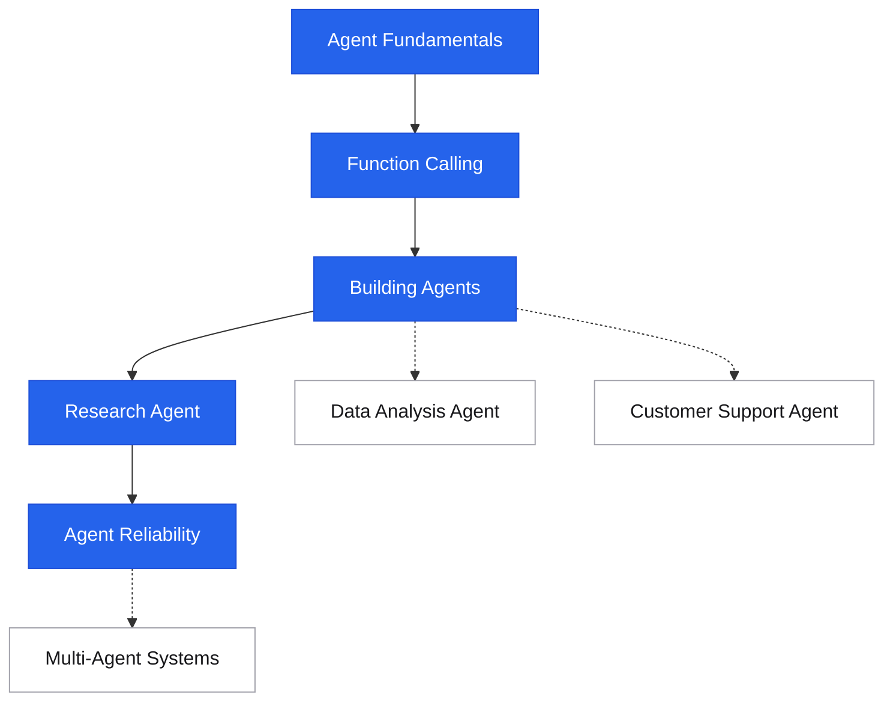

# AI Agents

<div class="sec-hero" markdown>
<span class="ey">AI · autonomous systems</span>
A practical guide to understanding, building, and running AI agents in production — from first principles (the agent loop, tool use) to working end-to-end examples you can adapt and run.
</div>

## Roadmap

Follow the spine top-to-bottom your first time. Dashed branches hang off the topic they support — grab them when you need them.

<div class="sd-mermaid-links" data-links='{
  "Agent Fundamentals": "agent-fundamentals/",
  "Function Calling": "function-calling/",
  "Building Agents": "building-agents/",
  "Research Agent": "example-research-agent/",
  "Agent Reliability": "agent-reliability/",
  "Data Analysis Agent": "example-data-agent/",
  "Customer Support Agent": "example-customer-support-agent/",
  "Multi-Agent Systems": "multi-agent-systems/"
}'></div>



## Suggested reading order

New to this topic? Read these in order — each builds on the previous:

1. [Agent Fundamentals](agent-fundamentals.md) — what an agent actually is and when you need one
2. [Function Calling & Tool Use](function-calling.md) — the core mechanism every agent is built on
3. [Building Agents](building-agents.md) — write your first agent loop from scratch
4. [Research Agent](example-research-agent.md) — see a complete, runnable agent end-to-end
5. [Agent Reliability](agent-reliability.md) — what it takes to make agents production-safe

**Then, as needed (reference):** [Data Analysis Agent](example-data-agent.md), [Customer Support Agent](example-customer-support-agent.md)

**Advanced — come back later:** [Multi-Agent Systems](multi-agent-systems.md)

## Concepts

The agent loop and the mechanism it runs on.

<div class="pcards">
<a class="pcard" href="agent-fundamentals/"><span class="t">Agent Fundamentals</span><span class="d">The agent loop, four core components, types of agents, when to use one</span></a>
<a class="pcard" href="function-calling/"><span class="t">Function Calling & Tool Use</span><span class="d">How to give agents tools, tool design principles, parallel calls</span></a>
</div>

## Building

From a from-scratch agent class to coordinating several agents safely.

<div class="pcards">
<a class="pcard" href="building-agents/"><span class="t">Building Agents</span><span class="d">Agent class from scratch, memory, structured output, framework comparison</span></a>
<a class="pcard" href="multi-agent-systems/"><span class="t">Multi-Agent Systems</span><span class="d">Orchestrator/worker, pipelines, critic loops, CrewAI, AutoGen</span></a>
<a class="pcard" href="agent-reliability/"><span class="t">Agent Reliability</span><span class="d">Budget limits, HITL, prompt injection defense, sandboxing, observability</span></a>
</div>

## End-to-End Examples

Complete, runnable agents you can adapt.

<div class="pcards">
<a class="pcard" href="example-research-agent/"><span class="t">Research Agent</span><span class="d">Web search + synthesis → structured report. Run it in 5 minutes.</span></a>
<a class="pcard" href="example-data-agent/"><span class="t">Data Analysis Agent</span><span class="d">Natural language → SQL + Python → insights + charts</span></a>
<a class="pcard" href="example-customer-support-agent/"><span class="t">Customer Support Agent</span><span class="d">Order lookup, refunds, escalation to human — full conversation flow</span></a>
</div>

---

## What you need to run the examples

```bash
pip install anthropic requests

# For research agent
export ANTHROPIC_API_KEY="sk-ant-..."
export TAVILY_API_KEY="tvly-..."    # free tier at tavily.com

# For data agent
pip install pandas matplotlib

# All examples run with Python 3.10+
```

---

## Relationship to AI Engineering

The [AI Engineering](../ai/index.md) section covers LLM concepts broadly — RAG, embeddings, fine-tuning, evaluation. This **AI Agents** section is narrowly focused on building and running agents with practical, working code. Cross-references:

- [Agentic Patterns](../ai/agentic-patterns.md) — advanced patterns (reflection, ToT, self-consistency)
- [Memory Systems](../ai/memory-systems.md) — long-term memory for agents
- [Guardrails & Safety](../ai/guardrails-safety.md) — input/output safety for agent pipelines
- [LLMOps](../ai/llmops.md) — monitoring agent costs and quality in production
