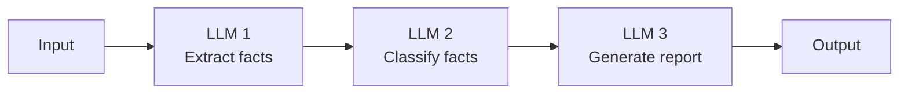
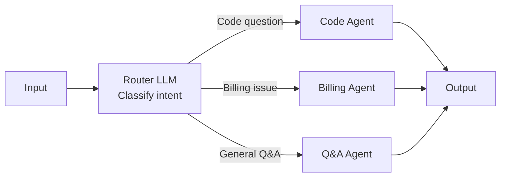
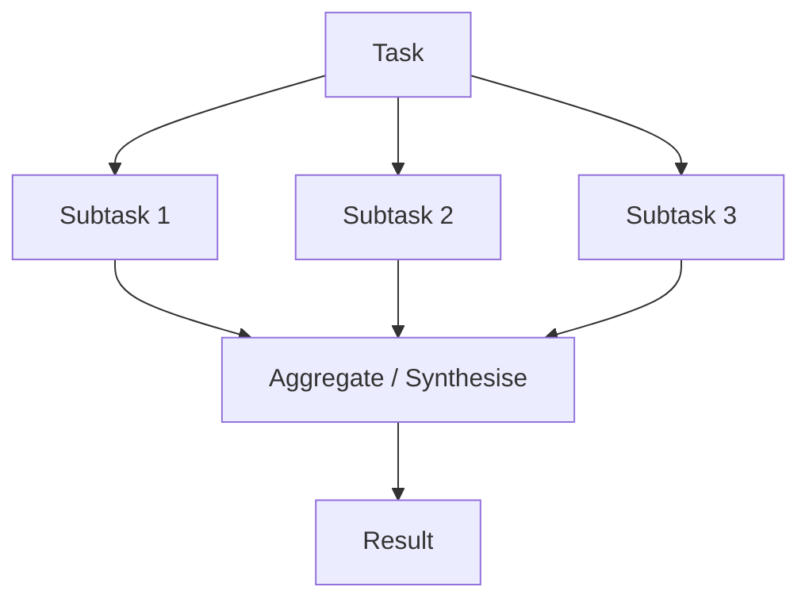
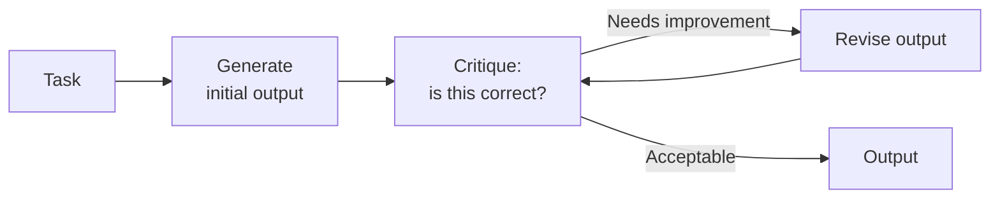
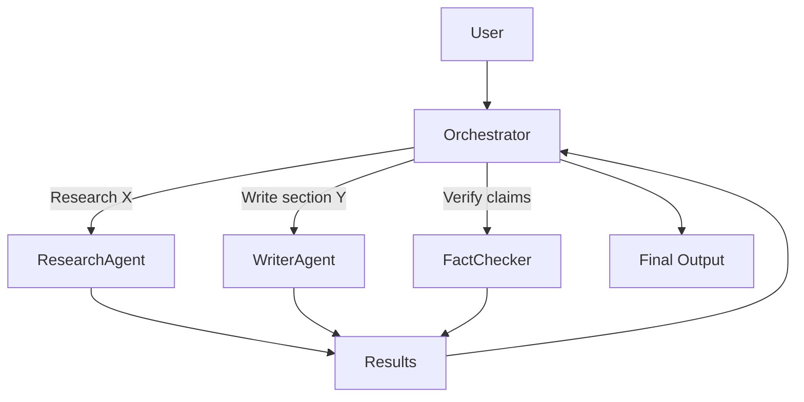

# Agentic Patterns

As agent tasks grow in complexity, single-agent ReAct loops become insufficient. These patterns address parallelism, specialisation, reliability, and coordination across multiple agents.

## Pattern overview

```
Simple                                          Complex
  │                                               │
Single     Prompt     Routing    Parallelism    Multi-Agent
Agent   →  Chaining →  Agent  → Subagents    →  Network
```

---

## Prompt Chaining

Break a complex task into a sequential pipeline of focused LLM calls. Each step's output feeds the next.



```python
def research_pipeline(topic: str) -> str:
    # Step 1: Generate research questions
    questions = llm.complete(
        f"Generate 5 focused research questions about: {topic}"
    )

    # Step 2: Answer each question (could be parallelised)
    answers = []
    for q in parse_questions(questions):
        answer = llm.complete(f"Answer this question concisely: {q}")
        answers.append({"question": q, "answer": answer})

    # Step 3: Synthesise into a final report
    synthesis_input = "\n".join(
        f"Q: {a['question']}\nA: {a['answer']}" for a in answers
    )
    return llm.complete(
        f"Write a structured report based on these Q&As:\n{synthesis_input}"
    )
```

**When to use:** When task steps are sequential and each step must complete before the next begins. Great for document processing pipelines, multi-stage analysis.

**Benefits:** Each step is independently testable and debuggable. Failures are isolated to a specific step.

---

## Routing

A classifier LLM (or simple model) routes an input to the most appropriate specialised agent or pipeline.



```python
def route_request(user_message: str) -> str:
    route = classifier_llm.complete(
        f"""Classify this user request into one of:
        - code_help: coding questions, debugging, code review
        - billing: subscription, payments, invoices
        - general: everything else

        Request: {user_message}
        Return only the category name."""
    )

    match route.strip():
        case "code_help": return code_agent.run(user_message)
        case "billing":   return billing_agent.run(user_message)
        case _:           return general_agent.run(user_message)
```

**When to use:** When different query types require different tools, prompts, or models. Use a cheaper/faster model for routing.

---

## Parallelisation

Run independent agent tasks concurrently, then aggregate results.



### Sectioning (fan-out)

Split a large task into N independent parallel subtasks.

```python
import asyncio

async def analyse_document_sections(document: str) -> str:
    sections = split_into_sections(document)

    # Analyse all sections in parallel
    tasks = [
        asyncio.create_task(
            analyse_section(section, section_index=i)
        )
        for i, section in enumerate(sections)
    ]
    analyses = await asyncio.gather(*tasks)

    # Synthesise all analyses
    return await synthesise(analyses)
```

**When to use:** Long documents, multi-source research, any task where work can be divided and independently processed.

### Voting (consensus)

Run the same task N times with different temperature or prompts, then pick the majority answer.

```python
async def answer_with_voting(question: str, n: int = 5) -> str:
    # Run N parallel completions
    responses = await asyncio.gather(*[
        llm.complete(question, temperature=0.7)
        for _ in range(n)
    ])

    # Pick most common answer
    from collections import Counter
    return Counter(responses).most_common(1)[0][0]
```

**When to use:** High-stakes tasks where one model might be wrong. Classification, fact verification, code generation (majority-vote on test pass).

---

## Reflection & Self-Critique

The agent critiques and revises its own output, iterating until quality standards are met.



```python
def generate_with_reflection(task: str, max_rounds: int = 3) -> str:
    output = llm.complete(task)

    for round in range(max_rounds):
        critique = llm.complete(
            f"Review this output for accuracy, completeness, and quality.\n\n"
            f"Task: {task}\n\n"
            f"Output: {output}\n\n"
            f"List specific issues. If none, respond with 'APPROVED'."
        )

        if "APPROVED" in critique:
            return output

        output = llm.complete(
            f"Revise the output to fix these issues:\n{critique}\n\n"
            f"Original output:\n{output}"
        )

    return output
```

**When to use:** Code generation (generate → test → fix), writing tasks with quality standards, complex reasoning where self-correction improves accuracy.

**Caution:** Reflection can reinforce wrong answers (the model "convinces itself"). Don't rely solely on LLM self-critique for factual accuracy — use external validators (unit tests, tools) when possible.

---

## Orchestrator–Subagent Pattern

A high-level orchestrator plans the work and delegates to specialised subagents that each have a focused set of tools and prompts.



```python
class OrchestratorAgent:
    def run(self, goal: str) -> str:
        plan = self.plan(goal)

        results = {}
        for step in plan.steps:
            agent = self.get_agent(step.agent_type)
            results[step.id] = agent.run(
                task=step.task,
                context=self.build_context(results, step.dependencies)
            )

        return self.synthesise(goal, results)

    def get_agent(self, agent_type: str) -> Agent:
        return {
            "research":    ResearchAgent(tools=[web_search, vector_search]),
            "writer":      WriterAgent(tools=[]),
            "fact_checker": FactCheckerAgent(tools=[search_sources]),
            "coder":       CoderAgent(tools=[run_code, read_file])
        }[agent_type]
```

**When to use:** Long-horizon tasks, tasks with specialisation (some steps need browsing, some need code execution, etc).

---

## Multi-Agent Handoff

Agents pass control to each other explicitly when their part of the task is done.

```python
from anthropic import Anthropic

client = Anthropic()

def handle_user_request(message: str) -> str:
    # Triage agent decides who handles it
    triage_response = client.messages.create(
        model="claude-haiku-4-5-20251001",   # cheap model for routing
        system="Determine if this needs: support, billing, or engineering.",
        messages=[{"role": "user", "content": message}]
    )

    department = extract_department(triage_response)

    if department == "engineering":
        # Hand off to engineering agent (more capable model + code tools)
        return engineering_agent.run(message)
    elif department == "billing":
        return billing_agent.run(message)
    else:
        return support_agent.run(message)
```

**Anthropic's agent SDK** provides built-in handoff primitives. See the [Claude API docs](https://docs.anthropic.com/en/docs/agents) for the official implementation.

---

## Structured output as agent glue

Between agents, pass structured data (not prose) to reduce parsing errors and enable validation.

```python
from pydantic import BaseModel
from typing import Literal

class ResearchResult(BaseModel):
    topic: str
    key_facts: list[str]
    sources: list[str]
    confidence: Literal["high", "medium", "low"]

class WritingTask(BaseModel):
    content: str
    word_count: int
    needs_revision: bool
    revision_notes: str | None

# Agent 1 → structured output → Agent 2 input
research: ResearchResult = research_agent.run(query)
draft: WritingTask = writer_agent.run(research)
```

---

## Error handling in multi-step agents

### Retry with context

```python
def run_step_with_retry(step, context, max_retries=3):
    for attempt in range(max_retries):
        try:
            return agent.run(step, context)
        except ToolError as e:
            context["errors"] = context.get("errors", []) + [str(e)]
            if attempt == max_retries - 1:
                raise
            # Give LLM the error context on next attempt
```

### Fallback agents

```python
def run_with_fallback(task: str) -> str:
    try:
        return primary_agent.run(task)
    except AgentFailure:
        return fallback_agent.run(task)   # simpler, more reliable agent
```

### Graceful degradation

```python
def run_agent(task: str) -> AgentResult:
    try:
        return full_agent.run(task)
    except MaxIterationsReached:
        # Return partial results rather than failing completely
        return AgentResult(
            answer=partial_results.best_so_far,
            complete=False,
            message="Could not complete fully — partial answer provided"
        )
```

---

## Pattern selection guide

| Scenario | Pattern |
|---|---|
| Sequential multi-step task | Prompt chaining |
| Different query types with different requirements | Routing |
| Long document processing | Parallelisation (sectioning) |
| Uncertain/hallucination-prone task | Voting (N samples) |
| High-quality output required | Reflection |
| Complex task requiring specialists | Orchestrator-subagent |
| Multiple teams/services involved | Multi-agent handoff |

---

## Interview / design angle

!!! tip "What comes up in AI system design"
    - *"How would you build a code review agent?"* → Orchestrator assigns: style check, security check, logic check to specialised subagents in parallel; orchestrator synthesises
    - *"How do you prevent cascading failures across agents?"* → Timeouts per agent, fallback agents, return partial results
    - *"When would you use multiple agents vs one agent with many tools?"* → Specialisation (different prompts/models), isolation (failures don't cascade), parallelism

## Related topics

- [Agents & Tool Use](agents-and-tool-use.md) — single agent fundamentals
- [Memory Systems](memory-systems.md) — shared memory between agents
- [LLMOps](llmops.md) — tracing multi-agent pipelines
- [Evaluation](evaluation.md) — testing agentic systems
