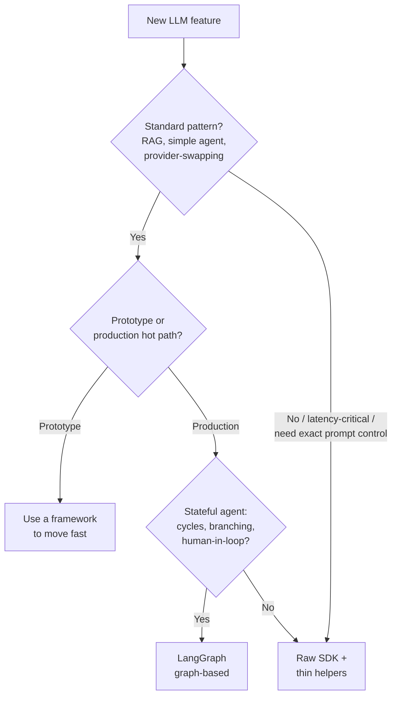
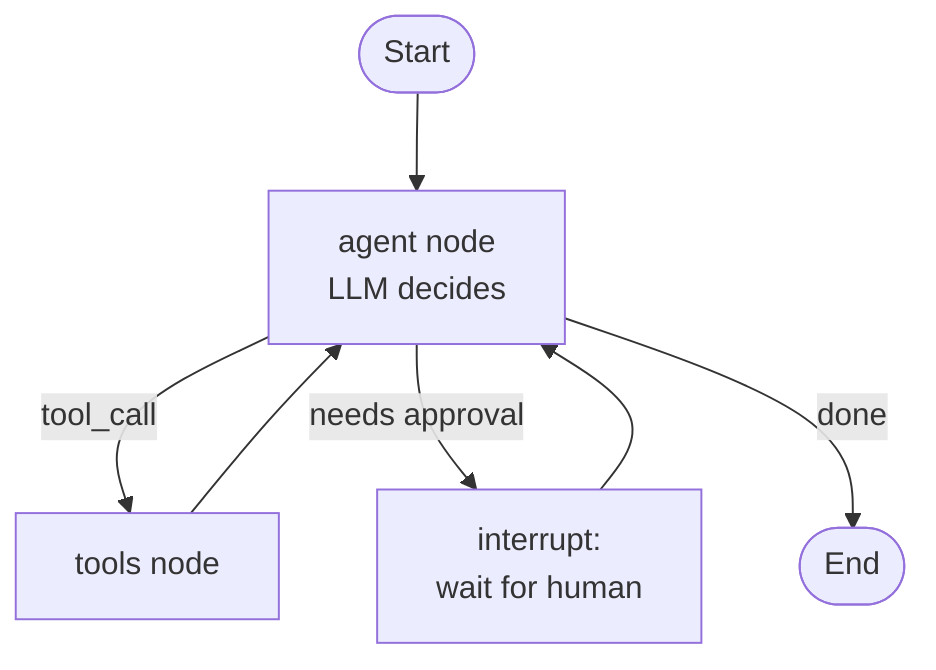

---
tags:
  - applied
---

# LLM Frameworks (LangChain, LangGraph & friends)

## You'll see this when...

- You're starting an LLM feature and someone asks "do we use LangChain or just the SDK?"
- A prototype that flew together in a weekend has become impossible to debug — you can't see the actual prompt being sent
- A framework upgrade broke three call sites and the migration guide is a blog post
- You want to swap providers (Claude ↔ OpenAI ↔ a local model) without rewriting business logic
- Your RAG pipeline works, but you don't know which retriever/chunker/reranker is actually firing
- An agent needs cycles, branching, and a human-approval step — and a linear "chain" no longer fits
- You keep copy-pasting the same retry/tool-loop/memory plumbing across services

This page is about the **layer between your code and the model API**: what frameworks give you, what they cost, and when the boring option (raw SDK + thin helpers) wins.

## The core question: framework vs raw SDK

A framework offers abstractions over the things every LLM app needs: prompt templating, chains (pipe one call's output into the next), memory, retrieval/RAG, agent loops, and tool wiring. The pitch is speed — standard patterns come pre-built.

The critique is the **abstraction tax**:

- **Hidden prompts.** The framework injects its own prompt scaffolding. When output is wrong, you're debugging text you didn't write and can't easily see.
- **Hard-to-debug control flow.** A bug in a 5-call chain surfaces deep inside framework internals, not your code.
- **Churn.** These APIs move fast. Code written against last year's `LLMChain` may not exist this year.
- **Leaky abstractions.** The moment you need something the abstraction didn't anticipate (a custom retry policy, a provider-specific parameter, exact token control), you fight the framework instead of using it.

The honest position: **plenty of production systems run on the raw provider SDK plus a few hundred lines of thin helpers.** The provider SDKs already handle retries, streaming, tool loops, and structured output (see [Working with LLM APIs](working-with-llm-apis.md)). A framework earns its place when it removes more code than it adds — and that calculus depends heavily on *which* framework and *what* you're building.



## The landscape

These are not interchangeable — they sit at different layers and optimise for different shapes of problem.

| Framework | Sweet spot (one line) | Watch-out |
|---|---|---|
| **LangChain** | Broad toolkit; chains, integrations, fast prototyping | Heavy abstraction, hidden prompts, historically high churn |
| **LangGraph** | Graph-based **stateful agents** with durable execution — the current LangChain flagship for agents | A real mental model to learn; overkill for a single LLM call |
| **LlamaIndex** | Retrieval/RAG-first: ingestion, indexing, query engines | Less suited to general agent orchestration |
| **Haystack** | Production RAG/search pipelines, component-graph design | Smaller ecosystem; more search-engine-flavoured |
| **DSPy** | **Programmatic prompt optimisation** — compile prompts/weights against a metric | Different paradigm; you optimise, you don't hand-write prompts |
| **Pydantic AI** | Typed, lightweight agents; structured output via Pydantic | Younger; intentionally minimal feature set |
| **CrewAI** | Multi-agent "teams" with roles and tasks | Opinionated; can obscure control flow |
| **AutoGen** | Multi-agent conversations / research-style orchestration | Conversational model can be hard to make deterministic |
| **OpenAI Agents SDK** | Lightweight multi-agent + handoffs, provider-flexible | Newer; smaller surface than LangChain |
| **Semantic Kernel** | .NET-first orchestration, plugins, planners | Best fit if your stack is Microsoft/.NET |

A useful way to read the table: **LlamaIndex/Haystack are RAG-shaped, LangGraph/CrewAI/AutoGen/Agents-SDK are agent-shaped, DSPy is an optimiser, Pydantic AI is the thin-typed option, Semantic Kernel is the .NET option.** "LangChain" is the broad middle that overlaps all of them — which is both its appeal and the source of its abstraction tax.

## LangGraph in a bit more depth

LangGraph is the one most teams reach for now, because the **agent** shape (loops, branching, pausing for a human) is exactly where linear chains break down. It's the current LangChain flagship for agentic systems.

### The graph model

You model the application as a **graph**:

- **Nodes** = steps (an LLM call, a tool call, a router, a piece of plain Python).
- **Edges** = control flow between nodes; edges can be **conditional** (branch on state) and can form **cycles** (loop back).
- **State** = a single typed object threaded through every node. Each node reads state and returns updates to it.



```python
from typing import Annotated, TypedDict
from langgraph.graph import StateGraph, START, END
from langgraph.graph.message import add_messages

class State(TypedDict):
    # add_messages appends rather than overwrites — the reducer for this field
    messages: Annotated[list, add_messages]

def agent(state: State) -> dict:
    # call the model with state["messages"], return the new message
    response = llm.invoke(state["messages"])
    return {"messages": [response]}

def should_continue(state: State) -> str:
    last = state["messages"][-1]
    return "tools" if last.tool_calls else END

graph = StateGraph(State)
graph.add_node("agent", agent)
graph.add_node("tools", tool_node)
graph.add_edge(START, "agent")
graph.add_conditional_edges("agent", should_continue, {"tools": "tools", END: END})
graph.add_edge("tools", "agent")   # cycle: tools loop back to the agent

app = graph.compile(checkpointer=checkpointer)
```

### Why a graph beats a linear chain for agents

A chain is a straight pipe: A → B → C. Agents aren't straight pipes. They:

- **Cycle** — call a tool, look at the result, decide whether to call another (the core ReAct loop; see [Agentic Patterns](agentic-patterns.md)).
- **Branch** — route to different sub-flows based on intent or state.
- **Pause** — stop mid-run for a human to approve an action, then resume with that decision injected into state.

The graph makes these first-class. The cyclic edge *is* the agent loop; the conditional edge *is* the router; the interrupt *is* the human-in-the-loop.

### Checkpointing / persistence

Compile the graph with a **checkpointer** and state is persisted after every node. That buys you:

- **Resume after a crash or deploy** — reload the thread and continue from the last checkpoint.
- **Human-in-the-loop interrupts** — the graph pauses, you persist, a human responds hours later, you resume.
- **Time-travel debugging** — inspect or replay state at any prior node.
- **Memory across turns** — keyed by a thread ID.

### How it relates to durable workflow engines

This persistence story rhymes with [durable workflows](../patterns/durable-workflows.md), but it lives at a **different layer**:

| | LangGraph | Temporal / Step Functions |
|---|---|---|
| Layer | **App-framework** durability | **Infrastructure** durability |
| Unit of work | LLM/tool nodes in one process | Activities across a worker fleet |
| Persistence | Checkpointer (your DB/store) | Engine-managed event history |
| Determinism constraint | Loose — nodes are normal Python | Strict — workflow code must be deterministic, side effects in activities |
| Best for | The agent's own reasoning loop, interrupts, memory | Long-running business processes (days/weeks), sagas, SLA timers |

They compose: a Temporal **activity** can run a LangGraph agent, getting infra-grade durability around the whole step while LangGraph handles the agent's internal loop and interrupts. Reach for LangGraph when the durability you need is *the agent's reasoning*; reach for Temporal when it's *the surrounding business process*.

## When to use a framework (and when not to)

**Use one when:**

- **Prototyping speed** matters more than long-term control — you want a working RAG/agent demo today.
- You're implementing a **standard pattern** (vanilla RAG, a ReAct agent, prompt chaining) that the framework does well.
- You need to **swap providers** and want one interface over many model APIs.
- The team is small and the plumbing the framework provides is plumbing you'd otherwise hand-write and maintain.

**Don't, when:**

- **Latency-critical hot paths** — every abstraction layer adds overhead and obscures where time goes.
- You need **exact prompt control** — frameworks inject scaffolding you can't fully see or pin.
- The abstraction is **fighting you** — you're spending more time reading framework internals than writing features. That's the signal to drop to the raw SDK for that path.

## The recommendation: start raw, adopt selectively

A pragmatic default:

1. **Start with the raw provider SDK** for the core path. You'll understand exactly what's sent and returned.
2. **Wrap it in your own thin interfaces** — an OpenFeature-style abstraction you control, not one the framework imposes. A small `LLMClient` protocol with `complete()`, `stream()`, and `tool_loop()` is often all you need, and it makes provider-swapping trivial without buying a whole framework.
3. **Adopt a framework component where it clearly pays** — LlamaIndex for a complex ingestion pipeline, LangGraph when an agent genuinely needs cyclic/branching/interrupt control. Adopt the *piece*, not the whole platform.

```python
from typing import Protocol

class LLMClient(Protocol):
    """Your interface — business logic depends on this, not on a vendor SDK."""
    def complete(self, system: str, messages: list[dict], **kw) -> str: ...
    def stream(self, system: str, messages: list[dict], **kw): ...

class AnthropicClient:
    """One thin adapter per provider. Swappable, testable, mockable."""
    def __init__(self):
        import anthropic
        self._client = anthropic.Anthropic()

    def complete(self, system, messages, model="claude-opus-4-8", **kw) -> str:
        resp = self._client.messages.create(
            model=model, system=system, max_tokens=4096, messages=messages, **kw
        )
        return next((b.text for b in resp.content if b.type == "text"), "")

    def stream(self, system, messages, model="claude-opus-4-8", **kw):
        with self._client.messages.stream(
            model=model, system=system, max_tokens=4096, messages=messages, **kw
        ) as s:
            yield from s.text_stream

# Business logic never imports `anthropic` directly:
def summarise(client: LLMClient, document: str) -> str:
    return client.complete(
        system="You summarise documents concisely.",
        messages=[{"role": "user", "content": document}],
    )
```

This is the [choose-boring-technology](../patterns/boring-tech.md) move applied to the LLM layer: keep the load-bearing code on stable primitives, and treat fast-moving frameworks as components you can replace.

## Insulating against framework churn

These APIs change quickly. Limit the blast radius:

- **Keep business logic out of framework-specific code.** Domain rules live in plain functions; the framework lives in a thin adapter at the edge. When the framework's API churns, you touch one file.
- **Pin versions and read changelogs before upgrading.** Treat an LLM-framework upgrade like a database driver upgrade, not a `latest` install.
- **Don't let framework types leak into your domain model.** Your code should pass around your own message/result types, not `langchain.schema.AIMessage`.
- **Have an exit hatch.** If you can describe what a framework component does in a paragraph, you can usually replace it with ~100 lines of your own when the abstraction stops earning its keep.

## Anti-patterns

| Anti-pattern | Why it hurts | Better |
|---|---|---|
| Reaching for LangChain on day one for a single LLM call | Pulls in a large dependency and hidden prompts for something the SDK does in 5 lines | Raw SDK; add a framework when a real pattern appears |
| Letting framework types leak through your whole codebase | Every API churn becomes a repo-wide refactor | Wrap the framework in a thin adapter; pass your own types |
| Using a framework you can't debug on a latency-critical path | Can't see the prompt, can't profile the overhead | Raw SDK with explicit prompts on hot paths |
| Treating LangGraph like a durable workflow engine for week-long business processes | Wrong layer — no infra-grade activity retries/SLA timers | Temporal/Step Functions for the business process; LangGraph for the agent loop inside it |
| Picking a multi-agent framework before you have a multi-agent problem | Coordination complexity with no payoff | Single agent + tools first; add agents only when specialisation/isolation demands it |
| `pip install`-ing `latest` and upgrading blindly | Fast-moving APIs break call sites silently | Pin versions; read changelogs; upgrade deliberately |
| Building your own framework from scratch "to avoid the tax" | You reinvent retries, streaming, tool loops — badly | Raw SDK (it already has these) + thin helpers you actually need |

## Quick reference

| Need | Reach for |
|---|---|
| One LLM call, full control | Raw provider SDK |
| Provider-swappable core, your own interface | Raw SDK behind a thin `LLMClient` adapter |
| Fast prototype of a standard RAG/agent | LangChain (then re-evaluate for production) |
| Stateful agent: cycles, branching, human-in-loop | LangGraph (with a checkpointer) |
| Retrieval/RAG-heavy ingestion + query | LlamaIndex (or Haystack) |
| Optimise prompts against a metric, not by hand | DSPy |
| Typed, minimal agent with structured output | Pydantic AI |
| Multi-agent team with roles | CrewAI / AutoGen / OpenAI Agents SDK |
| .NET / Microsoft stack | Semantic Kernel |
| Infra-grade durability for a long business process | [Durable workflow engine](../patterns/durable-workflows.md), not an LLM framework |

## Interview angle

!!! tip "What interviewers are testing"
    They want to see that you treat a framework as a *cost-benefit decision*, not a default. Strong candidates name the abstraction tax (hidden prompts, debuggability, churn, leaky abstractions), know that LangGraph is the current graph-based agent flagship and *why* a graph beats a chain, and can place LangGraph's app-level durability next to Temporal's infra-level durability without conflating them.

**Strong answer pattern:**

1. Start from the **shape of the problem**: single call, RAG, or stateful agent — that determines the layer you need.
2. Default to **raw SDK + thin helpers** for the core path; justify with control, debuggability, and churn-insulation.
3. Adopt a framework **component** where it clearly removes more code than it adds (LlamaIndex for ingestion, LangGraph for cyclic/branching/interrupt agents).
4. For agents, explain the **graph model** — nodes/edges/state, cycles for the tool loop, conditional edges for routing, interrupts + checkpointing for human-in-the-loop.
5. Distinguish **app-framework durability (LangGraph checkpointer)** from **infra durability (Temporal/Step Functions)** and note they compose.
6. Name the **churn-insulation** discipline: business logic out of framework code, pin versions, your types not theirs.

**Common follow-ups:**

- "Why not just use LangChain for everything?" — Abstraction tax: hidden prompts you can't debug, overhead on hot paths, and fast-moving APIs that break call sites. Fine for prototypes; risky as a foundation.
- "When is LangGraph the right call over a plain ReAct loop?" — When the agent needs cycles *plus* branching *plus* persistence/interrupts. A simple tool loop doesn't justify the graph; a multi-step agent that must pause for human approval and survive a restart does.
- "LangGraph vs Temporal?" — Different layers. LangGraph persists the agent's reasoning loop in-process; Temporal persists a business process across a worker fleet with strict determinism. Use both: a Temporal activity runs a LangGraph agent.
- "How do you swap LLM providers cleanly?" — Define your own `LLMClient` interface; one thin adapter per provider; business logic depends on the interface, never on a vendor SDK or framework type.
- "What is DSPy doing differently?" — It's an optimiser, not an orchestrator: you specify a signature and a metric, and it *compiles* the prompts (and optionally weights) rather than you hand-tuning prompt strings.

## Test yourself

Answers are hidden — commit to an answer before expanding.

??? question "What is the 'abstraction tax' of an LLM framework, and name two concrete forms it takes?"

    The abstraction tax is the cost a framework imposes in exchange for convenience. Concrete forms: (1) hidden prompts — the framework injects its own scaffolding, so when output is wrong you're debugging text you didn't write and can't easily inspect; (2) hard-to-debug control flow — bugs surface inside framework internals rather than your code; (3) churn — fast-moving APIs break call sites between versions; (4) leaky abstractions — the moment you need something unanticipated (custom retry, provider-specific param, exact token control) you fight the framework. Any two of these.

??? question "Why does a graph model (LangGraph) fit agents better than a linear chain?"

    Agents aren't straight pipes. They cycle (call a tool, inspect the result, decide whether to call another — the ReAct loop), branch (route to different sub-flows based on intent/state), and pause (stop for a human to approve, then resume). A linear chain (A → B → C) can't express cycles or conditional branching cleanly. In a graph, nodes are steps, edges are control flow, and a typed state object threads through every node — so the cyclic edge *is* the agent loop, the conditional edge *is* the router, and an interrupt *is* the human-in-the-loop step.

??? question "LangGraph's checkpointer and Temporal both give you durability. What's the distinction, and do you ever use both?"

    They sit at different layers. LangGraph's checkpointer is **app-framework durability** — it persists the agent's reasoning state (its node graph) after each node, enabling resume-after-crash, human-in-the-loop interrupts, and memory, all within one process. Temporal/Step Functions provide **infrastructure durability** — durable execution of activities across a worker fleet, with strict determinism (side effects in activities) and engine-managed event history, built for long-running business processes (days/weeks), sagas, and SLA timers. You compose them: a Temporal activity can run a LangGraph agent, so the business process gets infra-grade durability while LangGraph handles the agent's internal loop.

??? question "Your team wants to be able to swap between Claude, OpenAI, and a local model. What's the cleanest way to insulate against this without adopting a whole framework?"

    Define your own thin interface (an OpenFeature-style `LLMClient` protocol with `complete()` / `stream()` / `tool_loop()`), and write one small adapter per provider that maps that interface onto the provider's raw SDK. Business logic depends only on your interface — it never imports a vendor SDK or framework type directly. Swapping providers becomes a one-adapter change; you get provider portability without buying (or being locked into) a framework, and you keep full control over prompts and parameters on each path.

??? question "When would you deliberately NOT use a framework, even though one exists for the task?"

    On latency-critical hot paths (every abstraction layer adds overhead and hides where time goes); when you need exact prompt control (frameworks inject scaffolding you can't fully see or pin); when the abstraction is actively fighting you (you're spending more time reading framework internals than shipping features); and for a single LLM call where the raw SDK does the job in a few lines and a framework would only add a heavy dependency plus hidden prompts. The rule of thumb: a framework should remove more code than it adds — if it doesn't, drop to the raw SDK for that path.

## Related

- [Working with LLM APIs](working-with-llm-apis.md) — the raw SDK layer frameworks sit on top of
- [Agentic Patterns](agentic-patterns.md) — chaining, routing, reflection, orchestrator-subagent
- [RAG](rag.md) — the retrieval patterns LlamaIndex/Haystack specialise in
- [LLMOps](llmops.md) — tracing and observability across framework-built pipelines
- [Building Agents](../agents/building-agents.md) — from-scratch agent class and framework comparison
- [Multi-Agent Systems](../agents/multi-agent-systems.md) — when CrewAI/AutoGen-style coordination applies
- [Durable Workflows](../patterns/durable-workflows.md) — infra-level durability vs LangGraph's app-level checkpointing
