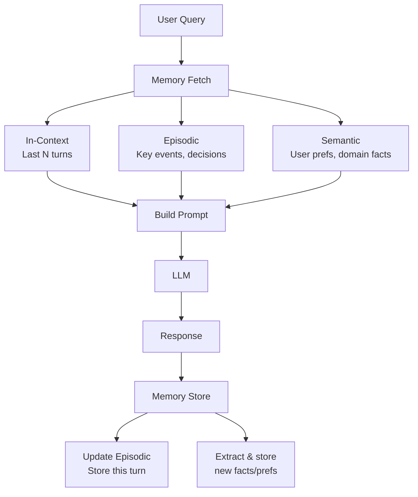

# Memory Systems for AI Agents

Memory is what separates a stateless chatbot from a capable long-running agent. Without memory, every conversation starts from scratch. With the right memory architecture, an agent can remember user preferences, learn from past mistakes, and accumulate knowledge over time.

## The four types of memory

```
┌─────────────────────────────────────────────────────────────────┐
│  In-Context Memory          │  External Memory                  │
│  ─────────────────          │  ───────────────                  │
│  Everything in the current  │  Persisted outside the model,     │
│  context window             │  retrieved when needed            │
│                             │                                   │
│  • Conversation history     │  • Vector store (semantic)        │
│  • Injected summaries       │  • Key-value store (episodic)     │
│  • Recent tool results      │  • Relational DB (structured)     │
└─────────────────────────────────────────────────────────────────┘

┌─────────────────────────────────────────────────────────────────┐
│  Episodic Memory            │  Semantic Memory                  │
│  ───────────────            │  ───────────────                  │
│  Specific past events       │  General facts and knowledge      │
│  ("last Tuesday user asked" │  ("user prefers Python over Java" │
│  "the API call failed with" │  "project uses PostgreSQL"        │
│  "we decided to use Redis") │  "team naming conventions")       │
└─────────────────────────────────────────────────────────────────┘
```

---

## 1. In-Context Memory (Conversation History)

The simplest form — just keep the full message history in the context window.

```python
messages = [
    {"role": "system", "content": system_prompt},
    {"role": "user",   "content": "My name is Alice"},
    {"role": "assistant", "content": "Hi Alice, how can I help?"},
    {"role": "user",   "content": "What's my name?"},
    # LLM can see the full history → knows name is Alice
]
```

**Limit:** Context window exhaustion. At ~200K tokens, costs spike and "lost in the middle" attention degradation kicks in.

**When to use:** Short conversations (< ~20 turns), simple chatbots, tasks that fit in one session.

---

## 2. Sliding Window Memory

Keep only the N most recent turns in context. Oldest messages are dropped.

```python
MAX_HISTORY_TURNS = 20

def trim_history(messages: list[dict]) -> list[dict]:
    system = [m for m in messages if m["role"] == "system"]
    history = [m for m in messages if m["role"] != "system"]

    # Keep only the last N turns (2 messages per turn: user + assistant)
    trimmed = history[-(MAX_HISTORY_TURNS * 2):]
    return system + trimmed
```

**Problem:** Older context is lost entirely, including important decisions made earlier.

---

## 3. Summarisation Memory

Periodically summarise older conversation history, replacing it with a compressed version.

```python
SUMMARISE_AFTER_TURNS = 10

async def maybe_summarise(messages: list[dict]) -> list[dict]:
    history = [m for m in messages if m["role"] != "system"]

    if len(history) < SUMMARISE_AFTER_TURNS * 2:
        return messages

    # Summarise oldest half
    to_summarise = history[:SUMMARISE_AFTER_TURNS]
    recent = history[SUMMARISE_AFTER_TURNS:]

    summary = await llm.complete(
        f"Summarise this conversation history concisely. "
        f"Preserve key decisions, facts, and user preferences:\n\n"
        + "\n".join(f"{m['role']}: {m['content']}" for m in to_summarise)
    )

    system = [m for m in messages if m["role"] == "system"]
    summary_msg = {
        "role": "system",
        "content": f"[Conversation summary so far]:\n{summary}"
    }
    return system + [summary_msg] + recent
```

**When to use:** Long multi-turn conversations where exact wording isn't critical.

---

## 4. External Episodic Memory (Key-Value Store)

Store specific past events, decisions, or interactions in a key-value or relational store. Retrieve by session ID, user ID, or time.

```python
import redis
import json
from datetime import datetime

class EpisodicMemory:
    def __init__(self, redis_client):
        self.redis = redis_client

    def store(self, session_id: str, event: dict):
        key = f"memory:{session_id}:events"
        entry = {**event, "timestamp": datetime.utcnow().isoformat()}
        self.redis.lpush(key, json.dumps(entry))
        self.redis.ltrim(key, 0, 99)   # keep last 100 events

    def retrieve(self, session_id: str, n: int = 20) -> list[dict]:
        key = f"memory:{session_id}:events"
        raw = self.redis.lrange(key, 0, n - 1)
        return [json.loads(r) for r in raw]

    def retrieve_as_context(self, session_id: str) -> str:
        events = self.retrieve(session_id)
        return "\n".join(
            f"[{e['timestamp']}] {e['type']}: {e['description']}"
            for e in events
        )
```

**Structured storage also works:**

```sql
CREATE TABLE agent_memories (
    id          BIGSERIAL PRIMARY KEY,
    session_id  TEXT NOT NULL,
    user_id     TEXT,
    type        TEXT NOT NULL,   -- 'decision', 'error', 'preference', 'fact'
    content     JSONB NOT NULL,
    created_at  TIMESTAMPTZ DEFAULT now()
);
```

---

## 5. Semantic Memory (Vector Store)

Store facts, preferences, and knowledge as embeddings. Retrieve by semantic similarity — relevant memories are fetched even if the exact words don't match.

```python
from openai import OpenAI

client = OpenAI()

class SemanticMemory:
    def __init__(self, vector_db):
        self.db = vector_db

    def store(self, content: str, metadata: dict = {}):
        embedding = client.embeddings.create(
            model="text-embedding-3-small",
            input=content
        ).data[0].embedding

        self.db.upsert({
            "content": content,
            "embedding": embedding,
            "metadata": metadata
        })

    def retrieve(self, query: str, top_k: int = 5) -> list[str]:
        query_embedding = client.embeddings.create(
            model="text-embedding-3-small",
            input=query
        ).data[0].embedding

        results = self.db.search(query_embedding, top_k=top_k)
        return [r["content"] for r in results]

    def retrieve_as_context(self, query: str) -> str:
        memories = self.retrieve(query)
        if not memories:
            return ""
        return "Relevant memories:\n" + "\n".join(f"- {m}" for m in memories)
```

**Example usage in an agent:**

```python
memory = SemanticMemory(vector_db)

# When user shares a preference
memory.store(
    "User prefers Python code examples over JavaScript",
    metadata={"user_id": "alice", "type": "preference"}
)

# On next query, inject relevant memories
query = "Show me a web scraping example"
context = memory.retrieve_as_context(query)
# → "Relevant memories: - User prefers Python code examples over JavaScript"
# → Agent now provides Python example without being asked
```

---

## 6. Full Memory Architecture (Production)

A production agent typically combines multiple memory types:



```python
class AgentWithMemory:
    def __init__(self):
        self.episodic  = EpisodicMemory(redis_client)
        self.semantic  = SemanticMemory(vector_db)
        self.in_context: list[dict] = []

    async def chat(self, user_id: str, message: str) -> str:
        # 1. Fetch relevant memories
        episodic_context  = self.episodic.retrieve_as_context(user_id)
        semantic_context  = self.semantic.retrieve_as_context(message)

        # 2. Build prompt with memory injected
        system = self.build_system_prompt(episodic_context, semantic_context)

        self.in_context.append({"role": "user", "content": message})
        self.in_context = trim_history(self.in_context)

        # 3. Generate response
        response = await llm.chat(
            system=system,
            messages=self.in_context
        )
        self.in_context.append({"role": "assistant", "content": response})

        # 4. Store this turn in episodic memory
        self.episodic.store(user_id, {
            "type": "conversation_turn",
            "description": f"User asked: {message[:100]}. Agent responded about: {extract_topic(response)}"
        })

        # 5. Extract and store any new facts/preferences
        await self.extract_and_store_facts(user_id, message, response)

        return response

    async def extract_and_store_facts(self, user_id: str, message: str, response: str):
        facts = await llm.complete(
            f"Extract any user preferences, decisions, or important facts from this exchange. "
            f"Return a JSON array of strings. Return [] if none.\n\n"
            f"User: {message}\nAssistant: {response}"
        )
        for fact in json.loads(facts):
            self.semantic.store(fact, metadata={"user_id": user_id})
```

---

## mem0 — Memory as a Service

[mem0](https://github.com/mem0ai/mem0) is an open-source library that handles the full memory pipeline automatically:

```python
from mem0 import Memory

m = Memory()

# Add memories
m.add("I prefer dark mode in all applications", user_id="alice")
m.add("I'm working on a Python FastAPI project", user_id="alice")

# Search relevant memories
memories = m.search("What are Alice's preferences?", user_id="alice")
# → ["I prefer dark mode...", "I'm working on FastAPI..."]

# Get all memories for a user
all_memories = m.get_all(user_id="alice")
```

mem0 uses an LLM to extract facts from conversations and stores them in a vector database with automatic deduplication and conflict resolution.

---

## Memory for long-running agents

For agents that run over hours or days (e.g. autonomous research agents):

```python
class LongRunningAgent:
    def checkpoint(self, state: AgentState):
        """Save agent state to allow resumption after interruption."""
        db.save({
            "agent_id": self.id,
            "step": state.current_step,
            "completed_steps": state.completed,
            "working_memory": state.scratchpad,
            "accumulated_results": state.results,
            "timestamp": datetime.utcnow()
        })

    def resume(self, agent_id: str) -> AgentState:
        """Resume from last checkpoint."""
        saved = db.load(agent_id)
        return AgentState(
            current_step=saved["step"],
            completed=saved["completed_steps"],
            scratchpad=saved["working_memory"],
            results=saved["accumulated_results"]
        )
```

---

## Interview / design angle

!!! tip "What comes up in AI system design"
    - *"How does your chatbot remember previous conversations?"* → Summarisation memory for in-context + semantic memory for user preferences
    - *"How would you build a personal AI assistant?"* → Four-tier memory: in-context (recent), episodic (events), semantic (facts/prefs), long-term profile
    - *"What happens if the context window fills up?"* → Sliding window + periodic summarisation, offload to external semantic memory

## Related topics

- [Agents & Tool Use](agents-and-tool-use.md) — the agent loop that memory feeds into
- [RAG](rag.md) — semantic memory is structurally the same as RAG
- [Embeddings & Vector Search](embeddings-vector-search.md) — the underlying tech for semantic memory
- [Redis Deep Dive](../caching/redis.md) — episodic memory storage
