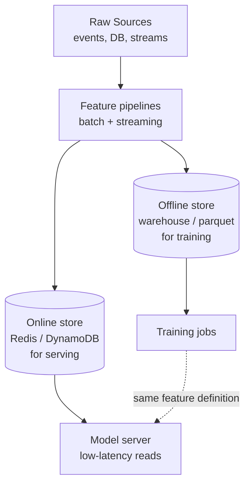
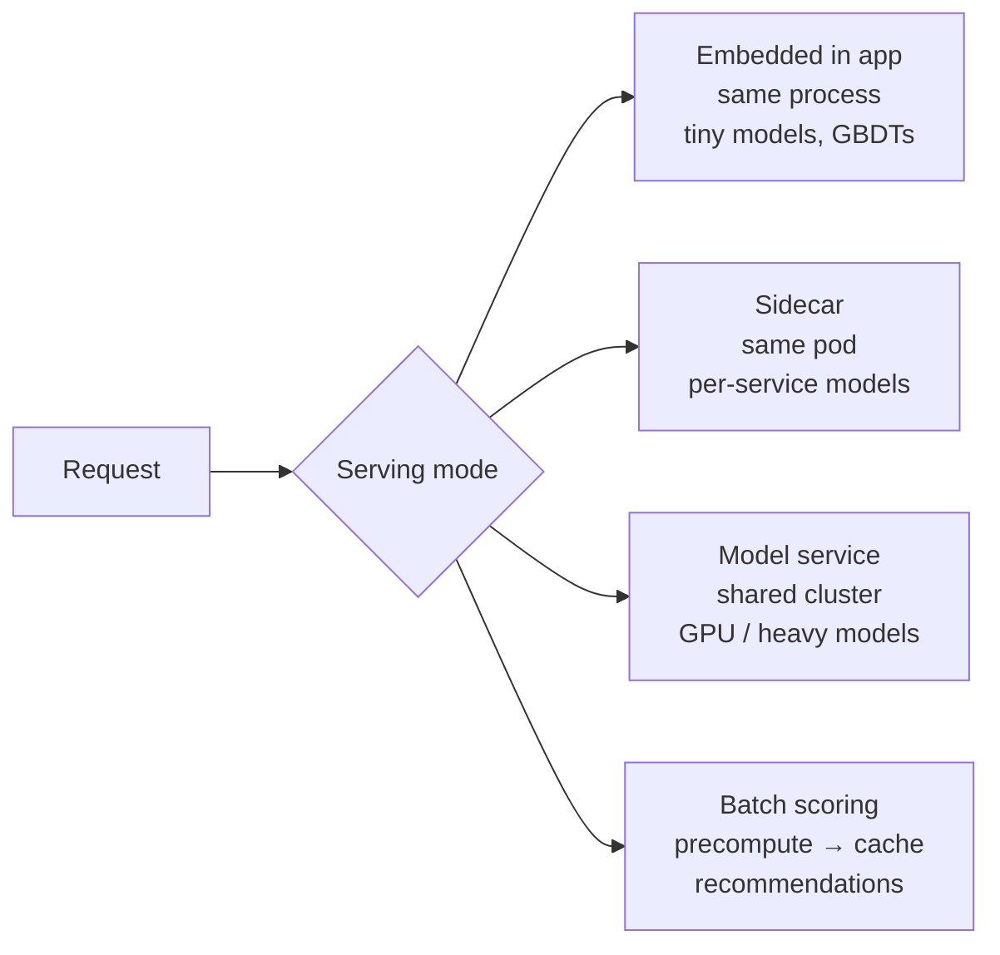
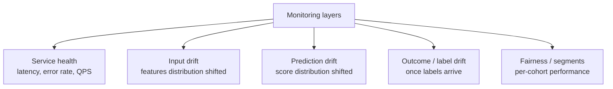
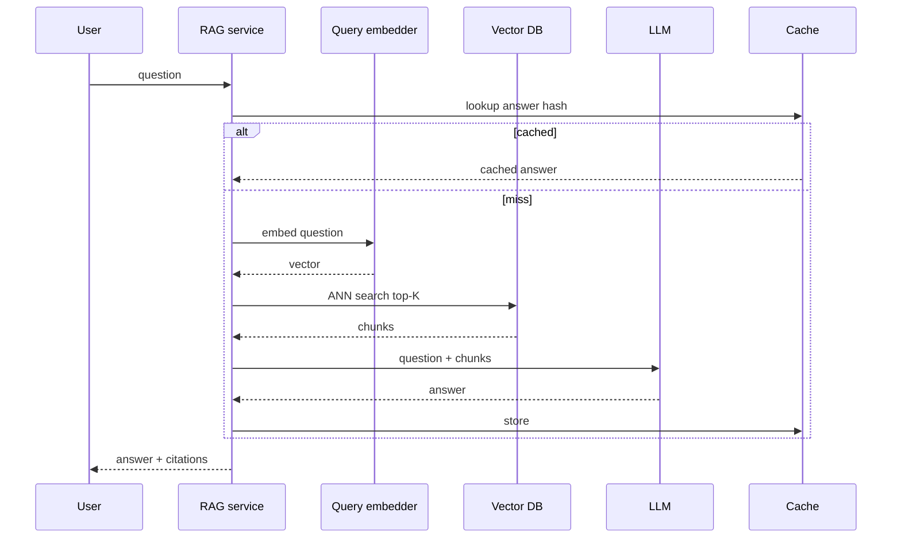

---
tags:
  - applied
  - for-scale
---

# ML in Production (Beyond LLMs)

## You'll see this when...

- A recommender, ranker, fraud model, or classifier is moving from notebook to serving traffic
- The team is debating "where does feature engineering live" — app, warehouse, or feature store
- Models are silently degrading because training data drifted from serving data
- A/B tests for model changes are inconclusive because the variance dominates the effect

LLMs get the press; classical ML still runs ranking, fraud, ads, pricing, recommendations, churn, and forecasting. The operational discipline is older and in many ways harder.

## The training/serving skew problem

The single biggest source of production ML bugs. The feature your model trained on is computed differently than the feature your serving stack produces.

```
Training (offline, batch):
  warehouse SQL → user_signup_age_days = DATEDIFF(now, signup_date)
    → computed at 2am UTC daily

Serving (online, request time):
  app code → user_signup_age_days = (System.currentTimeMillis() - user.signup_ms) / 86_400_000
    → wall-clock, possibly different timezone

Result: the same logical feature has subtly different values.
Model performance silently degrades. No alert fires.
```

The fix is to define features in one place and consume them from both pipelines. That place is a **feature store**.

## Feature stores



| Tool | Where it shines |
|---|---|
| **Feast** | Open source, pluggable backends, lightweight |
| **Tecton** | Managed, opinionated, good for streaming features |
| **Vertex AI Feature Store** | GCP-native |
| **SageMaker Feature Store** | AWS-native |
| **Databricks Feature Store** | If you live in the lakehouse |

The feature store gives you:

- **Point-in-time correctness** for training — joining a label at time T with feature values as they were at T, not as they are now (no leakage)
- **Online/offline parity** — same definition, two stores
- **Reuse** — fraud team's "30-day spend" feature can be picked up by the credit team

The boring tech alternative: a shared SQL/dbt model that writes to a warehouse table and is replicated to Redis nightly. Works for many use cases. Only adopt a full feature store when feature reuse, streaming features, or point-in-time joins are genuinely needed.

## Model serving patterns



| Pattern | When |
|---|---|
| **Embedded** (in-process) | Latency-critical, small models, tabular (XGBoost, LightGBM in app memory) |
| **Sidecar / per-service** | One team's model, isolated lifecycle |
| **Shared inference service** | GPU pools, many tenants, model gateway (Triton, KServe, BentoML, Ray Serve) |
| **Batch / precomputed** | Recommendations, ranking — score offline, serve from KV |

### Tools

- **NVIDIA Triton Inference Server** — multi-framework, multi-model GPU serving, dynamic batching
- **KServe** — Kubernetes-native model serving, autoscaling to zero
- **BentoML** — Python-friendly packaging + serving
- **Ray Serve** — composition of models and Python logic
- **TorchServe / TF Serving** — framework-specific
- **ONNX Runtime** — framework-agnostic inference, often faster than native

### Dynamic batching

GPUs are far more efficient at batch sizes > 1. Triton/Ray Serve queue incoming requests for a few ms, batch them, run one forward pass, return.

```
Request rate 1000 RPS, model latency at batch=1 is 20ms, at batch=32 is 25ms.
Without batching: 20ms p50, GPU at 30% utilization.
With batching (5ms window):  25ms p50, GPU at 90% utilization, 30x lower cost.
```

Trade-off: a few ms added latency for massive cost savings.

## A/B testing models

Naïve A/B (50/50 split, run for 2 weeks) is often wrong for ML changes.

```
Why it breaks:
  - Effect sizes are small (a 0.5% lift on CTR is huge in ads)
  - Variance is high (heavy-tailed user behavior)
  - Network effects: a recommender shifts inventory, affecting the control group
  - Novelty effects: short-term lift, long-term flat
  - Position bias: the slot you tested in dominates the result
```

### Better approaches

**Interleaving** (for ranking): show one query, mix results from model A and model B, see which clicks the user produces. Faster signal, lower variance.

**Multi-armed bandits**: dynamically allocate traffic to better-performing variants. Useful when you have many candidates and want to converge fast. Watch out — bandits assume stationarity that often doesn't hold.

**Switchback / time-sliced experiments**: rotate the model every N minutes across all traffic. Removes user-level network effects (e.g., marketplace).

**Holdout cohort**: a small permanent group (1-5%) never sees new models. The long-run delta is your ground truth that the system is improving.

## Model monitoring

Monitoring an ML system is not the same as monitoring a web service. The service can be up (200 OK, p99 ok) while the model is rotting.

### What to watch



| Signal | How |
|---|---|
| **Feature drift** | Compare live feature stats vs training reference (PSI, KS test, Wasserstein) |
| **Prediction drift** | Distribution of scores over time |
| **Performance** | Once labels land (clicks, conversions, fraud confirmations), compute AUC / MAE / precision\@k |
| **Per-segment** | Slice by country, device, customer tier — overall metric can hide a broken segment |
| **Calibration** | A score of 0.7 should mean 70% positive. Plot reliability curves. |
| **Fairness** | False-positive/negative rates across protected groups |

Label arrival is often delayed (days for refunds, weeks for fraud chargebacks). You need both **leading indicators** (drift) and **lagging truth** (delayed labels).

### Tools

- **Evidently AI / WhyLabs / Arize / Fiddler** — drift, fairness, monitoring dashboards
- **Prometheus + Grafana** — for feature/score histograms with custom exporters
- **Great Expectations / Soda** — input data quality

## Embedding pipelines

For recommendations, semantic search, dedup, and many other tasks, you compute embeddings, store them, and search.

```
Producer side:
  content event → embedder model → embedding (768-d float vec)
                                  → write to vector DB + cache
                                  → write to warehouse for offline analysis

Consumer side:
  query event → embedder model (SAME version) → query vector
                                              → ANN search
                                              → re-rank top-K
```

### Operational gotchas

- **Embedding versioning**: change the model, all old embeddings become incompatible. You either reindex everything (expensive, hours) or run two indexes during cutover.
- **Drift between embedder versions**: never serve from index v1 with query model v2 — distances are meaningless.
- **Quantization**: float32 → int8 cuts memory 4x with small recall loss. Standard for >100M vectors.
- **Cold start**: new items have no interaction signal — initial embedding has to come from content.

See also [Embeddings + Vector Search](embeddings-vector-search.md).

## RAG operations

Beyond the demo, RAG in production has its own ops surface.

| Concern | What to monitor / control |
|---|---|
| **Retrieval quality** | recall\@k offline, click-through online, "answer-in-context" rate |
| **Chunking strategy** | Re-chunk and re-embed when sources change; version chunks |
| **Index freshness** | How fast does new content become retrievable? Minutes vs hours matters. |
| **Citation correctness** | Did the answer cite the right chunk? Eval with LLM-as-judge + spot checks |
| **Cost per query** | Token count × calls × markup; cache retrievals and answers where safe |
| **Sensitive data** | ACLs on the vector store; never embed PII without need; redact in indexing |

The standard pipeline:



## CI/CD for ML

ML pipelines need their own promotion model.

```
Code change → unit tests → training pipeline run
   → registered model version
   → offline eval gates (AUC > threshold, fairness checks, no regression on slices)
   → staging deploy (shadow traffic)
   → A/B / canary on small % of traffic
   → promotion to 100% (or rollback)
```

### Tools

- **MLflow** — experiment tracking, model registry, packaging
- **Weights & Biases** — heavier-weight experiment tracking + dashboards
- **Vertex AI / SageMaker Pipelines** — managed pipelines
- **Kubeflow / Metaflow / Flyte / Prefect** — DAG runners with ML semantics
- **DVC** — data + model versioning in git

### Reproducibility checklist

- Pinned package versions (`requirements.txt` or lockfiles)
- Data snapshot version (DVC, Delta time travel, Iceberg snapshot id)
- Random seeds where it matters (and acknowledged where it doesn't — distributed training is rarely bitwise reproducible)
- Code commit SHA stored alongside the trained model
- Hardware notes if it matters (GPU model affects fp16 results)

## Online learning vs offline training

```
Offline (batch retrain):
  train weekly/daily on historical data → deploy → score
  Pros: simple, stable, easy rollback
  Cons: slow to adapt to drift

Online (incremental):
  update model parameters from each event / mini-batch
  Pros: adapts fast, low latency to new patterns
  Cons: harder to debug, can be poisoned, hard to A/B
```

Most teams should default to **offline retraining** with a **fast schedule** (daily or hourly). True online learning is justified for cases like ad bidding, news ranking, and fraud where the world genuinely changes in minutes.

## Anti-patterns

| Anti-pattern | Why it hurts | Better |
|---|---|---|
| Training features in notebooks, serving features in app code | Skew | Feature store or shared SQL/Python module |
| No reference dataset for drift | Can't detect drift | Snapshot training distribution; compare live |
| Deploy on offline metric only | Real users behave differently | Always validate with shadow + A/B |
| One global model performance number | Hides broken segments | Slice by country / cohort / device |
| Re-embed without reindexing | Mixed-version distance is nonsense | Atomic reindex or dual indexes |
| Ignoring label delay | "Yesterday's AUC" is impossible | Track delayed labels separately, alert on leading drift |
| Bandits without guardrails | Can lock onto a degenerate variant | Min exploration, kill switches, holdout |
| Notebooks in prod | Not reproducible, not versioned | Promote to pipeline-as-code |

## Quick reference

| Need | Reach for |
|---|---|
| Tabular model in a Java service | XGBoost/LightGBM → ONNX → embedded |
| GPU inference, many models | Triton or KServe with shared GPU pool |
| Reusable features for many models | Feature store (Feast/Tecton) |
| Detect drift before label arrives | PSI on top features; alert on threshold |
| Test a new ranker | Interleaving > vanilla A/B for ranking |
| Score recommendations cheaply | Batch nightly → KV; serve from Redis |
| Personalized but cold start | Content-based embedding as fallback |
| Sensitive data in RAG | ACL filter at retrieval; never embed raw PII |

## Interview angle

!!! tip "What interviewers are testing"
    For ML systems they're not asking you to invent the model. They want to see you treat the model as one component in a system that also has data pipelines, monitoring, retraining, rollback, and skew.

**Strong answer pattern:**

1. Separate offline (training) and online (serving) paths and call out that features must come from one definition
2. Pick serving topology — embedded vs service vs batch — and justify with latency and cost
3. Describe how you detect that the model is degrading before customers complain (drift + delayed labels)
4. Explain rollout — shadow, then A/B with proper variance / interleaving / holdout — not just "deploy"
5. Be honest about failure modes — silent skew, label delay, fairness regressions, cold start

**Common follow-ups:**

- "How would you A/B test a new ranker fairly?" — interleaving for ranking, switchback for marketplace effects, long-term holdout for novelty
- "How do you detect the model has gone bad before any user complains?" — input drift on top features + score distribution + per-segment health
- "How do you handle the same feature being computed for training and serving?" — feature store or single shared transform module called from both paths
- "How would you re-index 100M embeddings without downtime?" — dual indexes, write to both, switch reads, drop old

## Related topics

- [LLMOps](llmops.md) — operations for generative models
- [RAG](rag.md) — retrieval-augmented generation
- [Embeddings + Vector Search](embeddings-vector-search.md)
- [Evaluation](evaluation.md) — offline + online metrics
- [Modern Data Stack](../storage/modern-data-stack.md) — where features and labels live
- [Performance Engineering](../observability/performance-engineering.md) — latency analysis for inference
