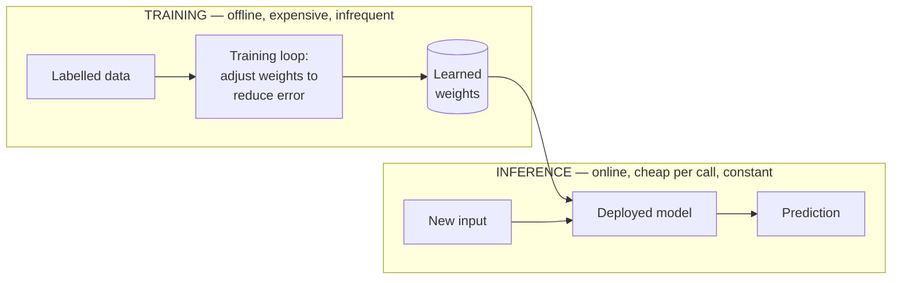

---
tags:
  - applied
---

# ML & AI Literacy

The mental model you need *before* any LLM-specific page makes sense. If "model", "training vs inference", "parameters", "overfitting", or "precision vs recall" are fuzzy terms, start here. Everything from prompt engineering to RAG to fine-tuning is built on these foundations.

## You'll see this when...

- Someone says "let's add AI to this" and you can't tell whether the problem actually needs ML — or just a few `if` statements
- A model scores 99% accuracy in a demo and falls apart in production (it was evaluated on data it trained on)
- A teammate proposes an LLM for a task that logistic regression would solve faster, cheaper, and more reliably
- A vendor quotes "7B parameters" or "175B parameters" and you have no intuition for what that means in cost or capability
- A fraud model has "95% accuracy" but misses every actual fraud case (the classes are imbalanced and accuracy is the wrong metric)
- You're asked "is this supervised or unsupervised?" in an interview and need a crisp one-liner

---

## What a "model" actually is

Strip away the mystique: a machine learning model is **a function with parameters that were learned from data instead of written by a programmer**.

```
Traditional code:   you write the rules
    input → [ rules you wrote ] → output

Machine learning:   the rules are learned from examples
    input → [ f(input; learned weights) ] → output
```

The function `f` has a fixed *shape* (the architecture) and a set of numbers called **parameters** (also: **weights**). Training adjusts those numbers so the function maps inputs to the outputs you want.

```
spam_score = f(email_features; weights)
             where weights = [0.8, -1.2, 0.3, ...]  ← learned, not hand-coded
```

### Parameters vs hyperparameters

These get confused constantly. The distinction is who sets them and when.

| | Parameters (weights) | Hyperparameters |
|---|---|---|
| Set by | The training process | You, before training |
| Examples | The 0.8, -1.2 numbers above | Learning rate, number of layers, tree depth, regularisation strength |
| When | Learned during training | Chosen before / tuned across runs |
| Count | Millions to billions | A handful to a few dozen |

You *tune* hyperparameters (often by trying several and comparing on validation data). The model *learns* parameters.

---

## The three learning paradigms

| Paradigm | What it learns from | One-line | Example |
|---|---|---|---|
| **Supervised** | Labelled examples (input → known answer) | Learn to predict the label | Spam/not-spam, house price prediction, image classification |
| **Unsupervised** | Unlabelled data (no answers given) | Find structure on its own | Customer segmentation (clustering), anomaly detection, dimensionality reduction |
| **Reinforcement** | Rewards from trial and error | Learn a policy that maximises reward | Game-playing agents, robotics, RLHF used to align LLMs |

Most production ML is **supervised** — it dominates because labelled data plus a clear target is the most tractable setup. Unsupervised is common for exploration and preprocessing. Reinforcement learning is powerful but expensive and finicky; you'll meet it mainly as the "RL" in **RLHF** (the alignment step that turns a raw next-token predictor into a helpful chat model — see [LLM Fundamentals](llm-fundamentals.md)).

---

## Training vs inference — the one distinction that matters most

If you remember nothing else, remember this. **Training** produces the weights. **Inference** uses them. They have opposite cost profiles, run at different times, and often on different hardware.



| | Training | Inference |
|---|---|---|
| When | Once / periodically (offline) | Every request (online) |
| Cost | High, one-off (hours–weeks of GPU) | Low *per call*, but adds up at volume |
| Output | A set of weights | A prediction |
| Hardware | Many GPUs/TPUs, lots of memory | Often a single GPU, or CPU for small models |
| Data | Large labelled dataset | One input at a time (or a batch) |
| Frequency | Rare | Constant |

Why it matters for system design: **you size and budget these completely differently.** A model might cost \$50k to train once and then \$0.0001 per inference. Your serving infrastructure, autoscaling, and latency budgets are all about *inference*. Training is a batch job. (For the serving side, see [ML in Production](ml-in-production.md).)

---

## Classical ML vs deep learning vs foundation models

There is a strong temptation in 2026 to reach for an LLM for everything. Don't. The right tool depends on the problem, the data you have, and your latency/cost budget. This is a progression, not a ranking — each row is the *best* choice for some problems.

| Approach | What it is | Best when | Watch out for |
|---|---|---|---|
| **Classical ML** (logistic regression, linear models, decision trees, gradient-boosted trees like XGBoost) | Hand-engineered features → relatively simple learned function | Tabular data, < millions of rows, interpretability matters, low latency, small budget | Still needs good features; struggles with raw text/images |
| **Deep learning** (neural networks, CNNs, RNNs) | Many-layered networks that learn features automatically | Images, audio, large datasets where features are hard to hand-craft | Needs lots of data + compute; harder to interpret |
| **Foundation models / LLMs** (Transformers pretrained on web-scale data) | Huge pretrained models adaptable to many tasks via prompting or fine-tuning | Open-ended language tasks, few labelled examples, fast prototyping | Expensive, slower, non-deterministic, can hallucinate; overkill for narrow tasks |

**The boring option is often the right one.** For structured/tabular prediction (churn, fraud scoring, demand forecasting), **gradient-boosted trees (XGBoost / LightGBM)** routinely beat deep learning *and* LLMs while being faster, cheaper, and easier to explain. Reach for an LLM when the input is unstructured language and the task is open-ended — not because it's the newest tool in the box.

```
Decision sketch:
  Tabular data, clear target?           → gradient-boosted trees (XGBoost)
  Images / audio / large unstructured?  → deep learning
  Open-ended language, few labels?      → LLM (prompt first, fine-tune later)
  Crisp rules a human can write?        → no ML — just write the rules
```

---

## Features and feature engineering

A **feature** is an input signal the model sees. Raw data is rarely fed in directly; you transform it into features.

```
Raw:      transaction at 03:14 on 2026-06-18, amount £4,200, country DE
Features: hour_of_day=3, amount_zscore=5.1, is_foreign_country=1,
          txns_last_hour=7, amount_vs_user_avg=12.0x
```

**Feature engineering** — crafting these signals — is where most of the accuracy in classical ML comes from. (Deep learning and LLMs do more of this automatically, which is part of their appeal.) In production, features are computed consistently for training *and* inference, which is the whole point of a **feature store** — see [ML in Production](ml-in-production.md).

---

## Embeddings, at a literacy level

An **embedding** is a dense vector of numbers that represents the *meaning* of something (a word, sentence, image, product) such that similar things sit close together in that vector space.

```
"dog"   → [0.23, -0.45, 0.67, ...]
"puppy" → [0.25, -0.43, 0.65, ...]   ← close (similar meaning)
"audit" → [-0.81, 0.12, -0.05, ...]  ← far away
```

That's the literacy-level idea: meaning becomes geometry, and "similar" becomes "nearby". This is what powers semantic search, recommendations, and retrieval for RAG. For similarity metrics, vector databases, and approximate nearest-neighbour search, see [Embeddings & Vector Search](embeddings-vector-search.md).

---

## Overfitting, underfitting, and the data split

A model that memorises its training data looks brilliant on that data and useless on anything new. This is **overfitting**. The opposite — too simple to capture the real pattern — is **underfitting**.

```
Underfit:  ─────────        (straight line through curvy data: misses the pattern)
Good fit:  ～～～～～         (captures the trend, ignores noise)
Overfit:   ∿∿∿∿∿∿∿          (wiggles through every point, incl. noise)
```

The defence is to **split your data** and never let the model see the test set during training:

| Split | Purpose | Touched during training? |
|---|---|---|
| **Train** (~70%) | Learn the weights | Yes |
| **Validation** (~15%) | Tune hyperparameters, pick best model | Indirectly (used to choose) |
| **Test** (~15%) | Final, honest estimate of real-world performance | No — touched once, at the end |

**The cardinal rule: never evaluate on data the model trained on.** A 99% accuracy on the training set tells you almost nothing — the model may have just memorised. The only number that matters is performance on data it has never seen. (For doing this rigorously, see [Evaluation](evaluation.md).)

---

## Evaluation: accuracy is not enough

Accuracy = "fraction of predictions that were correct." It's intuitive and often dangerously misleading, especially with **imbalanced classes**.

> If 1 in 1,000 transactions is fraud, a model that predicts "not fraud" every single time is **99.9% accurate** — and catches zero fraud. Accuracy is the wrong metric here.

The richer picture comes from the **confusion matrix**:

```
                  Predicted Positive   Predicted Negative
Actual Positive   True Positive (TP)    False Negative (FN)  ← missed it
Actual Negative   False Positive (FP)   True Negative (TN)
                  ↑ false alarm
```

From it come the metrics that actually matter:

| Metric | Formula | Question it answers | Care about it when |
|---|---|---|---|
| **Precision** | TP / (TP + FP) | When we flag something, how often are we right? | False alarms are costly (e.g. blocking a legit transaction) |
| **Recall** | TP / (TP + FN) | Of all the real cases, how many did we catch? | Misses are costly (e.g. missing a tumour, missing fraud) |
| **F1** | harmonic mean of the two | Balance of precision and recall | You need a single number balancing both |

**Metric choice depends on the cost of each error type.** A cancer screen prioritises recall (don't miss a case — a false alarm just means another test). A spam filter prioritises precision (don't dump a real email in spam — a missed spam is mildly annoying). There is no universal "best" metric; you choose based on which mistake hurts more.

---

## Parameters and scale intuition

When you hear "7B" or "175B", that's the **parameter count** — the number of learned weights. More parameters generally means more capacity (and more memory, cost, and latency).

| Scale | Parameters | Examples | Intuition |
|---|---|---|---|
| Classical model | dozens – thousands | logistic regression, small trees | Fits in a config file |
| Small neural net | millions | older CV/NLP models | Runs on a laptop |
| Small/edge LLM | 1B – 8B (e.g. "7B") | Llama 3 8B, small Mistral | Runs on one consumer/server GPU |
| Mid LLM | 8B – 70B | Llama 3 70B | Needs a serious GPU or several |
| Frontier LLM | 100B – 1T+ | GPT-4-class, Claude, Gemini | Datacentre-scale; you call an API, you don't host it |

Rough memory rule of thumb: at 16-bit precision, **a model needs ~2 GB of GPU memory per billion parameters** just to load the weights (a 7B model ≈ 14 GB), plus more for the working context. Quantising to 8-bit or 4-bit roughly halves or quarters that — the main lever for running big models on small hardware. For order-of-magnitude figures across systems, see [Numbers to Know](../fundamentals/numbers-to-know.md).

---

## When you do NOT need ML at all

The most senior move is often *not* using ML. ML adds data pipelines, training jobs, monitoring, drift, and non-determinism. If a handful of rules solves the problem, write the rules.

```
Prefer rules / heuristics when:
  - The logic is known and stable    ("flag transactions > £10,000")
  - You have little or no labelled data
  - You need full explainability      (regulators, audits)
  - The cost of a wrong answer is high and edge cases are rare

Reach for ML when:
  - The pattern is real but too complex to hand-code
  - You have representative labelled data
  - Inputs vary in ways rules can't enumerate
  - You can tolerate (and measure) some error
```

Start with rules. Add ML when rules visibly stop scaling — and you have the data to do better.

---

## Anti-patterns

| Anti-pattern | Why it hurts | Better |
|---|---|---|
| Reaching for an LLM for a tabular prediction | Slower, costlier, less accurate, non-deterministic vs a tree model | Use gradient-boosted trees (XGBoost/LightGBM) for tabular data |
| Reporting accuracy on imbalanced classes | A "99.9% accurate" model can catch zero of the thing you care about | Report precision, recall, F1; inspect the confusion matrix |
| Evaluating on the training data | Measures memorisation, not generalisation; looks great, fails in prod | Hold out a test set; touch it only once, at the end |
| Tuning hyperparameters against the test set | Leaks the test set into model selection; inflated, dishonest numbers | Tune on validation; reserve test for the final estimate |
| Building ML when rules would do | Adds pipelines, drift, non-determinism, and cost for no gain | Write the rules first; add ML only when they stop scaling |
| Confusing parameters with hyperparameters | Leads to nonsense like "manually setting the weights" | Weights are learned; hyperparameters are chosen before training |

---

## Quick reference

| Need | Reach for |
|---|---|
| Predict a number or category from tabular data | Classical ML — gradient-boosted trees (XGBoost), logistic regression |
| Classify images / audio | Deep learning (CNNs) |
| Open-ended language tasks, few labels | Foundation model / LLM |
| Group similar items with no labels | Unsupervised clustering |
| Crisp, known, stable logic | Rules / heuristics — no ML |
| Honest performance estimate | Held-out test set, evaluated once |
| The right success metric | Precision / recall / F1 based on which error costs more |
| Memory to load an LLM | ~2 GB per billion params at 16-bit; less if quantised |

---

## Interview angle

!!! tip "What interviewers are testing"
    Whether you have *engineering judgement* about ML, not just buzzword recall. They want to see that you'd pick the simplest tool that works, that you understand the train/inference cost split, and that you won't be fooled by a misleading accuracy number. Reaching straight for an LLM on a tabular problem is a red flag; naming the boring tree model is a green one.

**Strong answer pattern:**

1. Clarify the task and the data: is it tabular, language, images? Labelled or not? How much data? What's the latency/cost budget?
2. Ask whether ML is even needed — could rules or heuristics solve it acceptably?
3. Pick the simplest model class that fits (trees for tabular, LLM only for open-ended language) and justify the choice.
4. Define success with the *right* metric for the error costs (precision vs recall), not raw accuracy.
5. Separate training (offline, batch, expensive, infrequent) from inference (online, cheap-per-call, the thing you actually scale and monitor).

**Common follow-ups:**

- *"Why not just use an LLM for everything?"* — Cost, latency, non-determinism, and hallucination. For tabular prediction a gradient-boosted tree is faster, cheaper, more accurate, and explainable.
- *"Your model has 99% accuracy — ship it?"* — Not without checking class balance. On imbalanced data accuracy is misleading; show me precision/recall and the confusion matrix.
- *"What's the difference between training and inference?"* — Training learns the weights once, offline, expensively. Inference applies them per request, cheaply, online. They're sized and budgeted separately.
- *"Parameters vs hyperparameters?"* — Parameters (weights) are learned during training; hyperparameters (learning rate, depth) are set by you before training and tuned on validation data.
- *"What does '7B' mean and why care?"* — 7 billion learned parameters; roughly 14 GB of GPU memory at 16-bit, which sets your hosting cost and whether it fits on one GPU.

---

## Test yourself

??? question "What is the single most important difference between training and inference, and why does it matter for system design?"

    Training learns the weights — it's offline, expensive, and infrequent (a batch job). Inference applies those weights to new inputs — it's online, cheap per call, and constant. It matters because you size, budget, and scale them completely differently: your serving infra, autoscaling, and latency budgets are all about inference, while training is a periodic batch job on different (often much larger) hardware.

??? question "A fraud model reports 99.9% accuracy on a dataset where 0.1% of transactions are fraud. Is it good?"

    Almost certainly not — you can't tell from accuracy alone. A model that always predicts "not fraud" achieves 99.9% accuracy and catches zero fraud. With imbalanced classes, accuracy is the wrong metric. Look at the confusion matrix and report precision and recall: how many flagged transactions were really fraud, and how many real fraud cases were caught.

??? question "When should you choose gradient-boosted trees over an LLM?"

    For structured/tabular data with a clear target (churn, fraud scoring, demand forecasting). Trees like XGBoost/LightGBM are typically faster, cheaper, more accurate, deterministic, and far easier to explain than an LLM on these problems. Reach for an LLM only when the input is unstructured language and the task is open-ended.

??? question "Why must you never evaluate a model on its training data?"

    Because it measures memorisation, not generalisation. A model can score near-perfectly on data it has already seen while failing on anything new (overfitting). The only honest performance estimate comes from a held-out test set the model never saw during training or hyperparameter tuning — and you touch it once, at the end.

??? question "What's the difference between parameters and hyperparameters, and roughly how much memory does a '7B' model need?"

    Parameters (weights) are the numbers learned during training — millions to billions of them. Hyperparameters (learning rate, tree depth, number of layers) are set by you before training and tuned on validation data. "7B" means 7 billion parameters; at 16-bit precision that's roughly 14 GB of GPU memory to load (~2 GB per billion params), less if quantised to 8- or 4-bit.

---

## Related

- [LLM Fundamentals](llm-fundamentals.md) — tokens, context windows, sampling — the LLM-specific layer on top of these basics
- [Embeddings & Vector Search](embeddings-vector-search.md) — the deep dive on the embedding concept introduced here
- [Working with LLM APIs](working-with-llm-apis.md) — calling foundation models in practice
- [ML in Production](ml-in-production.md) — feature stores, serving, monitoring, and drift
- [Evaluation](evaluation.md) — measuring model quality rigorously
- [Numbers to Know](../fundamentals/numbers-to-know.md) — order-of-magnitude figures for capacity planning
