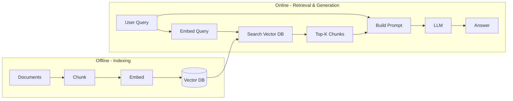
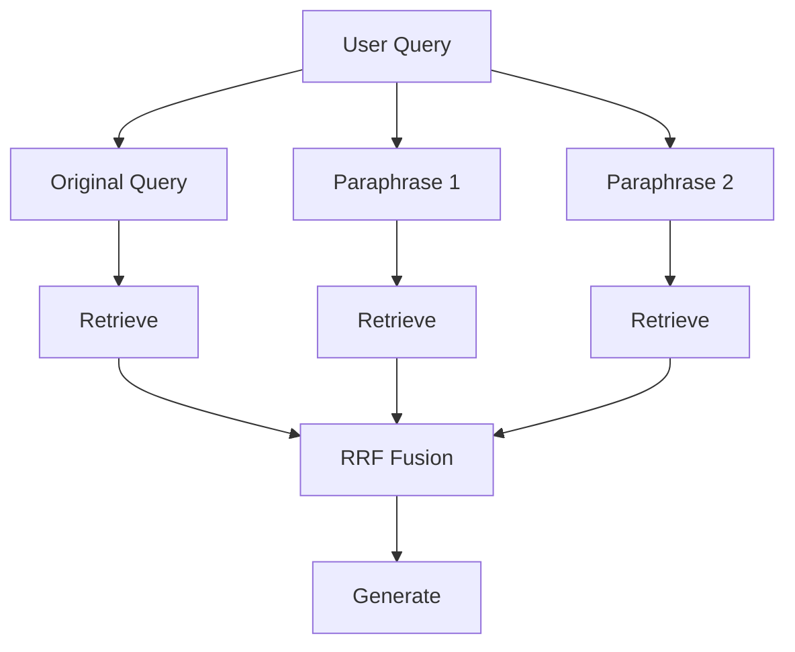

# RAG — Retrieval-Augmented Generation

RAG is the most important pattern in production AI systems. Instead of relying solely on the knowledge baked into the model's weights, you retrieve relevant context at query time and inject it into the prompt. This grounds the model's response in your data.

## Why RAG?

| Problem | RAG solution |
|---|---|
| LLM knowledge is frozen at training cutoff | Retrieve fresh data at query time |
| LLM doesn't know your private data | Retrieve from your documents/DB |
| LLM hallucinates facts | Ground response in retrieved source |
| Fine-tuning is expensive and slow | RAG is deploy-same-day |
| Context window too small for all docs | Retrieve only what's relevant |

---

## Basic RAG pipeline



### Step 1: Indexing (offline)

```python
from openai import OpenAI
import psycopg2

client = OpenAI()

def index_document(doc_id: str, text: str, metadata: dict):
    # 1. Chunk the document
    chunks = chunk_text(text, chunk_size=512, overlap=50)

    # 2. Embed each chunk
    embeddings = client.embeddings.create(
        model="text-embedding-3-small",
        input=chunks
    ).data

    # 3. Store in vector DB
    for chunk, emb in zip(chunks, embeddings):
        db.execute("""
            INSERT INTO documents (doc_id, content, metadata, embedding)
            VALUES (%s, %s, %s, %s)
        """, (doc_id, chunk, json.dumps(metadata), emb.embedding))
```

### Step 2: Retrieval (online)

```python
def retrieve(query: str, top_k: int = 5) -> list[dict]:
    query_embedding = client.embeddings.create(
        model="text-embedding-3-small",
        input=query
    ).data[0].embedding

    results = db.execute("""
        SELECT content, metadata, 1 - (embedding <=> %s) AS score
        FROM documents
        ORDER BY embedding <=> %s
        LIMIT %s
    """, (query_embedding, query_embedding, top_k))

    return results.fetchall()
```

### Step 3: Generation (online)

```python
def answer(query: str) -> str:
    chunks = retrieve(query, top_k=5)

    context = "\n\n---\n\n".join(
        f"Source: {c['metadata']['source']}\n{c['content']}"
        for c in chunks
    )

    response = client.chat.completions.create(
        model="gpt-4o",
        messages=[
            {
                "role": "system",
                "content": (
                    "Answer the user's question using ONLY the provided context. "
                    "If the answer is not in the context, say 'I don't know'. "
                    "Always cite the source."
                )
            },
            {
                "role": "user",
                "content": f"Context:\n{context}\n\nQuestion: {query}"
            }
        ]
    )
    return response.choices[0].message.content
```

---

## Chunking strategies

Chunking is the most impactful, most underrated step. Bad chunking = bad retrieval = bad answers.

### Fixed-size chunking

Split every N tokens with M tokens of overlap.

```python
def chunk_fixed(text: str, chunk_size: int = 512, overlap: int = 50) -> list[str]:
    tokens = tokenizer.encode(text)
    chunks = []
    for i in range(0, len(tokens), chunk_size - overlap):
        chunk_tokens = tokens[i:i + chunk_size]
        chunks.append(tokenizer.decode(chunk_tokens))
    return chunks
```

**Pros:** Simple, predictable chunk sizes.
**Cons:** Splits mid-sentence, mid-paragraph — breaks semantic units.

### Recursive character splitting

Split on paragraph → sentence → word boundaries, respecting structure.

```python
from langchain.text_splitter import RecursiveCharacterTextSplitter

splitter = RecursiveCharacterTextSplitter(
    chunk_size=1000,       # characters (not tokens)
    chunk_overlap=200,
    separators=["\n\n", "\n", ". ", " ", ""]  # try these in order
)
chunks = splitter.split_text(document)
```

**Best for:** General prose documents.

### Semantic chunking

Group sentences by semantic similarity — keep related sentences together.

```python
# Split at embedding similarity drop-offs between sentences
# If similarity(sentence[i], sentence[i+1]) < threshold → new chunk
```

**Best for:** Long documents with varied topics per section.

### Document-structure-aware chunking

Respect document structure: H1/H2 → new chunk, keep table together, keep code block together.

```
# Markdown doc
## Section 1            ← chunk boundary
content...

## Section 2            ← chunk boundary
content...
| table | here |        ← keep table in one chunk
```

**Best for:** Structured documents (Markdown, HTML, PDFs with clear sections).

### Chunking best practices

```
chunk_size:  512–1024 tokens is typical sweet spot
overlap:     10–20% of chunk size
too small:   chunks lack context, retrieval is noisy
too large:   less precise retrieval, wastes context window
```

Always include metadata in each chunk: document title, section header, page number, URL. These become part of the prompt context.

```python
chunk = {
    "content": "...chunk text...",
    "metadata": {
        "source": "engineering-handbook.pdf",
        "section": "Deployment",
        "page": 42,
        "url": "https://..."
    }
}
```

---

## Retrieval strategies

### Dense retrieval (vector search)

Semantic similarity via embeddings. Handles synonyms, paraphrasing, conceptual queries.

```
Query: "how do I roll back a deployment"
Match: "reverting to a previous release version"   ← no keyword overlap, semantic match
```

### Sparse retrieval (BM25 / keyword)

TF-IDF-based keyword matching. Handles exact terms, product names, codes, IDs.

```
Query: "error code E0x2F4A"
BM25 wins: exact string match is more reliable than semantic similarity for codes
```

### Hybrid search

Combine dense + sparse scores for best-of-both-worlds retrieval.

```python
# Reciprocal Rank Fusion (RRF) — simple, effective fusion
def rrf_score(rank: int, k: int = 60) -> float:
    return 1.0 / (k + rank)

def hybrid_search(query: str, top_k: int = 10) -> list[dict]:
    dense_results  = vector_search(query, top_k=top_k * 2)   # semantic
    sparse_results = bm25_search(query,   top_k=top_k * 2)   # keyword

    # Build score map using RRF
    scores: dict[str, float] = {}
    for rank, doc in enumerate(dense_results):
        scores[doc.id] = scores.get(doc.id, 0) + rrf_score(rank)
    for rank, doc in enumerate(sparse_results):
        scores[doc.id] = scores.get(doc.id, 0) + rrf_score(rank)

    sorted_ids = sorted(scores, key=scores.get, reverse=True)
    return fetch_documents(sorted_ids[:top_k])
```

**Hybrid search consistently outperforms either alone.** Use it by default.

---

## Advanced RAG patterns

### Re-ranking

Run a cross-encoder re-ranker on the top-K retrieved chunks to reorder by true relevance.

```
retrieve top 20 (fast) → re-rank top 20 (slow, but only 20) → take top 5 → generate
```

Improves answer quality by 15–30%. Use Cohere Rerank, `bge-reranker-v2-m3`, or similar.

---

### HyDE (Hypothetical Document Embeddings)

Generate a hypothetical answer to the query first, then use *that* as the search query.

```python
def hyde_retrieve(query: str) -> list[dict]:
    # Step 1: Generate a hypothetical answer
    hypothetical = llm.complete(
        f"Write a detailed answer to: {query}\n\nAnswer:"
    )
    # Step 2: Embed the hypothetical answer (not the query)
    query_embedding = embed(hypothetical)
    # Step 3: Search with the hypothetical answer's embedding
    return vector_search(query_embedding)
```

**Why it works:** Questions and answers have different embedding distributions. A hypothetical answer embedding is closer in embedding space to the actual answer documents.

---

### Query expansion / decomposition

Rephrase or decompose the query to improve recall.

```python
# Multi-query: generate N paraphrases, retrieve for each, merge results
paraphrases = llm.complete(
    f"Generate 3 alternative phrasings of this question:\n{query}"
)
all_results = [retrieve(q) for q in paraphrases]
merged = deduplicate(flatten(all_results))
```

---

### Contextual compression

After retrieval, use an LLM to extract only the relevant portion of each chunk before injecting into the final prompt.

```python
def compress_chunk(chunk: str, query: str) -> str:
    return llm.complete(
        f"Extract only the part of the following text relevant to: '{query}'\n\n{chunk}"
    )
```

Reduces token count by 50–70%, allowing more chunks to fit in the context window.

---

### Parent-child chunking

Index at two granularities: small child chunks for precise retrieval, large parent chunks for rich context.

```
Parent chunk (2000 tokens):
  [entire section on "Deployment Strategies"]

Child chunks (200 tokens each):
  [Blue-Green deployments]
  [Canary releases]
  [Rolling updates]

→ Search child chunks for high precision
→ Return parent chunk for full context
```

---

### RAG fusion

Run multiple parallel retrievals with different queries/strategies, then fuse with RRF before generating.



---

## RAG evaluation metrics

| Metric | Measures | Tool |
|---|---|---|
| **Context Recall** | Are the relevant docs being retrieved? | RAGAS |
| **Context Precision** | Are the retrieved docs actually relevant? | RAGAS |
| **Answer Faithfulness** | Is the answer grounded in the context? | RAGAS |
| **Answer Relevance** | Does the answer address the question? | RAGAS |
| **MRR (Mean Reciprocal Rank)** | Is the best result ranked highly? | Manual |

```python
from ragas import evaluate
from ragas.metrics import faithfulness, answer_relevancy, context_recall

result = evaluate(
    dataset=eval_dataset,
    metrics=[faithfulness, answer_relevancy, context_recall]
)
print(result)
```

---

## Common RAG failure modes

| Failure | Cause | Fix |
|---|---|---|
| Wrong chunks retrieved | Bad chunking or embedding model | Better chunking + re-ranking |
| Answer ignores retrieved context | Prompt not instructing model to use context | Explicit "use ONLY the context" instruction |
| Hallucination despite good retrieval | Model adds facts not in context | Add citation requirement, faithfulness eval |
| Query-document mismatch | Query style ≠ document style | HyDE or query expansion |
| Stale data | Indexed data not refreshed | Incremental re-indexing pipeline |
| Too many irrelevant results | Top-K too large | Re-rank + reduce final K |

---

## Interview / design angle

!!! tip "What comes up in AI system design"
    - *"How would you build a Q&A system over 10,000 internal docs?"* → RAG pipeline with hybrid search + re-ranking
    - *"How do you handle documents that change frequently?"* → incremental indexing, track document hashes, re-embed on change
    - *"How do you ensure the LLM only answers from the docs?"* → "use ONLY the context" instruction + faithfulness eval + abstain-if-unknown
    - *"How do you improve RAG accuracy?"* → better chunking → hybrid search → re-ranking → HyDE (in that order)

## Related topics

- [Embeddings & Vector Search](embeddings-vector-search.md) — the retrieval foundation
- [Prompt Engineering](prompt-engineering.md) — injecting context into prompts
- [Evaluation](evaluation.md) — RAGAS metrics
- [Vector Databases](../storage/vector-databases.md) — storage layer
- [Memory Systems](memory-systems.md) — long-term memory in agents
