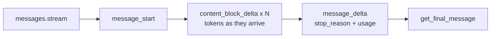
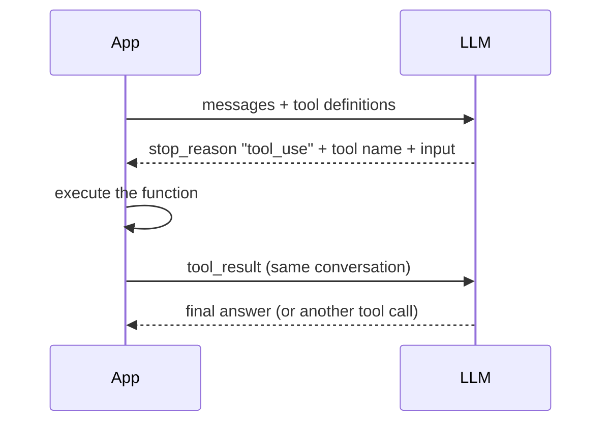

---
tags:
  - applied
---

# Working with LLM APIs

## You'll see this when...

- You've understood prompting in a playground and now need to call a model from actual code
- A request that "worked in the chat UI" times out, truncates, or returns malformed JSON in production
- You need the model's output as a typed object your code can use — not a paragraph to regex
- Streaming, tool calls, retries, and cost all show up at once and you're not sure which knob is which
- The bill is higher than expected and someone asks "are we caching anything?"

This is the bridge between *knowing how LLMs work* and *building with them*. The examples use the **Anthropic (Claude) SDK** because it's the reference this site builds on; the OpenAI SDK has near-identical shapes (`client.chat.completions.create`, streaming, tool calls, JSON mode) — the concepts transfer directly.

## The one call everything is built on

Every LLM API is one endpoint: send messages, get a message back. Features (tools, structured output, streaming) are options *on that one call*, not separate APIs.

```python
import anthropic

client = anthropic.Anthropic()  # reads ANTHROPIC_API_KEY from the environment

response = client.messages.create(
    model="claude-opus-4-8",
    max_tokens=1024,
    system="You are a concise assistant.",
    messages=[{"role": "user", "content": "Name three uses for Redis."}],
)

# content is a LIST of typed blocks, not a string — check .type
text = next(b.text for b in response.content if b.type == "text")
print(text)
```

Two things trip up everyone on day one:

1. **The API is stateless.** It remembers nothing between calls. "Memory" in a chat app is you re-sending the whole conversation every time (see [Multi-turn](#multi-turn-the-api-remembers-nothing) below).
2. **`content` is a list of blocks**, not a string. A response can contain text, thinking, and tool-use blocks interleaved. Always branch on `block.type`.

### Picking a model

Model choice is a latency/cost/intelligence triangle. Default up, then drop down only where you've proven a cheaper model is good enough.

| Model | When |
|---|---|
| `claude-opus-4-8` | Default — most tasks; strong reasoning at a sensible price |
| `claude-fable-5` | The hardest reasoning / long-horizon agentic work (premium) |
| `claude-sonnet-4-6` | High-volume production where Opus is overkill |
| `claude-haiku-4-5` | Simple, latency-critical, cheap (classification, routing) |

Don't hard-code one model everywhere — route by task. A classifier and a coding agent shouldn't use the same tier. See the [Numbers to Know](../fundamentals/numbers-to-know.md) mindset: measure before optimizing.

## `max_tokens` and why your output got cut off

`max_tokens` is the **hard ceiling on the response**, not a target. Hit it and the output truncates mid-sentence with `stop_reason: "max_tokens"`. Sensible defaults:

- **Non-streaming**: `~16000`. Above this, the request risks an SDK HTTP timeout (idle connections drop on long generations).
- **Streaming**: `~64000`. Timeouts aren't a concern once you stream, so give the model room.
- **Classification / tiny outputs**: `256` to cap cost.

Always read `stop_reason` before trusting `content`:

| `stop_reason` | Meaning |
|---|---|
| `end_turn` | Finished naturally |
| `max_tokens` | Truncated — raise the cap or stream |
| `tool_use` | Wants to call a tool — execute it and continue |
| `refusal` | Declined for safety — surface it, don't blind-retry |

## Streaming — for anything a user watches

Without streaming, the user stares at a spinner for the full generation. With it, tokens appear as they're produced. It's also your timeout protection for long outputs.

```python
with client.messages.stream(
    model="claude-opus-4-8",
    max_tokens=64000,
    messages=[{"role": "user", "content": "Write a short story."}],
) as stream:
    for text in stream.text_stream:
        print(text, end="", flush=True)

    final = stream.get_final_message()   # full Message object once done
    print(f"\n\ntokens: {final.usage.output_tokens}")
```

`stream.get_final_message()` accumulates the whole response for you — so you get streaming UX *and* the complete object without hand-assembling deltas. Default to streaming for any request with large input, large output, or high `max_tokens`.



## Structured output — stop parsing prose

The single biggest reliability win for app code: make the model return data that conforms to a schema, validated for you. Define the shape with Pydantic and use `messages.parse()`:

```python
from pydantic import BaseModel
from typing import List

class Ticket(BaseModel):
    title: str
    priority: str          # ideally an Enum
    tags: List[str]
    needs_human: bool

response = client.messages.parse(
    model="claude-opus-4-8",
    max_tokens=1024,
    messages=[{"role": "user", "content": "Customer can't log in after the password reset email never arrived."}],
    output_format=Ticket,
)

ticket = response.parsed_output   # a validated Ticket instance
print(ticket.priority, ticket.tags)
```

Under the hood this constrains the response format (`output_config.format` with a JSON schema). The win: no fragile `json.loads()` on free text, no "the model added a markdown fence" bugs, no missing-field surprises. Use it for extraction, classification, routing, and any time the output feeds more code rather than a human.

> Caveat: a safety `refusal` or a `max_tokens` truncation can still break the schema — check `stop_reason` first.

## Tool use (function calling) — the heart of agents

Tool use is how an LLM *acts*: you describe functions, the model decides when to call them, you run them, you feed results back. This loop is the foundation of the [agent loop](agents-and-tool-use.md).



```python
tools = [{
    "name": "get_weather",
    "description": "Current weather for a city. Call this when the user asks about weather.",
    "input_schema": {
        "type": "object",
        "properties": {"city": {"type": "string"}},
        "required": ["city"],
    },
}]

messages = [{"role": "user", "content": "Should I bring an umbrella in Lisbon?"}]
response = client.messages.create(model="claude-opus-4-8", max_tokens=1024, tools=tools, messages=messages)

if response.stop_reason == "tool_use":
    block = next(b for b in response.content if b.type == "tool_use")
    result = get_weather(**block.input)              # your real function
    messages += [
        {"role": "assistant", "content": response.content},
        {"role": "user", "content": [{
            "type": "tool_result",
            "tool_use_id": block.id,                 # must match
            "content": result,
        }]},
    ]
    response = client.messages.create(model="claude-opus-4-8", max_tokens=1024, tools=tools, messages=messages)
```

The SDKs ship a **tool runner** that automates this loop (define tools as decorated functions, it calls them and re-prompts until done) — reach for it once the manual loop is clear. Tool-description quality drives whether the model calls the right tool; be prescriptive about *when* to call, not just what it does. Always parse `tool_use.input` as structured data — never string-match the serialized JSON.

## Thinking / reasoning effort

For hard problems, let the model reason before answering. Modern Claude models use **adaptive thinking** — the model decides how much to think — with an `effort` dial for the cost/quality trade:

```python
response = client.messages.create(
    model="claude-opus-4-8",
    max_tokens=16000,
    thinking={"type": "adaptive"},
    output_config={"effort": "high"},   # low | medium | high | xhigh | max
    messages=[{"role": "user", "content": "Design a rate limiter for 1M users."}],
)
```

`effort` is the main intelligence-vs-cost lever on reasoning models: `low` for routine/latency-sensitive work, `high` for most intelligence-sensitive tasks, `max` when correctness outweighs cost. (The older fixed `budget_tokens` knob is gone on current models — use `effort`.)

## Prompt caching — the cheapest 10x you'll get

If many requests share a large prefix (a long system prompt, a big document, few-shot examples), cache it. Cached tokens cost ~10% of full price.

```python
response = client.messages.create(
    model="claude-opus-4-8",
    max_tokens=1024,
    system=[{
        "type": "text",
        "text": LARGE_SHARED_CONTEXT,          # e.g. 50KB of docs
        "cache_control": {"type": "ephemeral"},
    }],
    messages=[{"role": "user", "content": "Summarize the key risks."}],
)
print(response.usage.cache_read_input_tokens)  # >0 means the cache hit
```

The catch: caching is a **prefix match** — any byte change before the cache point invalidates it. The classic silent killer is a `datetime.now()` or a per-request UUID near the top of the system prompt: it changes every call, so the cache never hits. Keep stable content first, volatile content last, and verify with `cache_read_input_tokens`.

## Counting tokens (and not guessing)

Cost and context limits are measured in tokens. **Don't use `tiktoken`** — that's OpenAI's tokenizer and it mis-counts Claude by 15-20%+. Use the API's counter:

```python
n = client.messages.count_tokens(
    model="claude-opus-4-8",
    messages=messages,
    system=system,
).input_tokens
```

Token counts are model-specific — count against the model you'll actually call.

## Multi-turn: the API remembers nothing

A "conversation" is you replaying the full history every request. The model is stateless; you own the transcript.

```python
messages = []
def chat(user_text: str) -> str:
    messages.append({"role": "user", "content": user_text})
    resp = client.messages.create(model="claude-opus-4-8", max_tokens=1024, messages=messages)
    reply = next(b.text for b in resp.content if b.type == "text")
    messages.append({"role": "assistant", "content": reply})
    return reply
```

This is why long conversations get expensive and eventually hit the context window — every turn re-sends everything. The mitigations (summarize old turns, compaction, retrieval instead of stuffing) are the bread and butter of [LLMOps](llmops.md) and [memory systems](memory-systems.md).

## Reliability: errors, retries, timeouts

Production LLM calls fail — rate limits, overloads, transient 5xxs. The SDK already retries `429` and `5xx` with exponential backoff (configurable via `max_retries`); don't hand-roll what it does for free. Catch **typed exceptions**, never string-match error text:

```python
try:
    response = client.messages.create(...)
except anthropic.RateLimitError as e:
    retry_after = int(e.response.headers.get("retry-after", "60"))
except anthropic.APIStatusError as e:
    if e.status_code >= 500:
        ...  # transient — safe to retry
    else:
        raise  # 4xx is your bug — fix the request
```

For batch, non-latency-sensitive work, the **Batches API** runs the same requests asynchronously at ~50% cost — reach for it for backfills, evals, and bulk extraction.

## Anti-patterns

| Anti-pattern | Why it hurts | Better |
|---|---|---|
| Treating `content` as a string | Crashes on tool-use / thinking blocks | Branch on `block.type` |
| `json.loads()` on free-text output | Markdown fences, missing fields, drift | Structured output (`messages.parse`) |
| Hard-coding one model everywhere | Overpay on simple tasks, underperform on hard ones | Route by task tier |
| No streaming on long outputs | Spinner UX + HTTP timeouts | `messages.stream()` + `get_final_message()` |
| `datetime.now()` in the system prompt | Silently kills prompt caching | Keep the prefix byte-stable; volatile content last |
| `tiktoken` for token counts | 15-20%+ off for Claude | `messages.count_tokens()` |
| Re-implementing retry/backoff | The SDK already does it | Configure `max_retries`; catch typed errors |
| Lowballing `max_tokens` | Truncated output, silent `max_tokens` stop | 16K non-streaming / 64K streaming defaults |
| Storing API keys in code | Leaked credentials | Environment variables / secrets manager |
| Ignoring `stop_reason` | Treat a refusal/truncation as a complete answer | Check `stop_reason` before reading content |

## Quick reference

| Need | Reach for |
|---|---|
| One-shot answer | `messages.create()` |
| Real-time UX / long output | `messages.stream()` → `get_final_message()` |
| Typed data out | `messages.parse(output_format=Model)` |
| Let the model act | Tool use (`tools=`, handle `stop_reason == "tool_use"`) |
| Harder reasoning | `thinking={"type":"adaptive"}` + `effort` |
| Cut cost on shared context | Prompt caching (`cache_control`) |
| Accurate token count | `messages.count_tokens()` (never tiktoken) |
| Bulk / offline jobs | Batches API (~50% cost) |
| Resilience | SDK auto-retry + typed exception handling |

## Interview angle

!!! tip "What interviewers are testing"
    Whether you can turn "the model is smart" into a reliable system: structured output instead of regex, streaming for UX and timeouts, tool use as the agent primitive, and cost levers (caching, model routing, batching). They want production instincts, not playground familiarity.

**Strong answer pattern:**

1. One endpoint, stateless — you resend history; features are options on the one call
2. Structured output for anything that feeds code; check `stop_reason` regardless
3. Stream long/interactive responses; it's UX and timeout protection
4. Tool use is the read/act loop that agents are built on
5. Control cost deliberately: prompt caching for shared prefixes, model routing by task, Batches for offline work

**Common follow-ups:**

- "The chat UI worked but production truncates — why?" — default `max_tokens` too low or non-streaming timeout; raise the cap and stream
- "How do you get reliable JSON?" — schema-constrained structured output, not prompt-and-pray + `json.loads()`
- "Our LLM bill doubled — first thing you check?" — cache hit rate (`cache_read_input_tokens`); a per-request timestamp/UUID in the prefix is the usual culprit; then check model routing
- "How do retries work?" — SDK retries 429/5xx with backoff; you catch typed exceptions and never retry 4xx
- "Why not tiktoken to estimate cost?" — it's the wrong tokenizer for Claude; use the model's own `count_tokens`

## Test yourself

Answers are hidden — commit to an answer before expanding.

??? question "The same prompt that worked in the chat UI truncates in your code. What are the two most likely causes?"

    Either `max_tokens` is set too low and the response hit the ceiling (`stop_reason: "max_tokens"`), or it's a non-streaming request whose generation ran long enough to hit an HTTP/idle timeout. The fix for both is to raise `max_tokens` and switch to streaming for long outputs — streaming also removes the timeout risk.

??? question "Why is parsing the model's text output with `json.loads()` fragile, and what replaces it?"

    Free-text output drifts: the model may wrap JSON in a markdown fence, add a preamble, omit a field, or change a type between calls — so `json.loads()` breaks unpredictably. Structured output (schema-constrained, e.g. `messages.parse()` with a Pydantic model) makes the API return validated data conforming to your schema, eliminating the parse-and-pray step.

??? question "Your LLM bill suddenly doubled with no traffic change. What's the first thing you check, and what's the classic cause?"

    Check the cache hit rate via `cache_read_input_tokens` — if it's zero across requests that should share a prefix, prompt caching has silently broken. The classic cause is a per-request value (a `datetime.now()` timestamp or a UUID) placed near the top of the system prompt: caching is a prefix match, so any byte change before the cache point invalidates everything after it.

??? question "Walk through the tool-use loop. What does the API return, and what must you send back?"

    You send the messages plus tool definitions. The model responds with `stop_reason: "tool_use"` and a `tool_use` block (tool name + structured input). You execute the function yourself, then continue the same conversation by appending the assistant's response and a `tool_result` block whose `tool_use_id` matches the call. The model then produces a final answer or another tool call.

??? question "An interviewer asks why you shouldn't use `tiktoken` to estimate Claude costs. What's the answer?"

    `tiktoken` is OpenAI's tokenizer; Claude uses a different one, so counts are off by 15-20%+ (worse on code/non-English), and tokenizers differ between model generations too. Use the API's own `messages.count_tokens()` against the exact model you'll call — token counts are model-specific and that's the only accurate source.

## Related

- [LLM Fundamentals](llm-fundamentals.md) — tokens, context windows, sampling (read first)
- [Prompt Engineering](prompt-engineering.md) — what goes in the `messages`
- [Agents & Tool Use](agents-and-tool-use.md) — the loop tool use enables
- [LLM Frameworks](llm-frameworks.md) — when to wrap this in LangChain/LangGraph vs use the raw SDK
- [Structured output & evaluation](evaluation.md) — measuring what comes out
- [LLMOps](llmops.md) — cost, caching, observability in production
- [ML & AI Literacy](ml-literacy.md) — the foundations beneath all of this
