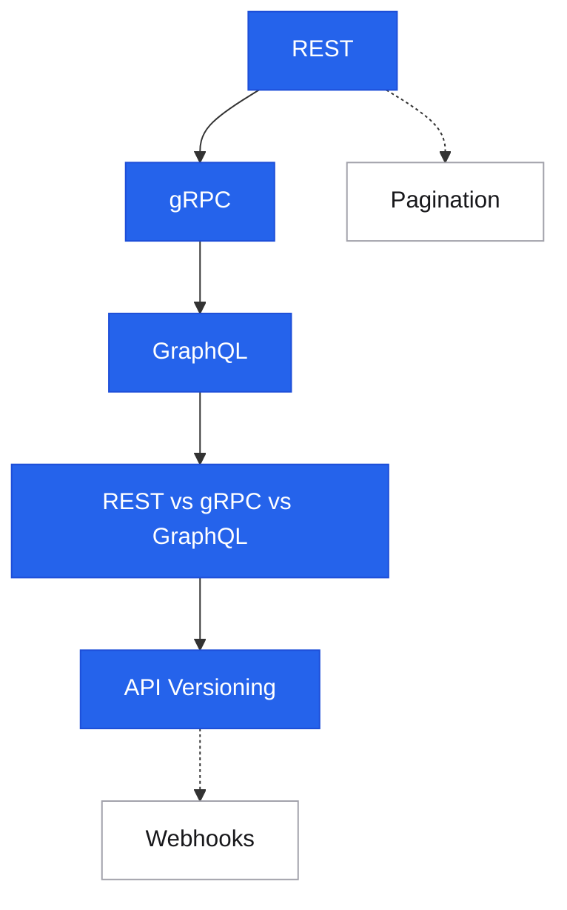

# API Design

<div class="sec-hero" markdown>
<span class="ey">Communication · contracts</span>
An API is a contract between a provider and its consumers. Unlike internal implementation details, API decisions have long lifetimes — every endpoint, field name, and error code becomes a commitment the moment a client depends on it. Designing APIs well means designing for evolution.
</div>

## Roadmap

Follow the spine top-to-bottom your first time. Dashed branches hang off the topic they support — grab them when you need them.

<div class="sd-mermaid-links" data-links='{
  "REST": "rest/",
  "gRPC": "grpc/",
  "GraphQL": "graphql/",
  "REST vs gRPC vs GraphQL": "comparison/",
  "API Versioning": "versioning/",
  "Pagination": "pagination/",
  "Webhooks": "webhooks/"
}'></div>



## Suggested reading order

New to this topic? Read these in order — each builds on the previous:

1. [REST](rest.md) — the default API style; HTTP semantics and resource modeling underpin everything else
2. [gRPC](grpc.md) — the contrast case: strict contracts, binary protocol, streaming for internal services
3. [GraphQL](graphql.md) — the third paradigm: client-driven queries and the trade-offs they bring
4. [REST vs gRPC vs GraphQL](comparison.md) — now that you know all three, the decision framework makes sense
5. [API Versioning](versioning.md) — every API you ship must evolve without breaking clients

**Then, as needed (reference):** [Pagination](pagination.md), [Webhooks](webhooks.md)

---

## The API design spectrum

```
REST                      gRPC                    GraphQL
  │                         │                         │
HTTP + JSON             HTTP/2 + Protobuf        HTTP + JSON (flexible)
Resource-oriented       RPC-oriented             Query-oriented
Browser-friendly        Internal services        Client-driven queries
Stateless               Streaming capable        Flexible shape
Easy to cache           Strongly typed           Harder to cache
```

No single winner — the right choice depends on client type, performance requirements, and team workflow.

---

## API styles

The three paradigms and the framework for choosing between them.

<div class="pcards">
<a class="pcard" href="rest/"><span class="t">REST</span><span class="d">Constraints, HTTP semantics, resource modeling, HATEOAS</span></a>
<a class="pcard" href="grpc/"><span class="t">gRPC</span><span class="d">Protobuf, HTTP/2, unary/streaming, code generation</span></a>
<a class="pcard" href="graphql/"><span class="t">GraphQL</span><span class="d">Schemas, resolvers, N+1 problem, subscriptions, persisted queries</span></a>
<a class="pcard" href="comparison/"><span class="t">REST vs gRPC vs GraphQL</span><span class="d">Decision framework with concrete tradeoffs</span></a>
</div>

## Lifecycle & delivery

How APIs evolve, traverse large result sets, and push events — the concerns that outlive the initial design.

<div class="pcards">
<a class="pcard" href="versioning/"><span class="t">API Versioning</span><span class="d">URI, header, content-type strategies — and deprecation</span></a>
<a class="pcard" href="pagination/"><span class="t">Pagination</span><span class="d">Offset, cursor, keyset — why cursor wins at scale</span></a>
<a class="pcard" href="webhooks/"><span class="t">Webhooks</span><span class="d">Push-based event delivery, retries, verification</span></a>
</div>

---

## Concept map

```
API Styles
  ├── REST       → nouns (resources), HTTP verbs, stateless
  ├── gRPC       → verbs (methods), binary protocol, streaming
  └── GraphQL    → graph traversal, single endpoint, client selects fields

API lifecycle concerns
  ├── Versioning → how to change without breaking clients
  ├── Pagination → how to traverse large result sets
  └── Webhooks   → how to push events instead of polling

Cross-cutting concerns (apply to all styles)
  ├── Auth       → OAuth 2.0 / JWT / API keys
  ├── Rate limiting → protect provider, communicate limits via headers
  ├── Error formats → consistent machine-readable errors (Problem Details RFC 7807)
  └── Observability → request IDs, tracing headers, structured access logs
```

---

## API design decision tree

```
Who are the clients?
  ├── External developers / browsers
  │     → REST (broad tooling, HTTP semantics, easy to explore)
  │     → GraphQL (if clients need flexible queries / BFF)
  │
  ├── Internal services (backend-to-backend)
  │     → gRPC (type safety, performance, streaming)
  │     → REST (if language/team diversity is high)
  │
  └── Third-party integrations (async events)
        → Webhooks (push events on state changes)

Do you need streaming?
  ├── Server → Client only  → SSE or gRPC server streaming
  ├── Bidirectional         → WebSockets or gRPC bidirectional streaming
  └── No streaming needed   → REST or gRPC unary
```

---

## Interview shortlist

| Question | Key answer |
|---|---|
| *"REST vs gRPC — when to use each?"* | REST: external/browser clients, broad ecosystem. gRPC: internal services, strict contracts, streaming, low latency. |
| *"What's the N+1 problem in GraphQL?"* | For a list of N items, resolving a nested field triggers N extra DB queries. Fix: DataLoader (batch + cache per request). |
| *"How do you version an API without breaking clients?"* | Additive-only changes are non-breaking. Breaking changes need a new version: URI (`/v2/`), header (`API-Version: 2`), or content-type. |
| *"Why does cursor pagination beat offset at scale?"* | Offset requires counting rows: `OFFSET 10000` scans and discards 10K rows. Cursor uses `WHERE id > last_seen` — index seek, O(1). |
| *"How do you secure a webhook endpoint?"* | HMAC signature on payload (shared secret). Validate signature before processing. Replay protection via timestamp in signature. |

---

## Related topics

- [Networking](../networking/index.md) — what the API rides on
- [Security: API Security](../security/api-security.md) — OWASP API Top 10, input validation
- [Patterns: Idempotency](../patterns/idempotency.md) — safe retries for POST/PUT
- [Patterns: Rate Limiting](../patterns/rate-limiting.md) — protecting the API surface
- [Fundamentals: Networking Basics](../fundamentals/networking-basics.md) — HTTP, TLS, TCP fundamentals
