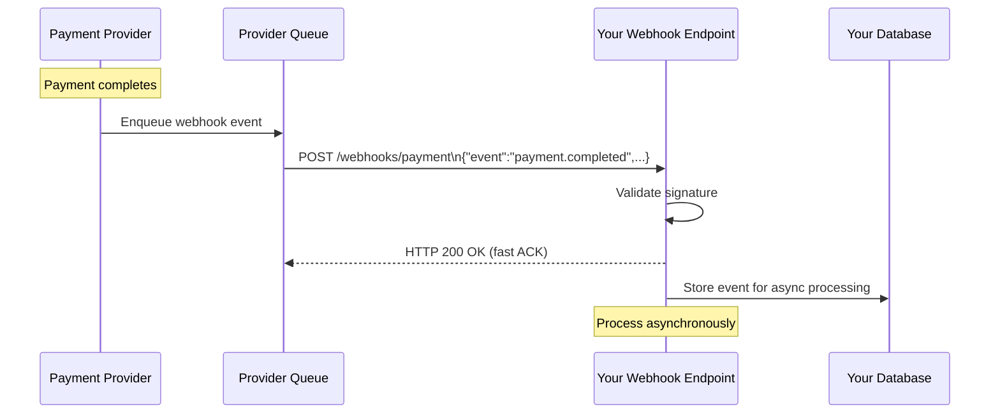

# Webhooks

## What it is

Webhooks are user-defined HTTP callbacks — when an event occurs in system A, it sends an HTTP POST to a URL registered by system B. The inverse of REST: instead of the client polling for updates, the server pushes when something happens.

```
Polling (client-driven):
  Client → GET /payment/status (check every minute)
  Client → GET /payment/status (no change)
  Client → GET /payment/status (no change)
  Client → GET /payment/status (no change)
  Client → GET /payment/status (payment completed!)
  → 5 minutes wasted, 5 unnecessary requests

Webhook (server-driven):
  Server → POST https://yourapp.com/webhooks/payment
           {"event": "payment.completed", "payment_id": "pay_123"}
  → Instant notification, zero polling
```

## How webhooks work



**Critical design principle:** Your endpoint must respond with HTTP 2xx within seconds (usually <5s timeout from provider). Do the work asynchronously.

## Request format

```http
POST /webhooks/stripe HTTP/1.1
Host: yourapp.com
Content-Type: application/json
Stripe-Signature: t=1714137600,v1=abc123...
User-Agent: Stripe/1.0

{
    "id": "evt_1ABC123",
    "type": "payment_intent.succeeded",
    "created": 1714137600,
    "data": {
        "object": {
            "id": "pi_1ABC123",
            "amount": 2000,
            "currency": "usd",
            "metadata": {
                "order_id": "ord_789"
            }
        }
    },
    "livemode": true
}
```

## Signature verification

**Always verify webhook signatures.** Without verification, anyone can send fake events to your endpoint.

```python
import hmac
import hashlib
import time
from fastapi import Request, HTTPException

WEBHOOK_SECRET = "whsec_..."  # from environment

async def stripe_webhook(request: Request):
    payload = await request.body()
    sig_header = request.headers.get("stripe-signature")
    
    # Parse: "t=timestamp,v1=signature"
    parts = dict(item.split("=", 1) for item in sig_header.split(","))
    timestamp = int(parts["t"])
    received_sig = parts["v1"]
    
    # Replay attack prevention: reject if timestamp too old
    if abs(time.time() - timestamp) > 300:  # 5 minute tolerance
        raise HTTPException(400, "Webhook timestamp too old")
    
    # Compute expected signature
    signed_payload = f"{timestamp}.{payload.decode()}"
    expected_sig = hmac.new(
        WEBHOOK_SECRET.encode(),
        signed_payload.encode(),
        hashlib.sha256
    ).hexdigest()
    
    # Constant-time comparison (prevents timing attacks)
    if not hmac.compare_digest(expected_sig, received_sig):
        raise HTTPException(400, "Invalid webhook signature")
    
    event = json.loads(payload)
    return event
```

**HMAC-SHA256 flow:**
```
Provider knows: secret_key
Provider sends: HMAC(secret_key, timestamp + "." + payload)

You verify: HMAC(secret_key, timestamp + "." + received_payload) == received_signature
→ Only someone with secret_key could have produced that signature
→ Payload has not been tampered with
```

## Idempotent processing

Webhooks are delivered **at-least-once**. The same event may arrive multiple times:

```python
async def handle_payment_completed(event: dict):
    event_id = event["id"]  # e.g., "evt_1ABC123"
    
    # Idempotency check — has this event been processed?
    async with db.transaction():
        existing = await db.execute(
            "SELECT id FROM processed_webhook_events WHERE event_id = $1",
            event_id
        )
        if existing:
            return  # already processed, safe to skip
        
        # Mark as processed first (within same transaction)
        await db.execute(
            "INSERT INTO processed_webhook_events (event_id, processed_at) VALUES ($1, NOW())",
            event_id
        )
        
        # Process the event
        order_id = event["data"]["object"]["metadata"]["order_id"]
        await order_service.mark_paid(order_id)

# Schema
"""
CREATE TABLE processed_webhook_events (
    event_id VARCHAR(255) PRIMARY KEY,
    processed_at TIMESTAMP NOT NULL
);
"""
```

## Asynchronous processing pattern

Never do heavy work synchronously in the webhook handler:

```python
from fastapi import FastAPI, BackgroundTasks
import asyncio

app = FastAPI()

# Option 1: FastAPI BackgroundTasks (in-process)
@app.post("/webhooks/stripe")
async def stripe_webhook(request: Request, background_tasks: BackgroundTasks):
    event = await verify_and_parse(request)
    background_tasks.add_task(process_event, event)
    return {"status": "accepted"}  # immediate response

# Option 2: SQS queue (recommended for production)
@app.post("/webhooks/stripe")  
async def stripe_webhook(request: Request):
    event = await verify_and_parse(request)
    
    # Enqueue for processing
    await sqs.send_message(
        QueueUrl=WEBHOOK_QUEUE_URL,
        MessageBody=json.dumps(event),
        MessageDeduplicationId=event["id"],  # FIFO queue dedup
        MessageGroupId="stripe",
    )
    
    return {"status": "accepted"}

# Separate worker processes the queue
async def process_event(event: dict):
    match event["type"]:
        case "payment_intent.succeeded":
            await handle_payment_completed(event)
        case "payment_intent.payment_failed":
            await handle_payment_failed(event)
        case "customer.subscription.deleted":
            await handle_subscription_cancelled(event)
        case _:
            logger.info(f"Unhandled event type: {event['type']}")
```

## Retry behavior

Providers retry on failure. Understand the retry schedule:

```
Stripe retry schedule:
  Attempt 1: immediate
  Attempt 2: 5 minutes later
  Attempt 3: 30 minutes later
  Attempt 4: 2 hours later
  Attempt 5: 5 hours later
  ...
  Final attempt: 3 days later (then disable endpoint)

GitHub retry schedule:
  Retries for 3 days with exponential backoff

→ Your endpoint MUST be idempotent
→ Design for eventual delivery, not immediate
```

If your endpoint repeatedly fails, providers often disable it and require manual re-enablement.

## Dead letter queue

For events that can't be processed after all retries:

```python
# SQS webhook processing with DLQ
async def process_webhook_from_queue(message: dict):
    try:
        event = json.loads(message["Body"])
        await process_event(event)
        await sqs.delete_message(
            QueueUrl=WEBHOOK_QUEUE_URL,
            ReceiptHandle=message["ReceiptHandle"]
        )
    except Exception as e:
        logger.error(f"Failed to process webhook {event.get('id')}: {e}")
        # Don't delete — SQS will retry
        # After maxReceiveCount retries → sent to DLQ
        raise

# DLQ monitor: alert on-call when messages arrive
```

## Webhook receiver infrastructure

```
Internet
   │
   ▼
CloudFront / ALB  ←── SSL termination
   │
   ▼
Webhook Service
   │ (fast ACK, enqueue)
   ▼
SQS Queue  ←── DLQ for failures
   │
   ▼
Worker Pool  ←── idempotent processing
   │
   ▼
Database / Services
```

**Availability considerations:**
- If your endpoint is down during webhook delivery, events pile up on the provider's retry queue
- If your SQS consumer crashes, events pile up in SQS (no data loss)
- DLQ captures events that fail after all retries

## Sending webhooks (you as the provider)

If you're building a platform that sends webhooks to customers:

```python
import httpx
import hmac
import hashlib
import time

class WebhookSender:
    def __init__(self, db, queue):
        self.db = db
        self.queue = queue
    
    async def send(self, subscription: WebhookSubscription, event: dict):
        payload = json.dumps(event).encode()
        timestamp = int(time.time())
        
        # Sign the payload
        signed_payload = f"{timestamp}.{payload.decode()}"
        signature = hmac.new(
            subscription.secret.encode(),
            signed_payload.encode(),
            hashlib.sha256
        ).hexdigest()
        
        # Attempt delivery with timeout
        try:
            async with httpx.AsyncClient() as client:
                resp = await client.post(
                    subscription.endpoint_url,
                    content=payload,
                    headers={
                        "Content-Type": "application/json",
                        "X-Webhook-Signature": f"t={timestamp},v1={signature}",
                        "X-Webhook-ID": event["id"],
                    },
                    timeout=10.0,
                )
                resp.raise_for_status()
                await self.record_delivery(event["id"], "success", resp.status_code)
        
        except Exception as e:
            await self.record_delivery(event["id"], "failed", str(e))
            # Re-queue with exponential backoff
            await self.schedule_retry(subscription, event, attempt=1)
    
    async def record_delivery(self, event_id: str, status: str, detail):
        await self.db.execute(
            "INSERT INTO webhook_delivery_log (event_id, status, detail, delivered_at) VALUES ($1,$2,$3,NOW())",
            event_id, status, str(detail)
        )
```

### Delivery log schema

```sql
CREATE TABLE webhook_subscriptions (
    id UUID PRIMARY KEY,
    endpoint_url TEXT NOT NULL,
    secret VARCHAR(255) NOT NULL,  -- HMAC secret
    events TEXT[] NOT NULL,        -- subscribed event types
    active BOOLEAN DEFAULT true,
    failure_count INT DEFAULT 0,
    created_at TIMESTAMP NOT NULL
);

CREATE TABLE webhook_delivery_log (
    id UUID PRIMARY KEY DEFAULT gen_random_uuid(),
    subscription_id UUID REFERENCES webhook_subscriptions(id),
    event_id VARCHAR(255) NOT NULL,
    event_type VARCHAR(255) NOT NULL,
    status VARCHAR(50) NOT NULL,   -- success, failed, retrying
    http_status INT,
    response_time_ms INT,
    attempt_number INT NOT NULL DEFAULT 1,
    delivered_at TIMESTAMP NOT NULL
);
```

## Webhook vs polling vs WebSocket vs SSE

| Mechanism | Direction | Use case | Latency |
|---|---|---|---|
| **Polling** | Client → Server (repeat) | Simple, no webhook support | High (delay = poll interval) |
| **Webhook** | Server → Client (push) | Async events, integrations | Near-real-time |
| **SSE** | Server → Client (stream) | User-facing real-time updates | Real-time |
| **WebSocket** | Bidirectional | Chat, collaboration | Real-time |

**Webhook vs SSE/WebSocket:**
- Webhooks: for server-to-server integration (your app ↔ Stripe/GitHub/etc). Client is a server.
- SSE/WebSocket: for server-to-browser. Client is a browser.

## AWS context

| Need | Solution |
|---|---|
| Receive webhooks | ALB → Lambda or ECS service → SQS → worker |
| DLQ for failed processing | SQS DLQ with CloudWatch alarm |
| Send webhooks | Lambda + SQS + DLQ + EventBridge scheduler for retries |
| Webhook fan-out | EventBridge → multiple Lambda targets per event type |
| Signature secrets | AWS Secrets Manager |
| Delivery logs | CloudWatch Logs or DynamoDB |

## Interview angle

!!! tip "When webhooks come up"
    Usually in "how does X notify Y?" (payment confirmation, CI pipeline events, order fulfillment).

**Strong answer pattern:**
1. Webhook = HTTP callback — server pushes when event happens, no polling
2. Always verify signatures — HMAC-SHA256 prevents forged events
3. Respond fast (< 5s), process async — enqueue to SQS, never do DB work in handler
4. Idempotency is mandatory — providers retry on failure, same event may arrive multiple times
5. Build delivery log + DLQ — for debugging and re-processing failed deliveries

## Related topics

- [REST](rest.md) — webhooks are built on HTTP
- [Message Queues](../messaging/message-queues.md) — SQS as the buffer behind webhook endpoints
- [Idempotency](../patterns/idempotency.md) — mandatory for webhook processing
- [Event-Driven Architecture](../architecture/event-driven.md) — webhooks as an event delivery mechanism
- [API Security](../security/api-security.md) — signature verification, rate limiting
