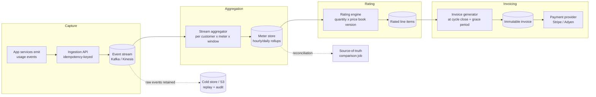
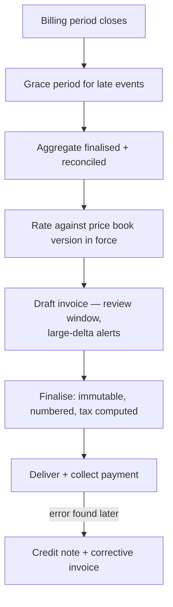
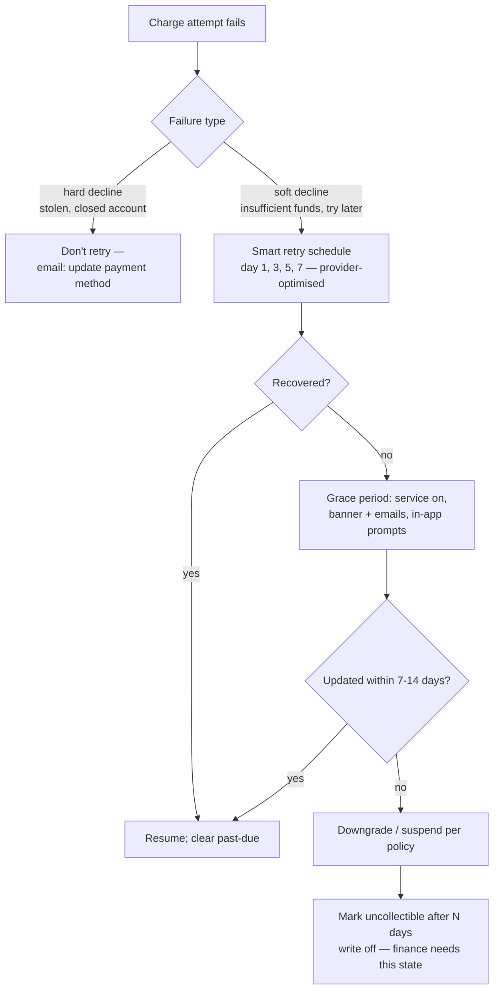

---
tags:
  - applied
  - for-saas
---

# Billing & Metering Engineering

Billing looks like a CRUD feature and behaves like a distributed-systems problem with money attached. Usage events arrive late, twice, or never; prices change mid-cycle; invoices are legal documents you can't edit; and every bug is either lost revenue or an angry customer with a refund demand. This page covers the engineering of metering pipelines, rating, invoicing, dunning, and pricing migrations.

---

## You'll see this when...

- A customer disputes an invoice and you cannot reproduce how the number was computed
- Finance finds your usage dashboard and Stripe disagree by 3% and asks which one is "right"
- A Kafka consumer was redeployed, replayed a partition, and double-counted a day of API calls — on invoices that already went out
- Product wants to move from per-seat to usage-based pricing "next quarter" and existing customers must keep their old plans
- A mid-cycle upgrade produced a proration credit that's off by one day and now support tickets reference timezone math
- 8% of revenue quietly churns every month because cards expire and nobody built retry logic
- An invoice was "fixed" by editing the row, and now the customer's copy and your database disagree — during an audit

---

## Why billing is a system design problem

Three properties collide:

```
Money:        every error is revenue lost or trust lost; disputes are expensive
Correctness:  invoices are legal/accounting documents; "eventually right" isn't a state
Scale:        usage-based pricing means metering millions-billions of events,
              then aggregating them into one auditable number per customer
```

The deceptive part: v1 (flat plans, Stripe Checkout, done in a week) works fine. The complexity arrives with the *second* pricing model, the *first* mid-cycle change, and the *first* usage dispute. Billing systems are accreted, not designed — unless you design them.

The core discipline: **billing is event-sourced accounting**. Every number on an invoice must be derivable from immutable inputs (usage events, subscription history, price book versions). If you can't replay the computation, you can't defend the invoice.

---

## Pricing models and their engineering cost

| Model | Example | Engineering cost | Hidden complexity |
|---|---|---|---|
| Flat subscription | $99/mo | Trivial | Almost none; do this as long as you can |
| Per-seat | $15/user/mo | Low | Seat counting rules (invited? deactivated? mid-month?), proration on seat changes |
| Usage-based | $0.10/1k API calls | **High** | Full metering pipeline, late events, disputes, spend alerts, forecasting |
| Hybrid | $499 base + usage overage | High | Both of the above, plus entitlement logic (what's included vs overage) |
| Credits / prepaid | Buy 10k credits, burn down | High | Credit ledger (it's a wallet — double-entry, expiry, refunds, negative-balance policy) |
| Tiered / volume | First 1M free, next 9M at $X | Medium on top of usage | Tier boundary semantics: *graduated* (each tier priced separately) vs *volume* (whole quantity at the reached tier's price) — get this wrong and invoices are wrong at every boundary |

Rule of thumb: each step right in this table roughly doubles billing engineering scope. Usage-based pricing is a product strategy decision that *creates a data engineering team's worth of work*. Say so before the pricing page changes.

---

## Metering pipeline architecture

The canonical four stages:



Separation of stages is the load-bearing decision:

```
Capture:      append-only facts ("customer X made 1 API call at T").
              Never price at capture time — prices change, events don't.
Aggregation:  raw events → per-customer, per-meter, per-window quantities.
              This is where dedup, late events, and backfills are handled.
Rating:       quantity × the price that was in force for that period.
              Price book is versioned; rating references a version, not "current".
Invoicing:    rated lines → an immutable document; triggers payment collection.
```

Keep raw events (S3, cheap, long retention). Aggregates are derived state — when (not if) you find an aggregation bug, you replay from raw.

```json
// A good usage event
{
  "idempotency_key": "req_8f3a-2026-06-11-svc-api",  // natural or UUID, sender-owned
  "customer_id": "cus_123",
  "meter": "api_calls",
  "quantity": 1,
  "occurred_at": "2026-06-11T09:14:02Z",   // event time — NOT ingest time
  "received_at": "2026-06-11T09:14:03Z",
  "properties": { "endpoint": "/v1/search", "region": "eu" }
}
```

---

## Accuracy requirements

### Idempotent ingestion

At-least-once delivery is a given (retries, consumer replays). Without dedup, every infrastructure hiccup becomes an overbilling incident.

```sql
-- Dedup at the ingestion boundary
INSERT INTO usage_events (idempotency_key, customer_id, meter, quantity, occurred_at)
VALUES ($1, $2, $3, $4, $5)
ON CONFLICT (idempotency_key) DO NOTHING;
```

The key must come from the **sender** (request ID, job ID), so the same logical event retried produces the same key. See [Idempotency](../patterns/idempotency.md) — billing is its highest-stakes application.

### Late events and the watermark

Events arrive after the window they belong to (mobile clients offline, batch exports, consumer lag). You can't wait forever — invoices have due dates.

```
Policy (make it explicit, write it down):
  Billing period closes June 30 23:59:59
  Grace period: 48-72h — accept late events with occurred_at in June
  Invoice generated July 3 from the closed aggregate
  Events arriving after the watermark: route to the NEXT invoice as an
  adjustment line, or drop below a materiality threshold — never mutate
  the issued invoice
```

This is the same event-time vs processing-time problem as any streaming system — but here the "correction" path is a financial adjustment, not a dashboard refresh.

### Backfills

An SDK bug under-reported usage for two weeks. Now what?

```
1. Replay/emit corrected events from raw source with original occurred_at
2. Idempotency keys ensure already-counted events don't double
3. Re-aggregate affected windows
4. If invoices already issued: NEVER retro-edit. Issue an adjustment on the
   next invoice (under-billing) or a credit note (over-billing)
5. Business call: many companies eat under-billing below a threshold —
   back-billing customers is a trust grenade
```

### Reconciliation against source of truth

Continuously answer "does the meter match reality?"

```
Daily job:
  metered api_calls per customer (billing pipeline)
    vs
  count from request logs / DB / object store inventory (independent path)

Alert on drift > 0.5-1%. Investigate BEFORE invoicing, not after disputes.
```

Same shape for money: your invoice totals vs payment-provider records, daily. Finance calls this "rev rec tie-out"; you should find breaks before they do.

---

## The proration problem

Customer upgrades from $50/mo to $200/mo on day 11 of a 30-day cycle.

```
Unused remainder of old plan:   $50  × 19/30 = $31.67 credit
New plan for the remainder:     $200 × 19/30 = $126.67 charge
Net proration: $95.00 charged now (or added to next invoice)
```

Looks simple; the edge cases are where the bugs live:

```
- Month lengths: 19/30 vs 19/31 vs February — pick day-based or second-based
  proration and apply it EVERYWHERE consistently
- Timezones: whose midnight closes the period? (Use UTC; document it)
- Downgrades: credit now, credit next invoice, or defer the downgrade to
  period end? (Most SaaS defers downgrades — simpler and revenue-friendlier)
- Multiple changes in one cycle: each change closes a "phase"; invoice is
  the sum of phases, each rated independently
- Per-seat + proration: each seat added/removed mid-cycle is its own
  prorated line
- Trials → paid conversions mid-cycle: an upgrade from a $0 phase
```

Model the subscription as a **timeline of phases**, not a mutable row:

```
subscription_phases
  (sub_id, plan_version, starts_at, ends_at, quantity)

Invoice = Σ rate(phase ∩ billing_period)
```

This phase model also turns out to be exactly what you need for grandfathering (below) and for explaining any invoice line to a customer.

---

## Invoice generation

### Immutability

An issued invoice is a legal and accounting document. It is **never edited**.

```
Wrong invoice?  → issue a credit note (negative document referencing the
                  original), then a corrected invoice if needed
Why not edit?   → the customer has a copy; accounting systems imported it;
                  auditors compare; tax was computed on it. An edited row
                  means two versions of a legal document exist.
```



Practical details that distinguish real billing systems:

```
- Sequential invoice numbers (legal requirement in many jurisdictions;
  gaps need explanation — generate at finalisation, not draft)
- Snapshot EVERYTHING onto the invoice: customer name/address, tax rate,
  price book lines. The invoice must render identically in 7 years even
  if the customer renamed and prices changed.
- A draft stage with anomaly checks ("invoice is 8× last month") catches
  metering bugs before customers do
- Tax: use a tax engine (Stripe Tax, Avalara) — VAT/GST/US sales tax is
  its own compliance domain
```

One more auditability trick: record on each invoice *which* aggregate snapshot and price-book versions produced it (an `inputs_hash`). An invoice whose inputs are pinned can always be re-derived and defended in a dispute.

---

## Payment failure handling

Cards fail constantly: expiry, insufficient funds, fraud flags, 3DS challenges. Untreated, this becomes **involuntary churn** — historically 5-10% of SaaS payment volume, and a top-three churn cause that engineering can directly fix.

### Dunning



```
Engineering checklist:
  ✓ Distinguish hard vs soft declines (decline codes) — retrying a stolen
    card just burns reputation with the card networks
  ✓ Use provider smart retries (Stripe ML-timed retries) over naive cron
  ✓ Card updater services (networks push new expiry dates automatically)
  ✓ Pre-dunning: email BEFORE a stored card expires
  ✓ Grace period state machine in YOUR app: past_due ≠ cancelled;
    entitlements code must understand both
  ✓ B2B invoicing (net-30, wire/ACH) is a separate flow: reminders,
    AR aging, collections — not card dunning
```

Dunning sequences are long-running, retry-heavy, and must survive deploys — a natural fit for [durable workflows](../patterns/durable-workflows.md).

---

## Build vs buy

| Option | Sweet spot | Limits |
|---|---|---|
| **Stripe Billing** | Default for most SaaS: subscriptions, proration, dunning, tax, invoicing in one | Usage metering is improving but coarse for high-cardinality/high-volume meters; complex enterprise contracts (custom terms, ramps) get awkward; fee % at scale |
| **Metronome** | Heavy usage-based at scale (infra/AI companies); real-time aggregation, spend alerts, contract/commit modelling | You still need payment collection (pairs with Stripe); enterprise price tag |
| **Orb** | Similar space: usage pipeline + flexible pricing as config, strong replay/audit story | Same shape: rating layer, not a payment processor |
| **Lago** | Open-source metering + billing; self-host for control/cost/residency | You operate it; smaller ecosystem |
| **In-house** | Billing *is* the product domain (you're a telco/cloud/payments co), or contract terms no vendor models | 3-10 engineers permanently; you rebuild proration, credit notes, tax, dunning, rev-rec exports — and own every incident |

Pragmatic 2026 stance:

```
Flat / per-seat:           Stripe Billing. Stop. Build product instead.
Usage-based, low volume:   Stripe meters or Lago.
Usage-based at scale:      Metronome/Orb for metering+rating, Stripe/Adyen
                           for collection.
Always build in-house:     the CAPTURE side (your events, your idempotency
                           keys, your raw-event retention) — vendors can't
                           own your source of truth.
Almost never:              a full in-house invoicing + tax + dunning stack
                           "because Stripe fees".
```

---

## Revenue recognition — the 20% engineers need

Three different numbers that non-finance engineers conflate, and the conflation causes real schema mistakes:

```
Billed:      you issued a $12,000 annual invoice (Jan 1)
Collected:   cash arrived (maybe Jan 20, maybe never)
Recognized:  revenue "earned" — $1,000/month over the year as the
             service is delivered (ASC 606 / IFRS 15)
```

Why you care as an engineer:

```
- The $12k collected in January is mostly DEFERRED REVENUE (a liability!)
  until earned month by month
- Finance needs a recognition schedule per invoice line — your billing
  system must export line items with service periods, not just amounts
- Usage-based revenue is typically recognized in the period the usage
  happened → another reason occurred_at (event time) matters
- Mid-cycle changes, credits, and refunds all reshape recognition
  schedules → another reason invoices are immutable and credit notes
  are separate documents
```

You don't implement ASC 606 — finance tools (or NetSuite) do. You make sure every billing artifact carries `service_period_start/end` so they can. Ask finance early; retrofitting service periods onto historical invoices is miserable.

---

## Testing billing

Billing bugs ship silently and surface as money. Two techniques carry most of the weight:

### Time-travel testing

Billing logic is a function of time: cycle boundaries, proration, grace periods, dunning schedules, leap years. You cannot wait 30 days per test run.

```python
def test_upgrade_proration_in_february_leap_year():
    clock = FakeClock(start="2028-02-01T00:00:00Z")
    sub = create_subscription(plan="starter_50", clock=clock)
    clock.advance(days=10)                       # Feb 11
    sub.change_plan("pro_200")
    clock.advance(to_period_end=True)            # Feb 29 — leap year
    invoice = run_invoicing(clock)
    assert invoice.total == expected_proration(10, 19, 29, 50, 200)
```

Inject a clock everywhere; the injection has to be total — one stray `datetime.utcnow()` in a proration branch and the suite tests fiction.

### Golden invoices

```
Maintain a corpus of scenario fixtures:
  upgrade mid-cycle, downgrade-at-period-end, trial conversion, seat
  add+remove same cycle, tier boundary exactly hit, late events in grace
  window, credit burn-down to zero, leap day, DST boundary, refund + rebill

Each scenario → full expected invoice (every line, every amount).
Every change to rating/proration code re-runs the corpus; any diff is a
review item. New bug in production → minimised into a new golden scenario.
```

This is approval/snapshot testing applied to money — the single best defence against "the proration refactor changed February invoices by $0.33". Pair it with a shadow-mode rerun before deploying any rating change: rate last month with the new code, diff against issued invoices, expect zero delta.

---

## The migration problem

Pricing changes are inevitable; existing customers usually keep old terms (**grandfathering**). This means your billing system permanently runs N pricing models concurrently.

```
Requirements that fall out:
  1. Versioned price book — plans/prices are immutable rows; "changing a
     price" = new version. Subscriptions reference a version.
  2. Subscription phases reference plan VERSIONS → old customers rate
     against old versions forever, automatically
  3. Migration tooling: cohort selection, scheduled moves at renewal,
     "legacy price honored until 2027-01-01" expiry terms
  4. Comms + consent: price increases often legally require notice;
     timed migrations, not big-bang UPDATE statements
  5. Reporting copes with mixed models (ARR across per-seat + usage cohorts)
```

The trap: building v1 with `plan.price` as a mutable column. The first price change then either retro-changes history (rating old periods at new prices) or forces an emergency data model migration under sales pressure. Version the price book on day one — it's nearly free then.

---

## Anti-patterns

| Anti-pattern | Why it hurts | Better |
|---|---|---|
| Pricing at event-capture time | Price changes corrupt history; no replay possible | Capture raw facts; rate later against versioned price book |
| Mutable `plan.price` column | First price change rewrites history or blocks grandfathering | Immutable plan versions; subscriptions reference versions |
| No idempotency on usage ingestion | Every retry/replay is an overbilling incident | Sender-owned idempotency keys; dedup at ingestion |
| Using ingest time for billing windows | Late events land in the wrong month | `occurred_at` event time + watermark + grace period |
| Editing issued invoices | Two versions of a legal document; audit failure | Credit notes + corrective invoices; invoices immutable |
| Discarding raw events after aggregation | Aggregation bug becomes unrecoverable | Cheap cold retention; aggregates are rebuildable |
| Naive daily card retries on all declines | Hard declines never recover; card networks penalise you | Decline-code-aware smart retries; card updater; pre-dunning |
| `past_due == cancelled` in entitlement code | Grace-period customers locked out; recoverable revenue lost | Explicit subscription state machine incl. past_due |
| Billing math on `now()` directly | Untestable; proration bugs found by customers | Injected clock; time-travel tests; golden invoices |
| No independent reconciliation | Drift discovered via customer disputes | Daily meter-vs-source and invoice-vs-PSP reconciliation jobs |
| Big-bang `UPDATE` to migrate pricing | Legal notice violations; support meltdown | Cohort-based migration at renewal with comms |

---

## Quick reference

| Need | Reach for |
|---|---|
| Flat or per-seat SaaS billing | Stripe Billing; don't build |
| Usage-based at serious volume | Metronome / Orb (rating) + Stripe/Adyen (collection); Lago if self-hosting |
| Exactly-once-ish usage counting | Idempotency keys at ingestion + `ON CONFLICT DO NOTHING` + raw event retention |
| Late event policy | Event-time windows, 48-72h grace before invoice finalisation, next-invoice adjustments after |
| Mid-cycle plan changes | Subscription phases; rate each phase × period overlap; defer downgrades to period end |
| Wrong invoice already sent | Credit note + corrective invoice — never edit |
| Failed card payments | Decline-code triage, smart retries, grace-period state, card updater, pre-expiry emails |
| "Can you prove this invoice?" | Versioned price book + inputs hash + raw events = full replay |
| Pricing model change with existing customers | Versioned plans, grandfathered phases, cohort migration at renewal |
| Catch metering drift | Daily reconciliation vs independent source of truth; alert at <1% drift |
| Testing proration/dunning | Injected clock (time travel) + golden invoice corpus + shadow-mode reruns |
| Finance asks about rev rec | Every line carries `service_period_start/end`; export schedules; deferred revenue ≠ cash |

---

## Interview angle

!!! tip "What interviewers are testing"
    Whether you treat billing as event-sourced accounting under distributed-systems constraints — idempotency, event time, immutability, reconciliation — rather than a CRUD feature. Bonus signal: knowing where the build/buy line sits and what pricing models cost in engineering terms.

**Strong answer pattern:**

1. Name the stakes: money + legal documents + scale; every number must be replayable from immutable inputs
2. Lay out the pipeline: capture → aggregate → rate → invoice, with raw events retained and rating decoupled from capture
3. Accuracy mechanics: sender-owned idempotency keys, event-time windows with a watermark/grace period, backfills as adjustments, daily reconciliation against an independent source
4. Model subscriptions as phases over a versioned price book — this one structure solves proration, grandfathering, and auditability together
5. Invoices immutable; corrections via credit notes; sequential numbering and snapshotted data
6. Unhappy paths: dunning state machine with hard/soft decline handling and grace periods (involuntary churn is an engineering-fixable revenue leak)
7. Build/buy: Stripe for subscription mechanics, Metronome/Orb/Lago when usage metering outgrows it; in-house only when billing is the product
8. Mention testability (injected clock, golden invoices) — it's rare and lands

**Common follow-ups:**

- *"How do you guarantee a usage event is counted exactly once?"* → You don't get true exactly-once across a distributed pipeline; you get at-least-once delivery plus idempotent ingestion. Sender attaches a deterministic idempotency key; ingestion dedups (`ON CONFLICT DO NOTHING` or equivalent in the stream processor); aggregation is then a pure function of the deduped set. Reconciliation against an independent source catches anything that slips through.
- *"An event for May arrives on June 5th. What happens?"* → Depends on the watermark. If May's invoice isn't finalised (within grace), it lands in May's aggregate. If finalised, it becomes an adjustment line on June's invoice — we never mutate an issued invoice. Below a materiality threshold we may drop it; the policy is explicit and documented for disputes.
- *"Customer upgrades on day 11, downgrades on day 20, cancels on day 25. Invoice?"* → Four phases (original plan days 1-10, upgraded 11-19, downgraded 20-24, terminal credit policy from 25). Each phase rates independently as plan-version price × overlap fraction; the invoice is the sum plus any usage rated per phase. The phase model makes this mechanical rather than special-cased.
- *"When would you build billing in-house?"* → When billing logic is the product's moat (cloud providers, telcos, usage-priced AI platforms with contract ramps no vendor models) and you'll fund a permanent team. Even then, buy payment collection and tax. For everyone else, in-house billing is an expensive way to rediscover proration edge cases.

---

## Test yourself

??? question "Why must rating be separated from event capture, and what goes wrong if you price events as they arrive?"

    Prices change; facts don't. If you stamp a price onto events at capture, a price-book update mid-period either corrupts in-flight aggregates or forces you to reprocess priced events — and historical replays rate old usage at the wrong price. Capturing raw quantities and rating later against a *versioned* price book makes the invoice a pure, replayable function: `rate(aggregate, price_book_version)`. That's what lets you defend an invoice in a dispute, rebuild after an aggregation bug, and grandfather old customers on old prices simultaneously.

??? question "Your stream consumer replayed a partition and re-ingested a day of usage events. Why is this a non-event in a well-built pipeline?"

    Because ingestion is idempotent on sender-owned keys. Each event carries a deterministic idempotency key (request ID, job ID); the ingestion layer dedups (`ON CONFLICT DO NOTHING` or dedup state in the processor), so re-delivered events are no-ops and aggregates are functions of the deduped set. Defence in depth: daily reconciliation against an independent source of truth (request logs, DB counts) would flag the drift even if dedup had a gap — before invoicing, not after a customer dispute.

??? question "Walk through the proration math and the design that makes multiple mid-cycle changes tractable."

    Model the subscription as immutable *phases*: each plan change closes the current phase and opens a new one referencing a plan version. For a $50→$200 upgrade on day 11 of 30: credit $50 × 19/30 = $31.67 for the unused old phase, charge $200 × 19/30 = $126.67 for the new one — net $95. With N changes in a cycle, the invoice is simply Σ over phases of (phase price × overlap fraction with the billing period) plus per-phase usage rating. Pin down the conventions explicitly: day- vs second-based fractions, UTC period boundaries, and whether downgrades apply immediately or defer to period end (most SaaS defers).

??? question "What's the difference between billed, collected, and recognized revenue — and what must your billing system export to support recognition?"

    Billed: invoice issued ($12k annual on Jan 1). Collected: cash actually received. Recognized: revenue *earned* as the service is delivered — $1k/month under ASC 606/IFRS 15; the rest sits as deferred revenue, a liability. Engineering consequence: every invoice line must carry a `service_period_start/end` so finance tooling can build recognition schedules; usage lines recognize in the period the usage occurred (another reason event time matters); credits and refunds reshape schedules (another reason corrections are separate documents, not edits). You don't implement ASC 606 — you make sure your artifacts carry the fields it needs.

??? question "How do you change your pricing model without breaking existing customers or your billing system?"

    Versioned price book: plans and prices are immutable rows, and "changing a price" creates a new version. Subscriptions reference plan *versions* via their phases, so existing customers automatically keep rating against old terms — grandfathering falls out of the data model rather than being special-cased. Migration is then tooling and policy: select cohorts, move them at renewal (price increases typically require advance notice), support expiry terms ("legacy price honored until..."), and keep reporting sane across mixed models. The big-bang `UPDATE prices SET amount=...` approach rewrites history, breaks grandfathering, and may violate notice requirements — it's the trap a mutable price column sets for you.

---

## Related

- [Payment System (case study)](../case-studies/payment-system.md) — the collection side: PSPs, ledgers, exactly-once payments
- [Idempotency](../patterns/idempotency.md) — the foundational pattern under metering
- [Event Streaming Maturity](../messaging/event-streaming-maturity.md) — the pipeline your meters ride on
- [Multi-Tenancy](../architecture/multi-tenancy.md) — per-tenant entitlements and isolation
- [Cost Engineering](../architecture/cost-engineering.md) — the mirror problem: metering your own spend
- [Durable Workflows](../patterns/durable-workflows.md) — dunning sequences and invoice generation as long-running workflows
