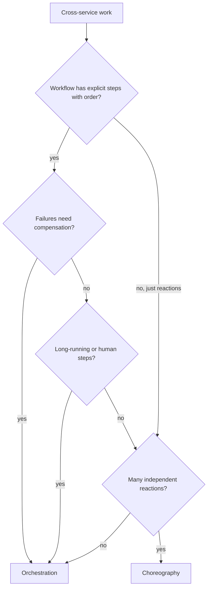

# Choreography vs Orchestration

When multiple services need to collaborate to complete a workflow, two coordination styles exist: **choreography** (each service reacts to events without a central coordinator) and **orchestration** (a central coordinator tells each service what to do). The choice shapes coupling, observability, and how easy it is to add new steps.

---

## You'll see this when...

- 12 services subscribe to events, nobody can describe the full workflow (choreography gone wild)
- Order workflow has explicit steps: reserve → charge → ship → confirm — needs orchestration
- Compensating actions / rollback logic split across many services
- Long-running workflows (waits, timers, human approval, retries spanning days)
- Temporal, AWS Step Functions, Camunda, Cadence, Argo Workflows in the stack
- Need to see "what's the current state of this workflow run" centrally
- Adding a new step requires changes to multiple services (sign of choreography pain)
- Saga implementation needed; deciding between coordinator-driven or event-driven

---

## The two patterns

### Choreography

```
Order placed event ──► Inventory service (reserves stock)
                  ──► Payment service (charges card)
                  ──► Notification service (sends email)
                  ──► Analytics service (records metrics)
```

The Order service publishes one event. Other services subscribe and react. No service knows about the others.

### Orchestration

```
Workflow engine starts:
  Step 1: Tell Inventory to reserve stock → wait for response
  Step 2: Tell Payment to charge card → wait for response
  Step 3: Tell Notification to send email → wait for response
  Step 4: Mark workflow complete
```

A central process (the orchestrator) calls each service in turn. Services don't know about each other; they only know the orchestrator.

---

## Side-by-side

| | Choreography | Orchestration |
|---|---|---|
| Coordination | Distributed (each service decides) | Centralised (orchestrator decides) |
| Coupling | Services know events; not each other | Services know orchestrator; not each other |
| Adding a new participant | Add a subscriber; no upstream changes | Add a step in orchestrator |
| Observability | Hard — flow scattered across services | Easy — orchestrator knows the whole flow |
| Failure handling | Each service responsible | Orchestrator coordinates rollback |
| Latency | Async; potentially fast | Sync between steps; can be slower |
| Single point of failure | None | Orchestrator |
| Best fit | Simple workflows; many independent reactions | Complex workflows; explicit business process |

---

## Choreography example

Order placed; many things should happen, none of them depending on each other:

```python
# Order service
def place_order(order):
    db.save(order)
    events.publish(OrderPlacedEvent(order))
    return order

# Inventory service (subscribes)
@subscribe(OrderPlacedEvent)
def reserve_stock(event):
    inventory.reserve(event.order.product_id, event.order.quantity)

# Payment service (subscribes)
@subscribe(OrderPlacedEvent)
def charge_card(event):
    payment.charge(event.order.user_id, event.order.total_cents)

# Notification service (subscribes)
@subscribe(OrderPlacedEvent)
def send_email(event):
    email.send(event.order.user_id, "order_placed_template")
```

The order service doesn't know who consumes the event. Adding a new consumer (e.g., audit logging) is a one-service change.

### Strengths

- **Loose coupling**: each service evolves independently
- **Resilient**: one consumer down doesn't block others
- **Easy to extend**: subscribe a new service to the event
- **Naturally async**: scales well

### Weaknesses

- **Hard to see the workflow**: no single place describes "what happens when an order is placed"
- **Hard to coordinate failures**: if payment fails after inventory reserved, nobody is in charge of unreserving
- **Hard to debug**: trace events through N services
- **Implicit dependencies**: removing an event consumer might break a workflow nobody documented

---

## Orchestration example

Order workflow with explicit steps and rollback:

```python
# Orchestrator (could be a workflow engine like Temporal, Cadence, AWS Step Functions)

@workflow
def place_order_workflow(order):
    # Step 1
    try:
        inventory_resp = call_service("inventory.reserve", order)
    except Exception as e:
        return WorkflowFailed(reason=e)
    
    # Step 2
    try:
        payment_resp = call_service("payment.charge", order)
    except Exception as e:
        # Compensate step 1
        call_service("inventory.unreserve", order)
        return WorkflowFailed(reason=e)
    
    # Step 3 (best-effort)
    try:
        call_service("notification.send", order)
    except Exception:
        log_warning("Email failed; not blocking order")
    
    return WorkflowComplete(order_id=order.id)
```

The orchestrator controls flow, ordering, retries, and compensation. Each service is a "dumb" worker that knows nothing of the workflow.

### Strengths

- **Visible workflow**: the orchestrator's code is the workflow specification
- **Explicit error handling**: rollback / compensation logic in one place
- **Easy to monitor**: track workflow state; see which step is running
- **Easy to evolve**: add / reorder steps in the orchestrator
- **Long-running**: workflow engines persist state across hours/days

### Weaknesses

- **Single point of failure**: orchestrator must be highly available
- **Tighter coupling to orchestrator**: services tied to one workflow engine
- **Performance**: synchronous between steps; can be slow
- **Centralised complexity**: the orchestrator becomes a god-object if not careful

---

## Workflow engines (orchestrators)

| Engine | Notes |
|---|---|
| **Temporal** | Modern; fault-tolerant; handles long-running workflows |
| **AWS Step Functions** | Managed; integrates with AWS services |
| **Apache Airflow** | DAG-based; data pipeline focus |
| **Camunda / Zeebe** | BPMN-style; visual workflow design |
| **Cadence** | Predecessor to Temporal |
| **Argo Workflows** | K8s-native |
| **Netflix Conductor** | DSL-based |

Modern orchestrators handle:

- **Persistent state**: workflows survive restarts, deploys, machine failures
- **Time travel**: replay past workflow runs for debugging
- **Retries with backoff**: built-in
- **Time-based logic**: "wait 24 hours then send a reminder"
- **Compensation patterns**: explicit rollback steps

---

## Choosing between them

### Use choreography when

- Workflow is naturally event-driven
- Steps are independent (none requires another's result)
- Many unrelated reactions to the same event
- Adding new reactions is common
- Failures in one consumer don't need to roll back others

Examples:
- Notification fanout (email, push, SMS, analytics)
- Cache invalidation across services
- Audit logging
- Multi-region replication

### Use orchestration when

- Workflow has explicit business steps with order
- Failures need explicit handling (compensation, retry, rollback)
- Long-running (waits, timers, human approval)
- Stakeholders need to see "what's the workflow doing now?"
- Adding / changing steps happens in the orchestrator's code

Examples:
- Order fulfilment with payment, shipping, customer comms
- Customer onboarding flow with KYC, compliance checks
- ETL pipelines with strict step ordering
- Approval workflows with human gates

---

## The blended pattern

Real systems mix both:

```
Order placed → Orchestrator (handles inventory + payment + shipping)
                  ↓
             Publishes OrderConfirmed event
                  ↓
            ──► Notification service (choreography)
            ──► Analytics service (choreography)
            ──► Recommendation service (choreography)
```

Orchestration for the **business-critical workflow**. Choreography for the **secondary reactions**.

This is often the right answer. Don't force one style for everything.

---

## Saga pattern

A saga is a sequence of local transactions that maintains consistency without distributed transactions. Sagas come in both flavours:

- **Choreography saga**: each step listens for the previous step's event and emits its own
- **Orchestration saga**: a coordinator drives the steps and handles compensation

```
Choreography saga:
  Order created → Reserve stock event → Stock reserved → Charge card event → Card charged → ...
  
Orchestration saga:
  Saga coordinator:
    1. Reserve stock (compensate: unreserve)
    2. Charge card  (compensate: refund)
    3. Ship order   (compensate: cancel shipment)
```

Choreography sagas are simple to start but become hard to reason about; orchestration sagas have the orchestrator overhead but visible flow. See [Saga Pattern](../patterns/saga-pattern.md).

---

## Observability differences

### Choreography

```
Trace across services via correlation ID:
  - Order service trace
  - Inventory service trace (separate)
  - Payment service trace (separate)
  - Notification service trace (separate)

Tools: distributed tracing (Jaeger, Zipkin) ties them together.
```

Without good distributed tracing, debugging choreography is painful — "the email didn't send" requires combing through logs across N services.

### Orchestration

```
Workflow ID → state in orchestrator:
  step 1: completed (200 ms)
  step 2: completed (1500 ms)
  step 3: failed   (timeout)
  step 4: pending
```

The workflow engine UI shows everything. Easy to see where it broke.

---

## Failure handling

### Choreography failure

```
Step 1: stock reserved
Step 2: payment fails
Step 3: ??? — who knows step 1 happened?
```

Each consumer must know how to compensate. The order service doesn't know payment failed unless someone tells it.

Solution: events for failures too. `PaymentFailed` event triggers `Inventory unreserves`. Spreading compensation logic across services makes the failure paths complex.

### Orchestration failure

```
Step 1: stock reserved
Step 2: payment fails
Orchestrator: catches the failure, calls inventory.unreserve, marks workflow failed
```

The orchestrator owns compensation. One place to look; one place to update.

---

## Anti-patterns

### "Distributed monolith via choreography"

```
Service A subscribes to Service B's events
Service B subscribes to Service A's events
Service C subscribes to both

Adding a feature requires changing A, B, and C
Removing C breaks the workflow B implicitly relied on
```

The services are tightly coupled in practice — every change ripples. Document workflows or move to orchestration.

### "Orchestrator god-object"

```
The orchestrator service has:
  - Order workflow logic
  - Inventory workflow logic
  - Payment workflow logic
  - Customer onboarding logic
  - 50+ other workflows

It's the new monolith — but distributed, with all the complexity.
```

Split orchestrators by domain; or use a workflow engine that scales horizontally with logic per workflow type.

### "Half-orchestrated, half-choreographed"

Some steps the orchestrator drives; some steps services emit events for. Now you need to track both — observability of either alone is incomplete.

Pick a primary mode per workflow. Mixing within one workflow is usually a smell.

---

## Real-world examples

### Stripe (largely orchestrated)

Payment workflows are explicit, with compensation. They use a custom workflow engine internally.

### Slack (mostly choreographed)

Most cross-service work is event-driven; channels for events; subscribers react. Workflow engines for specific things (onboarding, billing).

### Netflix (mixed)

Conductor for explicit workflows (encoding pipeline). Many event-driven flows for fanout (notification, analytics).

### Amazon retail (mixed)

Step Functions / SWF for order fulfilment. Events for downstream consumers.

---

## Decision flowchart



---

## Interview angle

!!! tip "What interviewers are testing"
    Whether you can match coordination style to workflow type — not pick one as the right answer.

**Strong answer pattern:**
1. Choreography: events + subscribers; loose coupling, hard observability
2. Orchestration: central coordinator; visible flow, explicit error handling
3. Use choreography for fanout / many independent reactions
4. Use orchestration for explicit business workflows with steps and compensation
5. Real systems blend: orchestration for critical workflows + choreography for secondary reactions
6. Modern orchestrators (Temporal, Step Functions) handle long-running, fault-tolerant workflows

**Common follow-up:** *"You have an order workflow that's grown to 12 services. It's choreographed. What's wrong?"*
> Probably: hard to see the full flow, hard to handle partial failures, fragile to changes. Each service is reacting to events without knowing the global state. The fix is usually to introduce orchestration for the order-fulfilment workflow itself — pick Temporal or Step Functions — and keep choreography for genuinely independent reactions (notifications, analytics). Move the workflow logic into the orchestrator; services become focused workers.

---

## Related topics

- [Event-Driven Architecture](event-driven.md) — choreography is event-driven
- [Saga Pattern](../patterns/saga-pattern.md) — applies to both styles
- [Durable Workflows](../patterns/durable-workflows.md) — orchestration in practice (Temporal, Step Functions)
- [Microservices Patterns](microservices-patterns.md) — coordination patterns at scale
- [CQRS + ES Architecture](cqrs-event-sourcing-architecture.md) — events feed both styles
