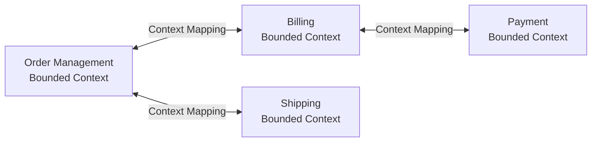

# Domain-Driven Design

## What it is

Domain-Driven Design (DDD) is a software design approach that focuses on modeling software around the business domain, using a shared language between technical and domain experts. For system design, the key concepts are **bounded contexts**, **aggregates**, and the **ubiquitous language** — these are how you find service boundaries.

## Strategic DDD (for system design)

### Ubiquitous Language

A shared vocabulary used by both developers and domain experts throughout the code, diagrams, and conversations:

```
Bad: "ProcessEntity", "HandleThing", "UpdateRecord"
Good: "PlaceOrder", "Shipment", "CustomerAccount", "InventoryReservation"

The code should read like the business speaks.
User: "A customer places an order, which reserves inventory and triggers payment"
Code: customer.placeOrder(items) → order.reserveInventory() → order.chargePayment()
```

### Bounded Context

A boundary within which a domain model is consistent and internally coherent. The same concept can mean different things in different bounded contexts.

```
"Order" in different contexts:

Order Management Context:
  Order = { id, items, total, status: pending/confirmed/shipped/delivered }
  Cares about: item quantities, prices, fulfillment workflow

Billing Context:
  Order = { id, invoice_number, amount, payment_status, payment_method }
  Cares about: amounts, payment, invoicing

Shipping Context:
  Order = { id, shipping_address, package_dimensions, carrier, tracking }
  Cares about: physical delivery, carrier integration
```

**Each bounded context has its own:**
- Data model (different tables/schemas)
- Service/module
- Ubiquitous language
- Team ownership

**Bounded contexts → microservice boundaries:**



Each bounded context often maps to one microservice (or a small cluster of related services).

### Context Mapping

How bounded contexts communicate:

| Pattern | Description | When |
|---|---|---|
| **Shared Kernel** | Two contexts share a subset of the model | Closely related teams, minimal sharing |
| **Customer/Supplier** | Supplier defines interface; customer adapts | Clear upstream/downstream |
| **Conformist** | Downstream conforms to upstream's model | Can't change upstream |
| **Anticorruption Layer (ACL)** | Translation layer to isolate your model from external models | Legacy integration, external APIs |
| **Open Host Service** | Publish a protocol for integration | Many consumers |
| **Published Language** | Well-documented exchange language | Many external consumers |
| **Partnership** | Two teams plan together | Mutual dependency |
| **Separate Ways** | No integration | Completely independent |

**Anticorruption Layer** is the most important for system design:

```
Your Domain Model ↔ ACL ↔ External System's Model

External CRM uses "contact" → Your ACL translates to "customer"
External payment gateway uses "charge" → ACL translates to "payment transaction"

Your code never knows about external models.
Change in external system → update ACL only.
```

## Tactical DDD (for implementation)

### Entity

An object with a unique identity that persists over time. Identity is more important than attributes.

```python
class Order:
    def __init__(self, order_id: str):
        self.order_id = order_id  # identity
        self.status = 'pending'
        self.items = []
    
    # Two orders with same items are still different orders
    def __eq__(self, other):
        return isinstance(other, Order) and self.order_id == other.order_id
```

### Value Object

Defined by its attributes, not identity. Immutable. No lifecycle.

```python
@dataclass(frozen=True)
class Money:
    amount: Decimal
    currency: str
    
    def add(self, other: 'Money') -> 'Money':
        assert self.currency == other.currency
        return Money(self.amount + other.amount, self.currency)

@dataclass(frozen=True)
class Address:
    street: str
    city: str
    country: str
    postal_code: str

# Two Money(100, USD) objects are equal — no unique identity needed
```

### Aggregate

A cluster of entities and value objects that are treated as a single unit for data changes. Has one root entity (Aggregate Root) — all external access goes through the root.

```python
class Order:  # Aggregate Root
    def __init__(self, order_id: str, customer_id: str):
        self.order_id = order_id
        self.customer_id = customer_id
        self.items: List[OrderItem] = []  # entities within the aggregate
        self.status = 'draft'
        self.total = Money(0, 'USD')
    
    def add_item(self, product_id: str, quantity: int, price: Money):
        # Business invariant enforced here
        if self.status != 'draft':
            raise OrderAlreadySubmittedError()
        
        item = OrderItem(product_id, quantity, price)  # created only through root
        self.items.append(item)
        self.total = self.total.add(price.multiply(quantity))
    
    def submit(self):
        if not self.items:
            raise EmptyOrderError()
        self.status = 'submitted'
        # emit OrderSubmitted event

class OrderItem:  # Entity within aggregate (not accessible directly from outside)
    def __init__(self, product_id: str, quantity: int, price: Money):
        self.item_id = str(uuid.uuid4())
        self.product_id = product_id
        self.quantity = quantity
        self.price = price
```

**Aggregate rules:**
1. External references hold only the root's ID
2. Transactions don't span aggregates (one aggregate = one transaction)
3. Size: as small as possible — large aggregates → locking contention

### Domain Events

Significant business occurrences that the business cares about:

```python
@dataclass(frozen=True)
class OrderSubmitted:
    order_id: str
    customer_id: str
    total: Money
    items: List[dict]
    occurred_at: datetime
```

### Repository

Abstraction for loading and saving aggregates. Hides the storage mechanism.

```python
class OrderRepository(ABC):
    @abstractmethod
    def find_by_id(self, order_id: str) -> Optional[Order]:
        pass
    
    @abstractmethod
    def save(self, order: Order) -> None:
        pass

class PostgresOrderRepository(OrderRepository):
    def find_by_id(self, order_id: str) -> Optional[Order]:
        # load from DB, reconstruct aggregate
        ...
```

### Domain Service

Business logic that doesn't naturally belong to an entity or value object:

```python
class TransferService:
    """
    Transfer between accounts — doesn't belong to either account.
    Operates on multiple aggregates.
    """
    def transfer(self, from_account: Account, to_account: Account, amount: Money):
        from_account.debit(amount)
        to_account.credit(amount)
        # publish MoneyTransferred event
```

## DDD for finding microservice boundaries

This is the most practical use of DDD for system design:

```
1. Talk to domain experts — understand the business
2. Identify major subdomains:
   - Core domain: your competitive advantage (model carefully)
   - Supporting domain: necessary but not differentiating (can buy off-shelf)
   - Generic domain: fully generic (use existing SaaS: email, auth)

3. Draw bounded contexts around coherent language areas
4. Map relationships between contexts
5. Each bounded context → candidate for a microservice

Example: E-commerce
  Core: Product recommendations, search ranking
  Supporting: Inventory management, order fulfillment
  Generic: Email delivery (SES), auth (Cognito), payments (Stripe)
```

## Interview angle

!!! tip "When DDD comes up"
    Interviewers sometimes ask "how would you design the data model?" or "how would you split this into services?" DDD gives you a principled answer.

**Strong answer pattern:**
1. Identify the bounded contexts from the requirements
2. Use bounded context = service boundary
3. Model the core aggregate for each context
4. Use ACL at external integrations
5. Events to communicate between contexts

## Related topics

- [Monolith vs Microservices](monolith-vs-microservices.md) — DDD finds service boundaries
- [Event-Driven Architecture](event-driven.md) — domain events as integration
- [Event Sourcing](../patterns/event-sourcing.md) — aggregates + events
- [CQRS](../patterns/cqrs.md) — command/query separation at the domain level
