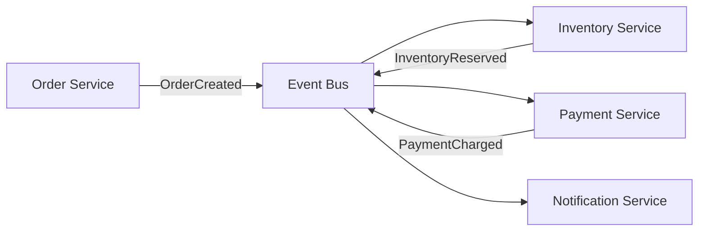
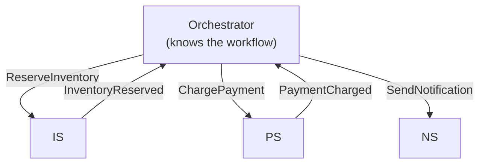

# Event-Driven Architecture

## What it is

Event-Driven Architecture (EDA) is an architectural style where components communicate through events — immutable records of things that happened. Producers publish events without knowing who consumes them. Consumers react to events independently.

!!! tip "Applied companions"
    For payload design (fat vs thin events), see **[Event Payload Design](../messaging/event-payload-design.md)**.
    For schema evolution, see **[Event Schema Evolution](../messaging/event-schema-evolution.md)**.
    For consumer-side handling, see **[Idempotent Consumers in Production](../messaging/idempotent-consumers.md)**.

## You'll see this when...

- Many services need to react when something happens (order placed → email + analytics + inventory + recommendation refresh)
- Kafka, Pulsar, AWS Kinesis, EventBridge, Google Pub/Sub in the stack
- Event names like `OrderPlaced`, `UserSignedUp`, `PaymentCharged` flowing through topics
- Audit / compliance requirement to keep a record of every state change
- Need to add new functionality without modifying existing services (subscribe to existing events)
- Decoupling teams: "your team doesn't need to know about my service, just consume my events"
- Real-time analytics fed by event streams alongside transactional writes

## Cost reality

The event-driven backbone has a real infrastructure + ops cost. Rough estimates (AWS, 2026):

```
Light event-driven (SQS / SNS / EventBridge):
  Setup time:        days
  Infra cost:        $20-200/month (often nearly free at low volume)
  Ops overhead:      negligible
  
Mid-tier (Kinesis Data Streams):
  Setup time:        weeks
  Infra cost:        $200-1500/month (depends on shard count + retention)
  Ops overhead:      light — managed service
  
Kafka (MSK or self-hosted):
  Setup time:        weeks-months
  Infra cost:        $300-3K/month minimum (3-broker cluster + storage)
  At scale:          $5K-50K+/month
  Ops overhead:      meaningful — Schema Registry, Connect, KRaft, monitoring
  Engineer effort:   often a dedicated platform / streaming team at scale
```

Plus the cognitive cost: eventual consistency, schema evolution, debugging across services, distributed tracing. Don't adopt Kafka for 100 events/sec — SQS/SNS handle that with $20/month and no ops.

```
Traditional (request-driven):
  Order Service → HTTP call → Inventory Service → HTTP call → Notification Service
  Tight coupling: Order Service knows about both downstream services
  Failure: if Inventory is down, Order fails

Event-Driven:
  Order Service → publishes "OrderCreated" event
                              ↓
                 Inventory Service (consumes, reserves stock)
                 Notification Service (consumes, sends email)
                 Analytics Service (consumes, updates metrics)
  
  Order Service doesn't know who consumes. New consumers added without touching Order Service.
```

## Core concepts

### Event

An immutable fact about something that happened. Always past tense. Contains only the data needed to describe the change — not instructions.

```python
# Event (past tense, describes what happened)
{
    "event_id": "evt_8821",
    "event_type": "OrderCreated",
    "occurred_at": "2024-04-26T14:00:00Z",
    "version": "1.0",
    "data": {
        "order_id": "ord_123",
        "user_id": "usr_456",
        "items": [{"product_id": "p_1", "qty": 2}],
        "total": 29.98
    }
}

# NOT an event (this is a command — telling someone what to do)
# { "action": "send_confirmation_email", "to": "user@example.com" }
```

### Event vs Command vs Query

| | Event | Command | Query |
|---|---|---|---|
| Direction | Broadcast | Targeted | Targeted |
| Tense | Past ("OrderCreated") | Imperative ("CreateOrder") | Question ("GetOrder") |
| Response | None required | Result/ack expected | Response required |
| Mutates state | Was already mutated | Should mutate state | No mutation |
| Coupling | None | Caller/callee coupled | Caller/callee coupled |

## Patterns in EDA

### Simple event notification

Notify subscribers that something happened. Consumers fetch details if needed:

```
OrderCreated { order_id: "ord_123" }   ← minimal payload, just the ID

Consumer:
  receives event → fetches full order details via API
  
Pros: Small events, no duplication of data
Cons: Extra round trip, consumer depends on source API being available
```

### Event-carried state transfer

Events contain all the data consumers need — no follow-up fetch required:

```
OrderCreated {
  order_id, user_id, user_email, user_name,
  items: [...], total, shipping_address
}

Consumer: receives event → has everything needed to process
Pros: No round-trip, consumer independent of source API
Cons: Larger events, data duplication, schema evolution complexity
```

### Event sourcing

Events as the source of truth (see [Event Sourcing](../patterns/event-sourcing.md)).

## Choreography vs Orchestration

### Choreography

Services react to events independently — no central coordinator. Each service knows what to do when it sees a specific event.



**Pros:** Decoupled, no single point of failure, services evolve independently  
**Cons:** Hard to trace the overall flow, circular dependencies, distributed debugging

### Orchestration

A central orchestrator sends commands and receives responses. Knows the full flow.



**Pros:** Clear visibility, single place for business logic, easy to trace  
**Cons:** Orchestrator becomes a coupling point, can become too complex

**When to use which:**
- Choreography: simple 2-3 step flows, highly decoupled teams, event-driven by default
- Orchestration: complex multi-step workflows, compensations (sagas), visibility needed

## Event schema design

### Versioning

Events are published to many consumers. Schema must evolve carefully:

```json
// v1.0
{ "event_type": "OrderCreated", "version": "1.0", "order_id": "ord_123", "total": 29.99 }

// v1.1 (backward compatible — added optional field)
{ "event_type": "OrderCreated", "version": "1.1", "order_id": "ord_123", "total": 29.99, "currency": "USD" }

// Consumers handling v1.0 events must handle missing "currency" field
```

**Rule:** Add fields with defaults, never remove or rename. Use a schema registry.

### Envelope pattern

Standard envelope for all events:

```json
{
    "id":           "uuid",
    "source":       "order-service",
    "type":         "com.example.OrderCreated",
    "version":      "1.1",
    "time":         "2024-04-26T14:00:00Z",
    "datacontenttype": "application/json",
    "subject":      "order/ord_123",
    "data": { ...event-specific fields... }
}
```

[CloudEvents](https://cloudevents.io) spec provides a standard envelope format.

## EDA patterns for specific problems

### CQRS + EDA

Write side publishes events → Read model projectors consume → Optimized read stores:

```
Command → Write Service → DB + Event → Kafka → Projector → Read DB
```

### Outbox + EDA

Atomic DB write + event publish:

```
App → DB transaction (write + outbox entry) → Relay → Kafka
```

### Saga + EDA

Distributed transactions via events (choreography):

```
OrderCreated → Inventory reserves stock → InventoryReserved
→ Payment charges card → PaymentCharged → Notification sends email
```

See [Saga Pattern](../patterns/saga-pattern.md).

## Challenges

### Eventual consistency

```
User places order → OrderCreated event published
→ Inventory service processes event (100ms later)
→ User queries inventory → still shows old stock for 100ms

Solutions:
  - Accept staleness (most cases)
  - Read-your-writes routing to write side
  - Optimistic UI update on client
```

### Event ordering

Events in a partition are ordered. Across partitions, ordering is not guaranteed:

```
User creates account → UserCreated event (partition 0)
Order service: OrderCreated for new user (partition 1)

If order processed before account → order references non-existent user

Solutions:
  - Route related events to same partition (by user_id)
  - Consumer handles "user not found" → wait/retry
  - Choreography with explicit dependency events
```

### Idempotency

Consumers receive events at-least-once. Must handle duplicates:

```python
def on_order_created(event):
    if already_processed(event.id):
        return
    process(event)
    mark_processed(event.id)
```

### Dead letter events

Events that fail processing after N retries:

```
Event → Consumer (fails 3 times) → DLQ
→ Alert → Human investigation
→ Fix bug → Replay from DLQ
```

## EDA in AWS

```
EventBridge:   Event routing with content-based filtering
  SNS + SQS:   Fan-out to reliable queues
  Kinesis:     High-throughput event streaming
  MSK (Kafka): Full event streaming with replay
  Step Functions: Orchestration for complex workflows
  Lambda:      Serverless event consumers
```

**Typical AWS event-driven flow:**
```
API → Lambda (publishes) → EventBridge → Rule-based routing
  → SQS → Lambda (email service)
  → SQS → Lambda (inventory service)
  → Kinesis Firehose → S3 → Athena (analytics)
```

## Interview angle

!!! tip "What interviewers are testing"
    They want to see you use events to decouple services — and know the tradeoffs vs synchronous calls.

**Strong answer pattern:**
1. Identify which interactions are "fire and forget" vs require immediate response
2. Use events for fire-and-forget: order confirmation, notifications, analytics
3. Use synchronous calls for immediate-response: auth check, balance query
4. Address ordering and idempotency
5. Choose choreography for simple flows, orchestration for complex sagas

## Related topics

- [Messaging](../messaging/index.md) — event buses and streaming
- [CQRS](../patterns/cqrs.md) — read/write separation via events
- [Event Sourcing](../patterns/event-sourcing.md) — events as source of truth
- [Saga Pattern](../patterns/saga-pattern.md) — distributed transactions via events
- [Monolith vs Microservices](monolith-vs-microservices.md) — EDA enables microservices decoupling
