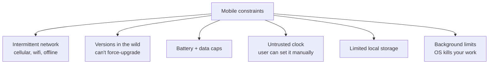
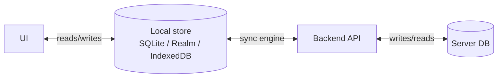
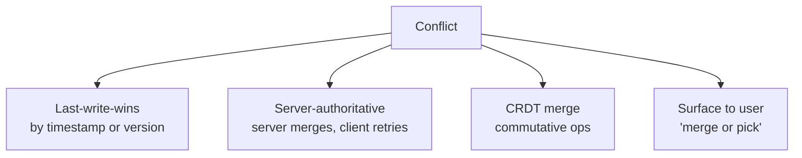
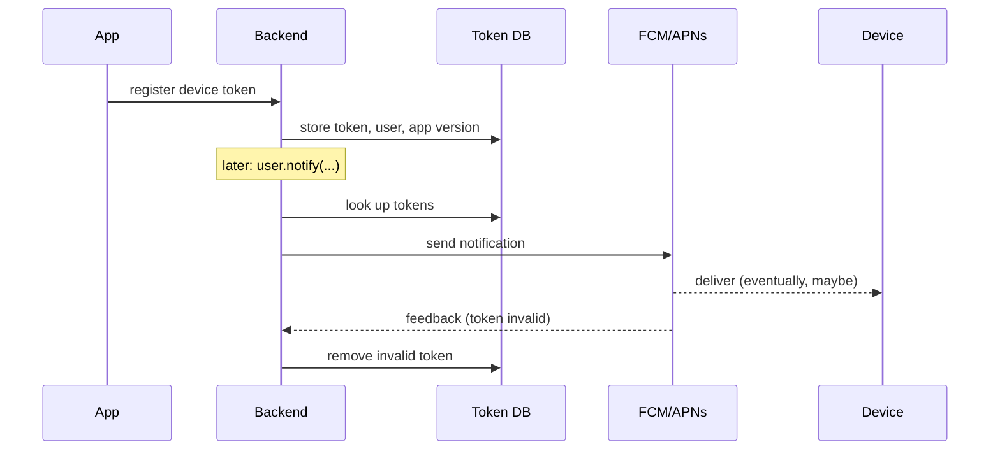

---
tags:
  - applied
---

# Mobile + Edge Specifics

## You'll see this when...

- The backend works perfectly but the mobile experience is flaky on real-world networks
- Users complain that the app shows stale data after switching networks
- Push notifications are out of order, duplicated, or silently dropped
- A new app version ships and 30% of users are still on the old one a month later
- Edge functions look cheap until egress, cold starts, and observability bills land

Mobile and edge clients break a lot of assumptions a backend engineer is used to: connectivity is intermittent, time is wrong, the client version is whatever the user feels like updating, and "deploy a fix" takes a week through app review.

## The constraints that change the design



Any of these alone changes a design. Together they push you toward **offline-first** thinking.

## Offline-first architecture

The naive model: app calls API on every screen. Works on demos, fails on subways.

The mature model: client has its own local store that is the UI's source of truth, plus a sync layer that reconciles with the server.



### What "sync" actually involves

1. **Detect what changed locally** — pending mutations queue, dirty flag, op log
2. **Send mutations to the server** — idempotent, ordered per resource
3. **Pull updates from the server** — incremental, since last sync token
4. **Resolve conflicts** — last-write-wins, CRDTs, server-authoritative, or human-resolved
5. **Apply server state to local store**
6. **Notify UI** — reactive query layer triggers re-renders

### Sync engine options

| Tool | Model | Good fit |
|---|---|---|
| **WatermelonDB** | SQLite + sync protocol you implement | RN apps, lots of local data |
| **PowerSync / Electric SQL** | Postgres ↔ SQLite replication | Postgres-first teams |
| **Realm Sync (Atlas Device Sync)** | Object DB, managed sync | Tightly coupled to MongoDB |
| **Replicache / Zero** | Server-authoritative mutations, optimistic UI | Web + RN, modern stacks |
| **CouchDB / PouchDB** | Multi-master replication | Long history of offline-first |
| **CRDTs (Yjs, Automerge)** | Conflict-free merge | Collaborative editing |

The boring option: roll your own — a `mutations` table, a `since_token` per user, idempotent server endpoints. Many production apps still do exactly this and it works fine.

## Conflict resolution

When two clients edit the same row offline, what wins?



| Strategy | When |
|---|---|
| **Last-write-wins** | Tolerable conflicts (a note's title) |
| **Server-authoritative** | Money, inventory — server is the truth, client retries |
| **CRDT** | Real-time collaboration, text editing |
| **Per-field merge** | Tickets, profiles — merge non-overlapping fields, conflict on overlap |
| **Surface to user** | High-stakes, low-frequency conflicts |

### Don't trust the client clock

If you use `updated_at` for LWW, the client phone might be 6 hours off. Use a **server-assigned monotonic version** (Lamport timestamp or a per-resource version counter) for ordering.

## API design for unreliable networks

### Idempotency is non-negotiable

Mobile retries. The same `POST /orders` will arrive twice. Every write endpoint must accept an `Idempotency-Key` header (UUID per logical operation) and return the same result on retry.

```http
POST /orders HTTP/1.1
Idempotency-Key: 7b0d9f-...
Content-Type: application/json

{ "item_id": "i_500", "quantity": 1 }
```

See [Idempotency](../patterns/idempotency.md).

### Incremental sync (delta API)

```http
GET /sync?since=2026-05-11T14:30:00Z&cursor=abc
→ { "events": [...], "next_cursor": "def", "has_more": true }
```

- Cursor-based, not page-based — page numbers shift under inserts
- `has_more=true` until caught up
- Idempotent — same cursor, same response

### Batch endpoints

A mobile sync should not be 100 HTTP requests. Batch the mutations:

```http
POST /sync/mutations
{
  "mutations": [
    { "op": "create_order", "client_id": "co_1", "data": {...} },
    { "op": "update_profile", "client_id": "up_2", "data": {...} }
  ]
}
→ { "results": [{ "client_id": "co_1", "server_id": "o_500" }, ...] }
```

Server processes in order, returns per-mutation results. Failed mutations don't block successful ones.

### Compression and payload size

- gzip / brotli everywhere
- Don't return fields the client doesn't need
- Use protobuf or flatbuffers for high-volume APIs
- Send images via a CDN URL, not embedded base64

## Push notifications

A surprisingly hard distributed system. APNs (Apple) and FCM (Google) are best-effort fire-and-forget — they will drop, reorder, and delay.



### Things to get right

| Concern | Practice |
|---|---|
| **Token rotation** | App reports new token on every launch; backend dedupes |
| **Token invalidation** | Honor feedback channel — remove tokens FCM/APNs report as invalid |
| **Idempotency** | Server idempotency key per notification → don't double-send on retry |
| **Quiet hours** | User timezone (server-stored), not client clock |
| **Multi-device** | One user → N devices; design for fan-out |
| **Sound + badge updates** | Silent pushes have different rate limits and OS rules |
| **Localization** | Localized at send time on the server, not in the client |
| **Rich payloads** | Image URLs hit a CDN; OS may block large images |
| **Background sync** | Use a data-only push to trigger a background fetch — don't put data in the visible push |

### Don't use push for transport

Pushes are notifications. Use them to **wake the app** or **alert the user**. The actual payload should come from a regular API call once the app fetches it. This is the single most common mobile architecture mistake.

## Version skew

Once an app version is in the field, you can't take it back. App store review can be a week; a bad release can linger for months.

### Mitigations

1. **Feature flags on the server** for any new client behavior — turn it off without app review
2. **Versioned APIs** (`/v1`, `/v2`) — old clients keep working
3. **Force-upgrade screen** for security or breaking-business-logic releases — surface a "please update" gate
4. **Server-driven UI** for parts that change often — backend returns UI configuration, client renders
5. **Migration paths** — when you bump a local schema, write migrations; do not assume users open the app in order

### Telemetry to watch

- p99 client version installed (the long tail is real)
- Crash rate by version
- API call distribution by `User-Agent` version

## Mobile-specific perf and reliability

### Cold start

| Tactic | Why |
|---|---|
| Defer non-critical init | Get to first screen faster |
| Prefetch the user's likely first screen data | Hide latency under animation |
| Cache last known good state | Show something while syncing |
| Minimize the dependency graph in the launch path | Each blocking init is a tax |

### Battery + data

- Coalesce network requests — sync every N minutes, not every screen
- Respect "low data mode" / "low power mode"
- Use `WorkManager` (Android) / `BGTaskScheduler` (iOS) for background — don't run a polling loop
- Never use long-polling on cellular — wakes the radio constantly

### Storage

- SQLite is the boring, correct default
- Encrypt sensitive data at rest (SQLCipher, iOS Keychain for keys)
- Have a quota and an eviction policy — users will fill the device
- Avoid blob storage in SQLite for large files — use the FS

## Edge compute

"Edge" usually means running compute close to users — Cloudflare Workers, Vercel Edge, AWS Lambda\@Edge, Fastly Compute. Different from CDNs (which only cache static content).

### What edge is good for

- **Authentication checks** at the POP, reject unauthorized before hitting origin
- **A/B test assignment** — read user cookie, route accordingly
- **HTML personalization** — small swap-ins (locale, currency)
- **Rate limiting at the edge** — protect origin from abusive clients
- **Image transformation** (resize, format) — Cloudflare Images, Imgix
- **Geo-routing** — send EU users to EU origins

### What edge is bad at

| Pattern | Why it fails |
|---|---|
| **Stateful workloads** | Each POP is independent; no shared in-memory state |
| **Long-running tasks** | Edge runtimes have tight CPU/time limits (50-200ms typical) |
| **Heavy compute** | No GPUs, limited memory |
| **Frequent DB writes** | Round-trip to a central DB cancels the latency win |
| **Things that need a full Node ecosystem** | Many native modules don't work on edge runtimes (V8 isolates) |

### Cold starts at edge

The pitch is "no cold starts" (V8 isolates start in ~5ms). Reality:

- Code bundle size matters — bigger bundle, slower init
- First request to a POP after long idle can be slower
- Edge KV reads are still cross-region for writes (eventually consistent reads close, writes go to origin POP)

### Data at the edge

- **Edge KV** (Cloudflare KV, Vercel Edge Config): low-latency reads worldwide, slow writes; great for config, A/B definitions, feature flags
- **Edge SQL** (Turso, D1, Neon read replicas): regional read replicas of a relational store
- **Durable Objects** (Cloudflare): single-instance stateful objects pinned to a region; good for coordination (chat rooms, collaborative docs)

### Cost gotchas

- Edge requests are billed per invocation — high-fanout APIs add up
- Egress to origin still costs; if every edge request hits origin you've added latency, not saved any
- Logs and observability at edge can dwarf compute cost if you're not careful

## Anti-patterns

| Anti-pattern | Why it hurts | Better |
|---|---|---|
| Treat the network as reliable | Subway, elevator, plane → app dies | Offline-first store, queued mutations |
| Use the client clock for ordering | Users set their clocks wrong | Server timestamps / versions |
| Cram data into push notifications | OS drops large payloads, no retry | Push wakes app; app fetches via API |
| Page-based sync | Pages shift under inserts → missed records | Cursor-based / since-token |
| One mega-endpoint for "all the app needs" | Slow, fails on partial errors | Batch with per-item results |
| No versioned API | Locked into supporting v1 forever | `/v1`, `/v2`, with a deprecation policy |
| "We'll force users to upgrade" | App review delay = real users stuck | Server-side feature flags, force-upgrade screen as fallback only |
| Edge for everything | Cold paths to DB, latency reversed | Edge for at-edge concerns only |

## Quick reference

| Need | Reach for |
|---|---|
| Offline support | Local store + mutation queue + delta sync |
| Avoid duplicate writes on retry | `Idempotency-Key` header |
| Ordered changes per resource | Server-assigned monotonic version |
| Real-time multi-client edits | CRDTs or server-authoritative + websockets |
| Notify users when app is closed | Push + background fetch |
| Roll out new behavior safely | Server feature flag, not new app version |
| Geo-aware response | Edge function reading `cf-ipcountry` |
| Static API responses with personalization | Cache at edge, vary on a small key set |

## Interview angle

!!! tip "What interviewers are testing"
    They want to see that you don't assume the client is a friendly server. The signal: idempotency, sync semantics, version skew, and respecting that you can't redeploy clients quickly.

**Strong answer pattern:**

1. Identify which constraints apply (offline, retries, version skew, battery, OS background limits)
2. Pick a sync model — offline-first, online-with-cache, or pure-online — and justify
3. Specify the conflict-resolution strategy and what's authoritative
4. Mention idempotency on the API side and how the client generates keys
5. For features that may change, plan a server-side feature flag rather than a new release

**Common follow-ups:**

- "How do you handle two users editing the same record offline?" — version per record, server reconciles, optionally surface conflict to user
- "How do you ensure a payment isn't double-charged on flaky network?" — client generates idempotency key, server stores and dedupes for N hours
- "Why not put the order data inside the push notification?" — push is fire-and-forget; payload size limits, drops, reorders, OS rules; treat push as a wake signal
- "When would you choose edge over a regional origin?" — when the request can be handled with edge-local data (auth check, A/B, redirect, simple personalization); not when every request must hit a central DB

## Related topics

- [Idempotency](../patterns/idempotency.md)
- [API Design](../api/index.md)
- [CDN](../networking/cdn.md)
- [Caching Strategies](../caching/caching-strategies.md)
- [CAP Theorem](../fundamentals/cap-theorem.md) — eventual consistency by design
- [Event Sourcing](event-driven.md) — applicable to client-side sync engines
