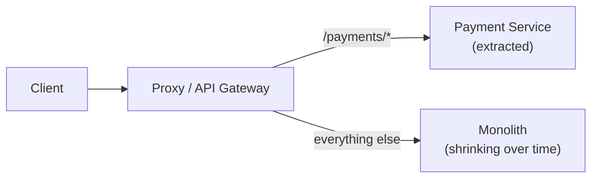

# Monolith vs Microservices

## Monolith

A monolith is a single deployable unit where all components (UI, business logic, data access) run in the same process and share the same database.

```
┌─────────────────────────────────────────┐
│              Monolith Process            │
│                                          │
│  ┌──────────┐  ┌──────────┐  ┌────────┐ │
│  │   Users  │  │  Orders  │  │Payment │ │
│  │  Module  │  │  Module  │  │ Module │ │
│  └──────────┘  └──────────┘  └────────┘ │
│                                          │
│  ┌──────────────────────────────────────┐ │
│  │         Single Database              │ │
│  └──────────────────────────────────────┘ │
└─────────────────────────────────────────┘
         ↑ Deploy together
```

### Strengths

- **Simple development:** One codebase, one deployment, one database
- **Simple debugging:** One log stream, one stack trace, no network calls to trace
- **Simple transactions:** Cross-module ACID transactions with no distributed complexity
- **Low latency:** Module-to-module calls are function calls, not network requests
- **Operational simplicity:** One thing to deploy, monitor, scale
- **Easy refactoring:** Rename a function → compiler tells you everywhere to update

### Weaknesses

- **Deployment coupling:** Change one module → deploy everything
- **Technology lock-in:** Entire codebase must use same language, framework, runtime
- **Scale coupling:** Can't scale just the payment module — scale the whole app
- **Fault coupling:** Memory leak in one module → entire app crashes
- **Large team friction:** 50 engineers on one codebase → merge conflicts, build contention
- **Long build/deploy cycles:** Full app rebuild and deploy for every change

## Microservices

Microservices decompose an application into small, independently deployable services, each owning its own data store.

```
┌──────────┐   ┌──────────┐   ┌──────────┐
│  Users   │   │  Orders  │   │ Payment  │
│ Service  │   │ Service  │   │ Service  │
│          │   │          │   │          │
│  Users   │   │  Orders  │   │ Payment  │
│   DB     │   │   DB     │   │   DB     │
└──────────┘   └──────────┘   └──────────┘
     ↑               ↑               ↑
  Deploy          Deploy          Deploy
 independently  independently  independently
```

### Strengths

- **Independent deployability:** Deploy payment service without touching user service
- **Independent scalability:** Scale order service to 100 instances, keep user service at 3
- **Technology independence:** Payment service in Java, ML service in Python, real-time in Go
- **Fault isolation:** Memory leak in one service → only that service affected
- **Team autonomy:** Each team owns their service end-to-end (Conway's Law)
- **Resilience:** Circuit breakers prevent single-service failure from cascading

### Weaknesses

- **Distributed systems complexity:** Network calls, partial failures, eventual consistency
- **Operational overhead:** N services × (deployment + monitoring + logging + alerting)
- **No distributed transactions:** Need sagas, 2PC, or accept eventual consistency
- **Latency:** Function call (nanoseconds) → network call (milliseconds)
- **Testing complexity:** Need service virtualization, contract testing, end-to-end environments
- **Service discovery & networking:** Service mesh, load balancing per service

## When to choose monolith

```
Choose monolith when:
  □ Team < 15 engineers
  □ Domain not well-understood (premature decomposition is expensive)
  □ Single-tenant or low-traffic application
  □ Speed to market is priority
  □ You're building a startup MVP

Don't sacrifice simplicity for architectural purity prematurely.
"Monolith-first" is a valid and often recommended approach.
```

## When to choose microservices

```
Choose microservices when:
  □ Team > 30 engineers with clear domain ownership
  □ Different components have very different scale needs
  □ Different components need different technology stacks
  □ Deployment coupling is causing real pain
  □ Fault isolation is critical (payments can't take down the whole app)
  □ Regulatory requirements necessitate isolation (PCI, HIPAA)
```

## Modular Monolith (the middle ground)

A monolith with strict internal module boundaries — separately deployable when needed, but currently deployed as one unit:

```
┌─────────────────────────────────────────┐
│              Monolith Process            │
│                                          │
│  ┌──────────┐  ┌──────────┐  ┌────────┐ │
│  │  Users   │  │  Orders  │  │Payment │ │
│  │ Package  │  │ Package  │  │Package │ │
│  │ (owns    │  │ (owns    │  │(owns   │ │
│  │ its API) │  │ its API) │  │its API)│ │
│  └──────────┘  └──────────┘  └────────┘ │
│        No direct cross-package access     │
│        Only through public interfaces     │
└─────────────────────────────────────────┘
```

**Benefits:**
- Simplicity of monolith deployment
- Enforced boundaries (ready to split later)
- Easy to extract a module into a service when scale demands it
- No distributed complexity until needed

## Migration path: monolith → microservices

Don't rewrite — extract:

```
Step 1: Identify bounded contexts (DDD)
  - Which parts have different change rates?
  - Which parts need different scale?

Step 2: Modularize first
  - Create strict boundaries in the monolith
  - No cross-module DB access

Step 3: Extract the most pain-inducing service first
  - Usually: auth, notifications, or the most traffic-heavy component

Step 4: Strangler Fig pattern
  - New requests → new service
  - Legacy requests → still hit monolith
  - Gradually move traffic until monolith handles nothing → retire it
```



## Conway's Law

> "Organizations which design systems are constrained to produce designs which are the mirror image of the communication structures of those organizations." — Mel Conway

Your architecture will mirror your team structure. Microservices work best when team boundaries match service boundaries. If your 5-person team owns 15 microservices, you have the wrong architecture for your team size.

## Interview angle

!!! tip "What interviewers are testing"
    They want to see you justify the choice — not just default to microservices because it sounds more sophisticated.

**Strong answer pattern:**
1. Start with requirements: team size, traffic, domain complexity
2. Default recommendation: start with a modular monolith
3. Extract to microservices based on specific pain: deployment coupling, scale needs, team autonomy
4. Acknowledge the costs of microservices — distributed systems complexity, operational overhead
5. Mention the Strangler Fig for migration if relevant

## Related topics

- [Event-Driven Architecture](event-driven.md) — how microservices communicate asynchronously
- [Domain-Driven Design](ddd.md) — how to find service boundaries
- [Service Discovery](../distributed/service-discovery.md) — how services find each other
- [Saga Pattern](../patterns/saga-pattern.md) — distributed transactions in microservices
- [Service Mesh](../infrastructure/service-mesh.md) — networking for microservices
