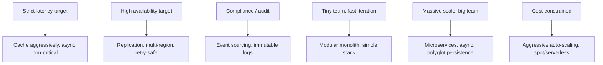

# Architectural Quality Attributes

Architecture decisions are tradeoffs across multiple "ilities" — performance, scalability, maintainability, observability. Quality attributes are the structured language that lets architects discuss these tradeoffs explicitly. The ISO 25010 standard codifies the canonical list; senior architects use them daily, often without naming them.

---

## The eight quality attributes that matter most

| Attribute | What it answers |
|---|---|
| **Performance** | How fast is it? |
| **Scalability** | How does it grow? |
| **Availability / Reliability** | How often is it up and correct? |
| **Security** | How well does it resist attack? |
| **Maintainability** | How easy is it to change? |
| **Observability** | How well can we see what it's doing? |
| **Operability** | How hard is it to run? |
| **Cost-effectiveness** | What does it cost to deliver value? |

There are more (portability, accessibility, compatibility, internationalisation), but these eight cover most architectural decisions.

---

## Why "ilities" matter

Functional requirements describe **what** the system does. Quality attributes describe **how well**.

```
Functional: "Users can place orders"
Quality:    
  - Performance: orders process in <500 ms p99
  - Scalability: handles 10K orders/sec
  - Availability: 99.95% uptime
  - Security: PCI-DSS compliant
  - Maintainability: feature changes ship in <1 week
  - Observability: every order has a trace ID
  - Operability: zero-downtime deploys
  - Cost: <$0.001 per order
```

Architecture decisions trade these against each other. A 99.99% requirement costs much more than 99.9%. Strong consistency loses some availability. You can't optimise all simultaneously.

---

## Performance

How fast operations complete.

| Metric | What it measures |
|---|---|
| Latency | Time per request (p50, p95, p99, p99.9) |
| Throughput | Requests / sec |
| Time-to-first-byte (TTFB) | Initial response delay |
| Tail latency | p99+, the long-tail outliers |

Architectural levers:

- **Caching** — most powerful single lever
- **Async processing** — don't block on slow work
- **Locality** — bring computation to data (edge, CDN)
- **Concurrency model** — async vs threads vs processes
- **Algorithm efficiency** — Big-O matters at scale
- **Database design** — indexes, denormalisation, sharding

Tradeoffs: caching → consistency overhead; async → complexity; sharding → join difficulty.

---

## Scalability

How performance changes as load grows.

| Type | Mechanism |
|---|---|
| **Vertical** | Bigger machine; cap at hardware limits |
| **Horizontal** | More machines; cap at coordination cost (Amdahl/USL) |
| **Read scaling** | Replicas, caching |
| **Write scaling** | Sharding, async, batch |
| **Storage scaling** | Sharding, archival tiers |

Architectural levers:

- Stateless services (horizontal scale becomes trivial)
- Sharding strategy (avoid hot partitions)
- Async messaging (decouple producer from consumer rate)
- Read replicas (reads scale separately from writes)

Tradeoffs: stateless services need external state stores; sharding complicates queries; async loses real-time feedback.

See [Scalability](../fundamentals/scalability.md) and [Throughput Limits](../fundamentals/throughput-limits.md).

---

## Availability and reliability

How often the system is up and working correctly.

| Term | Meaning |
|---|---|
| **Availability** | % of time the system responds at all |
| **Reliability** | % of operations that produce correct results |
| **MTBF** | Mean time between failures |
| **MTTR** | Mean time to recover |

Targets:

| 9s | Downtime / year |
|---|---|
| 99% | 3.65 days |
| 99.9% | 8.76 hours |
| 99.99% | 52.6 minutes |
| 99.999% | 5.26 minutes |

Architectural levers:

- Replication (no single point of failure)
- Multi-region deployment
- Graceful degradation (partial availability > full outage)
- Circuit breakers + bulkheads (isolate failures)
- Idempotency (safe retries)

Tradeoffs: high availability costs replication, complexity, and consistency.

See [Availability & Reliability](../fundamentals/availability.md).

---

## Security

How well the system resists unauthorised access, modification, or disclosure.

| Property | What it covers |
|---|---|
| Confidentiality | Only authorised parties read |
| Integrity | Data not modified by unauthorised parties |
| Authentication | We know who's making the request |
| Authorisation | We allow only what they're permitted |
| Auditability | We can reconstruct who did what |
| Non-repudiation | Actions can't be denied |

Architectural levers:

- Defense in depth (multiple layers of control)
- Zero trust (never trust the network)
- Least privilege (minimum permissions per role)
- Secrets management (no embedded credentials)
- Encryption at rest and in transit
- Continuous scanning (SAST, DAST, SCA)

Tradeoffs: security overhead in latency, complexity, developer ergonomics.

See [Security](../security/index.md).

---

## Maintainability

How quickly and safely the system can be changed.

Indicators:

- Time from "feature requested" to "in production"
- Frequency of regressions per release
- New developer time-to-productivity
- Test suite execution time
- Deployment frequency

Architectural levers:

- Modular boundaries (change blast radius bounded)
- Comprehensive tests (changes are verified)
- Clean architecture (intent visible)
- Documentation (ADRs, runbooks, READMEs)
- Standard patterns (cognitive load lower)
- Type systems and static analysis

Tradeoffs: investment in tests and structure feels slow until it pays off; flexibility costs optimisation.

See [Clean Architecture](../software-design/clean-architecture.md), [Refactoring](../software-design/refactoring.md).

---

## Observability

How visible the system's behaviour is.

The three pillars:

| Pillar | What it shows |
|---|---|
| Logs | What happened (events, errors) |
| Metrics | How much / how fast (counters, gauges, histograms) |
| Traces | What happened across services for one request |

Plus increasingly:

- **Profiling** — where time / resources are spent
- **Continuous profiling** — production code paths
- **Events** — discrete state changes worth recording

Architectural levers:

- Structured logging (queryable, not free-text)
- Distributed tracing (cross-service visibility)
- Standardised metrics (RED, USE, Four Golden Signals)
- Correlation IDs (tie everything to a request)

Tradeoffs: instrumentation cost; storage cost; alert noise.

See [Observability](../observability/index.md).

---

## Operability

How easily the system can be run in production.

Indicators:

- Time to deploy a new version
- Time to recover from an incident
- On-call burden (pages per week)
- Number of manual operational steps
- Confidence in performing changes

Architectural levers:

- Automated deploys (no human in the production path)
- Self-healing (auto-restart, auto-failover)
- Runbooks for known issues
- Comprehensive observability (debug without ssh)
- Feature flags (decouple deploy from release)
- Backups + restore drills

Tradeoffs: operability investments compete with feature work in the short term.

---

## Cost-effectiveness

How much resources / dollars per unit of value.

Indicators:

- Cost per request / per user / per transaction
- Infrastructure cost as % of revenue
- Engineering time per feature
- Wasted capacity (idle resources)

Architectural levers:

- Right-sized resources (no oversizing "for safety")
- Auto-scaling (pay for actual demand)
- Reserved / spot instances (commitment discounts)
- Multi-tenancy (share fixed costs)
- Caching (reduce expensive operations)
- Cold storage tiers (archive what's not hot)
- Vendor diversity (avoid lock-in pricing)

Tradeoffs: optimisation for cost can hurt latency, reliability, or developer ergonomics.

---

## Trade-offs are inevitable

You can't maximise all attributes. Common tensions:

| Tension | Example |
|---|---|
| Performance vs cost | Larger cache → lower latency, higher cost |
| Performance vs maintainability | Hand-tuned code → fast, hard to change |
| Availability vs consistency | Multi-region → available, eventual consistency |
| Security vs usability | More auth steps → safer, harder to use |
| Observability vs cost | More telemetry → debuggable, expensive to store |
| Scalability vs simplicity | Microservices → scalable, complex |

Architecture is the act of picking which tensions to resolve which way. Know which attributes matter most for the system's actual goals; let others be "good enough."

---

## Setting targets

For each attribute, define a measurable target:

```
Performance:        p99 latency < 200 ms
Scalability:        handle 10× current load with 5× resources
Availability:       99.9% per quarter (43 min downtime budget)
Security:           pass quarterly pen test; zero criticals
Maintainability:    avg change ships in 1 week
Observability:      mean time to root-cause < 30 min
Operability:        zero-downtime deploys
Cost:               $0.001 per user-month
```

Targets enable [fitness functions](fitness-functions.md). Without targets, "good enough" is opinion; with targets, it's measurement.

---

## How attributes shape architecture choices



The system's quality attribute targets determine the architecture style. Microservices for a 10-person startup is misalignment; modular monolith for a 1000-engineer org is also misalignment.

---

## Trade-off documentation

ADRs naturally capture quality attribute trade-offs:

```
ADR-0033: Use eventual consistency between order and inventory services

Context:
  Strict consistency requires distributed transactions across services.
  This adds latency and reduces availability.
  
Decision:
  Use eventual consistency via the saga pattern.
  
Consequences:
  + Lower latency on order placement
  + Higher availability (each service can fail independently)
  - Inventory may briefly oversell during sagas
  - Compensating transactions add complexity
  
Quality attributes:
  Performance: + (lower latency)
  Availability: + (independent service failure)
  Consistency: - (eventual, not strict)
  Maintainability: - (saga code is more complex)
```

Explicitly listing affected attributes makes the tradeoff legible.

---

## Interview angle

!!! tip "What interviewers are testing"
    Whether you can discuss architecture in terms of quality tradeoffs, not just naming patterns.

**Strong answer pattern:**
1. Architecture is multi-dimensional optimisation across "ilities"
2. Pick the 2-3 dimensions that matter most for this system; let others be acceptable
3. Set measurable targets per attribute (latency, uptime, cost, etc.)
4. Trade-offs are inevitable: performance vs cost, availability vs consistency, etc.
5. Use ADRs to record which attributes drove each decision

**Common follow-up:** *"You're designing a global financial system. Which quality attributes dominate?"*
> Reliability and security first — wrong answers in finance are catastrophic. Then auditability — every action must be reconstructible. Performance matters but is secondary to correctness. Availability target depends on tier (trading platforms need 99.999%; back-office can be 99.9%). Cost matters but isn't the primary lever. Maintainability matters because regulations change. Notice scalability isn't top — financial workloads tend to be predictable. The attribute mix is very different from "global photo-sharing app."

---

## Related topics

- [ADRs](adrs.md) — documenting which attributes drove each decision
- [Fitness Functions](fitness-functions.md) — automating attribute checks
- [Capacity Planning](capacity-planning.md) — sizing to attribute targets
- [Evolutionary Architecture](evolutionary-architecture.md) — maintaining attributes over time
- [Availability & Reliability](../fundamentals/availability.md) — depth on availability
- [Scalability](../fundamentals/scalability.md) — depth on scalability
