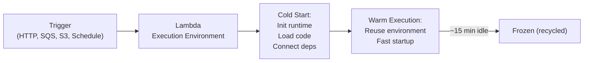
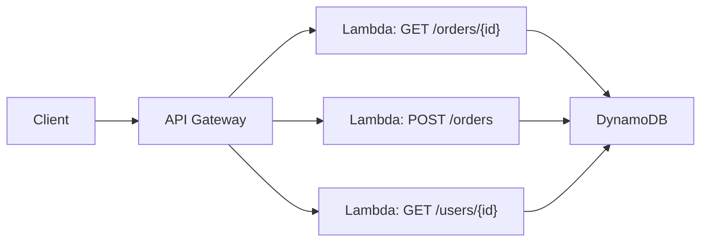
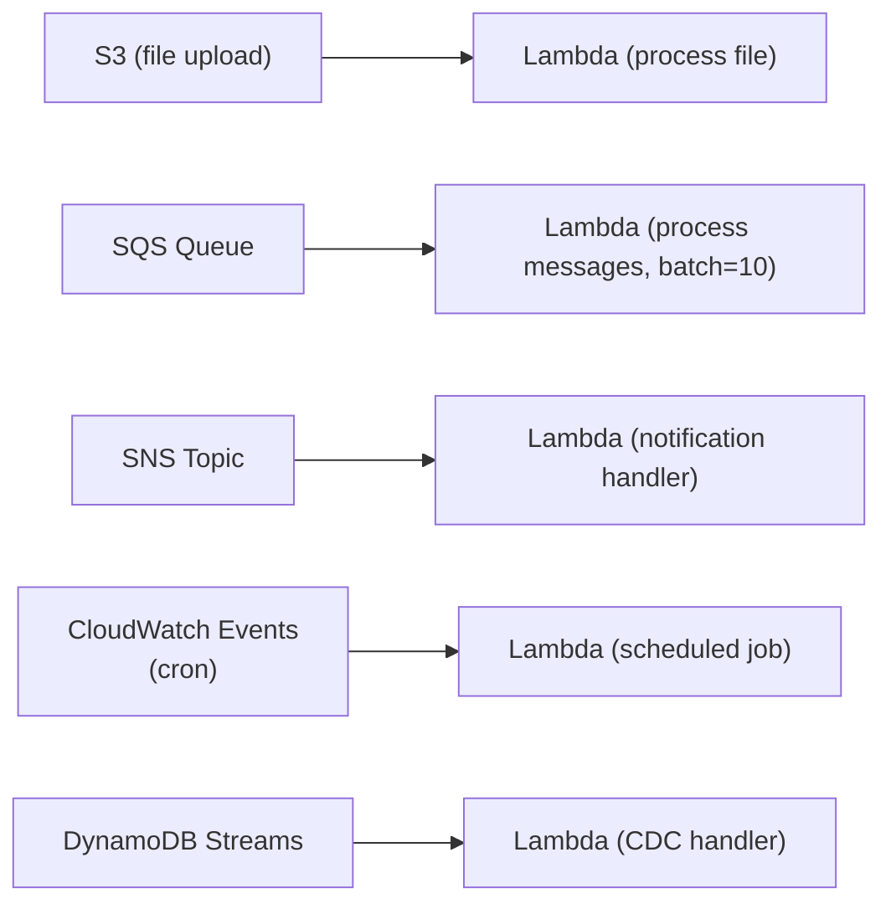

# Serverless Architecture

## What it is

Serverless means you write functions or declarative infrastructure without managing servers. The cloud provider handles provisioning, scaling, patching, and availability. You pay per invocation or execution time, not for idle capacity.

**Serverless ≠ no servers.** There are servers — you just don't manage them.

## FaaS (Function as a Service)

The core of serverless. Deploy individual functions, invoked by triggers.

```
AWS Lambda:
  - Upload code (zip or container image)
  - Configure trigger (HTTP, S3 event, SQS, schedule, etc.)
  - Set memory (128MB - 10GB), timeout (max 15 min)
  - Pay: $0.20/million invocations + $0.000016/GB-second

Azure Functions, Google Cloud Functions: equivalent offerings
```

### Execution model



### Cold start

The first invocation (or after idle period) incurs initialization overhead:

| Runtime | Cold start (p50) | Cold start (p99) |
|---|---|---|
| Node.js (zip) | ~100ms | ~500ms |
| Python (zip) | ~100ms | ~400ms |
| Go (zip) | ~50ms | ~200ms |
| JVM (Java/Kotlin) | ~1-3s | ~5s |
| Container image | ~1-3s | ~5s |

**Mitigation strategies:**
- **Provisioned concurrency:** Pre-warm N instances — pay for idle, zero cold start
- **Keep functions warm:** Schedule pings every 5 min (hack, not recommended)
- **Right-size memory:** More memory = more CPU = faster initialization
- **Lightweight runtimes:** Node/Python/Go cold start faster than JVM
- **Package size:** Smaller deployment → faster load

### Lambda function anatomy

```python
import json
import boto3

# Global scope: initialized once per cold start (shared across invocations)
dynamodb = boto3.resource('dynamodb')
table = dynamodb.Table('orders')

def lambda_handler(event, context):
    """
    event: trigger-specific payload (API Gateway request, SQS message, etc.)
    context: runtime info (function name, remaining time, request ID)
    """
    
    # Per-invocation logic
    order_id = event['pathParameters']['orderId']
    
    response = table.get_item(Key={'order_id': order_id})
    order = response.get('Item')
    
    if not order:
        return {
            'statusCode': 404,
            'body': json.dumps({'error': 'Order not found'})
        }
    
    return {
        'statusCode': 200,
        'headers': {'Content-Type': 'application/json'},
        'body': json.dumps(order)
    }
```

**Best practices:**
- Heavy init (DB connections, SDK clients) at global scope — reused across invocations
- Keep handler light — business logic only
- Avoid in-flight connections that can't be reused (use RDS Proxy for DB)

## Serverless patterns

### API + Lambda (REST API)



Zero servers to manage. Auto-scales to any load. Cost: ~$0 for low traffic, linear at scale.

### Event processing



### Fan-out pattern

```
API Gateway → Lambda A
              → publishes to SNS
                → SQS A → Lambda B (email)
                → SQS B → Lambda C (analytics)
                → Lambda D (push notification)
```

### Workflow orchestration

```
Step Functions → Lambda 1 (validate order)
              → Lambda 2 (charge payment)
              → Lambda 3 (reserve inventory)
              → Lambda 4 (send confirmation)
              
On failure: Step Functions handles retries and compensations
```

## Serverless storage

| Need | Serverless option |
|---|---|
| Durable KV/document | DynamoDB |
| Object storage | S3 |
| Cache | DynamoDB DAX (or ElastiCache — needs VPC) |
| Relational | Aurora Serverless v2 |
| Search | OpenSearch Serverless |
| Streaming | Kinesis / MSK Serverless |

## Concurrency and scaling

```
Lambda: 1 instance per concurrent request
  100 simultaneous requests → 100 Lambda instances

Concurrency limit:
  Account default: 1,000 concurrent executions (soft limit, can increase)
  Per-function reserved concurrency: guarantee min, cap max

Reserved concurrency:
  - Reserve 100 for payment-function → always available
  - Remaining 900 shared among all other functions

Throttling:
  If concurrency limit hit → 429 (throttle) → client must retry
```

## Cost model

```
Lambda pricing (us-east-1):
  Requests: $0.20 per million
  Duration: $0.0000166667 per GB-second

Example: 10M requests/month, 512MB, 100ms avg
  Requests: 10M × $0.20/million = $2.00
  Duration: 10M × 0.512 × 0.1 × $0.0000166667 = $8.53
  Total: $10.53/month

vs EC2 t3.medium: $30/month (always on)
Serverless wins at low-medium traffic, EC2 wins at constant high load.
```

**Break-even calculation:**
```
EC2 t3.medium: $30/month
Lambda: $2 + $16.67 × (GB-seconds / million)

At constant full load (10M req/month, 512MB, 100ms):
Lambda cost = ~$10 vs EC2 $30 → Lambda wins

At very high sustained load (100M req/month, 1GB, 500ms):
Lambda cost = ~$1000 vs EC2 $300 → EC2 wins
```

## Limitations

| Limitation | Value | Workaround |
|---|---|---|
| Max timeout | 15 minutes | Use Step Functions for longer workflows |
| Max memory | 10 GB | Use ECS/Fargate for memory-intensive tasks |
| Deployment package | 250MB unzipped (50MB zip) | Use container images (up to 10GB) |
| Concurrent executions | 1,000 default | Request limit increase |
| No persistent local state | — | Use external storage (S3, DynamoDB, EFS) |
| Cold start latency | 100ms-3s | Provisioned concurrency |

## When to use serverless

```
Good fit:
  □ Event-driven, async processing (S3 events, SQS, SNS)
  □ Scheduled jobs (cron)
  □ Low-medium traffic APIs (< ~100M requests/month at constant load)
  □ Variable/spiky traffic (scale to zero, then burst)
  □ Prototypes and MVPs
  □ Webhook handlers
  □ Glue code between services

Bad fit:
  □ Long-running processes (> 15 min)
  □ Constant high throughput (EC2/ECS is cheaper)
  □ Low-latency applications (cold starts matter)
  □ Stateful applications needing local storage
  □ HPC or GPU workloads
```

## Interview angle

!!! tip "What interviewers are testing"
    They want to see you choose serverless for the right reasons — not just because it's trendy.

**Strong answer pattern:**
1. Identify event-driven, bursty, or infrequent workloads → serverless fits
2. Identify constant-load, low-latency, stateful → containers/EC2 fit better
3. Address cold starts: provisioned concurrency for latency-sensitive
4. Architecture: API Gateway + Lambda + DynamoDB is the serverless trio
5. Cost analysis: serverless wins at variable load, EC2 wins at constant high load

## Related topics

- [Event-Driven Architecture](event-driven.md) — serverless is event-driven by nature
- [AWS Compute](../aws/compute.md) — Lambda vs ECS vs EC2
- [Containers & Docker](../infrastructure/containers.md) — the alternative
- [API Gateway](../networking/api-gateway.md) — the serverless HTTP front-end
