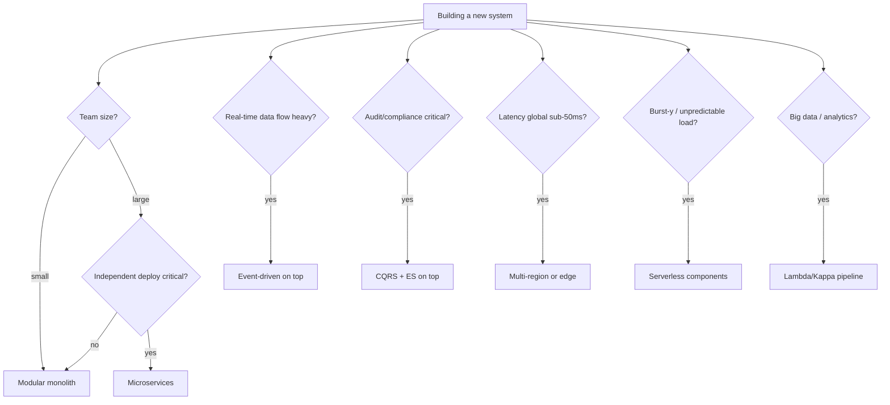

# Architecture Styles Comparison Matrix

A side-by-side reference for the major architectural styles. Use this to quickly compare options before going deep on the right one. Each row is a well-known style; columns capture the dimensions that typically drive decisions.

---

## The matrix

| Style | Deploy unit | State boundary | Coupling | Best fit | Page |
|---|---|---|---|---|---|
| Layered / N-Tier | One | Shared DB | High between layers | Traditional CRUD apps | [→](layered-architecture.md) |
| Monolith (single-process) | One | Single DB | High internally | Small teams, early product | [→](monolith-vs-microservices.md) |
| Modular Monolith | One | Schema per module | Low between modules | Mid-size teams, single product | [→](modular-monolith.md) |
| SOA | Several services | Per service or shared | Medium | Enterprise integration | [→](soa.md) |
| Microservices | Many services | Per service | Low (network) | Large teams, polyglot | [→](monolith-vs-microservices.md) |
| Hexagonal / Clean | Style of any deploy | Determined by host | Low (ports/adapters) | Domains needing isolation | [→](hexagonal.md) |
| Event-Driven | Many | Per service + event store | Loose (async events) | High-fan-out, async flows | [→](event-driven.md) |
| Serverless | Functions | Per function or via DB | Low | Burst workloads, tiny ops | [→](serverless.md) |
| Pipes & Filters | Many filters | Per filter or none | Linear chain | ETL, stream processing | [→](pipes-and-filters.md) |
| Space-Based | Many PUs + grid | In-memory grid | Tight (co-located) | Ultra-high throughput | [→](space-based.md) |
| CQRS + ES | Style atop above | Event store + projections | Loose | Audit-heavy, complex domain | [→](cqrs-event-sourcing-architecture.md) |
| Multi-Region | Topology atop above | Replicated globally | Geographic | Global low-latency, DR | [→](multi-region.md) |
| Edge | Compute at CDN edges | Global state | Geographic | Latency-sensitive global | [→](edge-architecture.md) |
| Lambda / Kappa | Batch + stream / stream-only | Combined or single | Event-flow | Big data analytics | [→](lambda-kappa-architectures.md) |
| Data Mesh | Domain-owned data products | Federated data | Domain-bounded | Large data orgs | [→](data-mesh.md) |

---

## Decision matrix by dimension

### Team size

| Team | Recommended start |
|---|---|
| 1-5 engineers | Monolith or modular monolith |
| 5-20 engineers | Modular monolith |
| 20-50 engineers | Modular monolith → split high-pressure modules |
| 50-200 engineers | Microservices around bounded contexts |
| 200+ engineers | Microservices + platform layer + domain teams |

Team structure constrains architecture (Conway's Law). Don't impose microservices on a team that can't operate them; don't bottleneck a 100-engineer team on one codebase.

### Latency requirements

| Latency target | Implies |
|---|---|
| < 100 ms (region) | Standard cloud architecture; optimise DB and caching |
| < 50 ms (region) | Aggressive caching; co-located compute |
| < 20 ms (global) | Multi-region; edge compute |
| < 5 ms | Space-based; in-memory grid; possibly custom hardware |
| < 1 ms | Specialised stack; not a generalist's problem |

### Scale axes

| Scaling need | Style |
|---|---|
| Read scaling | Read replicas; caching; CQRS read side |
| Write scaling | Sharding; CQRS write side; event sourcing |
| Storage scaling | Sharding; tiered storage; data mesh |
| User-base scaling | Multi-region; edge |
| Throughput at peak | Async; queues; space-based |

### Consistency needs

| Consistency | Architecture |
|---|---|
| Strong, single-region | Standard relational; modular monolith with one DB |
| Strong, multi-region | NewSQL (Spanner, Cockroach); higher cost |
| Eventual, multi-service | Event-driven; sagas; CQRS |
| Mixed (per use case) | Polyglot persistence; bounded contexts |

### Operational maturity

| Team capacity | Architecture |
|---|---|
| Limited ops | Monolith on managed services / serverless |
| Moderate | Modular monolith; managed databases |
| Strong DevOps | Microservices on K8s |
| Platform-level | Service mesh; multi-region; advanced GitOps |

You can't operate what you can't operate. Architecture choices buy or burn ops capacity.

### Audit / regulatory

| Need | Implication |
|---|---|
| Audit trail | Event sourcing or comprehensive logging |
| Time travel | Event sourcing |
| Right to deletion (GDPR) | Crypto-shredding; cellular data structures |
| Region isolation | Multi-region with regional data residency |
| Strict consistency | Avoid eventual consistency in compliance-critical paths |

---

## Quick decision flow



These styles compose. A typical mature system is **modular monolith or microservices** + **event-driven for inter-service** + **CQRS for hot read paths** + **multi-region for availability**. They're not mutually exclusive.

---

## Common combinations

### "Modern startup"

```
Modular monolith
  + managed Postgres + Redis
  + event publishing for async work (SQS or Kafka)
  + serverless for cron / one-offs
  + single region with backups elsewhere
```

Boring, ships fast, scales to millions of users with care.

### "Mid-stage SaaS"

```
Splitting modular monolith into 3-5 services
  + event-driven between services (Kafka)
  + CQRS in the high-traffic context
  + read replicas for reporting
  + multi-AZ within one region
  + auto-scaling
```

### "Large e-commerce"

```
Microservices around bounded contexts (orders, payments, inventory, ...)
  + event-driven backbone (Kafka)
  + CQRS + ES in core domains (orders)
  + multi-region active-active for global users
  + edge compute for catalog browsing
  + lambda architecture for analytics
  + data mesh for cross-domain analytics
```

The complexity is real and proportional to the scale and team size.

### "Real-time bidding / trading"

```
Space-based architecture for the hot path
  + event sourcing for audit
  + CQRS for query side
  + colocated compute and data
  + custom hardware in some hops
```

These are specialised problems that justify specialised architecture.

---

## Anti-combinations

Don't combine styles that fight each other:

| Combination | Problem |
|---|---|
| Microservices + shared database | Defeats the point — coupling at the data layer |
| Event-driven + synchronous request chains | Network call latency on every event |
| CQRS + small simple domain | Massive complexity for no benefit |
| Multi-region + chatty microservices | Cross-region latency on every call |
| Serverless + long-running stateful work | Function timeouts and cold starts |
| Edge compute + complex business logic | Edge runtimes have constraints; keep edge thin |

---

## When in doubt

Default to **modular monolith with event publication for async work**. It's:

- Simple to build
- Simple to operate
- Easy to evolve incrementally
- Cheap at small scale
- Convertible to microservices if needed

You can't go wrong with this for most products under ~50 engineers. The architectures up the ladder buy specific properties (independent deploys, multi-region, ultra-low latency); only adopt them when you need that property.

---

## Migration paths

Most architectures have natural successors when they outgrow:

```
Monolith → Modular monolith       (introduce module boundaries)
Modular monolith → Microservices  (split modules into services)
Microservices → +event-driven     (add async backbone)
Single region → Multi-region      (add replication, regional routing)
Synchronous → CQRS                (split read scaling from write)
```

Each step is its own months-to-years journey. Plan one step ahead, not three.

---

## Interview angle

!!! tip "What interviewers are testing"
    Whether you can talk about styles as trade-offs, not just name them.

**Strong answer pattern:**
1. Architecture is a multi-axis trade-off (team size, latency, consistency, ops, cost)
2. Default for most: modular monolith → event-driven → microservices as you outgrow
3. Specialised styles (space-based, edge, CQRS+ES) for specialised needs
4. Styles compose: most real systems blend several
5. Migration paths matter — pick something that can grow with you

**Common follow-up:** *"You're advising a 10-person startup. They want microservices. What do you say?"*
> Ask what problem they're solving with microservices. Independence, scaling, and team autonomy are the real benefits — and they don't pay off for a 10-person team. The cost (operational overhead, distributed-systems complexity) is paid immediately. Recommend a modular monolith with clear boundaries that can be split later. Explain that "you can always split a modular monolith; you can rarely un-split microservices." If they still want microservices for non-technical reasons, push back politely.

---

## Related topics

- All linked architecture pages
- [ADRs](adrs.md) — record which style each system uses and why
- [Quality Attributes](quality-attributes.md) — drives style choice
- [Capacity Planning](capacity-planning.md) — sizes the chosen style
