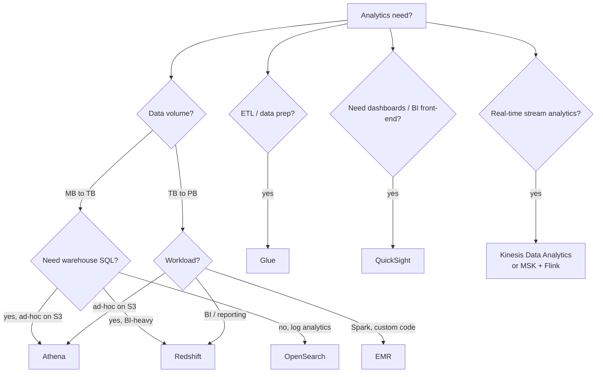

---
tags:
  - aws-native
  - applied
---

# AWS Analytics Picker

Athena, Redshift, EMR, Glue, OpenSearch, QuickSight — each fits a different point in the analytics pipeline. Picking wrong leads to expensive bills or impossible workloads.

For the *concept* of each, see [AWS Storage & Databases](storage-databases.md). This page is for **deciding**.

---

## Quick decision tree



---

## Side-by-side

| Service | Type | Best for | Cost model |
|---|---|---|---|
| **Athena** | Serverless SQL on S3 | Ad-hoc queries, log analysis | Per query ($5/TB scanned) |
| **Redshift** | Columnar warehouse | BI, large aggregations, dashboards | Per node-hour |
| **Redshift Serverless** | Auto-scaled Redshift | Variable workloads | Per RPU-second |
| **EMR** | Managed Spark / Hadoop | Custom data processing, ML pipelines | Per node-hour |
| **EMR Serverless** | Auto-scaled EMR | Variable Spark jobs | Per vCPU-second |
| **Glue** | Serverless ETL + catalog | Data prep pipelines | Per DPU-hour |
| **OpenSearch** | Search + log analytics | Logs, real-time search | Per node-hour |
| **QuickSight** | BI dashboards | Visualisation layer | Per user / per session |
| **Kinesis Data Analytics** | Stream SQL / Flink | Real-time aggregations | Per KPU-hour |
| **Lake Formation** | Data lake governance | Permission layer for S3 data | Free (uses underlying services) |
| **DataZone** | Data catalog / governance | Enterprise data discovery | Per user |

---

## When to use each

### Athena

```
✓ Ad-hoc queries on data already in S3 (parquet, CSV, JSON, ORC)
✓ Pay-per-query — no infra
✓ Engineering team that knows SQL
✓ Data lake architecture
✓ Sporadic queries, not 24/7 BI

✗ High-frequency dashboards (cost adds up; use Redshift)
✗ Sub-second response (Athena ~1-10s typical)
✗ Complex multi-step queries needing intermediate results
```

Cost: $5 per TB scanned. Use Parquet + partitioning to keep scan size low.

### Redshift

```
✓ BI dashboards needing fast aggregates
✓ Joins across many large tables
✓ Star/snowflake schemas
✓ Familiar SQL for analysts
✓ Frequent queries on the same dataset

✗ Sporadic / unpredictable workloads (use Athena or Serverless)
✗ Tiny datasets (overkill; use Postgres)
✗ Source-of-truth for transactional data (use RDS / Aurora)
```

Use **RA3 nodes** (decoupled storage from compute) for cost efficiency.

### Redshift Serverless

```
✓ Variable load (dev/staging, occasional big queries)
✓ Don't want to manage node sizing
✓ Per-second billing fits

✗ Sustained heavy use (provisioned cheaper)
```

### EMR

```
✓ Spark workloads (data prep, ML pipelines, custom transforms)
✓ Hadoop ecosystem (Hive, HBase)
✓ Heavy ETL beyond what Glue covers
✓ Need cluster lifecycle control

✗ Want fully managed without thinking about Spark configs (try Glue)
✗ One-off batch (Glue might be simpler)
```

EMR on EKS / EMR Serverless are newer; less ops overhead.

### Glue

```
✓ Lift-and-shift ETL (S3 → transform → S3 or Redshift)
✓ Data catalog (used by Athena, Redshift Spectrum)
✓ Crawlers detect schema in S3
✓ Visual ETL via Glue Studio

✗ Custom Spark code at huge scale (use EMR)
✗ Real-time / streaming ETL (Kinesis Analytics, Flink on EKS)
```

### OpenSearch

```
✓ Log analytics (CloudWatch Logs → OpenSearch)
✓ Full-text search across documents
✓ Real-time search-as-you-type
✓ Faceted exploration

✗ Long-term archive (use S3, query with Athena)
✗ Heavy aggregations (Redshift is faster for analytics)
✗ Source of truth (eventual consistency)
```

### QuickSight

```
✓ BI dashboards on Redshift, RDS, Athena, S3, etc.
✓ Per-user or per-session pricing
✓ Embedded dashboards in your product
✓ Want managed BI without Tableau / Looker pricing

✗ Heavy customisation / custom visuals (Looker, Tableau)
✗ Complex DAX-like calculated fields (Power BI)
```

### Kinesis Data Analytics (now Apache Flink on AWS)

```
✓ Real-time aggregations (last 5 min, sliding windows)
✓ Streaming joins
✓ Sub-second to seconds latency
✓ Flink SQL or Flink Java/Python

✗ Batch / historical reanalysis (use EMR / Glue)
```

---

## Lakehouse pattern (the modern default)

```
Raw data → S3 (parquet)
              │
              ├─► Athena: ad-hoc SQL (engineers)
              ├─► Redshift Spectrum: BI on a subset
              ├─► EMR / Glue: heavy transformations
              ├─► OpenSearch: text/log search
              └─► QuickSight: dashboards (via Redshift/Athena)
              
S3 is the source of truth. Different engines query the same data.
```

This is the de-facto modern shape. Open formats (Parquet, Iceberg, Delta) + S3 + multiple query engines.

---

## Cost shape

For "small startup analytics" (10GB data, occasional queries):

```
Athena:                ~$5-50/month (pay per query, small datasets cheap)
Redshift Serverless:   ~$50-200/month (pay per RPU-second)
Redshift provisioned:  ~$200+/month (smallest cluster)
QuickSight:            $9-18/user/month
```

For "mid-stage analytics" (1TB, daily BI):

```
Athena (well-optimised, partitioned parquet): ~$100-300/month
Redshift RA3 cluster:                          ~$700-2K/month
Snowflake equivalent:                          ~$500-1.5K/month
```

For "large analytics" (50TB+, 24/7 BI):

```
Redshift provisioned with concurrency scaling: ~$5K-30K/month
Athena (with caveats):                         can spike; less predictable
```

---

## Common mistakes

| Mistake | Better choice |
|---|---|
| Using Redshift for 1GB of data | Athena or Postgres |
| Using Athena for high-frequency dashboards | Redshift (predictable cost) |
| Running EMR for ad-hoc queries | Athena |
| Keeping all data in OpenSearch | S3 lifecycle + Athena for old data |
| Forgetting to partition S3 data | Athena scan costs balloon |
| Using CSV in S3 for analytics | Convert to Parquet (10× faster, 5× cheaper) |
| Manually running ETL with Lambda | Glue or Step Functions |
| QuickSight with row-level security on millions of rows | Pre-aggregate or use a dedicated BI tool |

---

## Patterns

### Pattern 1: Operational analytics (ELT)

```
OLTP (Postgres / DynamoDB) → CDC (DMS / Debezium) → S3 (parquet)
                                                       ↓
                                              Glue catalog → Athena / Redshift Spectrum
                                                       ↓
                                                  QuickSight dashboards
```

### Pattern 2: Real-time + batch (lambda-ish)

```
Events → Kinesis → Kinesis Analytics (Flink) → real-time aggregates → Redis / DynamoDB
                                              → also writes to S3
                                                       ↓
                                                  Daily batch (Athena / EMR) → corrected aggregates
```

### Pattern 3: Search-driven analytics

```
App logs → Kinesis Firehose → OpenSearch (hot tier, 30 days)
                            → S3 (cold, infinite)
                            
Recent logs: query OpenSearch
Old logs: query S3 with Athena
```

### Pattern 4: ML feature pipeline

```
Raw data in S3 → Glue / EMR (transform features) → SageMaker training
                                                  → Feature Store (real-time inference)
```

---

## Decision matrix

| Need | Service |
|---|---|
| Ad-hoc SQL on S3 | Athena |
| BI dashboards on big data | Redshift |
| Variable analytics workload | Redshift Serverless or Athena |
| Spark / custom ETL | EMR |
| Visual ETL pipeline | Glue |
| Log analytics + search | OpenSearch |
| Dashboard layer | QuickSight |
| Real-time aggregations | Kinesis Data Analytics / Flink |
| Data lake governance | Lake Formation |
| Enterprise data catalog | DataZone or Glue catalog |

---

## Related

- [AWS Storage & Databases concept page](storage-databases.md)
- [Data Warehousing](../storage/data-warehousing.md)
- [Lambda & Kappa Architectures](../architecture/lambda-kappa-architectures.md)
- [Data Mesh](../architecture/data-mesh.md)
- [Practical Examples — Data Processing](../examples/data-processing.md)
