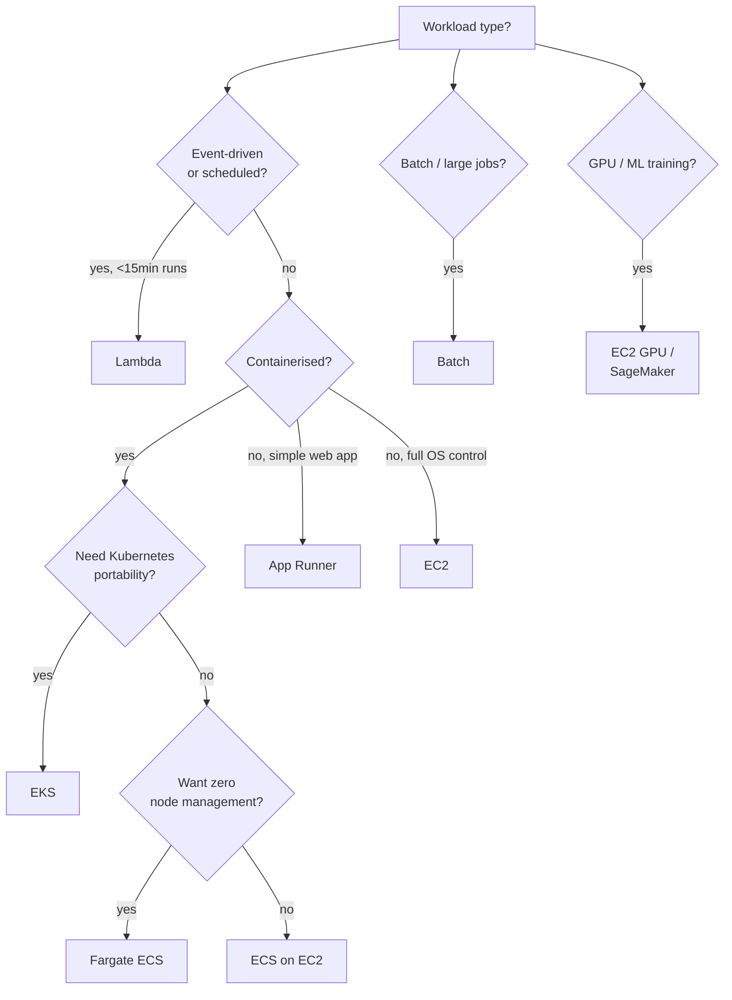

---
tags:
  - aws-native
  - applied
---

# AWS Compute Picker

Pick the right AWS compute service for the workload. EC2, ECS, Fargate, EKS, Lambda, App Runner, Batch — each fits a different shape of work.

For the *concept* of each, see [AWS Compute](compute.md). This page is for **deciding**.

---

## Quick decision tree



---

## Side-by-side

| Service | Mental model | Cold start | Max runtime | Best for |
|---|---|---|---|---|
| **Lambda** | Function as a service | ~100ms-2s | 15 min | Event-driven, APIs, cron, glue code |
| **App Runner** | "Heroku for AWS" | None | Unlimited | Single-app web service, no infra fuss |
| **Fargate** (ECS/EKS) | Serverless containers | ~30s-2min | Unlimited | Containers without managing nodes |
| **ECS on EC2** | Container orchestration | None | Unlimited | Containers with cost optimization + control |
| **EKS** | Managed Kubernetes | None | Unlimited | K8s portability, multi-cloud, polyglot |
| **EC2** | Virtual machines | Minutes | Unlimited | Full OS control, custom networking, GPU |
| **Batch** | Batch job runner | Minutes | Unlimited | ML training, video transcoding, scientific |
| **Lightsail** | "VPS for AWS" | None | Unlimited | Tiny apps, prototypes, dev tools |

---

## When to use each — concrete signals

### Lambda

```
✓ Event triggers (S3 upload, DynamoDB stream, EventBridge, API Gateway)
✓ Short execution (<15 min total)
✓ Idle most of the time; spiky traffic OK
✓ No persistent connections (limited)
✓ Pay-per-request feels right for this workload

✗ Long-running processing (>15 min)
✗ Sustained high QPS (cost blows up vs Fargate/EC2)
✗ Heavy ML model loading (cold start penalty per cold container)
✗ WebSocket server (API Gateway WebSockets exists but limited)
```

Cost intuition: ~$0.20 per million 100ms invocations + $0.00001/request. Cheap for spiky; expensive at 1000 req/s sustained.

### App Runner

```
✓ Single Docker container, HTTP-only
✓ Want minimum operational overhead
✓ Don't care about cost optimization
✓ <100 req/s typical traffic

✗ Multi-container apps
✗ Cost-sensitive at scale (~2× ECS+ALB)
✗ Need custom networking, VPC integration
```

### Fargate (ECS or EKS)

```
✓ Containerised, but don't want to manage EC2 nodes
✓ Variable traffic with auto-scaling
✓ Standard web services, APIs, workers
✓ Want pay-per-task, not pay-per-instance

✗ Cost optimization is critical (~50% pricier than EC2)
✓ Trade-off: pay more, ops less
```

### ECS on EC2

```
✓ Containers + cost matters
✓ Predictable baseline traffic
✓ Want spot instances for cheap compute
✓ Can manage node capacity, AMI updates

✗ Bursty traffic patterns (Fargate better)
✗ Small team without ops capacity
```

### EKS

```
✓ Multi-cloud portability (K8s anywhere)
✓ Existing K8s investment
✓ Polyglot, complex service graph
✓ Need K8s-specific features (operators, CRDs, mesh)

✗ Small team (~5 engineers) — operational overhead is real
✗ Single-app deployment — overkill
✗ Cost-conscious — EKS control plane ~$73/month + nodes
```

### EC2

```
✓ Need a specific OS, kernel, or networking config
✓ GPU workloads
✓ Heavy stateful workloads (databases, queues)
✓ Custom hardware requirements
✓ Hybrid (Outposts, Direct Connect)

✗ Stateless web services (use higher-level)
✗ Don't want to patch / update OS
```

### Batch

```
✓ ML training jobs
✓ Video / image transcoding
✓ Genomics, simulations, scientific
✓ Need spot for cost; AWS Batch handles interruptions

✗ Real-time / synchronous work
```

---

## Cost shape comparison

Rough monthly cost for a "small web service" (1 vCPU, 2GB, 100M req/month):

```
Lambda:       $20-50/month     (only pay for invocations)
App Runner:   ~$60/month       (instance is on, dev/prod combined)
Fargate:      ~$45/month       (task is on; auto-scale to 0 possible)
ECS on EC2:   ~$25/month       (t3.small reserved; you manage)
EC2:          ~$15-30/month    (t3.small spot or reserved)
EKS:          $73 (cluster) + nodes
```

For a "large web service" (100K req/s, multi-AZ):

```
Lambda:       $5K-10K/month    (cost-prohibitive at this QPS)
ECS Fargate:  $3K-5K/month     (10-20 tasks running)
ECS on EC2:   $1.5K-3K/month   (with spot/reserved mix)
EKS:          $2K-4K/month     (varies by node strategy)
```

Lambda's "pay per invocation" gets expensive past ~1000 req/s sustained. Container services get cheaper.

---

## Common mistakes

| Mistake | Better choice |
|---|---|
| Using Lambda for 24/7 high-throughput API | ECS/Fargate or EKS |
| Using EKS for 1 small service | Fargate or App Runner |
| Using EC2 with manual install for a Docker app | ECS Fargate |
| Using Lambda + RDS without Lambda RDS proxy | RDS Proxy or different compute |
| App Runner for a multi-tenant SaaS at scale | ECS Fargate (more control) |
| Fargate for a $20/month dev environment | Lambda or App Runner |

---

## Migration paths

Common evolutions:

```
Lightsail / single EC2 → App Runner → ECS Fargate → EKS
                                    ↘ ECS on EC2 (cost-optimised)

Lambda (early stage) → Fargate (when traffic sustained)
                     → keep Lambda for spiky / event-driven parts
```

Don't over-engineer day-1. Start higher up the stack (Lambda, App Runner, Fargate), drop down when constraints demand it.

---

## Related

- [AWS Compute concept page](compute.md) — depth on each service
- [Containers & Docker](../infrastructure/containers.md) — what runs in these services
- [Kubernetes](../infrastructure/kubernetes.md) — EKS context
- [Serverless Architecture](../architecture/serverless.md) — Lambda fits this style
- [Decision Flowcharts](../reference/decision-flowcharts.md) — broader architectural decisions
