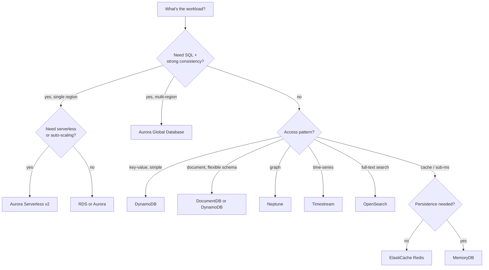

---
tags:
  - aws-native
  - applied
---

# AWS Database Picker

Pick the right AWS database for the workload. RDS, Aurora, DynamoDB, DocumentDB, Neptune, Timestream, OpenSearch, ElastiCache, MemoryDB — each fits a specific access pattern.

For the *concept* of each, see [AWS Storage & Databases](storage-databases.md). This page is for **deciding**.

---

## Quick decision tree



---

## Side-by-side

| Service | Type | Consistency | Best for |
|---|---|---|---|
| **RDS** | Managed Postgres/MySQL/etc. | Strong, single-region | Default OLTP database |
| **Aurora** | Managed Postgres/MySQL, AWS-tuned | Strong, single-region | Higher throughput than RDS, same APIs |
| **Aurora Serverless v2** | Aurora with auto-scaling capacity | Strong | Variable workloads, dev/test |
| **Aurora Global** | Aurora with cross-region replicas | Eventual cross-region | Multi-region read scaling, DR |
| **DynamoDB** | Managed key-value / document | Eventual (default), strong on read | High-scale, predictable access patterns |
| **DocumentDB** | MongoDB-compatible | Strong, single-region | Existing MongoDB code |
| **Neptune** | Graph (RDF + Gremlin) | Strong | Social graphs, recommendation, fraud |
| **Timestream** | Time-series | Eventual | IoT, metrics, telemetry |
| **OpenSearch** | Search engine | Eventual | Full-text, log analytics |
| **ElastiCache** | Redis or Memcached | In-memory | Cache, sessions, rate limiting |
| **MemoryDB** | Redis with durability | Strong | In-memory + persistence (rare) |
| **Redshift** | Columnar warehouse | Eventual | Analytics, BI, large aggregations |

---

## When to use each

### RDS (default for SQL)

```
✓ You need a relational database
✓ Standard Postgres/MySQL features and ecosystem
✓ Single-region OLTP
✓ Want managed backups, patching, failover
✓ Up to ~50K transactions/sec on largest instances

✗ Multi-region writes (use Aurora Global, with caveats)
✗ Need 100K+ TPS sustained (consider sharding, Aurora, NewSQL)
```

Default sizing: `db.t3.medium` for dev, `db.r6g.large` for prod start.

### Aurora

```
✓ Same APIs as RDS Postgres/MySQL, faster
✓ Up to 15 read replicas with low replica lag
✓ Storage auto-grows (no manual disk management)
✓ Better failover than RDS

✗ More expensive than RDS at small scale
✗ AWS-only (not portable to standard Postgres without effort)
```

### Aurora Serverless v2

```
✓ Variable / unpredictable load
✓ Dev/staging that idles overnight
✓ Multi-tenant SaaS where one DB per tenant scales independently
✓ "Pay for what you use" billing fits

✗ Steady-state predictable load (provisioned is cheaper)
```

### DynamoDB

```
✓ Single-key or simple-key access patterns
✓ Need >100K writes/sec at scale
✓ Want serverless, no instances
✓ Multi-region active-active (Global Tables) — single-table design
✓ Predictable < 10ms latency

✗ Complex queries with multiple filters
✗ JOINs across tables (no JOINs in DynamoDB)
✗ Ad-hoc reporting (need to export to warehouse)
✗ Workloads you can't model into a key-pattern up-front
```

Cost: pay-per-request or provisioned. ~$0.25/M reads, $1.25/M writes on-demand.

### DocumentDB

```
✓ Existing MongoDB application; want managed
✓ Document model fits naturally

✗ Latest MongoDB features (DocumentDB lags real MongoDB)
✗ New projects — DynamoDB or Postgres are better defaults
```

### Neptune

```
✓ Social graph (followers, connections)
✓ Recommendation engines (graph traversal)
✓ Fraud detection (entity relationships)
✓ Knowledge graphs

✗ General data store (overkill)
```

### Timestream

```
✓ IoT sensor data
✓ Server / app metrics
✓ Time-series queries (last hour, last day rollups)
✓ Auto-tiering (recent → memory; old → SSD)

✗ General OLTP
✗ Non-temporal data
```

### OpenSearch

```
✓ Full-text search across documents
✓ Log analytics (with OpenSearch Dashboards)
✓ Faceted search, fuzzy matching, ranking
✓ Real-time analytics on streaming data

✗ Source of truth (don't make it the only copy)
✗ Strong consistency required
```

### ElastiCache (Redis)

```
✓ Cache layer in front of DB
✓ Session storage
✓ Rate limiting counters
✓ Pub/Sub between services
✓ Sorted sets (leaderboards, timelines)

✗ Source of truth (data can be lost on failure unless MemoryDB)
✗ Sub-ms latency requirement and >1GB data — sharding required
```

### MemoryDB

```
✓ Redis API + durability guarantees
✓ Use case where losing in-memory data is not acceptable

✗ Cost-sensitive (much more than ElastiCache)
```

### Redshift

```
✓ Analytics on TBs to PBs
✓ Complex aggregations and joins for BI
✓ Familiar SQL interface for analysts

✗ OLTP (use RDS / Aurora)
✗ Real-time analytics (~minutes lag in many setups)
```

---

## Cost shape comparison

Rough monthly cost for "small SaaS DB tier":

```
RDS Postgres r6g.large + 100GB:   ~$190/month
Aurora Postgres equivalent:        ~$300/month (more for storage IOs)
Aurora Serverless v2 (modest):     ~$150-300/month (varies with usage)
DynamoDB on-demand, 1M req/day:    ~$50/month
ElastiCache cache.r6g.large:       ~$140/month
OpenSearch t3.medium × 3:          ~$150/month
```

"Big SaaS / mid-stage" (~$1M ARR):

```
RDS multi-AZ + 2 replicas (r6g.xlarge):  ~$1200/month
Aurora with 3 replicas:                   ~$1500/month
DynamoDB 100M req/day:                    ~$200/month (incredibly cheap at scale for key-value)
ElastiCache cluster mode (10 nodes):      ~$2K/month
OpenSearch (3 dedicated masters + 5 data): ~$2K/month
```

---

## Common mistakes

| Mistake | Better choice |
|---|---|
| Using DynamoDB for ad-hoc queries / reporting | Postgres or warehouse |
| Using Postgres at 100K writes/sec | Sharding, Cassandra, or DynamoDB |
| Using OpenSearch as source of truth | Postgres + ES indexed via CDC |
| Using DocumentDB for new projects | DynamoDB or Postgres |
| Using ElastiCache for billing-sensitive data | MemoryDB or proper DB |
| Using Aurora Global for sync writes | Spanner / CockroachDB; Aurora Global is async |
| Using RDS for time-series at scale | Timestream or specialised TSDB |
| Picking Redshift for OLTP | RDS / Aurora |

---

## Migration paths

Common evolutions:

```
RDS → Aurora (same API, better scale, more replicas)
RDS → sharded RDS → DynamoDB (when access pattern fits and scale demands it)
RDS → CDC to OpenSearch (for search) + Redshift (for analytics)  ← typical CQRS shape
ElastiCache → MemoryDB (when durability matters)
```

Avoid: "rewrite everything in DynamoDB for scale." DynamoDB requires up-front access-pattern design; mid-migration discoveries are painful.

---

## Decision matrix by access pattern

| Access pattern | First choice | Second choice |
|---|---|---|
| Single-key lookup, ultra-low latency | DynamoDB or Redis | ElastiCache |
| Complex multi-table JOINs | RDS / Aurora | Postgres on EC2 |
| Full-text search across millions of docs | OpenSearch | Postgres pg_trgm (smaller scale) |
| Time-series metrics | Timestream | ClickHouse on EC2 |
| Graph queries (friend-of-friend) | Neptune | Postgres with adjacency lists |
| Append-only event log | DynamoDB or Kafka | EventStoreDB |
| Multi-region writes | Aurora Global (eventual) | DynamoDB Global Tables |
| Multi-region writes, strong consistency | (not on AWS easily) | Spanner on GCP |
| Caching | ElastiCache Redis | DAX (DynamoDB-specific) |
| Analytics / BI | Redshift | Athena on S3 + Glue |

---

## Related

- [AWS Storage & Databases concept page](storage-databases.md)
- [SQL vs NoSQL](../storage/sql-vs-nosql.md) — broader picking criteria
- [Storage section](../storage/index.md) — depth on each database type
- [Caching](../caching/index.md) — when and how to add caching
- [Decision Flowcharts](../reference/decision-flowcharts.md) — broader decisions
