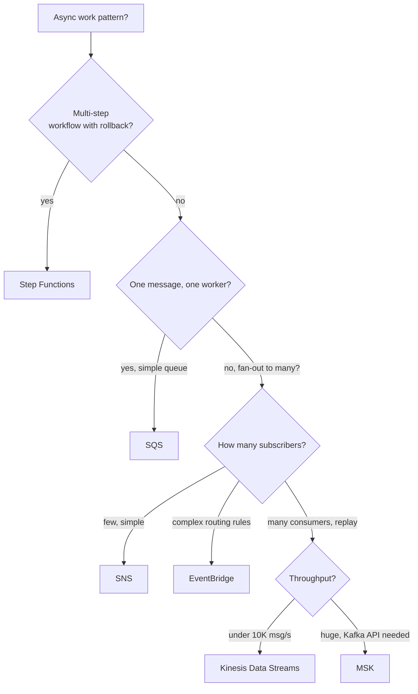

---
tags:
  - aws-native
  - applied
---

# AWS Messaging Picker

SQS, SNS, EventBridge, Kinesis, MSK (Kafka), Step Functions — each solves a different async messaging problem. Picking wrong leads to either over-engineering or hitting limits.

For the *concept* of each, see [AWS Messaging](messaging.md). This page is for **deciding**.

---

## Quick decision tree



---

## Side-by-side

| Service | Mental model | Throughput | Retention | Best for |
|---|---|---|---|---|
| **SQS** | Pull-based queue, one consumer | High | 14 days max | Background jobs, decoupling |
| **SNS** | Push fan-out to subscribers | High | None (not durable) | Simple fan-out, mobile push |
| **EventBridge** | Event router with rules | Moderate | None | Event-driven with filtering / routing |
| **Kinesis Data Streams** | Ordered log, replay-able | 1K records/sec/shard | 1-365 days | Streaming analytics, replay |
| **MSK (Kafka)** | Managed Kafka | Very high | Configurable | High-throughput streaming, Kafka API |
| **Step Functions** | State machine orchestrator | N/A | Hours-months | Multi-step workflows with state |
| **EventBridge Pipes** | Source → filter → enrich → target | N/A | N/A | "Stream tap" lightweight transformation |
| **SES** | Email | N/A | N/A | Transactional email |
| **MQ** | Managed RabbitMQ / ActiveMQ | Moderate | Days | Existing AMQP code; protocol portability |

---

## When to use each

### SQS

```
✓ Background work: emails, reports, batch processing
✓ Decouple producer from consumer (different rates OK)
✓ "At-least-once" delivery acceptable (use idempotent consumers)
✓ One message → one worker
✓ FIFO queues when ordering matters within a group

✗ Fan-out to many subscribers (SNS or EventBridge)
✗ Need replay / history (Kinesis / Kafka)
✗ Very high throughput (>3K req/s per queue) — use shards or Kafka
```

Cost: ~$0.40 per million requests. Cheap.

### SNS

```
✓ Topic with many subscribers (Lambda, SQS, HTTP, email, SMS, mobile push)
✓ Simple fan-out pattern
✓ No need for replay
✓ Push notifications to mobile

✗ Complex routing rules (use EventBridge)
✗ Want subscribers to consume at their own pace (use SQS as subscriber, or Kinesis)
✗ Need exactly-once (SNS is at-least-once)
```

Common pattern: SNS → SQS (per service). Each service has its own queue subscribed to the topic; pulls at its own pace.

### EventBridge

```
✓ Event-driven architecture with filtering
✓ Cross-account event routing
✓ Schedule + event triggers (replaces CloudWatch Events)
✓ Built-in AWS service event bus (S3 events, EC2 state changes)
✓ Schema Registry, payload transformation

✗ Very high throughput (>10K events/sec — consider Kinesis/MSK)
✗ Need replay (EventBridge isn't durable like Kinesis)
✗ Need ordered delivery
```

### Kinesis Data Streams

```
✓ Ordered, replay-able stream of records
✓ Multiple consumers, each maintains its own position
✓ Real-time analytics
✓ Up to 365-day retention
✓ Fits when "stream" makes more sense than "queue"

✗ Throughput beyond 1MB/s per shard (sharding ceiling)
✗ Want Kafka API and ecosystem
✗ Simple work queue (SQS is simpler)
```

Sibling services:
- **Kinesis Data Firehose**: streaming load to S3/Redshift/OpenSearch
- **Kinesis Data Analytics**: SQL on streams (limited; use Flink for complex)

### MSK (Managed Streaming for Kafka)

```
✓ Need Kafka API and ecosystem
✓ Very high throughput (100K+ msg/s)
✓ Existing Kafka code or team expertise
✓ Long retention with replay (weeks/months)
✓ Multi-consumer with consumer groups
✓ Connect ecosystem (CDC, sinks)

✗ Want fully managed without thinking (use Kinesis)
✗ Small workloads (~$200/month minimum just for cluster)
```

MSK Serverless is a recent option for variable workloads.

### Step Functions

```
✓ Multi-step workflow with explicit states
✓ Need visual workflow diagram
✓ Long-running (hours to days OK)
✓ Compensating actions on failure
✓ Human approval steps
✓ Mix of AWS services (Lambda, ECS, Glue, SageMaker)

✗ Simple async (use SQS + Lambda)
✗ Very high frequency (Step Functions Standard ~$0.025 per 1K transitions adds up)
```

Use **Express Workflows** for high-frequency short workflows; **Standard** for long-running.

### EventBridge Pipes

```
✓ Connect a source (DynamoDB Stream, Kinesis) to a target (Lambda, Step Functions, etc.)
✓ Need filtering / enrichment in between
✓ Light "stream tap" pattern

✗ Heavy stream processing (use Flink / Kafka Streams)
```

---

## Common patterns

### Pattern 1: Decoupled background jobs

```
API → SQS → Lambda or ECS task
                 ↓
              processes job
              retries on failure
              DLQ after N attempts
```

Use for: emails, report generation, image processing, async API responses.

### Pattern 2: Fan-out to many services

```
Event source (S3 upload, DB change) → SNS topic
                                          │
                                          ├─► SQS queue → Service A
                                          ├─► SQS queue → Service B
                                          └─► Lambda → Service C
```

Each subscriber processes at its own pace. SQS in between provides per-service durability.

### Pattern 3: Event-driven with rules

```
Producers → EventBridge bus
                   │
                   ├─[rule: order > $1000]─► high-value-orders Lambda
                   ├─[rule: order.status = cancelled]─► cancellation processor
                   └─[rule: source = mobile]─► mobile-analytics
```

EventBridge routes based on content. No code change in producers when adding subscribers.

### Pattern 4: Streaming pipeline

```
Producer → Kinesis Data Streams → Flink / KCL → Output (S3, DynamoDB, OpenSearch)
                                              ↘ Lambda
                                              ↘ another stream
```

Multiple consumers, each at own pace. Replay for new analytics jobs.

### Pattern 5: Multi-step workflow

```
Trigger → Step Functions state machine:
  1. Lambda: validate
  2. Wait for approval (SNS to human; resume on response)
  3. ECS task: process
  4. On failure: compensate
  5. SES: notify
```

Visible, retryable, persistable. The right answer when "do A, then B, then C" with errors needing rollback.

---

## Cost shape

```
SQS:                  $0.40 / 1M req
SNS:                  $0.50 / 1M publishes; first 1M free monthly
EventBridge:          $1.00 / 1M events on custom bus; AWS bus mostly free
Kinesis Streams:      $0.015/shard-hour + $0.014 / 1M PUT records
MSK:                  ~$200+/month minimum (3-broker dev cluster)
Step Functions:       $25 / 1M state transitions (Standard); $1 (Express)
```

SQS and SNS are very cheap; MSK has a high minimum but is cheap per-byte at scale.

---

## Common mistakes

| Mistake | Better choice |
|---|---|
| Using Kinesis when SQS is enough | SQS (simpler, cheaper, less to operate) |
| Using SNS without SQS-in-between for downstream services | SNS → SQS → service (per-service durability) |
| Using EventBridge for high-throughput streaming | Kinesis or MSK |
| Using SQS for fan-out to 5 services | SNS → 5 SQS queues |
| Using Step Functions for a 2-step workflow | SQS + Lambda |
| Using Step Functions Standard for high-frequency loops | Express Workflows |
| Using Kafka (MSK) for low-volume work | Kinesis or SQS |
| Forgetting DLQ on SQS | Always configure DLQ with maxReceiveCount |

---

## Decision matrix

| Need | Service |
|---|---|
| One producer → one worker | SQS |
| One producer → many subscribers, simple | SNS |
| One producer → many subscribers, routing rules | EventBridge |
| Stream with replay, ordered | Kinesis Data Streams |
| Kafka API + huge scale | MSK |
| Multi-step workflow with state | Step Functions |
| Email | SES |
| RabbitMQ / AMQP code | MQ |
| Stream → simple transform → target | EventBridge Pipes |
| Schedule (cron-like) | EventBridge Scheduler |

---

## Related

- [AWS Messaging concept page](messaging.md)
- [Message Queues](../messaging/message-queues.md)
- [Pub/Sub](../messaging/pub-sub.md)
- [Event Streaming](../messaging/event-streaming.md)
- [Kafka Deep Dive](../messaging/kafka.md)
- [Choreography vs Orchestration](../architecture/choreography-vs-orchestration.md)
