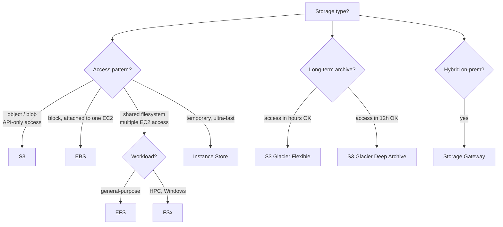

---
tags:
  - aws-native
  - applied
---

# AWS Storage Picker

S3, EBS, EFS, FSx, Instance Store, Storage Gateway, Backup — each solves a different storage need. The decision is usually between **block, file, object, and archive**.

For the *concept* of each, see [AWS Storage & Databases](storage-databases.md). This page is for **deciding**.

---

## Quick decision tree



---

## Side-by-side

| Service | Type | Use case | Latency | Cost |
|---|---|---|---|---|
| **S3 Standard** | Object | Application files, backups, data lake | ~30-100ms | $0.023/GB-month |
| **S3 IA** | Object, infrequent access | Cold-ish data | ~30-100ms | $0.0125/GB-month |
| **S3 Glacier Instant** | Object, archive with instant retrieval | Compliance archives | ~30-100ms | $0.004/GB-month |
| **S3 Glacier Flexible** | Object, archive | Backups, rarely accessed | minutes-hours | $0.0036/GB-month |
| **S3 Glacier Deep** | Object, deep archive | 7+ year retention | hours-12h | $0.00099/GB-month |
| **EBS gp3** | Block, attached to EC2 | EC2 root + data | sub-ms | $0.08/GB-month |
| **EBS io2** | Block, high IOPS | Database | sub-ms | $0.125/GB-month + IOPS |
| **EBS st1** | Block, throughput-optimised | Big sequential workloads | ms | $0.045/GB-month |
| **EBS sc1** | Block, cold | Infrequently accessed | ms | $0.015/GB-month |
| **EFS** | NFS file system | Shared file across EC2 | ms | $0.30/GB-month |
| **FSx for Lustre** | HPC parallel filesystem | ML training, HPC | sub-ms | varies |
| **FSx for Windows** | SMB / Windows file | Windows apps, AD | ms | varies |
| **FSx for NetApp ONTAP** | Enterprise NAS | Enterprise migration | ms | varies |
| **Instance Store** | NVMe SSD on EC2 | Ephemeral, ultra-fast | sub-ms | included in EC2 |

---

## When to use each

### S3 (the default for "store this")

```
✓ Application files (uploaded images, documents, PDFs)
✓ Static website hosting
✓ Backups, logs
✓ Data lake for analytics
✓ ML training data
✓ Lifecycle: hot → IA → Glacier automatically
✓ Versioning, presigned URLs, S3 Object Lock for compliance

✗ Filesystem semantics (mkdir, rename) — use EFS
✗ Block-level access (e.g., DB on top) — use EBS
✗ Frequent small reads (POSIX-y access) — use EFS
```

S3 is the default for almost all file storage. Cheap, durable (11 nines), reachable from anywhere.

### EBS (block storage for EC2)

```
✓ EC2 instance root volume
✓ Database storage (RDS, self-managed Postgres on EC2)
✓ Single-instance access (one EC2 mounts the volume)
✓ Need sub-ms latency
✓ Choose type by workload: gp3 default, io2 for high IOPS, st1 for big sequential

✗ Shared across multiple EC2 (use EFS) — EBS Multi-Attach exists but limited
✗ Containers without persistent state (use ephemeral storage)
```

`gp3` is the default — newer, cheaper, more flexible than `gp2`.

### EFS (shared NFS filesystem)

```
✓ Multiple EC2 / ECS / Lambda containers need the same files
✓ CMS uploads, shared logs, ML training data shared across workers
✓ Want auto-scaling capacity, no provisioning
✓ POSIX filesystem semantics

✗ Single-instance use (EBS is cheaper, faster)
✗ Very small files at high QPS (EFS has per-op latency)
✗ Replace S3 for blob storage — EFS is 10× the cost
```

### FSx for Lustre

```
✓ ML training, HPC simulation
✓ Need parallel filesystem performance
✓ Often backed by S3 (lazy-load training data from S3 to Lustre)

✗ General-purpose shared filesystem (use EFS)
```

### FSx for Windows / ONTAP

```
✓ Lift-and-shift Windows apps needing SMB
✓ Active Directory integration
✓ Enterprise NAS (ONTAP) migration

✗ Linux workloads (use EFS)
```

### Instance Store

```
✓ Temporary scratch space
✓ Cache that can be lost on instance termination
✓ Sub-ms latency required, can't afford EBS RTT
✓ Database temp tables, build artifacts, ML inference cache

✗ Anything that must survive instance restart (Instance Store is ephemeral)
```

### Storage Gateway

```
✓ Hybrid: on-prem servers accessing AWS storage via standard protocols
✓ Backup on-prem to AWS
✓ Tape replacement
✓ File Gateway: SMB/NFS access to S3 from on-prem

✗ Cloud-only workloads (use the native AWS service directly)
```

### S3 Glacier (archive)

```
✓ Compliance / legal retention (years)
✓ Backups you'll rarely need
✓ Photo / video archives
✓ Old logs

Tiers:
  Glacier Instant Retrieval: ~30ms, $0.004/GB
  Glacier Flexible Retrieval: minutes-hours, $0.0036/GB
  Glacier Deep Archive: hours, $0.00099/GB (cheapest)

✗ Frequently accessed data (retrieval cost adds up)
```

---

## S3 storage class lifecycle

Typical cost-optimisation:

```
Day 0:     S3 Standard (frequently accessed)
Day 30:    Transition to S3 Standard-IA (less frequent)
Day 90:    Transition to S3 Glacier Instant Retrieval
Day 180:   Transition to S3 Glacier Flexible
Day 365:   Transition to S3 Glacier Deep Archive
Day 2555:  Expire (delete after 7 years)
```

Use **S3 Intelligent-Tiering** for automatic transitions based on access patterns.

---

## Cost shape

Storing 10TB for a year:

| Storage | Cost |
|---|---|
| S3 Standard | $2,760 |
| S3 IA | $1,500 |
| S3 Glacier Instant | $480 |
| S3 Glacier Flexible | $432 |
| S3 Glacier Deep Archive | $120 |
| EBS gp3 | $9,600 (much more — block storage is expensive) |
| EFS | $36,000 (most expensive per GB) |

S3 is the cheapest by far for most use cases. EBS is expensive but needed for low-latency block access. EFS is 10× S3 — only use when filesystem semantics are needed.

---

## Common mistakes

| Mistake | Better choice |
|---|---|
| Using EBS for app file uploads | S3 with presigned URLs |
| Using EFS for static website assets | S3 + CloudFront |
| Keeping all S3 in Standard forever | Lifecycle to IA / Glacier |
| Using S3 for low-latency frequent reads | DynamoDB, ElastiCache, EBS |
| Single-AZ EFS (cheaper) for production data | Multi-AZ EFS (default for HA) |
| Forgetting S3 versioning + Object Lock for compliance | Enable from day-1 for sensitive data |
| Using FSx for general Linux file sharing | EFS |
| Manually copying old files to Glacier | S3 lifecycle policies (automatic) |

---

## Patterns

### Pattern 1: User uploads files

```
Client → presigned PUT URL → directly to S3
   App server doesn't proxy bytes
   App server only signs the URL (~1KB op)
```

### Pattern 2: ML training data pipeline

```
Source data (CSV, parquet) in S3 Standard
  ↓
FSx for Lustre linked to S3 bucket
  ↓
EC2 GPU training reads from Lustre (sub-ms)
  ↓
Trained model uploaded back to S3
```

### Pattern 3: Database backups

```
RDS automated backups → S3 (managed by AWS, free up to retention period)
                     ↓
                  Lifecycle to Glacier after 35 days
```

### Pattern 4: Containers needing shared state

```
ECS tasks → mount EFS at /shared
            EFS handles concurrent access, auto-scales
            Cheap-ish for moderate use, expensive at TB scale
```

---

## Decision matrix

| Need | Service |
|---|---|
| App uploads, S3-style blob | S3 |
| Database storage (Postgres on EC2) | EBS io2 |
| EC2 root volume | EBS gp3 |
| Shared files across EC2 / ECS | EFS |
| ML training data | S3 → FSx for Lustre (cache layer) |
| Windows file share | FSx for Windows |
| Long-term archive | S3 Glacier (tier by retrieval need) |
| Ephemeral scratch | Instance Store |
| Hybrid on-prem | Storage Gateway |

---

## Related

- [AWS Storage & Databases concept page](storage-databases.md)
- [Blob Storage](../storage/blob-storage.md) — S3 in depth
- [Disk and SSD Internals](../fundamentals/disk-ssd-internals.md) — EBS performance fundamentals
- [Capacity Planning](../architecture/capacity-planning.md) — sizing storage
