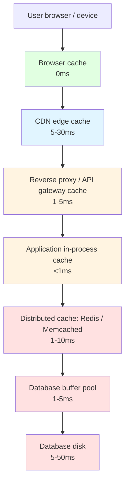

---
tags:
  - applied
  - for-scale
---

# Cache Hierarchy & Architecture

Real systems don't have "a cache" — they have **multiple cache layers**, each solving a different problem at a different latency. This page covers how to think about cache hierarchies, when each layer fits, and how the layers interact.

For the *concept* of caching, see [Caching Strategies](caching-strategies.md). This page focuses on the **architectural design** of caching across a system.

---

## The hierarchy



Each layer has different properties: capacity, latency, scope (per-user, per-instance, global), and invalidation cost. The art is **knowing which layer fits which data**.

---

## Layer 0: Browser / device cache

Closest to the user. Stores assets and API responses on the device.

```http
Cache-Control: public, max-age=86400, immutable
ETag: "v42-abc123"
```

### What lives here

- Static assets (JS, CSS, images, fonts)
- API responses marked cacheable
- Service Worker cached resources (PWAs)
- Offline-capable data (IndexedDB, localStorage)

### Sizing

- Browser cache: ~10-100MB per origin (browser-managed)
- localStorage: 5-10MB hard cap
- IndexedDB: hundreds of MB to GBs
- Service Worker: tied to disk quota

### When it fits

```
✓ Static assets that rarely change (versioned URLs)
✓ User-specific data that doesn't need server validation every time
✓ Offline support
✓ Reducing API roundtrips for navigation
```

### When it fails

```
✗ Multi-device users — cache is per-device
✗ Data that updates externally (other users' actions)
✗ Anything sensitive that shouldn't persist on shared devices
```

### Invalidation strategy

- **Versioned URLs**: change URL when content changes (`app.abc123.js`); old cache entries naturally become unreachable
- **Cache-Control headers**: set explicit max-age + must-revalidate
- **ETag validation**: cache stores response, sends If-None-Match on next request

---

## Layer 1: CDN edge cache

The CDN's points-of-presence (PoPs) — thousands of locations globally. The biggest performance win for global users.

```http
Cache-Control: public, s-maxage=3600
Surrogate-Control: max-age=86400
CDN-Cache-Control: max-age=86400
```

### What lives here

- All static assets (JS, CSS, images, video)
- Public API responses (rate-limited but cacheable)
- Personalised responses with care (cache key includes user attributes)
- HTML pages for content sites
- API gateway responses for public endpoints

### Sizing and scale

```
Cloudflare:    280+ PoPs, ~petabytes of cache globally
CloudFront:    600+ PoPs
Akamai:        ~4000 edge locations
Fastly:        ~95 PoPs, sub-50ms to most users worldwide
```

### When it fits

```
✓ Public, cacheable content with the same response for many users
✓ Global user base where origin is far from many users
✓ DDoS mitigation (CDN absorbs traffic spikes)
✓ Static assets ALWAYS
✓ "Mostly the same" API responses (e.g., product catalog, news article)
```

### Vary header for personalisation

```http
Vary: Accept-Language, Cookie
```

Tells the CDN: "treat each combination of these as a separate cache entry." Used for:
- Language localisation (Vary: Accept-Language)
- Logged-in vs anonymous (Vary: Cookie)
- Mobile vs desktop (Vary: User-Agent)

Each Vary dimension multiplies the cache entries. `Vary: Cookie` with millions of users = millions of cache entries = ~no caching benefit.

### Purge strategies

```python
# Cloudflare: purge specific URL
cf.purge_files(['https://example.com/api/products/123'])

# Cloudflare: purge by cache tag
cf.purge_tags(['products', 'category-electronics'])

# CloudFront: invalidation (slower; costs more)
cloudfront.create_invalidation(paths=['/api/products/*'])
```

CDN purges typically take 5-30 seconds to propagate globally. For real-time updates, combine with shorter TTLs.

### Edge compute as an extension

Modern CDNs run code at the edge (Cloudflare Workers, Lambda@Edge, Vercel Edge). They can:

- Generate personalised content close to the user
- Implement custom cache keys
- Validate cache freshness with origin
- Inject A/B variants

See [Edge Architecture](../architecture/edge-architecture.md).

---

## Layer 2: Reverse proxy / API gateway cache

Inside your infrastructure, in front of your app servers. Catches requests that escaped CDN.

### Examples

- **Nginx** with `proxy_cache` directive
- **Varnish** (HTTP-specific, very powerful)
- **AWS API Gateway** built-in caching
- **Cloudflare Worker / Fastly VCL** for fine-grained logic

### What lives here

- Authenticated API responses (where Vary: Cookie kills CDN benefit)
- Microservice-to-microservice responses
- "Almost-static" content per user segment

### Configuration example (Nginx)

```nginx
proxy_cache_path /var/cache/nginx levels=1:2 keys_zone=api_cache:100m max_size=10g;

server {
  location /api/ {
    proxy_cache api_cache;
    proxy_cache_key "$scheme$request_method$host$request_uri$http_authorization";
    proxy_cache_valid 200 5m;
    proxy_cache_use_stale error timeout updating http_500 http_502 http_503 http_504;
    proxy_cache_background_update on;
    proxy_pass http://backend;
  }
}
```

### When it fits

```
✓ API responses cacheable per-user (CDN can't help with auth)
✓ Smoothing bursty traffic to app servers
✓ Stale-while-revalidate to keep latency low during refresh
```

### Stale-while-revalidate pattern

```
proxy_cache_use_stale updating;
```

When a cache entry expires, serve the stale version while async-refreshing it. User sees instant response; cache repopulates in background. **The single biggest perceived-performance win** at this layer.

---

## Layer 3: Application in-process cache

Inside the application server's memory. Sub-millisecond access; no network hop.

### Examples

- Python: `functools.lru_cache`, `cachetools`
- Java: Caffeine, Guava
- Go: `github.com/hashicorp/golang-lru`
- Node: `lru-cache`, `node-cache`

### Code

```python
from functools import lru_cache

@lru_cache(maxsize=10000)
def get_product(product_id):
    return db.fetch_one("SELECT * FROM products WHERE id=%s", (product_id,))
```

```java
// Caffeine
Cache<String, Product> cache = Caffeine.newBuilder()
    .maximumSize(10_000)
    .expireAfterWrite(Duration.ofMinutes(5))
    .build();

Product product = cache.get(id, k -> db.fetchProduct(k));
```

### What lives here

- Reference data accessed on every request (auth permissions, feature flags)
- Hot read paths where Redis hop adds noticeable latency
- Pre-computed values shared across requests within one server

### Sizing

- Heap budget: typically 100MB - 4GB depending on JVM/process
- Items: tens of thousands to millions
- Eviction: LRU, LFU, time-based

### When it fits

```
✓ Read-mostly reference data (catalog, feature flags, config)
✓ Same data accessed many times per second by one server
✓ Acceptable inconsistency across servers (~minutes)
✓ Need ~sub-microsecond reads
```

### When it fails

```
✗ Need consistency across N server instances
✗ Working set too large to fit per-server
✗ Hot writes need to be reflected immediately
✗ Server restarts dump entire cache (cold start problem)
```

### The N-server stale problem

```
50 app servers, each with a 5-minute TTL cache of "user permissions for user X"
Admin revokes user X's permission
Some servers see the revoke immediately (next read repopulates)
Some serve stale permissions for up to 5 minutes

→ User can still perform restricted actions on the "stale" servers
```

**Mitigation**: combine in-process cache with pub/sub for invalidation events:

```python
import redis
r = redis.Redis()
pubsub = r.pubsub()
pubsub.subscribe('permissions.changed')

def on_permission_change(msg):
    user_id = json.loads(msg['data'])['user_id']
    permissions_cache.pop(user_id, None)  # remove from local cache

# Background thread listens for invalidation events
threading.Thread(target=listen_for_invalidations, daemon=True).start()
```

Each server still has its own cache, but invalidation broadcast keeps them roughly in sync.

---

## Layer 4: Distributed cache (Redis / Memcached)

Shared across all app servers. Network-backed but fast (~1-10ms).

### What lives here

- Session data
- Shared computed results (search results, recommendations)
- Rate limiting counters
- Distributed locks
- Hot DB query results
- Pub/sub channels

### Sizing

- Single Redis: ~64GB practical limit (memory constraint)
- Redis Cluster: TB scale via sharding
- Memcached cluster: similar

### When it fits

```
✓ Multiple app servers need consistent cache view
✓ Working set larger than in-process budget
✓ Need cross-instance coordination (locks, counters)
✓ Need durable cache across server restarts
```

### Architecture patterns

**Cache-aside (most common)**:

```python
def get_user(user_id):
    cached = redis.get(f"user:{user_id}")
    if cached:
        return json.loads(cached)
    user = db.fetch_one("SELECT * FROM users WHERE id=%s", (user_id,))
    redis.setex(f"user:{user_id}", 300, json.dumps(user))
    return user
```

**Write-through**:

```python
def update_user(user_id, **fields):
    db.update_user(user_id, fields)
    user = db.fetch_one("SELECT * FROM users WHERE id=%s", (user_id,))
    redis.setex(f"user:{user_id}", 300, json.dumps(user))
```

**Write-around (preferred for most cases)**:

```python
def update_user(user_id, **fields):
    db.update_user(user_id, fields)
    redis.delete(f"user:{user_id}")  # invalidate; next read repopulates
```

See [Caching Strategies](caching-strategies.md), [Cache Invalidation in Practice](cache-invalidation-applied.md).

---

## Layer 5: Database buffer pool

The database's own in-memory cache. Most Postgres / MySQL / etc. databases cache recently-read pages.

### Configuration

```sql
-- Postgres shared_buffers should typically be 25% of RAM
-- (Postgres also relies on OS page cache; don't make it 80%+)
SHOW shared_buffers;
-- 8GB

-- Hit ratio (you want >99%)
SELECT 
  sum(blks_hit) * 100.0 / (sum(blks_hit) + sum(blks_read)) AS hit_ratio
FROM pg_stat_database;
```

### When it matters

For most apps, you don't think about this layer — the DB handles it. But:

- Hot data should fit in `shared_buffers` for sub-ms reads
- Cold queries hit disk → 10-100× slower
- Hit ratio < 95% → DB underprovisioned or indexes missing
- Sequential scans on big tables blow out the buffer pool

### Working set sizing

```
Working set = data accessed in the last 5 minutes
Goal: working set fits in shared_buffers

If working set = 50GB and shared_buffers = 8GB:
  → 84% of reads will hit disk → slow
  → Solution: more RAM, smaller indexes, or external cache layer
```

This is why "caching layer in front of Postgres" works — you move the hot working set into Redis, freeing Postgres to handle the rest.

---

## Layer 6: Database disk

The bottom of the hierarchy. When all caches miss, this is the cost.

```
NVMe SSD random read:     ~100 µs
NVMe SSD sequential:      ~5-7 GB/s
HDD random:               ~10 ms (100× slower than NVMe random)
Network-attached (EBS):   adds 1-5 ms over local
```

The caches above exist to **avoid hitting this layer** for the hot working set. A well-tuned system:

```
99% of reads served from cache layers (sub-10ms)
1% of reads hit disk (cold data, ~100ms tail)
Overall p99: <50ms
```

---

## Designing a hierarchy

### Step 1: Identify access patterns

For each major piece of data:

```
Question                                Examples
─────────────────────────────────────────────────────────────────
How often is it read?                   "10K times/sec" — needs cache
How often does it change?               "Once a week" — long TTL OK
Per-user or global?                     Global = cacheable at CDN
Sensitive?                              Sensitive = not at edge
How much staleness is OK?               <30s = TTL or push invalidation
                                        Minutes OK = TTL-only
Size?                                   100KB+ = harder to cache widely
```

### Step 2: Map to layers

```
Product catalog (read 100K/s, changes daily, global, public):
  CDN layer (Cache-Control: public, max-age=3600)
  + app in-process cache (5min TTL)
  + Redis (15min TTL)

User profile (read 1K/s, changes occasionally, per-user, semi-public):
  No CDN (Vary: Cookie kills it)
  + Redis (5min TTL, invalidate on update)
  + app in-process cache (60s TTL)

Session data (read every request, changes on user action, per-user):
  Redis only (sub-ms lookup, central source)
  No app cache (consistency issues across servers)

Feature flags (read every request, changes hourly, global):
  In-process cache (30s TTL) + pub/sub invalidation
  + Redis as origin
```

### Step 3: Cost vs benefit per layer

Each layer adds complexity. Justify each:

```
CDN:                     huge ROI for global traffic; minimal complexity
Reverse proxy cache:     ROI when CDN can't help (auth); moderate complexity
In-process cache:        ROI for very hot reads; cross-server staleness risk
Redis:                   ROI for shared state; one-more-system overhead
DB buffer pool:          ROI is automatic if sized right
```

### Step 4: Design invalidation across layers

Each cached entity needs a "path of invalidation":

```
Product update:
  1. DB UPDATE
  2. Redis: DEL product:123
  3. App in-process: invalidate via pub/sub
  4. CDN: purge /api/products/123 (or wait for TTL)
  5. Browser: cache version bump or TTL expiry

Each layer's TTL acts as a backstop if the explicit invalidation fails.
```

---

## Common designs

### Design A: Read-heavy SaaS

```
[User] ↔ Browser cache ↔ Cloudflare ↔ Nginx ↔ App (Caffeine) ↔ Redis ↔ Postgres

CDN:    static assets, public catalog (1h TTL + purge on update)
Nginx:  auth'd API responses (Vary: Cookie, 60s TTL)
App:    feature flags, permissions (5min TTL + pub/sub invalidation)
Redis:  user sessions, hot query results (cache-aside, 5min TTL)
PG:     source of truth
```

### Design B: API-first product (no public site)

```
[Client SDK] ↔ Cloudflare ↔ Nginx ↔ App ↔ Redis ↔ Postgres

CDN:    rate limiting + tiny TTL (10s) for popular endpoints
Nginx:  internal microservice responses
App:    minimal in-process cache (config, schemas)
Redis:  shared application state, rate counters, idempotency keys
PG:     source of truth
```

### Design C: Real-time / collaborative (Figma-style)

```
[Client] ↔ Cloudflare ↔ Nginx ↔ App ↔ Redis ↔ Postgres
                                ↘ WebSocket gateway

Browser:    minimal (immutable docs in IndexedDB)
CDN:        static assets only; everything else dynamic
Nginx:      almost no cache (real-time data)
App:        no shared cache (WebSocket state per connection)
Redis:      pub/sub for fan-out, presence, ephemeral state
PG:         persistent collaborative state
```

### Design D: E-commerce at scale

```
[User] ↔ Cloudflare ↔ ALB ↔ Nginx ↔ App ↔ Redis Cluster ↔ Postgres + DynamoDB

Browser:    versioned assets (1 year cache)
CDN:        product pages (15min TTL + tag-purge on inventory change)
ALB → Nginx: cookie-based variants for A/B
App:        product catalog in-process (5min TTL, 1GB heap budget)
Redis:      sessions, cart, recommendations, inventory hints
Postgres:   transactional (orders, users, accounts)
DynamoDB:   inventory (single-key, ultra-low-latency)
```

---

## Anti-patterns

### Anti-pattern 1: "More cache layers = better"

Each layer adds invalidation complexity. Adding a layer should solve a specific bottleneck.

```
Too many layers:
  Browser → CDN → Nginx → App-cache → Redis → DB
  Every layer has its own TTL → stale data appears for hours
  Invalidating a single change requires 5 different mechanisms
```

Default: 2-3 layers (CDN + Redis + DB; optionally app cache for very hot reads).

### Anti-pattern 2: Same TTL at every layer

```
CDN:        5 minutes
Nginx:      5 minutes
App cache:  5 minutes
Redis:      5 minutes
```

Cumulative staleness is up to 20 minutes (worst case). Better: shorter TTL at upstream layers, longer at downstream:

```
CDN:        1 hour     (longest; only purge on important changes)
Nginx:      5 minutes  (refreshes more often)
App cache:  60 seconds (very fresh)
Redis:      30 seconds (most fresh shared)
```

Or use push invalidation top-down on updates.

### Anti-pattern 3: Cache key includes everything

```
Cache key: f"user:{user_id}:lang:{lang}:device:{device}:ab:{ab_variant}:tz:{timezone}"
```

With 1M users × 50 languages × 3 devices × 4 variants × 24 timezones = 14 billion possible keys. Cache hit rate near zero.

**Reduce dimensions**: combine where possible, default common values, accept some duplication.

### Anti-pattern 4: Caching mutation responses

```python
@cache(ttl=60)
def create_order(...):  # ← caching a write?!
    ...
```

Only cache reads. Caching writes leads to duplicate operations or missed work.

### Anti-pattern 5: No observability per layer

```
Aggregate "cache hit rate" of 80% looks fine.
But: CDN hit rate is 99%; Redis hit rate is 40% — Redis is misconfigured.
Without per-layer metrics, you don't see the issue.
```

Track hit rate, miss rate, latency, eviction rate per layer.

---

## Observability across the hierarchy

```yaml
Browser:
  ✗ Hard to measure server-side (some browsers send Cache-Status)
  → Use Lighthouse / WebPageTest
  
CDN:
  ✓ Cloudflare/Fastly/CloudFront analytics
  ✓ x-cache header (HIT/MISS/EXPIRED)
  
Nginx/Varnish:
  ✓ proxy_cache_status header
  ✓ Custom metrics via log parsing
  
App in-process:
  ✓ Library-specific (Caffeine.stats(), lru_cache.cache_info())
  
Redis:
  ✓ INFO stats (keyspace_hits, keyspace_misses)
  ✓ MONITOR (debug only)
  ✓ Slowlog
  
Database:
  ✓ pg_stat_database for hit ratio
  ✓ Query latency per percentile
```

**Single dashboard pattern**: each layer in a row, hit rate / latency / size in columns. Anomalies visible at a glance.

---

## Capacity planning

How much memory does each layer need?

### CDN

Set by your provider. Limit is bandwidth + their backplane. Plan by:

```
Total egress at peak: 100 Gbps
CDN coverage for cacheable content: 95%
Origin egress: 100 × 5% = 5 Gbps (manageable)
```

### Redis

```
Items × avg size = working set
+ ~30% overhead (Redis structures, connections)
+ ~20% headroom for spikes

Example:
  10M sessions × 4KB = 40GB working set
  + 12GB overhead
  + 10GB headroom
  → ~62GB Redis instance OR Redis Cluster
```

### App in-process

```
Items × avg size per server
Constrained by JVM heap or Python process memory
Goal: under 25% of process RAM (leave room for app code/data)

Example:
  10K cached products × 5KB = 50MB per server
  100 servers × 50MB = 5GB total (across cluster)
```

---

## When to add or remove a layer

### Signs you need another layer

```
✓ Existing cache hit rate is high (>90%) but app still slow
  → Add a closer layer (CDN, edge, in-process)

✓ Many app servers fetching same data simultaneously
  → Add in-process or distributed cache

✓ DB load high despite cache layer
  → Cache miss rate too high; increase capacity or TTL

✓ Global latency uneven
  → Add CDN
```

### Signs you should remove a layer

```
✓ Hit rate <30% — overhead exceeds benefit
✓ Working set fits trivially in DB buffer pool
✓ Invalidation bugs producing stale data
✓ Cost > value (Redis cluster for 1K req/s is overkill)
```

Adding cache layers isn't always the right move. Sometimes "fix the DB" is.

---

## The "cache is a hint" principle

Never let the cache be the source of truth. The DB (or origin) is the truth; the cache is a performance optimisation that can be wiped at any time.

```python
# WRONG: cache is treated as truth
def increment_view_count(post_id):
    count = redis.incr(f"views:{post_id}")
    # If Redis flushes, we lose all counts forever
    return count

# RIGHT: cache is hint; DB is truth
def increment_view_count(post_id):
    # Write to durable store (async OK for view counts)
    db.execute("UPDATE posts SET views = views + 1 WHERE id=%s", (post_id,))
    # Maintain cache as hint
    redis.incr(f"views:{post_id}")  # async, eventual
```

For analytics counts where loss is acceptable, OK to defer. For anything that matters: **DB first, cache second.**

---

## Interview angle

!!! tip "What interviewers are testing"
    Whether you can design a layered caching strategy — not just "we'll add Redis."

**Strong answer pattern:**
1. Identify the access pattern of the data being cached
2. Map to the right layer (CDN for public + global; Redis for cross-server shared; in-process for very hot)
3. Each layer with its own TTL + invalidation strategy
4. Observability per layer (hit rate, latency)
5. Cache is a hint, not source of truth

**Common follow-up:** *"You added a Redis cache and DB load is still high. What's the issue?"*
> Cache miss rate too high — either the working set is bigger than the cache, the TTL is too short, or hot keys are causing thundering herds on expiry. Check Redis INFO for keyspace_misses; compare to total reads. Then either increase Redis size, extend TTL on the cold-but-occasionally-accessed entries, or implement single-flight / stale-while-revalidate to absorb stampedes on cache miss.

---

## Related

- [Caching Strategies](caching-strategies.md) — read/write patterns
- [Cache Invalidation in Practice](cache-invalidation-applied.md) — keeping cache fresh
- [Cache Patterns & Pitfalls](cache-patterns.md) — stampedes, hot keys
- [Distributed Cache Best Practices](distributed-cache-best-practices.md) — Redis Cluster, replication
- [Distributed Caching](distributed-caching.md) — depth on distributed cache
- [Redis Deep Dive](redis.md) — Redis-specific
- [CDN](../networking/cdn.md) — Layer 1 in depth
- [Edge Architecture](../architecture/edge-architecture.md) — compute at the edge
