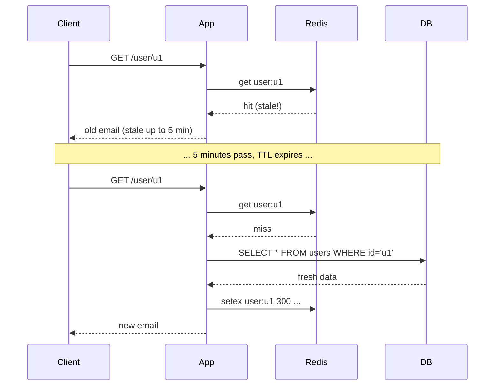
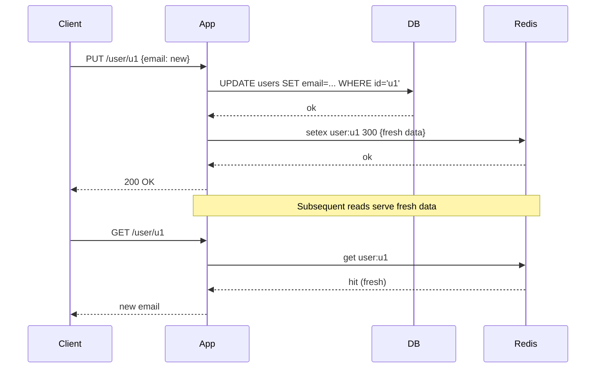
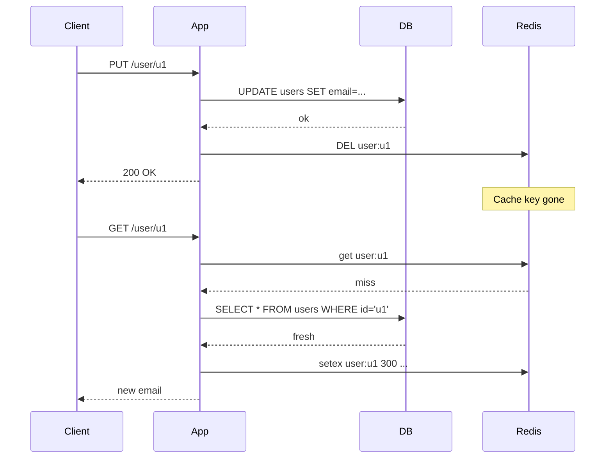
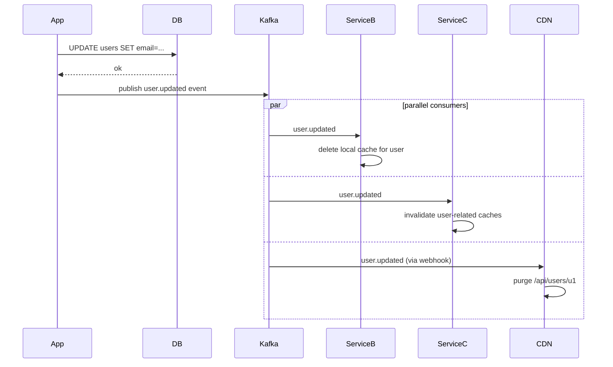
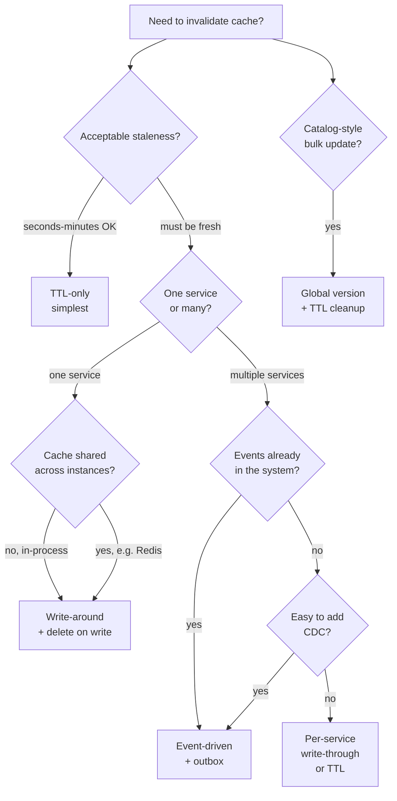

---
tags:
  - applied
  - for-saas
---

# Cache Invalidation in Practice

"There are only two hard things in Computer Science: cache invalidation and naming things." — Phil Karlton. This page covers the applied side: **how teams actually keep caches in sync with the source of truth** in production systems. Concrete patterns, code examples, and the trade-offs each makes.

For the *concept* of cache invalidation, see [Cache Invalidation](cache-invalidation.md). This is the applied companion.

---

## The fundamental problem

```
You wrote: 
  UPDATE users SET email = 'new@example.com' WHERE id = 'u1'

Now what?
  - Cache might have 'old@example.com'
  - 50 other servers' caches might too
  - CDN might be serving the old value
  - User just changed their email; they expect to see the new one
```

There are five practical strategies. Pick based on consistency requirements, write rate, and how much stale data your users tolerate.

---

## Strategy 1: TTL-only (eventual consistency)

The simplest. Just give every cache entry a TTL; let it expire naturally.

```python
# Write to DB; don't touch cache
def update_user(user_id, email):
    db.execute("UPDATE users SET email=%s WHERE id=%s", (email, user_id))
    # Cache entries for this user will be stale until TTL expires

# Read with cache-aside + TTL
def get_user(user_id):
    cached = redis.get(f"user:{user_id}")
    if cached:
        return json.loads(cached)
    
    user = db.fetch_one("SELECT * FROM users WHERE id=%s", (user_id,))
    redis.setex(f"user:{user_id}", 300, json.dumps(user))  # 5 min TTL
    return user
```

### Diagram



### When it fits

- **Acceptable**: read-heavy data where 5-minute staleness is OK (product catalogs, user profiles, recommendations, news feeds)
- **Not acceptable**: data where users expect their changes immediately (settings page, just-edited content)

### Tuning

- **Hot data**: short TTL (30s-5min) — staleness window small
- **Cold data**: long TTL (1h-24h) — fewer DB hits, more staleness
- **Rarely changes**: very long TTL (24h-7d) — like CDN-cached static assets

**Common mistake**: setting TTL too long without thinking about consistency. A 1-hour TTL means a user's profile change is invisible to half the population for an hour.

---

## Strategy 2: Write-through (synchronous update)

Update the cache and DB together on every write.

```python
def update_user(user_id, email):
    user = db.fetch_one("SELECT * FROM users WHERE id=%s", (user_id,))
    user['email'] = email
    
    # Update DB first
    db.execute("UPDATE users SET email=%s WHERE id=%s", (email, user_id))
    
    # Then update cache (or skip and let next read populate)
    redis.setex(f"user:{user_id}", 300, json.dumps(user))
```

### Diagram



### Trade-offs

**Pros**:
- Cache and DB in sync immediately
- Reads after writes always see new data
- Simple to reason about

**Cons**:
- Write path includes two operations (DB + cache); both can fail
- **Dual-write problem**: if cache write fails after DB succeeds, cache is now stale
- Slow writes (cache write adds latency)
- Cache gets populated even if entry won't be read soon (waste)

### Variant: invalidate instead of update

Often it's safer to **delete** the cache key rather than update it:

```python
def update_user(user_id, email):
    db.execute("UPDATE users SET email=%s WHERE id=%s", (email, user_id))
    redis.delete(f"user:{user_id}")  # next read repopulates from DB
```

Why delete > update:
- Avoids race conditions (two simultaneous writes; out-of-order updates)
- Simpler — only one write path that populates cache (the read path)
- Self-healing if the wrong value somehow ended up cached

### The race condition with write-through

```
Time 1: Client A reads user:u1 → cache miss → DB returns {email: old}
Time 2: Client B updates user:u1, sets cache to {email: new}
Time 3: Client A finally writes its DB result {email: old} to cache

Now cache has old value despite the recent update. This is one reason "delete on update" is preferred.
```

---

## Strategy 3: Write-around with invalidation

Don't update cache on writes; just delete it. Reads repopulate.

```python
def update_user(user_id, email):
    db.execute("UPDATE users SET email=%s WHERE id=%s", (email, user_id))
    redis.delete(f"user:{user_id}")  # invalidate

def get_user(user_id):
    cached = redis.get(f"user:{user_id}")
    if cached:
        return json.loads(cached)
    user = db.fetch_one("SELECT * FROM users WHERE id=%s", (user_id,))
    redis.setex(f"user:{user_id}", 300, json.dumps(user))
    return user
```

### Diagram



### When it fits

The **default choice** for most CRUD apps. Combines simplicity of cache-aside reads with explicit invalidation on writes.

### Multi-key invalidation

When one write affects multiple cached entries:

```python
def add_comment(post_id, user_id, text):
    db.execute("INSERT INTO comments (post_id, user_id, text) VALUES (...)", ...)
    
    # Invalidate everything that contains this comment
    redis.delete(f"post:{post_id}")              # post detail page
    redis.delete(f"user:{user_id}:comments")     # user's comment list
    redis.delete(f"post:{post_id}:comments")     # post's comment list
    redis.delete(f"feed:recent_activity")        # global activity feed
```

This is where invalidation gets hairy. Every cache key affected by the write must be deleted. Miss one → stale data.

### Pattern: tag-based invalidation

Some caches support tag-based invalidation:

```python
# Set with tags
redis.set('post:123', json.dumps(post))
redis.sadd('tag:post:123', 'post:123')
redis.sadd('tag:user:u1', 'post:123')

# On comment added — invalidate all keys tagged with post:123
def invalidate_tag(tag):
    keys = redis.smembers(f'tag:{tag}')
    if keys:
        redis.delete(*keys)
    redis.delete(f'tag:{tag}')
```

Trade-off: extra writes per cached entry (the tag membership). Worth it for systems with complex cross-cutting invalidation.

---

## Strategy 4: Event-driven invalidation

Database emits change events; cache subscribers invalidate accordingly. Used in larger systems where many services cache the same data.

```python
# Service A: source of truth
def update_user(user_id, email):
    db.execute("UPDATE users SET email=%s WHERE id=%s", (email, user_id))
    
    # Emit event via outbox or CDC
    outbox.publish('user.updated', {'user_id': user_id, 'fields': ['email']})

# Service B: maintains its own cache
def on_user_updated(event):
    user_id = event['user_id']
    local_cache.delete(f"user:{user_id}")
    
# Service C: also caches users
def on_user_updated(event):
    edge_cache.purge(f"/api/users/{event['user_id']}")
```

### Diagram



### When it fits

- Multiple services cache the same data
- CDN/edge cache needs explicit purges
- Event log already in place (Kafka, EventBridge)
- Eventual consistency is acceptable (events take 1-30 seconds to propagate)

### Implementation: outbox pattern

```python
# Write to DB and outbox in same transaction (atomic)
def update_user(user_id, email):
    with db.transaction():
        db.execute("UPDATE users SET email=%s WHERE id=%s", (email, user_id))
        db.execute(
            "INSERT INTO outbox (event_type, payload) VALUES (%s, %s)",
            ('user.updated', json.dumps({'user_id': user_id}))
        )
    # Background process publishes outbox entries to Kafka
```

See [Outbox Pattern](../patterns/outbox.md).

### Implementation: CDC (no app changes)

Debezium / DMS reads database WAL → publishes to Kafka → consumers invalidate.

```yaml
# Debezium connector
connector.class: io.debezium.connector.postgresql.PostgresConnector
database.hostname: postgres-prod
table.include.list: public.users
publication.name: cache_invalidation
plugin.name: pgoutput
```

Now every Postgres UPDATE on `users` automatically becomes a Kafka event. Consumers invalidate their caches.

### Trade-off: latency

Event propagation takes time. From DB commit to cache invalidation: typically 1-10 seconds.

```
Write at 10:00:00.000
Outbox publish: 10:00:00.500
Kafka deliver: 10:00:00.700
Consumer invalidates: 10:00:00.900

Reads between 10:00:00.000 and 10:00:00.900 may serve stale data.
```

For most use cases this is fine. For "user just updated their profile and immediately reads it back" — combine with another strategy.

---

## Strategy 5: Versioning / cache busting

Include a version in the cache key. Update the version on writes; old cache entries become unreachable.

### Pattern A: per-record versioning

```python
def update_user(user_id, email):
    new_version = int(time.time() * 1000)  # monotonic
    db.execute(
        "UPDATE users SET email=%s, version=%s WHERE id=%s",
        (email, new_version, user_id)
    )
    redis.set(f"user:{user_id}:version", new_version)

def get_user(user_id):
    # Get version (cheap)
    version = redis.get(f"user:{user_id}:version")
    if not version:
        # Cold start; read from DB
        version = db.fetch_one("SELECT version FROM users WHERE id=%s", (user_id,))['version']
        redis.set(f"user:{user_id}:version", version)
    
    # Look up versioned key
    cached = redis.get(f"user:{user_id}:v{version}")
    if cached:
        return json.loads(cached)
    
    user = db.fetch_one("SELECT * FROM users WHERE id=%s", (user_id,))
    redis.setex(f"user:{user_id}:v{version}", 3600, json.dumps(user))
    return user
```

**Pros**: no race conditions; old versions are orphaned (cleaned by TTL eventually)
**Cons**: extra key per record; slightly higher memory; two Redis ops per read

### Pattern B: global cache version (for catalog updates)

```python
# Bump global version when catalog changes
def update_catalog():
    db.update_catalog(...)
    redis.incr("catalog:version")

def get_product(product_id):
    version = redis.get("catalog:version") or 1
    cached = redis.get(f"product:{product_id}:v{version}")
    if cached:
        return json.loads(cached)
    # ... fetch and cache with current version
```

A single increment invalidates the entire catalog cache. Old entries expire via TTL.

### Pattern C: HTTP ETags (for HTTP caches/CDNs)

```
Response with ETag:
  ETag: "abc123-v45"
  Cache-Control: public, max-age=300

Client subsequent request:
  If-None-Match: "abc123-v45"
  
Server checks: still abc123-v45?
  Yes → 304 Not Modified
  No  → 200 + fresh body
```

Works at HTTP/CDN layer. Combined with origin-side versioning, lets CDNs serve content for years while still picking up changes immediately.

---

## Picking the right strategy



### Real-world mix

Most production systems use **multiple strategies layered**:

```
CDN layer (edge):                  long TTL + explicit purge on important changes
Application cache (Redis):          write-around + delete-on-write
Multi-service:                     event-driven invalidation via Kafka
Static catalog:                    global version bump
Rare critical updates:             write-through (immediate consistency)
```

---

## Specific scenarios

### Scenario 1: User profile

```
Strategy:    write-around (delete-on-write)
TTL:         5-15 minutes (backup if delete fails)
Why:         User expects to see their own changes immediately;
             other users tolerate brief staleness
```

```python
def update_profile(user_id, fields):
    db.update(user_id, fields)
    redis.delete(f"user:{user_id}")
    # Next read repopulates with fresh data
```

### Scenario 2: Product catalog

```
Strategy:    long TTL + global version bump on catalog update
TTL:         1-24 hours per product
Why:         Catalog changes infrequently; reads heavily cached;
             bulk updates handled via version increment
```

```python
def import_catalog():
    db.bulk_update(catalog_data)
    redis.incr("catalog:version")
    # Old per-product cache entries orphan, expire via TTL
```

### Scenario 3: News feed / social feed

```
Strategy:    write-back to a precomputed feed cache (per-user)
TTL:         long (24h+) with explicit invalidation on relevant events
Why:         Personalised; expensive to compute; events tell us when to invalidate
```

```python
def on_user_posts(event):
    # Invalidate timelines of users who follow this poster
    for follower_id in get_followers(event.user_id):
        redis.delete(f"timeline:{follower_id}")
```

### Scenario 4: Real-time inventory

```
Strategy:    write-through with strict consistency, OR no caching
TTL:         very short (seconds) if cached at all
Why:         Overselling is catastrophic; consistency more important than performance
```

```python
def reserve_inventory(product_id, qty):
    with db.transaction():
        # Optimistic concurrency
        result = db.execute(
            "UPDATE inventory SET available = available - %s "
            "WHERE product_id = %s AND available >= %s",
            (qty, product_id, qty)
        )
        if result.rowcount == 0:
            raise OutOfStock()
    
    # Update cache (invalidation acceptable if it fails — DB is truth)
    redis.delete(f"inventory:{product_id}")
```

For inventory, **the cache is a hint, not the source of truth**. Always reconfirm against DB before final commitment.

### Scenario 5: Configuration / feature flags

```
Strategy:    TTL with optional invalidation event
TTL:         30-60 seconds
Why:         Changes propagate within a minute; eventual consistency OK
```

```python
def get_feature_flag(flag_name):
    cached = redis.get(f"flag:{flag_name}")
    if cached:
        return json.loads(cached)
    flag = db.fetch_one("SELECT * FROM feature_flags WHERE name=%s", (flag_name,))
    redis.setex(f"flag:{flag_name}", 30, json.dumps(flag))  # 30s TTL
    return flag
```

LaunchDarkly and similar tools combine TTL with SSE push notifications.

### Scenario 6: CDN-cached API response

```
Strategy:    long Cache-Control + purge on relevant events
TTL:         hours to days at CDN
Why:         CDN serves billions of requests; can't go to origin for each
```

```
HTTP response:
  Cache-Control: public, max-age=86400, s-maxage=86400
  ETag: "user-u1-v42"

On update event:
  Cloudflare API purge: POST /api/v4/zones/.../purge_cache {files: [...]}
```

---

## Anti-patterns

### Cache and DB getting out of sync

```python
# Bug: update cache but DB write fails
def update_user(user_id, email):
    redis.set(f"user:{user_id}", json.dumps({'email': email}))  # cache first
    db.execute("UPDATE users SET email=%s WHERE id=%s", (email, user_id))  # DB after
    # If DB write fails, cache has stale-by-future value!
```

**Always DB-first, then cache.** And prefer delete over update.

### Forgetting cascading invalidation

```python
def update_user_email(user_id, new_email):
    db.execute("UPDATE users SET email=%s WHERE id=%s", (new_email, user_id))
    redis.delete(f"user:{user_id}")
    # Forgotten:
    # - search index (Elasticsearch document)
    # - email-to-user lookup index
    # - any view that contains the email (comments showing author, etc.)
```

When in doubt, **trace every cached path** that contains the data, invalidate each. Tools like dependency graphs of caches help in larger systems.

### Cache stampede on invalidation

```python
def update_popular_item(item_id):
    db.update_item(item_id)
    redis.delete(f"item:{item_id}")  # Hot key — 1000s of clients about to miss
    # All clients hit DB simultaneously → DB overload
```

Mitigation: **single-flight** or **probabilistic early refresh**:

```python
def get_item_with_singleflight(item_id):
    cached = redis.get(f"item:{item_id}")
    if cached:
        return json.loads(cached)
    
    # Try to acquire a lock for this item's reload
    lock_key = f"item:{item_id}:loading"
    if redis.set(lock_key, '1', nx=True, ex=10):  # got lock
        try:
            item = db.fetch_one("SELECT ...", (item_id,))
            redis.setex(f"item:{item_id}", 300, json.dumps(item))
            return item
        finally:
            redis.delete(lock_key)
    else:
        # Someone else is loading; wait briefly and retry
        time.sleep(0.05)
        return get_item_with_singleflight(item_id)
```

See [Cache Patterns & Pitfalls](cache-patterns.md).

### TTL too long without an invalidation path

```python
redis.setex(f"user:{user_id}", 86400, json.dumps(user))  # 24-hour TTL
# User updates profile → still see old data for up to 24 hours
```

Either keep TTL short OR add invalidation. Don't rely on just one — the combination is the safe approach.

### Invalidation only on writes you control

```python
def update_user(user_id, email):
    db.execute("...")
    redis.delete(f"user:{user_id}")
    
# But: admin tool also updates users directly in DB
# Bypasses your invalidation code → cache stays stale
```

Either route all writes through one service, or use CDC/event-driven invalidation that catches writes regardless of source.

---

## Observability for cache invalidation

```yaml
Metrics to track:
  ✓ Cache hit rate (per cache, per key prefix)
  ✓ Cache miss latency (how long to repopulate from origin)
  ✓ Invalidation rate (deletes per second)
  ✓ Time between update event and cache invalidation
  ✓ Cache size and eviction rate
  
Alerts:
  ✓ Hit rate drops below threshold (e.g., 80%)
  ✓ Invalidation queue depth growing (events not consumed)
  ✓ Specific endpoint stops serving fresh data
```

### Correlation IDs for tracing

```python
def update_user(user_id, email, request_id):
    log.info(f"{request_id}: writing user {user_id}")
    db.execute("UPDATE users SET email=%s WHERE id=%s", (email, user_id))
    log.info(f"{request_id}: invalidating cache user:{user_id}")
    redis.delete(f"user:{user_id}")
    log.info(f"{request_id}: cache invalidated")
```

When debugging "why am I seeing stale data," trace the write → invalidation → next read path with request_id.

---

## When to skip caching entirely

Caching introduces complexity. Sometimes the right answer is "don't cache."

```
✗ Highly volatile data — updates more often than reads
✗ Strict consistency requirements (financial, inventory)
✗ Data already fast to fetch (DynamoDB sub-ms reads)
✗ Cost of cache > cost of fetch
✗ Small dataset that fits in DB buffer pool
```

Postgres with a hot buffer pool can serve millions of reads per second. Sometimes adding Redis on top is just adding a coordination problem.

---

## Quick reference card

```
Default for CRUD app:        write-around + delete-on-write + 5min TTL backup
Multi-service:               event-driven invalidation via Kafka outbox
Catalog updates:             global version bump
Personalised feeds:          per-user precomputed cache + event invalidation
Inventory / money:           usually skip cache or write-through with care
CDN / edge:                  long TTL + explicit purge API on changes
Hot keys at risk of stampede: single-flight or probabilistic refresh
```

---

## Related

- [Cache Invalidation](cache-invalidation.md) — the concept
- [Caching Strategies](caching-strategies.md) — read patterns
- [Cache Patterns & Pitfalls](cache-patterns.md) — stampedes, hot keys
- [Cache Hierarchy](cache-hierarchy.md) — multi-tier caching design
- [Distributed Cache Best Practices](distributed-cache-best-practices.md) — Redis Cluster, replication
- [Outbox Pattern](../patterns/outbox.md) — for event-driven invalidation
- [Idempotency](../patterns/idempotency.md) — pairs with cache invalidation for correctness
