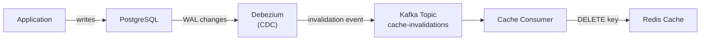
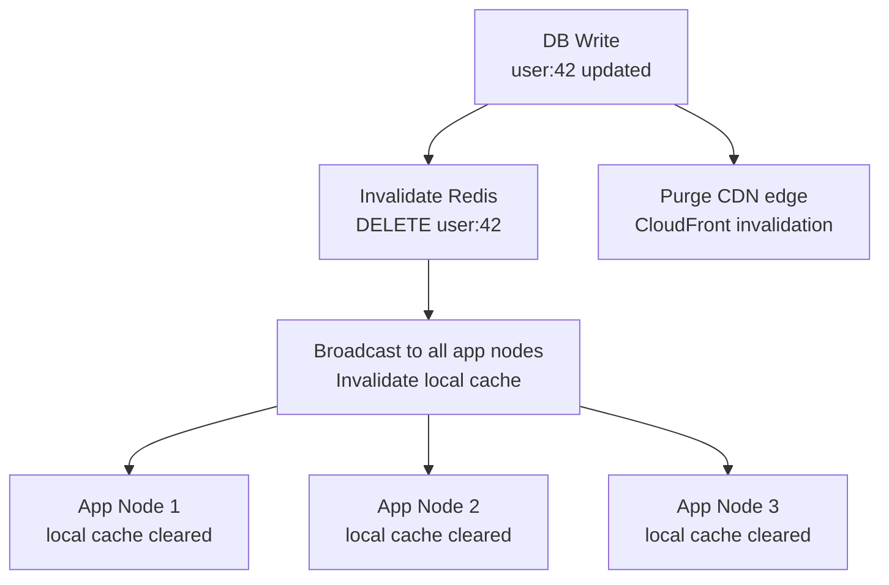

# Cache Invalidation

> "There are only two hard things in Computer Science: cache invalidation and naming things." — Phil Karlton

Cache invalidation is the problem of ensuring a cache does not serve stale data after the underlying source of truth changes. It is hard because it requires coordinating two separate systems (cache + DB) that can fail independently.

!!! tip "Applied companion"
    For the **practical patterns** (TTL, write-through, event-driven, versioning) with code examples, see **[Cache Invalidation in Practice](cache-invalidation-applied.md)**.

## Why it's hard

The core difficulty is the **consistency window** — the gap between a write to the DB and the cache reflecting that write:

```
t=0: DB: user.name = "Alice"    Cache: user:42 = "Alice"
t=1: DB: user.name = "Bob"      Cache: user:42 = "Alice"  ← stale!
t=2: (TTL expires)              Cache: user:42 = MISS → fetch → "Bob"
t=3: DB: user.name = "Bob"      Cache: user:42 = "Bob"   ← consistent again
```

The window [t=1, t=2] is the stale window. Whether this is acceptable depends on the application.

---

## Strategies

### 1. TTL-Based Expiry

Set a time-to-live on every cache entry. Stale data is bounded by the TTL duration.

```python
# Set with TTL
redis.setex(f"user:{user_id}", ttl=300, value=json.dumps(user))

# On write — do nothing to the cache
def update_user(user_id, data):
    db.update("UPDATE users SET ... WHERE id = %s", user_id, data)
    # cache will naturally expire within TTL seconds
```

**Trade-off matrix:**

| TTL | Staleness risk | DB load | Cache memory |
|---|---|---|---|
| Short (10s) | Low | High (frequent misses) | Low |
| Long (1hr) | High | Low | High |
| No TTL | Permanent until manual invalidation | Very low | Very high |

**When to use:** Data where some staleness is always acceptable — product descriptions, user preferences, reference data.

**Pitfall:** Never omit TTL entirely on cache-aside entries. Memory will fill indefinitely and eviction policies will behave unpredictably.

---

### 2. Event-Driven Invalidation (Delete on Write)

On every write to the DB, explicitly delete or update the corresponding cache key.

```python
def update_user(user_id: int, data: dict) -> None:
    # 1. Write to DB (source of truth first)
    db.execute("UPDATE users SET name=%s WHERE id=%s", data['name'], user_id)

    # 2. Invalidate the cache
    redis.delete(f"user:{user_id}")
    # Next read will be a cache miss → re-populate from DB
```

**Delete vs Update on write:**

- **Delete (invalidate):** Simpler, always safe. Next read repopulates from DB.
- **Update:** Avoids the next cache miss but requires transactional writes.

**Prefer delete** — updating the cache on write introduces a race condition:

```
Thread 1: writes user A to DB
Thread 2: writes user B to DB
Thread 2: updates cache to B
Thread 1: updates cache to A  ← cache now has A but DB has B!
```

Deleting avoids this: the next read always gets the authoritative value from DB.

---

### 3. Write-Through (Implicit Invalidation)

The write path always updates the cache atomically with the DB — no separate invalidation step needed.

```python
def update_user(user_id: int, data: dict) -> None:
    db.execute("UPDATE users SET name=%s WHERE id=%s", data['name'], user_id)
    redis.setex(f"user:{user_id}", 300, json.dumps(data))
    # Cache is always consistent with DB
```

This eliminates the invalidation problem by ensuring the cache is always fresh. See [Caching Strategies](caching-strategies.md) for full write-through details.

---

### 4. Cache Key Versioning

Append a version number or content hash to cache keys. Stale keys are naturally orphaned and eventually evicted by TTL.

```
# DB write increments user version
user:42:profile:v6  → stale, will expire via TTL
user:42:profile:v7  ← current

# Lookup always uses current version
def get_cache_key(user_id: int) -> str:
    version = db.query("SELECT version FROM users WHERE id=%s", user_id)
    return f"user:{user_id}:profile:v{version}"
```

**Pros:** No explicit invalidation needed. Old versions naturally die. Safe for CDN caching (immutable URLs).

**Cons:** Requires a version lookup on every cache check (or fetching version from a fast store). Orphaned keys consume memory until TTL.

**Best for:** Immutable assets (JS bundles, images with content hashes), or when you need strong cache-busting guarantees.

---

### 5. Change Data Capture (CDC) Invalidation

A CDC pipeline watches the database write-ahead log (WAL) and publishes invalidation events to a queue. Cache invalidation happens asynchronously without coupling to the write path.



```python
# CDC consumer
def handle_user_updated(event: dict) -> None:
    user_id = event['after']['id']
    redis.delete(f"user:{user_id}")
    redis.delete(f"user:{user_id}:profile")
    # any other related keys
```

**Pros:**
- Completely decoupled from the application write path
- Works even for writes that bypass the application (direct DB scripts, migrations)
- Can fan out to multiple caches simultaneously

**Cons:**
- Additional infrastructure (Debezium, Kafka)
- Introduces async delay — cache is slightly stale until CDC event is processed
- Complex failure handling (what if the consumer lags?)

**Best for:** Large systems where multiple services share the same cache, or where DB writes can come from multiple sources.

---

## The two-phase invalidation problem

The hardest case: ensuring cache and DB are consistent when one step fails.

### Problem: Delete then Write

```
t=1: Redis DELETE user:42       ← success
t=2: DB UPDATE ...              ← FAILS

Result: cache is empty, DB has old data.
Next read fetches old data from DB and repopulates cache with stale value.
```

### Problem: Write then Delete

```
t=1: DB UPDATE user.name = "Bob"    ← success
t=2: Redis DELETE user:42           ← FAILS (Redis timeout)

Result: DB has "Bob", cache still has "Alice".
Cache will serve stale "Alice" until TTL expires.
```

### Mitigation: Retry with idempotent deletes

Since Redis DELETE is idempotent, safe to retry:

```python
def update_user(user_id: int, data: dict) -> None:
    db.execute("UPDATE users SET name=%s WHERE id=%s", data['name'], user_id)

    # Retry cache invalidation with exponential backoff
    for attempt in range(3):
        try:
            redis.delete(f"user:{user_id}")
            break
        except RedisError:
            time.sleep(0.1 * 2 ** attempt)
    else:
        # Final fallback: set short TTL so stale data expires quickly
        redis.expire(f"user:{user_id}", 10)
```

### Mitigation: Outbox pattern for CDC

Write cache invalidation events to a DB outbox table in the same transaction:

```sql
BEGIN;
  UPDATE users SET name = 'Bob' WHERE id = 42;
  INSERT INTO cache_invalidation_outbox (key, created_at)
    VALUES ('user:42', NOW());
COMMIT;
```

A separate worker reads the outbox and invalidates the cache — guaranteed to eventually execute because it's in the same DB transaction.

---

## Multi-level cache invalidation

When you have multiple cache layers (local in-process cache + distributed Redis cache + CDN), invalidation must propagate to all layers.



**Local cache broadcast options:**
- **Redis Pub/Sub:** Publish invalidation message; each app node subscribes and clears its local cache
- **Message bus (Kafka/SQS):** More durable but higher latency
- **Periodic TTL:** Accept stale local cache up to TTL (simplest)

```python
# On write: publish invalidation event
redis.publish("cache:invalidate", json.dumps({"key": f"user:{user_id}"}))

# On each app node: subscribe and clear local cache
def cache_invalidation_listener():
    pubsub = redis.pubsub()
    pubsub.subscribe("cache:invalidate")
    for message in pubsub.listen():
        if message['type'] == 'message':
            event = json.loads(message['data'])
            local_cache.delete(event['key'])
```

---

## Choosing a strategy

| Scenario | Recommended strategy |
|---|---|
| Tolerate up to N seconds stale | TTL only |
| Low write rate, must be fresh | Event-driven delete on write |
| High write rate, cache must stay consistent | Write-through |
| Multiple services write to same DB | CDC (Debezium) |
| Immutable versioned assets | Key versioning |
| Multi-layer caches | Redis Pub/Sub invalidation broadcast |

---

## Interview angle

!!! tip "What interviewers are testing"
    They want to see that you understand invalidation is a distributed systems problem — not just a `redis.delete()` call.

**Strong answer pattern:**
1. Identify the staleness tolerance: "Can users see stale data? For how long?"
2. Default to **delete on write + short TTL as a safety net**
3. Explain the race condition if you update (not delete) on write
4. For high-consistency needs, mention **write-through** or **CDC**
5. For multi-layer: describe Pub/Sub broadcast pattern

**Common follow-up:** *"What if the cache delete fails?"*
> Retry with backoff. As a fallback, set a short TTL on the key so it expires quickly. For critical data, use the outbox pattern — write the invalidation as a DB transaction so it's guaranteed to eventually execute.

## Related topics

- [Caching Strategies](caching-strategies.md) — write-through as built-in invalidation
- [Eviction Policies](eviction-policies.md) — TTL as a complement to invalidation
- [Cache Patterns & Pitfalls](cache-patterns.md) — what happens when invalidation fails
- [Outbox Pattern](../patterns/outbox.md) — reliable event publishing from DB writes
