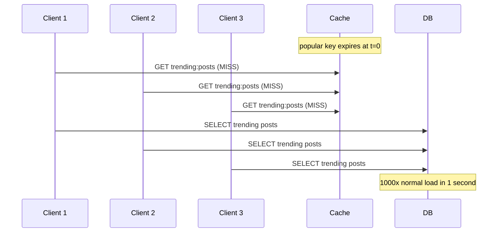
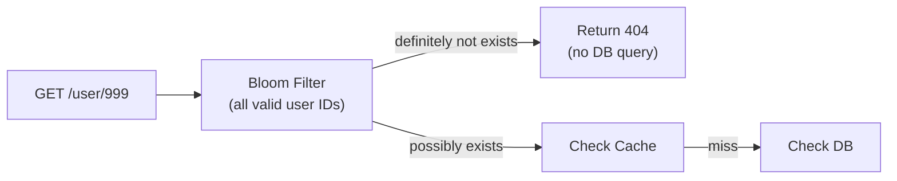

# Cache Patterns & Pitfalls

Even a well-designed cache can fail catastrophically under specific access patterns. Understanding these failure modes — and their mitigations — is essential for building resilient systems.

## You'll see this when...

- Popular cache key expires → 1000 concurrent requests all rebuild it (cache stampede)
- Cache hit rate suddenly drops to 30% → working set grew or cache was flushed
- "We restarted Redis and the database fell over" — cold cache stampede
- One product's launch overwhelmed cache → backend exposed
- Page latency jumps every 5 minutes (TTL synced expirations)
- Bug: write succeeded but cache shows old value
- "Snake oil" pattern: every query first checks if user exists → cache miss storm
- Negative caching missing: same expensive lookup of non-existent key over and over

## Cache Stampede (Thundering Herd)

### Problem

A popular key expires. All concurrent requests simultaneously hit the cache, get a miss, and race to fetch from the database simultaneously.



**Severity:** On a high-traffic key, thousands of requests can hit the DB simultaneously. A key with 10K requests/sec and a 1s DB query can generate 10,000 simultaneous DB queries at expiry.

### Mitigation 1: Mutex (Cache Lock)

Only one request fetches from DB. All others wait.

```python
import redis
import time

def get_with_lock(key: str, fetch_fn, ttl: int = 300):
    # Try cache first
    cached = redis.get(key)
    if cached:
        return json.loads(cached)

    # Acquire lock
    lock_key = f"lock:{key}"
    acquired = redis.set(lock_key, "1", nx=True, ex=10)  # 10s lock timeout

    if acquired:
        try:
            # Double-check: another process may have populated cache
            cached = redis.get(key)
            if cached:
                return json.loads(cached)
            # Fetch from DB and populate
            data = fetch_fn()
            redis.setex(key, ttl, json.dumps(data))
            return data
        finally:
            redis.delete(lock_key)
    else:
        # Wait for lock holder to populate cache, then retry
        time.sleep(0.05)
        return get_with_lock(key, fetch_fn, ttl)
```

**Pros:** Exactly one DB query per cache miss.

**Cons:** Waiting clients add latency. Lock acquisition adds one round-trip. Lock holder crash leaves others waiting until `ex` timeout.

---

### Mitigation 2: Probabilistic Early Expiry (PER)

Randomly refresh keys *before* they expire, based on a probability that increases as the key approaches expiry.

```python
import math, random, time

def get_probabilistic(key: str, fetch_fn, ttl: int = 300, beta: float = 1.0):
    """
    XFetch algorithm (Vattani et al. 2015)
    Refresh early with probability proportional to:
      - How close the key is to expiry
      - How long it takes to recompute (delta)
    """
    cached = redis.get(key)
    ttl_remaining = redis.pttl(key) / 1000  # seconds

    if cached:
        # Stored value format: {"data": ..., "delta": <fetch_time_ms>}
        entry = json.loads(cached)
        delta = entry.get("delta", 0.001)  # seconds to recompute

        # Refresh early if random condition met
        should_refresh = -delta * beta * math.log(random.random()) > ttl_remaining
        if not should_refresh:
            return entry["data"]

    # Cache miss or early refresh
    t_start = time.time()
    data = fetch_fn()
    delta = time.time() - t_start

    redis.setex(key, ttl, json.dumps({"data": data, "delta": delta}))
    return data
```

**How it works:** As the key approaches expiry, the probability of a random request triggering a refresh increases. Hot keys are almost always refreshed before they expire.

**Pros:** No coordination overhead. Works without locks. Statistically eliminates stampede on hot keys.

**Cons:** Slightly complex to implement. May cause a few early fetches.

---

### Mitigation 3: TTL Jitter

Add random variance to TTLs so keys expire at different times.

```python
import random

BASE_TTL = 300  # 5 minutes

def cache_set(key: str, value, jitter_pct: float = 0.2):
    # TTL = base ± 20%
    jitter = int(BASE_TTL * jitter_pct * (random.random() * 2 - 1))
    ttl = BASE_TTL + jitter  # 240 - 360 seconds
    redis.setex(key, ttl, json.dumps(value))
```

**Best for:** Preventing *mass* expiry of many related keys (e.g., all user profiles cached at the same time during a batch job).

---

### Mitigation 4: Background Refresh

Keep the cache warm by refreshing keys asynchronously before they expire.

```python
from threading import Thread

def get_with_background_refresh(key: str, fetch_fn, ttl: int = 300, refresh_threshold: int = 60):
    cached = redis.get(key)
    ttl_remaining = redis.ttl(key)

    if cached:
        # Trigger background refresh if approaching expiry
        if ttl_remaining < refresh_threshold:
            Thread(target=lambda: refresh_cache(key, fetch_fn, ttl), daemon=True).start()
        return json.loads(cached)

    # Hard miss
    data = fetch_fn()
    redis.setex(key, ttl, json.dumps(data))
    return data

def refresh_cache(key: str, fetch_fn, ttl: int):
    lock_key = f"refresh_lock:{key}"
    if redis.set(lock_key, "1", nx=True, ex=ttl):
        data = fetch_fn()
        redis.setex(key, ttl, json.dumps(data))
        redis.delete(lock_key)
```

---

## Cache Penetration

### Problem

Requests for keys that **don't exist** in either the cache or the database. The cache can never serve these requests, so every request hits the DB.

```
Attacker sends 10,000 req/sec for user IDs that don't exist:
  GET /user/999999999

Cache: MISS (key doesn't exist)
DB: SELECT WHERE id=999999999 → NULL

Cache never stores anything.
DB is hammered with 10,000 queries/sec for non-existent data.
```

Common causes:
- **Malicious attack:** Enumeration of non-existent IDs
- **Application bugs:** Querying deleted or invalid IDs
- **Data migration:** IDs that existed in old system but not new

### Mitigation 1: Cache Null Values

Cache the fact that a key doesn't exist, with a short TTL.

```python
def get_user(user_id: int) -> dict | None:
    key = f"user:{user_id}"
    cached = redis.get(key)

    if cached is not None:
        if cached == b"NULL":
            return None  # cached null
        return json.loads(cached)

    # Cache miss
    user = db.query("SELECT * FROM users WHERE id = %s", user_id)

    if user is None:
        redis.setex(key, 60, "NULL")  # cache null for 60s
        return None
    else:
        redis.setex(key, 300, json.dumps(user))
        return user
```

**Pros:** Simple. Effective for predictable null patterns.

**Cons:** Memory overhead for null entries. Short TTL required so real data isn't blocked after creation.

---

### Mitigation 2: Bloom Filter

A probabilistic data structure that can answer "definitely not in set" or "possibly in set". No false negatives.



```python
from bloom_filter import BloomFilter

# Initialize with all valid user IDs at startup
bloom = BloomFilter(max_elements=10_000_000, error_rate=0.01)
for user_id in db.query("SELECT id FROM users"):
    bloom.add(str(user_id))

def get_user(user_id: int) -> dict | None:
    if str(user_id) not in bloom:
        return None  # definitely doesn't exist, skip cache and DB

    # Bloom filter says "possibly exists"
    return get_from_cache_or_db(user_id)
```

**Properties:**
- 1% false positive rate means 1 in 100 non-existent IDs still check the cache/DB
- 0% false negative rate — valid IDs always pass the filter
- Memory: ~10 bits per element. 10M users ≈ 12.5 MB

**Redis built-in Bloom filter** (RedisBloom module):

```python
redis.bf_reserve("user:ids", 0.01, 10_000_000)   # 1% error, 10M capacity
redis.bf_add("user:ids", user_id)
redis.bf_exists("user:ids", user_id)  # True/False
```

**Cons:** Bloom filter must be updated when new users are created. Needs reinitialization if false positive rate degrades (as elements exceed capacity).

---

## Cache Avalanche

### Problem

Many cached keys expire simultaneously, causing a sudden spike of DB queries.

```
t=0: Batch job populates 10,000 product cache entries with TTL=300s
t=300: All 10,000 entries expire simultaneously
t=300: 10,000 cache misses → 10,000 DB queries in 1 second
       → DB overwhelmed, response times spike, timeouts begin
```

Different from cache stampede: stampede is about *one hot key*, avalanche is about *many keys expiring at once*.

### Mitigation 1: TTL Jitter

(same as for stampede — the root cause mitigation)

```python
def cache_set_with_jitter(key: str, value, base_ttl: int = 300):
    # Spread expiry over ±20% of base TTL
    jitter = random.randint(-base_ttl // 5, base_ttl // 5)
    redis.setex(key, base_ttl + jitter, json.dumps(value))
```

---

### Mitigation 2: Multi-Level Cache

Add a local in-process cache in front of Redis. Even if Redis has a mass expiry, the L1 cache can absorb the traffic.

```python
from cachetools import TTLCache

l1_cache = TTLCache(maxsize=1000, ttl=30)  # 30s local cache

def get_product(product_id: int) -> dict:
    key = f"product:{product_id}"

    # L1: in-process cache (30s TTL, avoids Redis round-trip)
    if key in l1_cache:
        return l1_cache[key]

    # L2: Redis (300s TTL)
    cached = redis.get(key)
    if cached:
        data = json.loads(cached)
        l1_cache[key] = data
        return data

    # L3: Database
    data = db.query("SELECT * FROM products WHERE id = %s", product_id)
    redis.setex(key, 300, json.dumps(data))
    l1_cache[key] = data
    return data
```

**Effect:** Even if Redis suffers a mass expiry, the L1 cache (with 30s TTL) absorbs the first burst. DB sees at most 1 query per product per 30 seconds per server instance.

---

### Mitigation 3: Circuit Breaker on Cache Miss

If cache miss rate spikes (DB becoming overwhelmed), circuit breaker trips and returns degraded responses instead of hammering DB.

```python
from circuitbreaker import circuit

@circuit(failure_threshold=10, recovery_timeout=30)
def fetch_from_db(key: str) -> dict:
    return db.query("SELECT ...")

def get_with_circuit_breaker(key: str) -> dict:
    cached = redis.get(key)
    if cached:
        return json.loads(cached)
    try:
        return fetch_from_db(key)
    except CircuitBreakerError:
        # Return stale data or graceful degradation
        return get_stale_or_default(key)
```

---

## Cache Warm-Up (Cold Start)

### Problem

When a cache starts empty (new deployment, cache restart), all requests are cache misses until the cache warms up. This can overload the DB.

```
t=0: New deployment → Redis is empty
t=0: 10,000 req/sec hit the app
t=0: All 10,000 are cache misses → DB gets 10,000 req/sec
t=30: Cache starts to fill → DB load normalizes
```

### Mitigation 1: Pre-warming via Script

Before routing traffic, pre-populate the cache with hot data.

```python
# Pre-warm script (runs before deployment switch)
def warm_cache():
    # Top 1000 products by view count
    hot_products = db.query("""
        SELECT p.*, pv.view_count
        FROM products p
        JOIN product_views pv ON p.id = pv.product_id
        ORDER BY pv.view_count DESC
        LIMIT 1000
    """)
    pipe = redis.pipeline()
    for product in hot_products:
        key = f"product:{product['id']}"
        pipe.setex(key, 300, json.dumps(product))
    pipe.execute()

warm_cache()
# Now switch load balancer to new deployment
```

---

### Mitigation 2: Gradual Traffic Shift

Route traffic incrementally (canary or blue/green deployment) to allow the cache to warm before full traffic hits.

```
t=0:   Route 5% traffic to new instance
t=10m: Cache at ~50% hit rate → route 25% traffic
t=20m: Cache at ~80% hit rate → route 100% traffic
```

---

### Mitigation 3: Shadow Cache (Persistence on Restart)

Persist the cache to disk before restart and reload it on startup (RDB snapshot in Redis):

```
# redis.conf
save 300 10     # RDB snapshot
dbfilename dump.rdb

# On restart, Redis loads dump.rdb automatically
# Cache is warm immediately after restart
```

Or for rolling updates, keep the old cache instance running while the new one warms up.

---

## Big Key Problem

A single Redis key that holds too much data (large list, hash with thousands of fields, large JSON blob).

```
Symptoms:
  - Single GET/HGETALL takes 10-100ms (vs normal <1ms)
  - Other requests queue behind the big key operation
  - Network transfer spike for one key
  - Memory fragmentation

Diagnosis:
  redis-cli --bigkeys
  redis-cli -h host DEBUG SLEEP 0  # check for latency spikes
  redis-cli OBJECT ENCODING mykey
```

**Mitigations:**
1. Split large hashes into multiple keys: `user:42:profile`, `user:42:settings`, `user:42:stats`
2. Cap list size with `LTRIM`
3. Use smaller data types (bitmap instead of set for membership)
4. Compress values before storing

---

## Hot Key Problem

A single key is accessed so frequently that it saturates a single Redis node.

```
Symptoms:
  - One Redis node at 100% CPU while others are idle
  - High latency on operations involving one key
  - "trending:posts" or "config:global" hit millions of times/sec
```

**Mitigations:**

1. **Local in-process cache:** Cache the hot key in each app instance's memory (no Redis round-trip)

```python
from cachetools import TTLCache
local_cache = TTLCache(maxsize=100, ttl=5)  # 5s local TTL

def get_global_config():
    if "config" in local_cache:
        return local_cache["config"]
    config = redis.get("config:global")
    local_cache["config"] = config
    return config
```

2. **Key sharding (read replicas):** Write to one key, read from multiple sharded copies:

```python
# Write
redis.set("trending:posts", data)
# Replicate to N shards for reads
for i in range(10):
    redis.set(f"trending:posts:shard:{i}", data)

# Read from random shard
shard = random.randint(0, 9)
redis.get(f"trending:posts:shard:{shard}")
```

3. **Read from replicas** (Redis Cluster `READONLY` mode)

---

## Summary

| Problem | Cause | Key mitigations |
|---|---|---|
| **Stampede** | Single hot key expires | Mutex, probabilistic early expiry, jitter |
| **Penetration** | Queries for non-existent keys | Cache nulls, Bloom filter |
| **Avalanche** | Many keys expire simultaneously | TTL jitter, multi-level cache, circuit breaker |
| **Cold start** | Cache is empty at startup | Pre-warming, gradual rollout, RDB restore |
| **Big key** | Oversized single key | Split keys, compress values, LTRIM |
| **Hot key** | Single key overloads one node | Local cache, key sharding, read replicas |

---

## Interview angle

!!! tip "What interviewers are testing"
    They want to see that you know caches can *cause* outages, not just prevent them. Naming the problems + mitigations shows operational maturity.

**Common scenario:** *"Your cache just went down. What happens?"*

> With cache-aside, all requests fall through to the DB. If the cache was hiding high read traffic (100K req/sec, 99% hit rate), the DB suddenly gets 100K req/sec instead of 1K req/sec — likely causing a DB overload cascade. Mitigations: connection pool limits, circuit breaker to return stale data or 503, gradual cache warm-up on restart, and DB read replicas to absorb the spike.

## Related topics

- [Cache Invalidation](cache-invalidation.md) — avoiding stale data
- [Eviction Policies](eviction-policies.md) — TTL and LRU as first lines of defense
- [Distributed Caching](distributed-caching.md) — hot key sharding, replication
- [Circuit Breaker](../patterns/circuit-breaker.md) — protection when cache fails
- [Rate Limiting](../patterns/rate-limiting.md) — protecting DB from penetration attacks
