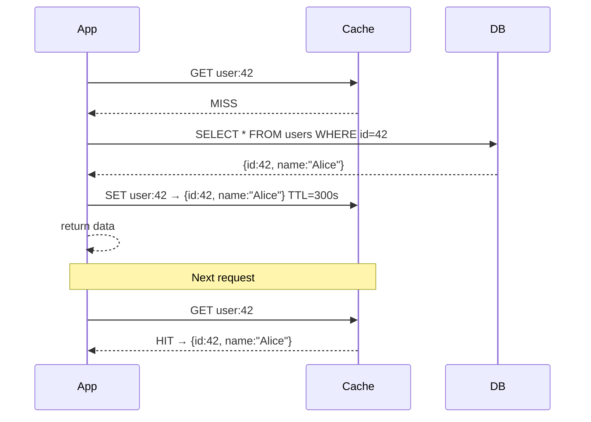
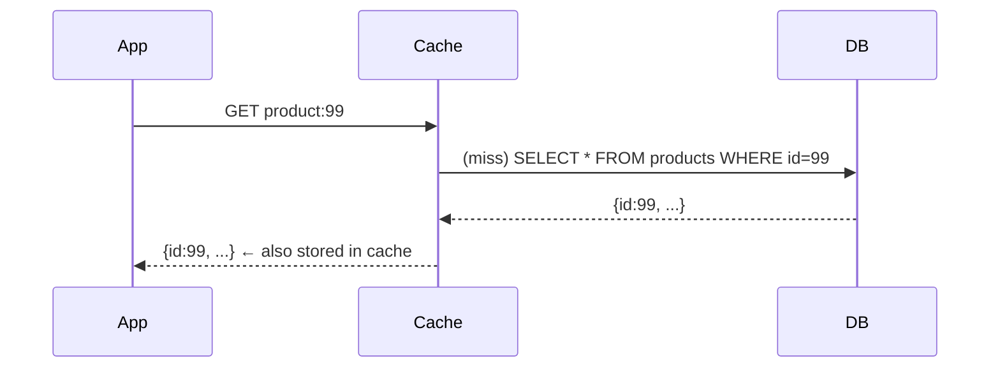
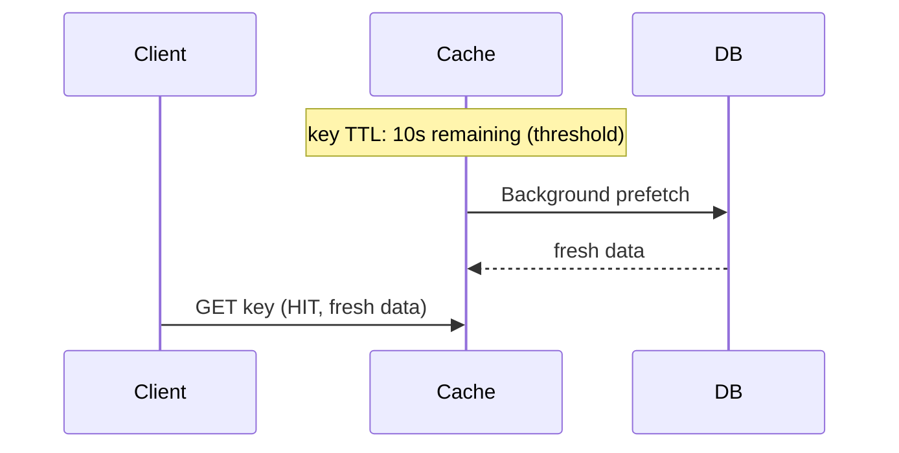
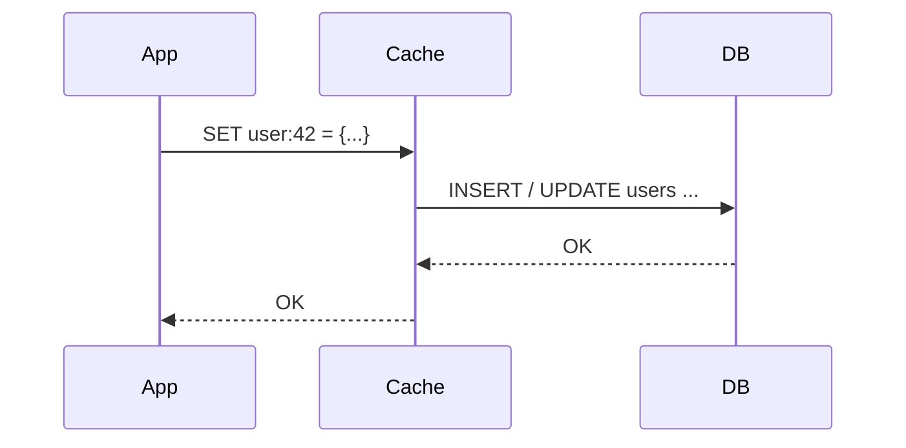
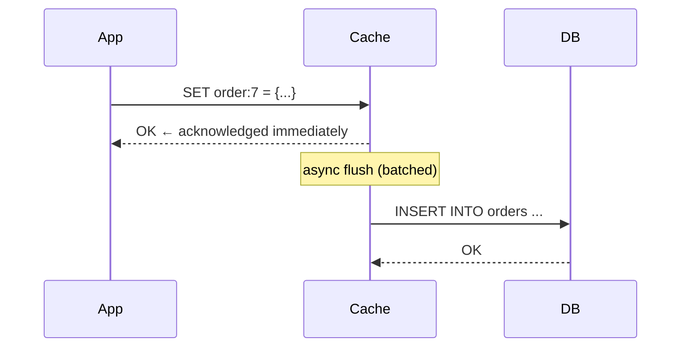

---
tags:
  - interview-critical
  - applied
  - for-saas
---

# Caching Strategies

Caching strategies define *who* is responsible for loading data into the cache and *when* writes propagate to the underlying store. Choosing the wrong strategy is a common source of stale reads, silent data loss, and thundering herds.

!!! tip "Applied companions"
    For multi-tier hierarchy design (CDN → app → Redis → DB), see **[Cache Hierarchy & Architecture](cache-hierarchy.md)**. For invalidation patterns, see **[Cache Invalidation in Practice](cache-invalidation-applied.md)**.

## You'll see this when...

- Database CPU pegged but most queries are read-the-same-data — needs caching
- Adding Redis / Memcached / DAX to the stack
- Stale data shown to users after writes — wrong strategy choice
- "Cache invalidation" debate at architecture review (it's hard for a reason)
- Read-through, write-through, write-back, cache-aside terminology in design docs
- Page load: 80% of time is DB queries that change rarely
- TTL values on cache entries — expiration-based strategy

## Read strategies

### Cache-Aside (Lazy Loading)

The application is fully responsible for cache interactions. The cache is never automatically populated — it fills only on misses.



```python
def get_user(user_id: int) -> dict:
    key = f"user:{user_id}"
    cached = redis.get(key)
    if cached:
        return json.loads(cached)

    user = db.query("SELECT * FROM users WHERE id = %s", user_id)
    redis.setex(key, 300, json.dumps(user))
    return user
```

**Pros:**
- Only caches data that is actually read — no cache bloat
- Cache failure is non-fatal; app falls through to DB
- Data model in cache can differ from DB schema (flexible)

**Cons:**
- First request after miss (cold start or expiry) is always slow
- Window of stale data between a DB write and cache refresh
- Application code must handle cache interactions explicitly

**Best for:** General-purpose read-heavy workloads. The default choice.

---

### Read-Through

The cache sits in front of the database. On a miss, the **cache itself** fetches from the DB and populates itself — the application only ever talks to the cache.

```
App → Cache → (on miss) Cache fetches DB → returns to App
                         Cache stores result
```



Providers like DAX (DynamoDB Accelerator) and NCache implement read-through natively.

**Pros:**
- Simpler application code — app always reads from cache
- Cache is always populated on first access

**Cons:**
- First request is still slow (cold start)
- Cache and DB schema must be coupled (cache layer owns the fetch logic)
- Harder to implement custom transformation logic

**Best for:** When using a managed cache layer (DAX, NCache) or when you want to keep application code clean.

---

### Refresh-Ahead (Prefetch)

The cache proactively refreshes entries **before** they expire, based on access patterns.

```
Cache detects key approaching TTL expiry
  → triggers background fetch from DB
  → updates cache before expiry
  → requests never see a miss
```



**Pros:**
- Near-zero latency even for hot keys — no cold-start penalty
- Smooths out periodic spikes caused by mass expiry

**Cons:**
- Wastes resources if prediction is wrong (data fetched but never re-read)
- Requires access pattern tracking or heuristics
- More complex to implement

**Best for:** Highly predictable, stable hot sets (e.g., homepage content, top-N products).

---

## Write strategies

### Write-Through

Every write goes to both the cache and the database **synchronously** before acknowledging the client.



**Pros:**
- Cache is always consistent with the database
- No stale reads after a write
- Simple reasoning — single write path

**Cons:**
- Write latency = cache latency + DB latency (additive)
- Cache is populated even for data that may never be read again
- If cache fails, writes must still go to DB (cache should not be the authoritative store)

**Best for:** Systems that read back data immediately after writing it (e.g., user profile updates).

---

### Write-Behind (Write-Back)

Write to the cache immediately, acknowledge the client, and **asynchronously** flush to the database.



**Pros:**
- Very low write latency — app never waits for DB
- Enables write batching/coalescing (multiple writes per DB round-trip)
- Absorbs write spikes gracefully

**Cons:**
- **Risk of data loss** if the cache crashes before flushing
- Complex failure handling — need durable write-ahead log or replication
- Eventual consistency between cache and DB

**Best for:** High write throughput with tolerable durability windows (e.g., counters, analytics, leaderboards). Redis AOF log mitigates the durability risk.

---

### Write-Around

Writes go **directly to the database**, bypassing the cache entirely. Cache is only populated on subsequent reads.

```
App → DB  (write, cache not touched)

Next read:
App → Cache MISS → DB → populate cache → return
```

**Pros:**
- Prevents cache pollution from write-heavy data that won't be read again
- Useful for bulk loads, batch writes, or infrequently-read data

**Cons:**
- First read after a write incurs a cache miss (higher read latency)
- Cache and DB can be out of sync for longer periods

**Best for:** Write-heavy workloads where data is rarely re-read (e.g., log ingestion, audit trails).

---

## Strategy comparison

| Strategy | Who populates cache | Write path | Consistency | Latency |
|---|---|---|---|---|
| Cache-Aside | Application (on miss) | App → DB, then invalidate cache | Eventual | Read miss: slow; hit: fast |
| Read-Through | Cache layer (on miss) | App → DB (cache not involved) | Eventual | Same as cache-aside |
| Refresh-Ahead | Cache (proactively) | App → DB | Near-real-time | Always fast for hot keys |
| Write-Through | Application | App → Cache → DB | Strong | Writes: slow |
| Write-Behind | Cache (async flush) | App → Cache, cache → DB async | Eventual | Writes: very fast |
| Write-Around | Application | App → DB (skip cache) | DB authoritative | Read after write: slow |

## Combining strategies

Real systems combine strategies by data type:

```
User session:       Cache-Aside + Write-Through   (strong consistency needed)
Product catalog:    Read-Through + Refresh-Ahead  (stable hot data)
Click counters:     Write-Behind                  (high write throughput)
Audit logs:         Write-Around                  (write-once, rarely read)
```

## Interview angle

!!! tip "What interviewers are testing"
    They want to see you justify the strategy against the system's consistency and throughput requirements — not just name the strategy.

**Strong answer pattern:**
1. Ask about consistency requirements: "Can users tolerate seeing stale data for X seconds?"
2. Ask about read/write ratio: "Is this read-heavy, write-heavy, or mixed?"
3. Default to **cache-aside** unless there's a reason not to
4. Choose **write-through** when the data must be fresh immediately after writes
5. Choose **write-behind** when you need to absorb write spikes and can tolerate brief inconsistency

## Test yourself

Answers are hidden — commit to an answer before expanding.

??? question "Why is cache-aside the default choice for general-purpose read-heavy workloads?"

    Three reasons: it only caches data that is actually read, so there's no cache bloat; cache failure is non-fatal because the app falls through to the DB; and the cached data model can differ from the DB schema. The trade-offs are that the first request after a miss is slow and there's a window of stale data between a DB write and the cache refresh.

??? question "Why does write-behind (write-back) risk data loss, and what mitigates it?"

    Write-behind acknowledges the client as soon as the cache accepts the write and flushes to the database asynchronously — so if the cache crashes before flushing, those writes are lost. Mitigation requires a durable write-ahead log or replication; for Redis, the AOF log mitigates the durability risk. That's why it's best for high write throughput with tolerable durability windows, like counters or leaderboards.

??? question "Your log-ingestion pipeline writes millions of audit records that are almost never read, and they're evicting genuinely hot data from the cache. Which strategy fixes this?"

    Write-around: writes go directly to the database, bypassing the cache entirely, and the cache is only populated on subsequent reads. This prevents cache pollution from write-heavy data that won't be read again. The cost is that the first read after a write incurs a cache miss, which is fine for write-once, rarely-read data like audit trails.

??? question "Your homepage content is cached with a TTL, and you observe periodic latency spikes when many entries expire at once. What strategy smooths this out?"

    Refresh-ahead (prefetch): the cache proactively refreshes entries before they expire based on access patterns, so requests for hot keys never see a miss and mass-expiry spikes are smoothed out. The costs are wasted resources when the prediction is wrong and added implementation complexity, which is why it's best for highly predictable, stable hot sets like homepage content or top-N products.

??? question "An interviewer asks: 'Users must see their profile update immediately after saving — which write strategy do you pick, and what does it cost?'"

    Write-through: every write goes synchronously to both the cache and the database before acknowledging the client, so the cache is always consistent with the DB and there are no stale reads after a write. The cost is write latency — cache latency plus DB latency, additive — and the cache gets populated even for data that may never be read again. This matches the strong-answer pattern: choose write-through when data must be fresh immediately after writes.

## Related topics

- [Cache Invalidation](cache-invalidation.md) — the hardest part of any strategy
- [Eviction Policies](eviction-policies.md) — what happens when the cache is full
- [Cache Patterns & Pitfalls](cache-patterns.md) — stampede, avalanche, penetration
- [Redis Deep Dive](redis.md) — implementation details for write-behind with AOF
