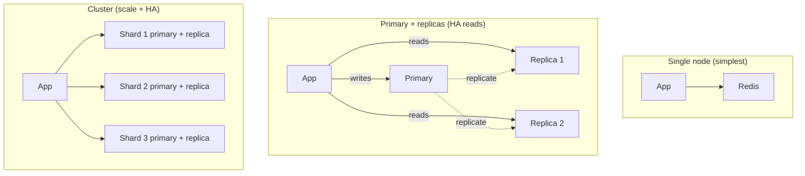

---
tags:
  - applied
  - for-scale
---

# Distributed Cache Best Practices

You're running Redis (or Memcached) in production at non-trivial scale. This page covers the operational reality: clustering, replication, failure modes, capacity planning, and the patterns real teams use to keep distributed caches reliable.

For the *concept* of distributed caching, see [Distributed Caching](distributed-caching.md). For Redis-specific depth, see [Redis Deep Dive](redis.md). This page focuses on **operating** distributed caches well.

---

## The reality: caches fail differently

A distributed cache is not just "Redis in front of Postgres." It's a stateful, network-attached service with its own failure modes. The biggest production incidents come from treating it like an afterthought.

```
Common cache-related incidents:
  - "Redis went down → DB melted from thundering herd"
  - "Wrong shard key → one Redis node hot, 99% CPU, latency spike"
  - "Lost cache after restart → 30 min cold-start period"
  - "Network partition split Redis cluster → wrong data served"
  - "Cache TTL too long → user updates not visible"
  - "Memory full → arbitrary evictions broke functionality"
```

This page covers each of these.

---

## Topology decisions

### Single node vs. cluster vs. replicated



| Topology | When | Caveats |
|---|---|---|
| **Single node** | Dev, small scale, can tolerate cache loss | No HA; cache flush = stampede |
| **Primary + replicas** | Read-heavy, want HA reads, fits in one node memory | Async replication; replica may lag |
| **Cluster (sharded)** | Working set > single node; need horizontal scale | Multi-key ops limited; complexity higher |
| **Cluster + per-shard replicas** | Production at scale | Most complex; best fault tolerance |

### Sizing thresholds

```
Single Redis node practical limits:
  Memory:      ~50GB (above this, RDB snapshots and replication get painful)
  Connections: ~10,000 (configurable; check OS file descriptor limits)
  Ops/sec:     ~100,000-500,000 (depending on op complexity)

When to add replicas: when you need HA or read scaling
When to add cluster:  when memory or ops/sec exceeds single-node limits
```

For most products: **single primary + 1 replica** is fine until ~$10M ARR or so. Cluster mode adds operational complexity that's only worth it at real scale.

---

## Redis Cluster basics

Redis Cluster shards data across nodes using 16,384 hash slots.

```
Key → CRC16(key) mod 16384 → hash slot → node

Nodes own ranges:
  Node A: slots 0-5460
  Node B: slots 5461-10922
  Node C: slots 10923-16383
```

### Client behaviour

```python
# Redis cluster client handles routing
from redis.cluster import RedisCluster

cluster = RedisCluster(host='cache-cluster.example.com', port=6379)

# Client computes hash slot, routes to correct node
cluster.set("user:1001", "alice")  # goes to node owning slot for 'user:1001'

# Client follows MOVED redirects on rebalance
# If node A says "MOVED 5461 nodeB:6379", client updates its slot map
```

### Hash tags — keeping related keys on the same shard

```python
# Without hash tag — keys may land on different shards
cluster.set("user:1001:profile", "...")  # slot X
cluster.set("user:1001:settings", "...") # slot Y (different node)

# Multi-key operation would fail with CROSSSLOT error
cluster.mget("user:1001:profile", "user:1001:settings")  # ERROR

# With hash tag (text in braces) — both keys to same shard
cluster.set("user:{1001}:profile", "...")
cluster.set("user:{1001}:settings", "...")
# Same hash slot — works for transactions, pipelines, multi-key ops
cluster.mget("user:{1001}:profile", "user:{1001}:settings")
```

Use hash tags when:
- Multiple keys are accessed together (one transaction, MGET, etc.)
- Same user/tenant's data should be co-located
- Lua scripts that touch multiple keys

### Multi-key limitations

```python
# Multi-key transaction — keys must hash to same slot
with cluster.pipeline() as pipe:
    pipe.multi()
    pipe.set("user:{1001}:a", "...")
    pipe.set("user:{1001}:b", "...")
    pipe.execute()

# Cross-shard transactions: NOT supported
# Cross-shard SCAN, FLUSHALL: special handling needed
```

This is why hash tags matter — they let you keep functionally-related keys together.

---

## Replication

### Async replication (default Redis)

```
Primary accepts write → returns OK to client immediately
                       → asynchronously sends to replicas

Replica lag: typically 1-100ms
After primary crash: replicas may have lost the last few writes (up to seconds worth)
```

```python
# Reads from replica may be stale
primary.set("user:1001", "alice")
replica.get("user:1001")  # might return old value or nil for ~10-100ms
```

### Sync via WAIT command

```python
primary.set("user:1001", "alice")
# Wait for at least 1 replica to acknowledge, with 100ms timeout
replicas_synced = primary.wait(num_replicas=1, timeout=100)
if replicas_synced < 1:
    # Replica didn't catch up — handle (rare, but real)
    log.warning("Replica lag exceeded")
```

WAIT gives you partial sync semantics. Most apps don't need it; ones doing critical writes (sessions, locks) sometimes do.

### Failover (Redis Sentinel or Cluster mode)

```
1. Primary becomes unreachable
2. Sentinel/cluster detects (after ~5-30 seconds, configurable)
3. Quorum of sentinels/nodes agree on failure
4. One replica promoted to primary
5. Clients updated (via DNS, or client library auto-discovery)
```

Failover lag: **5-60 seconds typical**. During this window, writes fail or hit the stale primary. Plan for this:

```python
def write_with_retry(key, value, max_retries=3):
    for attempt in range(max_retries):
        try:
            return redis.set(key, value)
        except (ConnectionError, RedisError) as e:
            if attempt < max_retries - 1:
                time.sleep(0.5 * (2 ** attempt))  # exponential backoff
            else:
                # Cache write failed — fall back to direct DB
                log.error(f"Cache write failed after retries: {e}")
                # Don't fail the user request
```

---

## Persistence options

Redis has two persistence mechanisms (often used together):

### RDB (snapshots)

Point-in-time dumps to disk every N seconds or after M writes.

```
save 900 1       # save if >=1 key changed in 900s
save 300 10      # ...
save 60 10000    # ...
```

**Pros**: compact; fast recovery; minimal performance impact
**Cons**: up to N seconds of data loss; fork during snapshot can spike memory

### AOF (Append-Only File)

Logs every write. Replayed on restart.

```
appendonly yes
appendfsync everysec  # fsync once per second; trade durability for performance
```

**Pros**: less data loss (up to 1 second with `everysec`)
**Cons**: larger files; slower recovery; more write IO

### Recommendation

```
Cache-only use case (data can be lost):
  Disable persistence (save "")
  Restart = empty cache = stampede risk (mitigate elsewhere)

Cache where data loss = problem:
  Enable RDB + AOF
  Trade-off: ~20% performance hit but durable

Session storage / critical state:
  AOF with fsync every write (slow but durable)
  Or use MemoryDB (Redis with strict durability)
```

---

## Eviction policies

When memory fills up, Redis must evict something. The policy matters.

```
maxmemory 10gb
maxmemory-policy allkeys-lru
```

| Policy | What it evicts | When to use |
|---|---|---|
| `noeviction` | Nothing; writes fail | Critical state; don't allow loss |
| `allkeys-lru` | Least-recently-used keys | Most caches; typical default |
| `allkeys-lfu` | Least-frequently-used | Hit-rate optimised; better for skewed workloads |
| `volatile-lru` | LRU among keys with TTL | Mix of "permanent" and "cacheable" data |
| `volatile-ttl` | Closest-to-expiring | Time-sensitive eviction |
| `allkeys-random` | Random keys | Rarely best |

**Default to `allkeys-lru`** unless you have a specific reason.

### Monitoring eviction

```
# Redis CLI
redis-cli INFO stats | grep evicted_keys

# Healthy: low or zero evictions
# Unhealthy: thousands per second → memory too small or working set too big
```

High eviction rate = cache hit rate dropping = you're losing the benefit. Either:
- Increase memory
- Reduce TTL on cold keys (free memory for hot keys)
- Audit what's in cache — is something taking unexpected space?

---

## Connection management

A common source of pain at scale.

### Connection pooling per app instance

```python
# DON'T: connection per request
def handler():
    r = redis.Redis(host='cache')  # new connection!
    return r.get("foo")
# At 1000 RPS: 1000 connections per second created/torn down

# DO: shared pool
pool = redis.ConnectionPool(host='cache', max_connections=50)

def handler():
    r = redis.Redis(connection_pool=pool)
    return r.get("foo")
```

### Sizing connections

```
Total connections to Redis = app_instances × pool_size_per_instance

Example:
  50 app instances × 20 connections each = 1000 connections to Redis primary
  Redis maxclients default: 10000 — fine
  Each connection: ~16KB Redis memory + ~5KB OS overhead

Watch for:
  - Connection limit on Redis (maxclients)
  - File descriptor limit on Redis OS
  - Network throughput at edge of Redis instance
```

### Cluster mode: connections × nodes

```
Single primary: 1000 connections
Cluster (8 shards): 1000 connections to each = 8000 total

For very large clusters:
  Use proxy (Envoy, Twemproxy, Redis Cluster-aware proxy)
  → app talks to ~10 proxies; proxies maintain connections to all shards
```

---

## Hot key problem

The single most common scaling issue with distributed caches.

### Diagnosis

```python
# Sample requests to find the hot key
# Redis CLI monitoring (use sparingly — affects performance)
redis-cli MONITOR | head -10000 | awk '{print $4}' | sort | uniq -c | sort -rn | head

# Output:
#  4523  "GET" "trending:global"     ← 45% of all traffic
#   234  "GET" "user:1001"
#   210  "GET" "user:1002"
#    ...
```

### Mitigation 1: Local in-process cache for hot keys

```python
from cachetools import TTLCache

local_cache = TTLCache(maxsize=100, ttl=30)

def get_trending():
    if 'trending:global' in local_cache:
        return local_cache['trending:global']
    
    # Redis hot key only hit by N (server count) per 30 seconds
    value = redis.get('trending:global')
    local_cache['trending:global'] = value
    return value
```

200 app servers × 1 read per 30s = ~7 Redis reads/sec for the hot key (vs. 10,000+).

### Mitigation 2: Replicate the hot key

For a Redis cluster, you can manually replicate hot keys across multiple shards:

```python
# Write the hot value to N keys; clients pick randomly
def update_trending(data):
    for i in range(10):
        redis.setex(f"trending:global:{i}", 300, data)

def get_trending():
    # Pick a random replica
    i = random.randint(0, 9)
    return redis.get(f"trending:global:{i}")
```

Trade-off: write amplification (10× writes), more cache memory, slightly stale variants.

### Mitigation 3: Cache the hot key client-side with very short TTL

Same as mitigation 1, just at every layer (CDN, proxy, in-process). The closer the cache to the request, the less Redis is hit.

---

## Cache stampede / thundering herd

When a hot key expires, many clients miss simultaneously and hammer the origin.

```
TTL expires at 10:00:00.000
At 10:00:00.001: 1000 simultaneous reads → 1000 simultaneous cache misses
                 → 1000 simultaneous DB queries
                 → DB melts
```

### Mitigation 1: Single-flight pattern

Only one request per key reloads from origin; others wait.

```python
def get_with_singleflight(key):
    cached = redis.get(key)
    if cached:
        return cached
    
    # Try to acquire reload lock
    lock_key = f"{key}:lock"
    if redis.set(lock_key, '1', nx=True, ex=5):
        try:
            value = db.fetch(...)  # expensive
            redis.setex(key, 300, value)
            return value
        finally:
            redis.delete(lock_key)
    else:
        # Another request is reloading; wait briefly
        time.sleep(0.05)
        return get_with_singleflight(key)  # recurse
```

### Mitigation 2: Probabilistic early refresh

Some requests refresh before TTL expires, smoothing the load.

```python
def get_with_probabilistic_refresh(key, ttl=300):
    cached = redis.get(key)
    if not cached:
        return refresh(key, ttl)
    
    value, expires_at = json.loads(cached)
    age = time.time() - (expires_at - ttl)
    
    # Probability of early refresh increases as TTL nears
    if random.random() < (age / ttl) ** 2:  # quadratic curve
        # Some lucky request refreshes early
        threading.Thread(target=refresh, args=(key, ttl)).start()
    
    return value
```

Cloudflare uses a similar technique at the edge.

### Mitigation 3: Stale-while-revalidate

Serve the stale value while refreshing asynchronously.

```python
def get_swr(key, ttl=300, stale_ttl=600):
    cached = redis.get(key)
    if cached:
        value, fresh_until = json.loads(cached)
        if time.time() < fresh_until:
            return value  # fresh
        else:
            # Stale but acceptable; refresh in background
            threading.Thread(target=refresh, args=(key, ttl, stale_ttl)).start()
            return value
    return refresh(key, ttl, stale_ttl)  # cold start
```

User always gets a fast response; freshness sacrificed slightly.

---

## Cache cold-start problem

When you restart Redis (or its node fails), the cache is empty. **Every request misses → DB stampede.**

### Mitigation 1: Persistence

Enable RDB or AOF. On restart, cache is mostly warm.

```
appendonly yes
save 900 1
save 300 10
```

### Mitigation 2: Pre-warming

Before adding a new Redis to traffic, warm it:

```python
def warm_cache(redis_new):
    # Replay most-recent N keys from old cache or batch-load from DB
    for product_id in get_top_products(10000):
        product = db.fetch_product(product_id)
        redis_new.setex(f"product:{product_id}", 3600, json.dumps(product))
    # Now safe to add to traffic
```

### Mitigation 3: Gradual ramp-up

Use canary-like rollout for cache nodes:

```
New Redis node added → receives 1% of traffic → cache fills → 10% → 50% → 100%
Origin sees small spike, not full stampede
```

---

## Capacity planning

### Memory budget

```
Working set size + ~30% overhead + ~20% headroom for spikes

Example:
  10M sessions × 4KB each = 40GB
  + 12GB Redis overhead (data structures, connections)
  + 10GB headroom
  → 62GB needed
```

Round up to next instance class (e.g., `cache.r6g.2xlarge` with 52GB → cache.r6g.4xlarge with 105GB).

### IO budget

```
Operations per second × avg op size = network bandwidth

100K ops/sec × 1KB average = 100MB/sec = 800 Mbps
```

Most cloud cache instances support 10-25 Gbps. Network rarely the bottleneck unless very large objects.

### Connection budget

```
maxclients = 65000  (typical Redis setting)

App fleet: 200 instances × 20 connections each = 4000 connections
Headroom: easily fits within 65K
```

If approaching the limit, use a connection pooler (e.g., Twemproxy, Envoy with Redis filter, Redis Enterprise's built-in proxy).

---

## Multi-region considerations

### Pattern 1: Per-region cache (most common)

```
US region: Redis Cluster (own data)
EU region: Redis Cluster (own data)
Each cache populated lazily from its regional DB
```

**Pros**: simple; low latency for in-region clients
**Cons**: cache invalidation across regions is hard; if data is global, each region's cache is independent

### Pattern 2: Globally replicated cache

```
Redis Enterprise / AWS MemoryDB / Cosmos DB Cache:
  Active-active across regions
  Each region writes locally; replicates async to others
```

**Pros**: each region has data from anywhere; no cross-region reads
**Cons**: cross-region consistency complex; CRDT-like data structures or last-write-wins; more expensive

### Pattern 3: Single-region cache + regional read replicas

```
Primary Redis in us-east
Read replicas in eu-west, ap-south
Writes go to primary; cross-region reads OK from local replica
```

**Pros**: simple writes; fast local reads
**Cons**: write latency for non-primary regions; primary region failure affects all

For most products: **Pattern 1 (per-region cache)** is fine. Data residency / global consistency drives the others.

---

## Security

```yaml
Authentication:
  ✓ requirepass enabled (or ACL with users in Redis 6+)
  ✓ Strong password; rotate periodically
  ✓ Don't commit passwords; use secrets manager

Network:
  ✓ Private subnet only (no public access)
  ✓ Security group limits inbound to app instances
  ✓ TLS in transit (Redis 6+ supports natively)
  ✓ VPC endpoints for managed services (ElastiCache)

Encryption:
  ✓ At-rest encryption (managed services usually default)
  ✓ TLS in transit
  ✓ Secrets in cache are still secrets — same care as DB
```

### Don't put PII in cache without controls

```python
# WRONG: arbitrary PII in cache, retained for hours
redis.setex(f"user:{user_id}:profile", 3600, json.dumps(full_profile))

# BETTER: cache the minimum needed
redis.setex(f"user:{user_id}:name", 300, name_only)
redis.setex(f"user:{user_id}:permissions", 300, permissions_only)
```

Especially with GDPR/CCPA: a user's "delete me" request must propagate to cache. Either short TTL or explicit invalidation.

---

## Observability

```yaml
Essential metrics:
  - Memory used / max memory ratio (alert at >85%)
  - Eviction rate (alert if non-zero in production)
  - Connection count / max connections
  - Hit rate (keyspace_hits / (keyspace_hits + keyspace_misses))
  - Latency p50/p99 from client perspective
  - Operations per second
  - Replication lag (if replicated)

Cluster-specific:
  - Per-shard memory and ops/sec (find imbalance)
  - Cluster state (ok / pfail / fail)
  - Slot migrations in progress

Investigations:
  - Slowlog: SLOWLOG GET 100  (find slow commands)
  - INFO commandstats: which commands are hot
  - MEMORY USAGE on suspicious keys
```

### What to alert on

```
Critical (page immediately):
  ✓ Cluster state != ok
  ✓ Memory > 95%
  ✓ Cache primary unreachable
  ✓ Replication broken

Warning (look during business hours):
  ✓ Eviction rate > 0 sustained
  ✓ Hit rate dropped below normal baseline
  ✓ Latency p99 > 50ms
  ✓ Connection count approaching limit
```

---

## Common operations playbook

### Adding a node to Redis Cluster

```bash
# 1. Provision the new node
redis-cli --cluster add-node new-node:6379 existing-node:6379

# 2. Reshard slots to give it a share
redis-cli --cluster reshard existing-node:6379 \
  --cluster-from <existing-node-id> \
  --cluster-to <new-node-id> \
  --cluster-slots 1024 \
  --cluster-yes

# Watch for SLOTSMIGRATING / SLOTSIMPORTING states; clients adapt automatically
```

### Removing a node

```bash
# Move all slots off first
redis-cli --cluster reshard target-cluster:6379 \
  --cluster-from <node-to-remove-id> \
  --cluster-to <other-node-id> \
  --cluster-slots <slot-count> \
  --cluster-yes

# Then remove from cluster
redis-cli --cluster del-node target-cluster:6379 <node-id>
```

### Failover

```bash
# Manual failover (e.g., for OS upgrade on primary)
redis-cli -p 6379 CLUSTER FAILOVER

# Force failover (primary unreachable)
redis-cli -p 6379 CLUSTER FAILOVER FORCE
```

### Renaming or migrating

```bash
# Migrate one key
redis-cli MIGRATE target-host 6379 mykey 0 5000

# Online migration of entire instance
# Use redis-shake or RedisGears, or use Aiven/RedisCloud's migration tools
```

---

## Cost optimisation

### Right-sizing

```
Underprovisioned: high evictions, low hit rate, app slowdown
Overprovisioned: paying for unused memory

Goal: 50-70% memory utilisation during peak, <5% evictions
```

### Reserved instances / commitment discounts

Cache nodes are 24/7. Reserved instances (AWS) or commitments save 30-50%.

### Tiered storage (Redis Enterprise)

For very large datasets, "hot" stays in RAM, "warm" goes to local SSD. Saves cost at the expense of latency for cold data.

### Don't cache everything

Caching costs money. Audit periodically: which keys have low hit rates? Drop or shorten TTL.

```bash
# Investigate
redis-cli --hotkeys             # find hot keys
redis-cli --bigkeys             # find large keys
redis-cli MEMORY USAGE somekey  # specific key
```

---

## Anti-patterns

| Anti-pattern | Better |
|---|---|
| Connection-per-request | Connection pool per app instance |
| Cache as source of truth | Cache as hint; DB always source |
| Storing 1MB blobs in Redis | Store reference; blob in S3 |
| `KEYS *` in production | `SCAN` with cursor; `KEYS` blocks Redis |
| `FLUSHDB` "to debug" | Per-key delete; FLUSHDB blocks |
| Same TTL for all keys | Tune per key class |
| Manual Redis cluster operations under load | Use managed service (ElastiCache, MemoryDB) |
| Synchronous WAIT on every write | Use only for critical writes |
| Replicating PII unnecessarily | Cache minimum; expire fast |

---

## Choosing between Redis and Memcached

Both work for caching; Redis is more flexible.

| | Redis | Memcached |
|---|---|---|
| Data structures | Strings, hashes, lists, sets, sorted sets, streams | Strings only |
| Persistence | Optional (RDB, AOF) | None |
| Replication | Yes | No (use mcrouter or similar) |
| Cluster mode | Built-in | Client-side hashing |
| Pub/Sub | Yes | No |
| Atomic operations | Many (INCR, MGET, transactions) | INCR, basic |
| Memory efficiency | Good | Slightly better for simple key-value |

**Default to Redis** unless you have a specific reason to use Memcached (extreme key-value simplicity at huge scale).

---

## When to use managed (ElastiCache, MemoryDB, Cloud Memorystore)

```
DIY Redis on EC2:
  Pro: complete control, cheaper at huge scale
  Con: operational burden (patching, failover, backups, scaling)

Managed (ElastiCache, MemoryDB):
  Pro: managed failover, snapshots, monitoring, security
  Con: less control, $/month is higher

Default: use managed until cost justifies DIY
```

For most teams under 100 engineers, managed is the right choice. The operational cost of self-hosting Redis at scale exceeds the price difference.

---

## Interview angle

!!! tip "What interviewers are testing"
    Whether you've actually operated a distributed cache — not just used `SET` / `GET` from a tutorial.

**Strong answer pattern:**
1. Topology: single → primary+replicas → cluster, based on scale
2. Eviction policy + memory budget; watch evictions
3. Hot keys mitigated via local in-process cache or replicated keys
4. Cache stampede via single-flight or stale-while-revalidate
5. Cold start mitigated via persistence or pre-warming
6. Connection pooling per app instance
7. Cache is a hint, not source of truth

**Common follow-up:** *"Your Redis just lost all data after a node failure. What now?"*
> Assess immediate impact: thundering herd from cold cache. Implement protections — single-flight on hot keys, circuit breakers on DB. Then audit persistence (was AOF on?), failover config (did Sentinel/cluster failover work?), backup recovery time. Long-term: enable persistence + replication + automated failover; pre-warm new instances before adding to traffic; design app to degrade gracefully when cache is unavailable (slower DB queries OK; outage not OK).

---

## Related

- [Distributed Caching](distributed-caching.md) — concept
- [Redis Deep Dive](redis.md) — Redis internals
- [Cache Patterns & Pitfalls](cache-patterns.md) — stampedes, hot keys
- [Cache Invalidation in Practice](cache-invalidation-applied.md) — keeping fresh
- [Cache Hierarchy](cache-hierarchy.md) — multi-tier design
- [Caching Strategies](caching-strategies.md) — read/write patterns
- [Hot Partitions](../fundamentals/hot-partitions.md) — same problem in DBs
