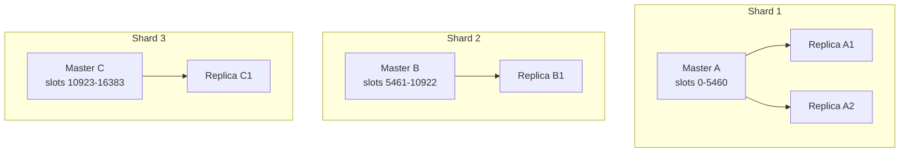
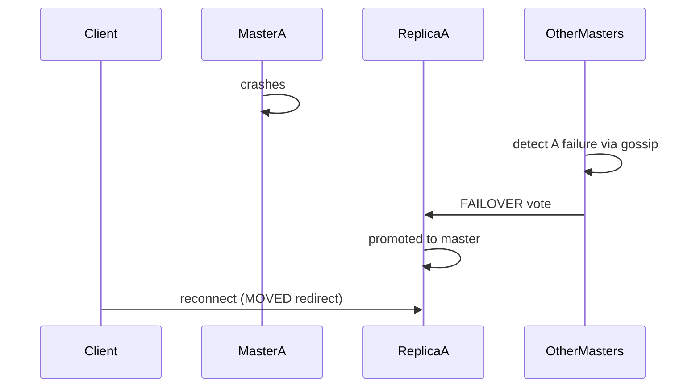
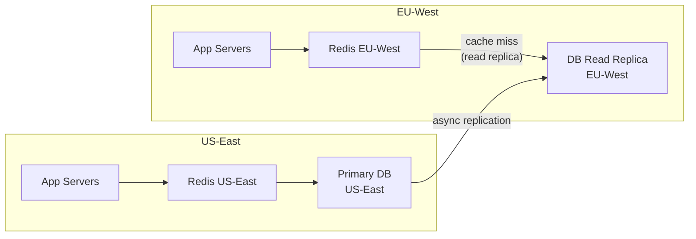

# Distributed Caching

A distributed cache spans multiple nodes to provide more memory capacity than a single server, survive node failures, and scale read/write throughput horizontally.

## Why distribute a cache?

```
Single Redis node:
  Max memory: ~100-200 GB (practical limit per instance)
  Throughput: ~100K ops/sec (single-threaded)
  Failure: all data lost / unavailable

Distributed cache (Redis Cluster, 6 nodes):
  Max memory: 600 GB+ (sharded)
  Throughput: 600K ops/sec (linear scaling)
  Failure: 1 node failure handled by replicas
```

---

## Sharding (data partitioning)

Sharding distributes keys across multiple cache nodes. Each node owns a subset of the key space.

### Naive modulo sharding

```python
node_index = hash(key) % num_nodes
```

**Problem:** Adding or removing a node remaps almost all keys:

```
3 nodes: key → hash % 3
Add 1 node (now 4): key → hash % 4

~75% of keys now map to a different node.
Result: mass cache misses ("thundering herd" on DB)
```

### Consistent hashing

Maps both keys and nodes onto a virtual ring. Each key is assigned to the nearest node clockwise on the ring.

```
        Node A (0°)
       /            \
  Key X        Key Y
      \            /
  Node C (240°)--Node B (120°)
```

Adding or removing one node affects only ~1/N of keys (where N is the number of nodes):

```
Before: 3 nodes, ~1/3 of keys each
Add 1 node: only keys between the new node and its predecessor move
            ~1/4 of keys affected instead of 75%
```

See [Consistent Hashing](../patterns/consistent-hashing.md) for full implementation details.

### Redis Cluster sharding (hash slots)

Redis Cluster divides the key space into **16,384 hash slots**. Each node owns a range of slots.

```
Node A: slots 0–5460
Node B: slots 5461–10922
Node C: slots 10923–16383

Slot assignment:
  CRC16(key) % 16384 = slot number
```

```
127.0.0.1:7000> CLUSTER INFO
cluster_enabled:1
cluster_size:3
cluster_slots_assigned:16384
cluster_slots_ok:16384

127.0.0.1:7000> CLUSTER NODES
a1b2... 127.0.0.1:7000 master - 0 0 1 connected 0-5460
c3d4... 127.0.0.1:7001 master - 0 0 2 connected 5461-10922
e5f6... 127.0.0.1:7002 master - 0 0 3 connected 10923-16383
```

**Hash tags:** Force multiple keys to the same slot using `{tag}`:

```python
# These keys all go to the same node (same slot as "user:42")
"user:42"
"{user:42}:profile"
"{user:42}:sessions"

# Needed for multi-key operations (MSET, transactions, Lua scripts)
redis.mset({"{user:42}:name": "Alice", "{user:42}:email": "alice@example.com"})
```

Without hash tags, multi-key operations across slots fail with `CROSSSLOT` error.

---

## Replication

Each shard master has one or more replicas that hold a copy of the data.



**Replication is asynchronous by default in Redis:**

```
Client → Master: SET key value
Master → Client: OK  (acknowledged before replica sync)
Master → Replica: async replication

Window: if master crashes before replica receives the write → data loss
```

**WAIT command for synchronous replication:**

```python
# Wait for N replicas to acknowledge before returning
redis.execute_command("WAIT", 1, 100)  # 1 replica, 100ms timeout
```

### Read from replicas

By default, Redis Cluster routes all reads to the master. To distribute reads to replicas:

```python
# Read from replica (may be slightly stale)
redis.execute_command("READONLY")
redis.get("key")
```

Use `READONLY` mode per-connection to allow reads from replica. Useful for read-heavy workloads where slight staleness is acceptable.

---

## Failover

When a master node fails, Redis Cluster promotes a replica automatically via the gossip protocol.



**Failover timeline:**
- Detection: ~5s (configurable via `cluster-node-timeout`)
- Promotion: ~2–5s
- Total downtime: ~7–10s

**No replica configured:** If a shard has no replica and the master fails, that shard's key space is **unavailable**. Cluster may enter fail state.

```
# Minimum production Redis Cluster: 3 masters + 3 replicas (6 nodes)
# Tolerates: 1 master failure per shard
```

---

## Cluster vs Sentinel vs Standalone

| | Standalone | Sentinel | Redis Cluster |
|---|---|---|---|
| **Purpose** | Single instance | HA for single shard | Horizontal sharding + HA |
| **Sharding** | No | No | Yes (16,384 slots) |
| **Failover** | Manual | Automatic | Automatic |
| **Multi-key ops** | Yes | Yes | Only within same slot |
| **Memory limit** | 1 node | 1 node | N × node memory |
| **Complexity** | Low | Medium | High |
| **Min nodes** | 1 | 3 (Sentinel) + 2 (Redis) | 6 (3 master + 3 replica) |

**Choose:**
- **Standalone:** Dev, small apps, cache that can be cold-started
- **Sentinel:** Single-shard HA without sharding (< 200 GB, simple setup)
- **Cluster:** Large datasets, high throughput, production-grade HA

---

## Cross-region caching

For global systems, a regional cache per data center avoids cross-region latency:



**Challenges:**
- DB writes happen in US-East → EU cache is eventually consistent
- Invalidation must propagate across regions (add cross-region Kafka topic)
- Some latency before EU reads the latest data

---

## Cache consistency in distributed systems

Distributed caches introduce two classes of consistency problems:

### 1. Read-your-own-writes

User updates their profile. Their next request hits a different app server that reads from a replica that hasn't replicated the write yet.

**Solutions:**
- Sticky sessions (route user to same server)
- Write to master, wait for replica sync (`WAIT 1 100`)
- Client-side cache (store latest write locally)

### 2. Lost updates

Two app servers read the same key, modify it, and write back:

```
Server 1: read counter=10
Server 2: read counter=10
Server 1: write counter=11
Server 2: write counter=11  ← Server 1's update lost!
```

**Solutions:**
- Redis atomic operations (`INCR`, `INCRBY`)
- Lua scripts (execute as atomic transaction)
- Optimistic locking with `WATCH`/`MULTI`/`EXEC`

```python
# Atomic increment — no lost update
redis.incr("page:view_count")

# Optimistic locking
with redis.pipeline() as pipe:
    while True:
        try:
            pipe.watch("balance:user:42")
            balance = int(pipe.get("balance:user:42"))
            pipe.multi()
            pipe.set("balance:user:42", balance + 100)
            pipe.execute()
            break
        except WatchError:
            continue  # retry on concurrent modification
```

---

## AWS managed options

| Need | AWS Service | Notes |
|---|---|---|
| Redis cluster | ElastiCache for Redis | Cluster mode enabled for sharding |
| Simple Redis | ElastiCache (cluster mode off) | Single shard, multi-AZ via Sentinel |
| DynamoDB cache | DAX (DynamoDB Accelerator) | Write-through, microsecond reads |
| Global distribution | ElastiCache Global Datastore | Cross-region replication for Redis |
| Serverless cache | ElastiCache Serverless | Auto-scales, no cluster management |

```
ElastiCache cluster mode enabled:
  - Up to 500 nodes
  - Up to 500 TB total memory
  - Online resharding (no downtime)

ElastiCache Global Datastore:
  - Primary cluster in one region
  - Up to 2 secondary clusters (read replicas in other regions)
  - < 1 second replication lag
```

---

## Interview angle

!!! tip "What interviewers are testing"
    They want to see you handle scale (more data than one node holds) and failure (what happens when a node goes down).

**Strong answer pattern:**
1. Start with single Redis — establish why you need to distribute
2. Introduce sharding via consistent hashing or Redis Cluster
3. Add replication: 1 replica per master minimum
4. Describe automatic failover (Redis Sentinel or Cluster)
5. Address cross-region if the system is global

**Common follow-up:** *"What happens during a failover?"*
> ~5–10s of unavailability for that shard during automatic failover. For the brief window, reads fall through to the DB. Mitigation: circuit breaker on the cache client, DB connection pool headroom for the increased load.

## Related topics

- [Consistent Hashing](../patterns/consistent-hashing.md) — the key distribution algorithm
- [Redis Deep Dive](redis.md) — Redis Cluster internals
- [Replication](../patterns/replication.md) — general replication patterns
- [Cache Patterns & Pitfalls](cache-patterns.md) — what goes wrong in distributed caches
