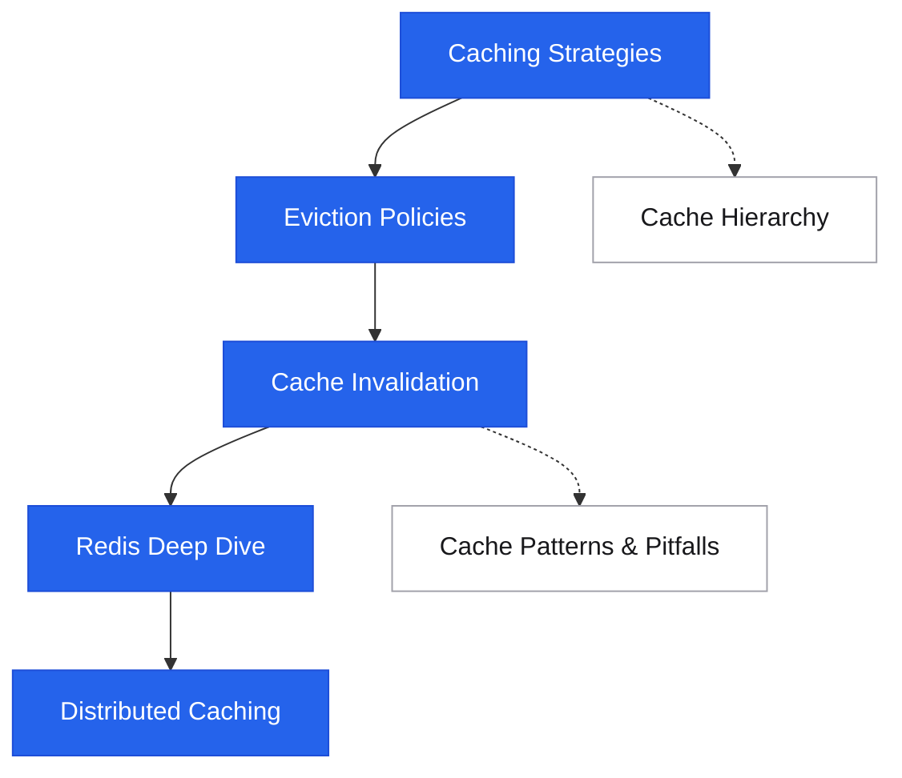
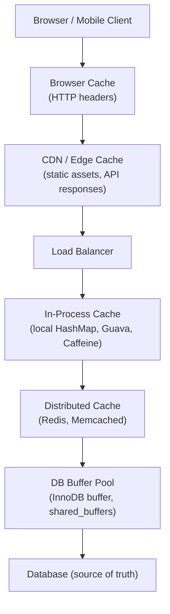

# Caching

<div class="sec-hero" markdown>
<span class="ey">Data · speed & freshness</span>
Storing copies of data in a fast-access layer so future requests can be served faster — one of the highest-leverage techniques in system design, used at every layer from CPU registers to global CDN edges.
</div>

## Roadmap

Follow the spine top-to-bottom your first time. Dashed branches hang off the topic they support — grab them when you need them.

<div class="sd-mermaid-links" data-links='{
  "Caching Strategies": "caching-strategies/",
  "Eviction Policies": "eviction-policies/",
  "Cache Invalidation": "cache-invalidation/",
  "Redis Deep Dive": "redis/",
  "Distributed Caching": "distributed-caching/",
  "Cache Patterns & Pitfalls": "cache-patterns/",
  "Cache Hierarchy": "cache-hierarchy/"
}'></div>



## Suggested reading order

New to this topic? Read these in order — each builds on the previous:

1. [Caching Strategies](caching-strategies.md) — how data gets into and out of a cache; everything else assumes this vocabulary
2. [Eviction Policies](eviction-policies.md) — what happens when the cache is full
3. [Cache Invalidation](cache-invalidation.md) — the hard part: keeping the cache honest
4. [Redis Deep Dive](redis.md) — the tool you'll actually use to apply the first three
5. [Distributed Caching](distributed-caching.md) — sharding and replication once one node isn't enough

**Then, as needed (reference):** [Cache Patterns & Pitfalls](cache-patterns.md)

**Advanced — come back later:** [Cache Invalidation Applied](cache-invalidation-applied.md), [Distributed Cache Best Practices](distributed-cache-best-practices.md), [Cache Hierarchy](cache-hierarchy.md)

## Why cache?

```
Without cache:
  Request → App → Database (5–50ms)

With cache:
  Request → App → Cache hit (0.1–1ms)
  Request → App → Cache miss → Database → populate cache (5–50ms first time only)
```

**Core trade-off:** Speed vs. consistency. A cache is always a snapshot of truth. The question is how stale you can tolerate.

## Cache layers in a system



Each layer adds latency but increases durability and consistency. Pick the right layer for the data's access pattern and staleness tolerance.

## Topics in this section

The full toolkit — strategies, eviction, invalidation, distribution, and the pitfalls that bite in production.

<div class="pcards">
<a class="pcard" href="caching-strategies/"><span class="t">Caching Strategies</span><span class="d">Cache-aside, read-through, write-through, write-behind, refresh-ahead</span></a>
<a class="pcard" href="eviction-policies/"><span class="t">Eviction Policies</span><span class="d">LRU, LFU, ARC, TTL, FIFO — when and why to use each</span></a>
<a class="pcard" href="cache-invalidation/"><span class="t">Cache Invalidation</span><span class="d">TTL, event-driven, versioning, the two-phase problem</span></a>
<a class="pcard" href="distributed-caching/"><span class="t">Distributed Caching</span><span class="d">Sharding, replication, Redis Cluster, consistency</span></a>
<a class="pcard" href="redis/"><span class="t">Redis Deep Dive</span><span class="d">Data structures, persistence, clustering, pub/sub, use cases</span></a>
<a class="pcard" href="cache-patterns/"><span class="t">Cache Patterns & Pitfalls</span><span class="d">Stampede, penetration, avalanche, warming strategies</span></a>
</div>

## The three cache problems (interview shortlist)

| Problem | Cause | Fix |
|---|---|---|
| **Cache stampede** | Hot key expires → burst of DB queries | Mutex, probabilistic early expiry, staggered TTL |
| **Cache penetration** | Queries for keys that don't exist (never cached) | Bloom filter, cache null values |
| **Cache avalanche** | Many keys expire simultaneously | TTL jitter, multi-level cache, circuit breaker |

## Related topics

- [Key-Value Stores](../storage/key-value-stores.md) — Redis as a primary database
- [CDN](../networking/cdn.md) — caching at the edge
- [Consistent Hashing](../patterns/consistent-hashing.md) — how distributed caches shard keys
- [Distributed Cache case study](../case-studies/distributed-cache.md) — full system design
