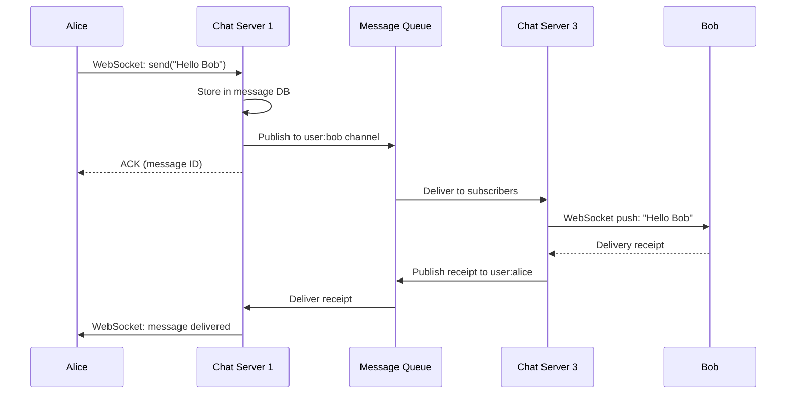

# Design a Chat System (WhatsApp/Slack)

## Problem statement

Design a real-time messaging system that:
- 1-on-1 messaging and group chats (up to 500 members)
- 50 million DAU, 10 billion messages/day
- Messages delivered in < 500ms
- Message history persisted, searchable
- Online presence indicators
- Message delivery receipts (sent, delivered, read)

## Clarifying questions

```
1. 1-on-1 only or groups?
   → Both: 1-on-1 and groups up to 500 members

2. Message types?
   → Text, images, files (no video calls in scope)

3. How long is history retained?
   → Forever (like WhatsApp)

4. Multi-device?
   → Yes: user on phone + laptop simultaneously

5. Message ordering guarantees?
   → Messages within a conversation must be ordered

6. Strong delivery guarantee?
   → At-least-once delivery; deduplication on client
```

## Scale estimation

```
DAU: 50M
Messages: 10B/day = 115,000/sec
Message size: avg 100 bytes text + metadata
Storage: 10B × 100B = 1TB/day
Network: 115K msg/s × 100B = ~11.5 MB/s

Read:write ≈ 1:1 (message sent = message received)
```

## Real-time delivery: WebSocket architecture

HTTP polling doesn't work for chat — too slow, too wasteful. WebSocket enables server-push:

```
Client A (phone) ──WebSocket──► Chat Server 1
Client A (laptop) ──WebSocket──► Chat Server 2
Client B ──WebSocket──► Chat Server 3
```

### Connection management problem

With 50M DAU, some users connect to Chat Server 1, others to Chat Server 3. When A sends to B:

```
A connected to Server 1
B connected to Server 3

A → Server 1 → How do I reach B? → need to find Server 3 → Server 3 → B
```

**Solution: Redis pub/sub for cross-server delivery**

```python
import asyncio
import redis.asyncio as aioredis
from fastapi import WebSocket

class ChatServer:
    def __init__(self):
        self.connections: dict[str, list[WebSocket]] = {}  # user_id → [ws1, ws2]
        self.redis = aioredis.from_url("redis://...")
        self.pubsub = self.redis.pubsub()
    
    async def connect(self, user_id: str, websocket: WebSocket):
        await websocket.accept()
        
        if user_id not in self.connections:
            self.connections[user_id] = []
            # Subscribe to user's channel (receive messages from other servers)
            await self.pubsub.subscribe(f"user:{user_id}")
        
        self.connections[user_id].append(websocket)
        
        # Register presence: this server holds user's connection
        await self.redis.setex(f"presence:{user_id}", 30, self.server_id)
    
    async def send_message(self, message: Message):
        target_user = message.recipient_id
        
        if target_user in self.connections:
            # Recipient is on THIS server — deliver directly
            for ws in self.connections[target_user]:
                await ws.send_json(message.to_dict())
        else:
            # Publish to Redis — other server will deliver
            await self.redis.publish(
                f"user:{target_user}",
                message.to_json()
            )
    
    async def listen_pubsub(self):
        """Background task: receive messages published by other servers"""
        async for raw_message in self.pubsub.listen():
            if raw_message['type'] == 'message':
                msg = Message.from_json(raw_message['data'])
                user_id = raw_message['channel'].decode().replace('user:', '')
                
                for ws in self.connections.get(user_id, []):
                    await ws.send_json(msg.to_dict())
```

## Message flow



## Data model

### Messages table (Cassandra)

Chat is a perfect Cassandra use case: time-series data, high write throughput, query by conversation:

```python
# Cassandra schema
"""
CREATE TABLE messages (
    conversation_id UUID,
    message_id      TIMEUUID,  -- embeds timestamp, globally ordered
    sender_id       UUID,
    content         TEXT,
    media_url       TEXT,
    message_type    TEXT,      -- text, image, file
    PRIMARY KEY (conversation_id, message_id)
) WITH CLUSTERING ORDER BY (message_id DESC)
  AND default_time_to_live = 0  -- retain forever
  AND compaction = {'class': 'TimeWindowCompactionStrategy',
                    'compaction_window_unit': 'DAYS',
                    'compaction_window_size': 7};
"""

# Query: get last 50 messages in conversation
rows = session.execute("""
    SELECT * FROM messages 
    WHERE conversation_id = %s 
    ORDER BY message_id DESC 
    LIMIT 50
""", [conversation_id])

# Pagination: cursor is the last message_id seen
rows = session.execute("""
    SELECT * FROM messages 
    WHERE conversation_id = %s 
      AND message_id < %s
    ORDER BY message_id DESC 
    LIMIT 50
""", [conversation_id, cursor_message_id])
```

### Conversations table

```sql
-- PostgreSQL: conversation metadata
CREATE TABLE conversations (
    id           UUID PRIMARY KEY,
    type         VARCHAR(10) NOT NULL,  -- 'direct' or 'group'
    created_at   TIMESTAMP NOT NULL,
    updated_at   TIMESTAMP NOT NULL     -- last message time (for sorting)
);

CREATE TABLE conversation_members (
    conversation_id UUID REFERENCES conversations(id),
    user_id         UUID NOT NULL,
    joined_at       TIMESTAMP NOT NULL,
    last_read_at    TIMESTAMP,  -- for unread count
    PRIMARY KEY (conversation_id, user_id)
);

CREATE INDEX idx_conv_members_user ON conversation_members(user_id, conversation_id);
```

### Presence and delivery receipts (Redis)

```python
# Online presence
redis.setex(f"presence:{user_id}", 30, "online")  # TTL: 30s heartbeat
redis.zadd("online_users", {user_id: time.time()})

# Delivery tracking
redis.hset(f"message:{message_id}:delivery", {
    "sent_at": time.time(),
    "delivered_at": None,
    "read_at": None,
})
```

## Message ID design

Using TIMEUUID (Cassandra's UUID v1) or Snowflake IDs:

```
Snowflake ID (64-bit):
  [41 bits: timestamp ms] [10 bits: server ID] [12 bits: sequence]

Benefits:
  - Globally unique
  - Sortable by time
  - No coordination needed (server ID embedded)
  - Compact (vs UUID)
```

## Multi-device sync

When a user has phone + laptop, both connected:

```python
# On message send: deliver to ALL devices of recipient
async def deliver_to_user(user_id: str, message: Message):
    # Get all device connections (via Redis pubsub or direct if local)
    await self.redis.publish(f"user:{user_id}", message.to_json())
    # Subscriber on each server delivers to all local connections for this user
    # Both phone and laptop receive the message

# Last sync: when device reconnects, fetch missed messages
async def sync_missed_messages(user_id: str, device_last_seen: datetime):
    # For each conversation the user is in:
    conversations = await get_user_conversations(user_id)
    missed = []
    for conv_id in conversations:
        messages = await cassandra.get_messages_after(conv_id, device_last_seen)
        missed.extend(messages)
    return sorted(missed, key=lambda m: m.timestamp)
```

## Message queue for reliability

WebSocket delivery is best-effort. For guaranteed delivery:

```
1. Message stored in DB first (durable)
2. Delivered via WebSocket (best effort)
3. Client sends ACK with message_id
4. If no ACK within 30s → message in "undelivered" queue
5. On reconnect → deliver unacknowledged messages
```

```python
# Track unacknowledged messages per device
redis.sadd(f"unacked:{user_id}:{device_id}", message_id)
redis.expire(f"unacked:{user_id}:{device_id}", 86400)  # 24h max

# On device reconnect
async def handle_reconnect(user_id: str, device_id: str, last_message_id: str):
    unacked = redis.smembers(f"unacked:{user_id}:{device_id}")
    messages = await batch_get_messages(unacked)
    for msg in messages:
        await send_to_device(user_id, device_id, msg)
```

## AWS architecture

```
Client (phone/browser)
    │ WebSocket
    ▼
NLB (TCP, preserves WebSocket)
    │
    ▼
Chat Servers (ECS Fargate, stateful WebSocket connections)
    │
    ├── ElastiCache Redis (pub/sub, presence, unacked messages)
    ├── Cassandra on EC2 (message history)
    ├── RDS Aurora (conversations, members metadata)
    └── S3 + CloudFront (media: images, files)
    
Message queue: SQS or Kafka for reliable delivery tracking
```

**Why NLB not ALB?** WebSocket at scale with millions of long-lived connections — NLB handles TCP efficiently. ALB can also handle WebSocket but adds HTTP overhead.

## Group chat scaling

For groups with 500 members:

```python
async def send_group_message(message: Message, group_id: str):
    # Get online members
    members = await db.get_group_members(group_id)
    
    # Publish to group channel (all servers subscribed per online member)
    await redis.publish(f"group:{group_id}", message.to_json())
    
    # Each server: for each member connected locally → deliver
    # O(online_members) not O(total_members)
```

## Interview talking points

!!! tip "Key design decisions to discuss"
    1. WebSocket for real-time; Redis pub/sub to route cross-server
    2. Cassandra for messages — time-series, high write, query by conversation
    3. Message IDs: Snowflake or TIMEUUID (sortable + unique)
    4. Multi-device: publish to user channel, all devices receive
    5. Reliability: store first, deliver second; ACK + retry for undelivered

## Related topics

- [WebSockets & SSE](../networking/websockets-sse.md) — real-time transport
- [Wide-Column Stores](../storage/wide-column-stores.md) — Cassandra message storage
- [Pub/Sub](../messaging/pub-sub.md) — Redis pub/sub for cross-server delivery
- [Consistent Hashing](../patterns/consistent-hashing.md) — Redis cluster sharding
