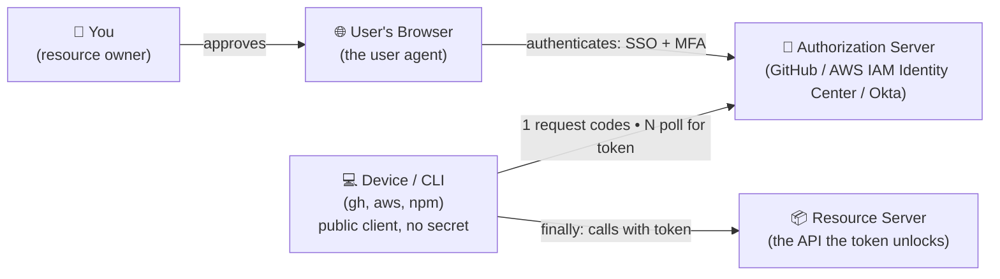
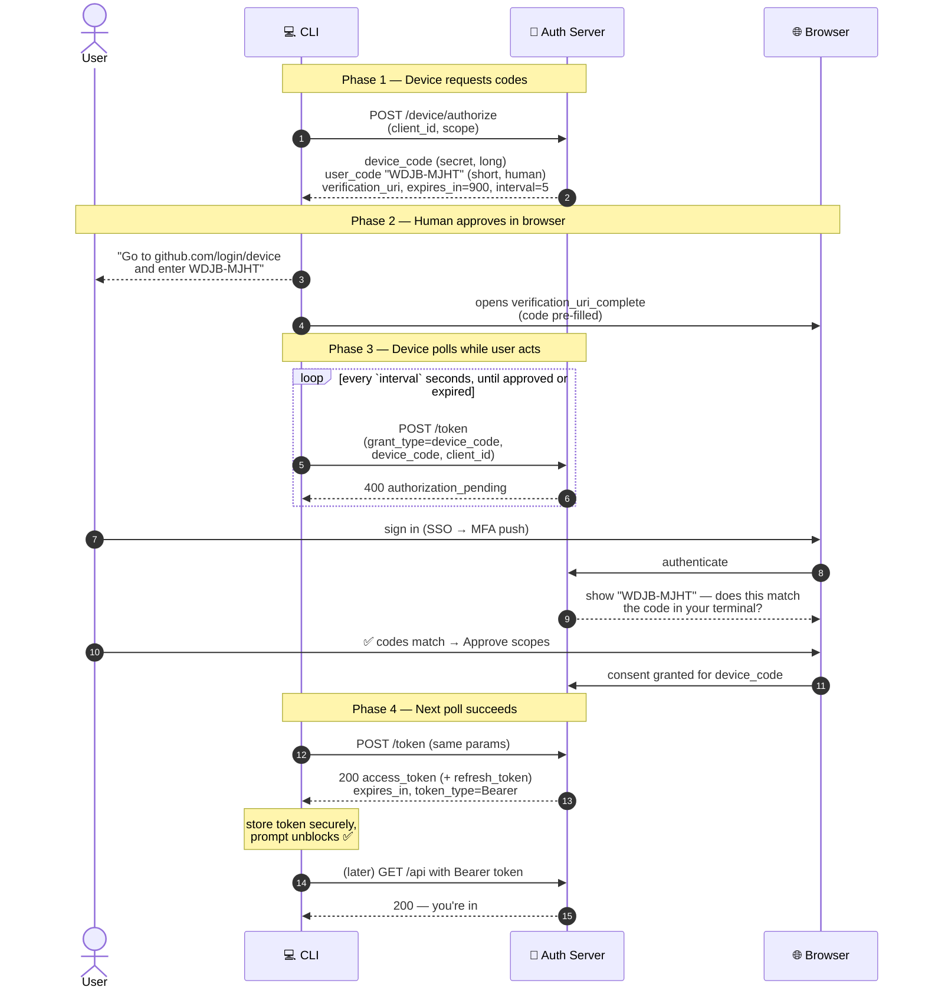
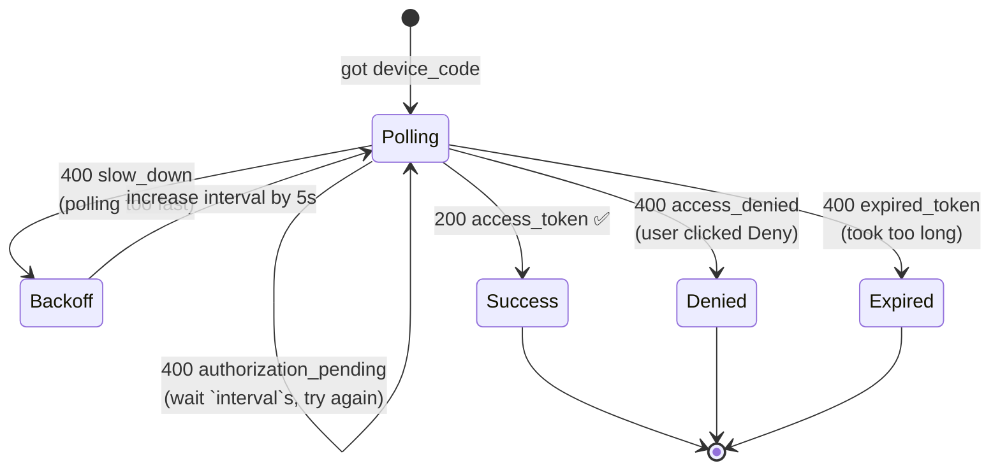
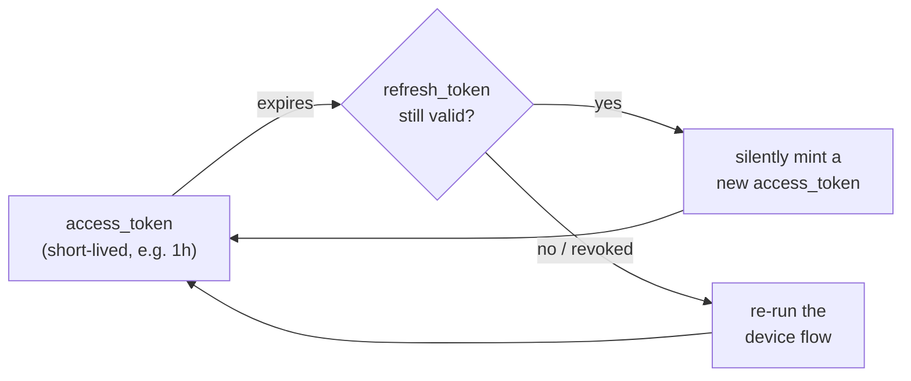
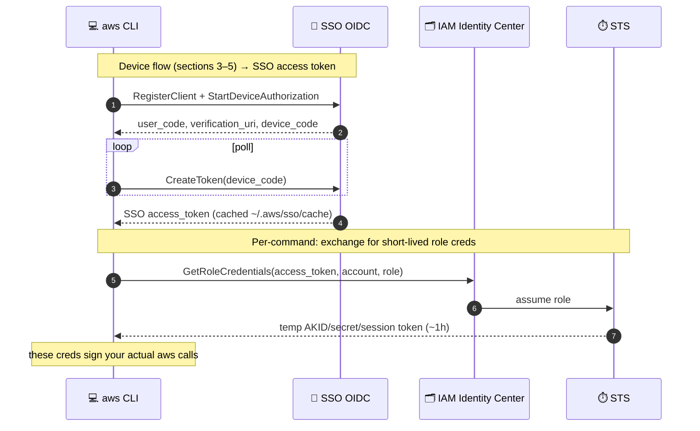

---
tags:
  - applied
  - interview-critical
  - for-saas
---

# CLI Login via Browser (Device Authorization Grant)

> You run `gh auth login`, `aws sso login`, or `npm login`. The terminal prints a short code — `WDJB-MJHT` — and a URL, then opens your browser. You sign in (SSO, MFA, the works), confirm the code matches, click **Approve**. A second later, **with no copy-paste back to the terminal**, your prompt unblocks and you're logged in. How?

This is the **OAuth 2.0 Device Authorization Grant** (RFC 8628), and it's one of the most elegant little flows in applied security. This page reverse-engineers it end to end.

---

## You'll see this when...

- A CLI tool prints *"First copy your one-time code: `WDJB-MJHT`"* and *"Press Enter to open github.com/login/device in your browser"*
- `aws sso login` pops a browser tab, you approve, and your terminal silently gains credentials
- You log into a **TV app** (Netflix, YouTube on a console) by typing a code shown on-screen into a phone — *same flow*
- A tool authenticates **without ever asking for your password in the terminal**, yet supports your org's full SSO + MFA
- The terminal sits there printing nothing for a few seconds while "waiting for you" — that's it **polling**

---

## 1. The constraint that forces this design

Why not just read a username and password in the terminal? Three hard problems make that a non-starter for modern auth:

| Problem | Why the naive approach fails |
|---|---|
| **The CLI has no browser-grade login UI** | Your org's login is SSO → SAML/OIDC → MFA push → maybe a hardware key. None of that fits in a `readline` prompt. The browser already solves it. |
| **The CLI is a *public client*** | It ships to thousands of laptops. It cannot hold a client secret — anyone can `strings` the binary. So it can't authenticate *itself* the classic way. |
| **There's no redirect URI** | The standard OAuth "Authorization Code" flow redirects the browser back to `https://yourapp/callback`. A CLI on a laptop behind NAT has no public URL to redirect to. |

The Device Authorization Grant sidesteps all three: **let the browser do the human login, and have the CLI poll for the result over a back channel.** The CLI never sees your password; the browser never needs to reach back to the CLI.

!!! info "Same flow, many names"
    "Device flow", "device code grant", "device authorization grant" (RFC 8628) all mean this. AWS calls its variant **SSO OIDC device authorization**. It powers CLIs *and* input-constrained devices (smart TVs, consoles, IoT) — anything where typing a password is painful or impossible but a second screen (your phone/laptop browser) is available.

---

## 2. The actors

The trick to notice: **the CLI and the browser never talk to each other.** They only ever talk to the authorization server. The server is the rendezvous point — the CLI's poll and the browser's approval meet there.

---

## 3. The full flow, step by step

This is the centerpiece. Read it top to bottom — the numbered arrows are the wire-level calls.

**In plain English:**

1. The CLI asks the auth server for a pair of codes. It gets a **`device_code`** (long, secret, machine-readable) and a **`user_code`** (short, human-readable — the `WDJB-MJHT` you see).
2. The CLI shows you the `user_code` + URL and opens your browser (often to a `verification_uri_complete` that pre-fills the code).
3. **In parallel**, the CLI starts polling the token endpoint with the `device_code`, getting `authorization_pending` back each time.
4. You log in *in the browser* — full SSO, MFA, whatever your org requires — and the browser shows you the `user_code`. **You confirm it matches what's in your terminal**, then approve the requested scopes.
5. On the CLI's *next* poll, the server returns a real **`access_token`**. The prompt unblocks. No copy-paste back to the terminal needed — the `device_code` the CLI already holds *is* the link to the approval you just gave.

---

## 4. Why the short code matters (the security crux)

The `user_code` (`WDJB-MJHT`) isn't just a UX nicety — it's the **binding between the device asking and the human approving**. This is the single most important idea on the page.

When you approve in the browser, you're approving *a specific pending device request*. The code is how the server (and you) know *which* request. Confirming "the code in my browser matches the code in my terminal" is you asserting: **"the device requesting access is the one physically in front of me."**

!!! danger "Device-code phishing — why the 'do the codes match?' step exists"
    The attack: a thief starts a device flow *on their own machine*, gets a `user_code`, and emails you — *"Sign in to approve access: go to this real, legitimate URL and enter `WDJB-MJHT`."* If you blindly enter it and approve, **you've just authorized the attacker's device** with your account, SSO and MFA included. The token lands on *their* machine, not yours.

    This is a real, actively-exploited attack (notably against Microsoft/Azure device flows). It works because the URL and login page are genuinely the provider's — your MFA doesn't help, because you authenticated a real session; you just authenticated it *for the wrong device*.

    Mitigations baked into good implementations:
    - **The "does this code match your terminal?" prompt** — only safe if *you* initiated the flow. If a code arrived unsolicited, that's the tell.
    - **Show the app + scopes clearly** on the consent screen ("*GitHub CLI* wants *repo, read:org*").
    - **Short `expires_in`** (5–15 min) shrinks the attack window.
    - **Bind to known `client_id`s** and, increasingly, restrict device flow by policy to where it's actually needed.

    The defensive lesson: **never enter a device code you didn't generate yourself, seconds ago, in your own terminal.**

---

## 5. Deep dive — the polling state machine

The CLI can't be *pushed* a result (it has no public endpoint), so it **pulls**. This is just short-polling, but the error contract is the interesting part:

| Token-endpoint response | Meaning | CLI does |
|---|---|---|
| `authorization_pending` | User hasn't finished yet | Wait `interval` seconds, poll again |
| `slow_down` | You're polling too aggressively | **Increase** `interval` (by 5s per the RFC), then continue |
| `access_denied` | User clicked *Deny* | Stop, print "authorization declined" |
| `expired_token` | The `device_code` timed out | Stop, tell user to re-run the command |
| `200` + `access_token` | Approved 🎉 | Store token, unblock prompt |

**Why polling and not a webhook / WebSocket?** Because the whole point is that the device has *no reachable address*. Polling sails straight through NAT, corporate firewalls, and captive portals — anywhere an outbound HTTPS call works, this works. It's the boring, robust choice, and it's correct here.

!!! tip "This is the same long-poll vs push trade-off you've seen before"
    The device flow polls for the same reason a CLI checking a CI job polls: the initiator is a client, not a server. If you wanted to eliminate the poll you'd need the device to host a callback — exactly the redirect URI the flow was designed to avoid. See [Long Polling vs WebSockets vs SSE](../networking/websockets-sse.md).

---

## 6. Token lifecycle — what you actually get

The `access_token` is deliberately short-lived (minutes to a day). Alongside it you usually get a **`refresh_token`**:

The CLI stores these as secrets — `gh` uses the OS keyring (or `hosts.yml`), `aws` caches the SSO token under `~/.aws/sso/cache/`. As long as the refresh token is valid, you never see the browser again; when it expires or is revoked, you're back to `aws sso login`.

---

## 7. How the big three actually do it

Same RFC, three flavors:

| | **GitHub (`gh auth login`)** | **AWS (`aws sso login`)** | **npm (`npm login`)** |
|---|---|---|---|
| Spec | RFC 8628 device flow | SSO **OIDC** device authorization | Web login (same pattern, npm-specific) |
| Code shown | `WDJB-MJHT` (8 chars, `XXXX-XXXX`) | 8-char user code | n/a — opens a one-time login URL |
| Verify at | `github.com/login/device` | `d-xxxx.awsapps.com/start/#/device` | `npmjs.com/login` |
| CLI does | polls token endpoint | polls `CreateToken` | polls a `doneUrl` |
| Token stored | OS keyring / `hosts.yml` | `~/.aws/sso/cache/*.json` | `.npmrc` auth token |
| Extra layer | token used directly | **SSO token → per-role temp creds** (next section) | token used directly |

### The AWS twist — two token layers

AWS adds a step that's worth seeing, because it separates *"who you are"* from *"what you can do right now"*:

The SSO access token proves *you logged in*. But your AWS API calls are signed with **temporary, per-account/per-role credentials** (from STS, ~1h lifetime) that the CLI fetches on demand using that SSO token. So one browser login → access to many accounts/roles, each with its own short-lived credentials. This is the [least-privilege](../security/index.md) and short-credential-lifetime principle made concrete.

---

## Anti-patterns

| Anti-pattern | Why it hurts | Better |
|---|---|---|
| Reading the user's password in the CLI | Breaks SSO/MFA, trains users to type passwords into untrusted prompts (phishing vector), and the CLI now handles secrets it shouldn't | Device flow — the browser owns the login |
| Embedding a client secret in the CLI binary | It's not secret — anyone can extract it; rotating it means re-shipping the binary | Treat the CLI as a **public client**; rely on the `user_code` binding, not a secret |
| Approving a device code someone sent you | Classic device-code phishing — you authorize *their* device | Only ever enter codes **you** just generated in **your** terminal |
| Polling at a fixed fast rate, ignoring `slow_down` | Server rate-limits or bans you; wastes resources | Honor `interval`, back off on `slow_down` |
| Long-lived access tokens with no refresh/expiry | A leaked token is valid forever | Short-lived access token + refresh token (or AWS's per-role temp creds) |
| Logging the `device_code` or token | They're bearer secrets; logs leak | Redact; store tokens in the OS keyring, not plaintext |

---

## Quick reference

| Need | Reach for |
|---|---|
| Log a CLI / TV / IoT device in via a second screen | OAuth 2.0 **Device Authorization Grant** (RFC 8628) |
| The two codes | `device_code` (secret, CLI-held) + `user_code` (short, human-typed) |
| Get the result back to a device with no public URL | **Poll** the token endpoint (`authorization_pending` → `200`) |
| Don't poll too fast | Honor `interval`; back off on `slow_down` |
| Web app with a real redirect URL instead | **Authorization Code + PKCE** flow (not device flow) |
| Keep credentials short-lived after login | Refresh token, or AWS SSO → STS per-role temp creds |
| Defend against device-code phishing | Short expiry, clear consent screen, "only enter codes you generated" |

---

## Interview angle

!!! tip "What interviewers are testing"
    Whether you understand *why* a flow exists from its constraints — not whether you memorized RFC 8628. The giveaway question is "how does the terminal know you approved without you pasting anything back?" A strong candidate derives the polling + shared-`device_code` answer from "the CLI has no public address."

**Strong answer pattern:**

1. **State the constraints**: public client (no secret), no redirect URI, login needs a real browser for SSO/MFA.
2. **Two codes, two channels**: `user_code` for the human in the browser, `device_code` for the machine on the back channel; the server is the rendezvous.
3. **Polling, not push**: the device pulls the result because it can't be reached — robust through NAT/firewalls.
4. **The `user_code` is a security binding**, not decoration: it ties the approval to the device in front of you; explain device-code phishing as the failure mode.
5. **Short-lived tokens + refresh** (and AWS's SSO-token → STS-creds split) for blast-radius control.

**Common follow-ups:**

- *"Why not just open a localhost callback server in the CLI?"* — That's the loopback variant of Auth Code + PKCE, and many CLIs do use it. Device flow wins when there's **no browser on the same machine** (TV, SSH'd-into remote box) or opening a local port is blocked. Mention both; pick by environment.
- *"How does the server match the browser approval to the CLI poll?"* — Both reference the same `device_code` (the `user_code` maps to it server-side). Approval flips that record's state; the next poll reads it.
- *"What stops me brute-forcing another user's `user_code`?"* — Short codes + short expiry + server-side rate limiting + the codes being single-use. The `device_code` (the actually-powerful secret) is long and high-entropy.
- *"Where does PKCE fit?"* — PKCE protects the *authorization code* flow. Device flow's analogous protection is the `device_code` secret + `user_code` binding.

---

## Test yourself

??? question "Why can't the CLI use the standard Authorization Code redirect flow?"

    It has no public, routable redirect URI — it's a process on a laptop behind NAT, not a web server. The Authorization Code flow needs the browser to redirect back to `https://app/callback`; there's nowhere for that to land. (The loopback `http://127.0.0.1:port` variant exists for CLIs *with* a local browser, but fails for headless/remote/TV scenarios — which is exactly where device flow shines.)

??? question "What's the difference between the `device_code` and the `user_code`, and why are there two?"

    The `user_code` (`WDJB-MJHT`) is short and human-typable — it's for the person to enter in the browser. The `device_code` is long, high-entropy, and secret — it's the machine's handle that the CLI polls with and that proves which pending request to fulfill. Two codes because one audience is a human typing on a phone (needs short) and the other is a machine on a back channel (needs unguessable). They map to each other server-side.

??? question "The terminal unblocks the instant you approve, with no copy-paste back. How?"

    It doesn't get pushed anything — it's been **polling** the token endpoint the whole time, getting `authorization_pending`. Your approval flips the server-side state tied to the `device_code` the CLI already holds. The very next poll therefore returns a real `access_token`. The "magic" is just a loop the server's answer changes.

??? question "A colleague messages you a real provider URL and an 8-character code, asking you to 'approve access.' Why is this dangerous?"

    It's device-code phishing. *They* started the device flow on *their* machine and got that `user_code`. If you sign in (even with MFA!) and approve, you authorize **their** device — the token lands on their machine with your identity and scopes. MFA doesn't save you because you genuinely authenticated; you just bound the approval to the wrong device. Rule: never enter a code you didn't generate yourself, moments ago, in your own terminal.

??? question "The token endpoint returns `slow_down`. What do you do, and what happens if you ignore it?"

    Increase your polling interval (by 5 seconds per RFC 8628) and keep polling. If you ignore it and keep hammering, the authorization server will rate-limit or temporarily block your requests, and your flow may fail even though the user would have approved — a self-inflicted denial of service.

---

## Related

- [OAuth 2.0 & JWT](../security/oauth-jwt.md) — the broader OAuth grant family this is one member of
- [Enterprise Authentication](../security/enterprise-auth.md) — SSO, SAML, OIDC: the browser-side login the device flow delegates to
- [Security](../security/index.md) — least privilege and short-lived credentials, made concrete by the AWS twist
- [Realtime Protocols (polling vs push)](../networking/websockets-sse.md) — why the CLI polls instead of being pushed a result
- [Idempotency & Exactly-Once](../distributed/exactly-once.md) — the polling loop is naturally idempotent: re-asking is safe
