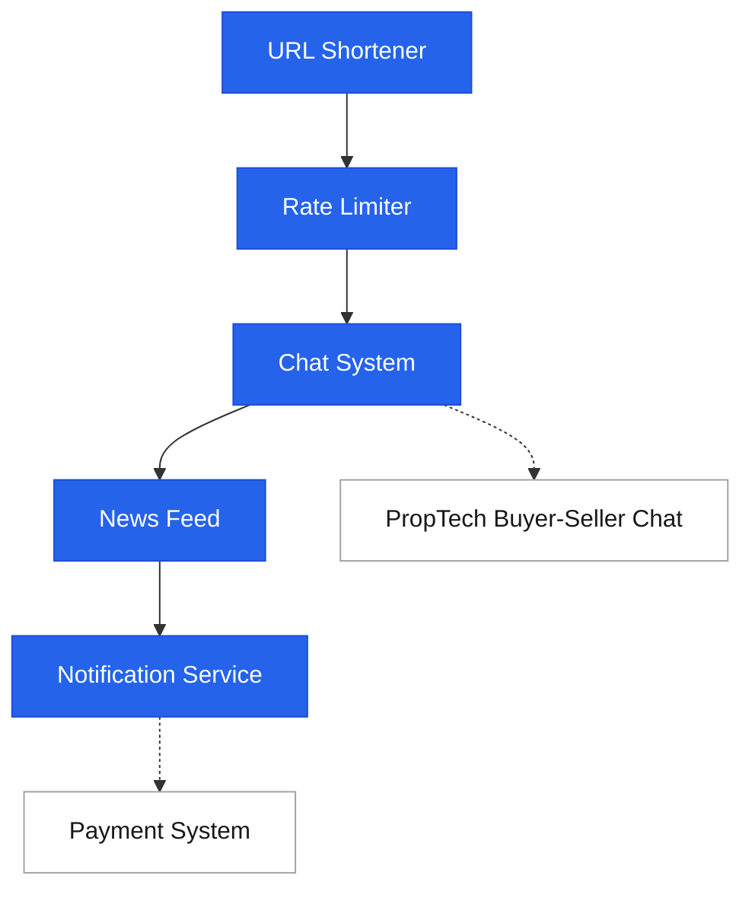

# Case Studies

<div class="sec-hero" markdown>
<span class="ey">Case Studies · end-to-end designs</span>
End-to-end system designs. Each follows the full interview flow: requirements → estimation → high-level design → deep dive → tradeoffs. Read these after the underlying concepts — the goal is to see why each decision was made, not memorize a template.
</div>

For shorter scenarios that weave 2–4 concepts together (rather than a full design), see [Practical Examples](../examples/index.md).

## Roadmap

Climb the difficulty ladder top-to-bottom. Dashed branches are reference designs to pick up once the spine clicks.

<div class="sd-mermaid-links" data-links='{
  "URL Shortener": "url-shortener/",
  "Rate Limiter": "rate-limiter/",
  "Chat System": "chat-system/",
  "News Feed": "news-feed/",
  "Notification Service": "notification-service/",
  "Payment System": "payment-system/",
  "PropTech Buyer-Seller Chat": "proptech-chat/"
}'></div>



## Suggested reading order

New to this topic? Read these in order — each builds on the previous:

1. [URL Shortener](url-shortener.md) — the canonical first design: smallest scope, teaches the full interview flow
2. [Rate Limiter](rate-limiter.md) — still small, but adds distributed coordination and Redis algorithms
3. [Chat System](chat-system.md) — first real-time system: WebSockets, ordering, delivery guarantees
4. [News Feed](news-feed.md) — the classic fan-out read/write tradeoff at scale
5. [Notification Service](notification-service.md) — async pipelines, at-least-once delivery, and retries

**Then, as needed (reference):** [Search Autocomplete](search-autocomplete.md), [Video Streaming](video-streaming.md), [Ride-Sharing](ride-sharing.md), [Distributed Cache](distributed-cache.md), [Web Crawler](web-crawler.md), [Cloud File Storage (Dropbox)](dropbox.md), [Social Media Feed (Twitter)](twitter.md), [Ad Click Tracking](ad-click-tracking.md)

**Advanced — come back later:** [Payment System](payment-system.md), [Maps & Navigation](google-maps.md), [PropTech Buyer-Seller Chat](proptech-chat.md)

---

## The systems

**Starter**

<div class="pcards">
<a class="pcard" href="url-shortener/"><span class="t">URL Shortener</span><span class="d">Hashing (MD5/base62), cache-aside, 301 vs 302, single-write DB</span></a>
<a class="pcard" href="rate-limiter/"><span class="t">Rate Limiter</span><span class="d">Token bucket, Redis counters, sliding window log, distributed coordination</span></a>
</div>

**Medium**

<div class="pcards">
<a class="pcard" href="news-feed/"><span class="t">News Feed</span><span class="d">Fan-out on write vs read, ranking signals, Redis sorted sets, CDN</span></a>
<a class="pcard" href="chat-system/"><span class="t">Chat System</span><span class="d">WebSockets, message ordering, delivery receipts, presence detection</span></a>
<a class="pcard" href="notification-service/"><span class="t">Notification Service</span><span class="d">Pub/Sub, at-least-once delivery, retry with backoff, device token management</span></a>
<a class="pcard" href="search-autocomplete/"><span class="t">Search Autocomplete</span><span class="d">Trie, top-K with heap, prefix caching, real-time vs offline updates</span></a>
<a class="pcard" href="video-streaming/"><span class="t">Video Streaming</span><span class="d">CDN edge caching, HLS chunking, adaptive bitrate, blob storage</span></a>
<a class="pcard" href="ride-sharing/"><span class="t">Ride-Sharing</span><span class="d">Geohashing, location update pipeline, ETA computation, dispatch matching</span></a>
<a class="pcard" href="distributed-cache/"><span class="t">Distributed Cache</span><span class="d">LRU implementation, consistent hashing, hot key mitigation, stampede</span></a>
</div>

**Hard**

<div class="pcards">
<a class="pcard" href="web-crawler/"><span class="t">Web Crawler</span><span class="d">URL frontier (priority queue), politeness delay, Bloom dedup, distributed workers</span></a>
<a class="pcard" href="dropbox/"><span class="t">Cloud File Storage (Dropbox)</span><span class="d">Content-addressed chunking, block dedup, delta sync, conflict resolution</span></a>
<a class="pcard" href="twitter/"><span class="t">Social Media Feed (Twitter)</span><span class="d">Fan-out celebrity problem, Snowflake IDs, timeline caching, trending topics</span></a>
<a class="pcard" href="payment-system/"><span class="t">Payment System</span><span class="d">Double-entry ledger, idempotency key, reconciliation, exactly-once</span></a>
<a class="pcard" href="ad-click-tracking/"><span class="t">Ad Click Tracking</span><span class="d">Extreme write volume (1M+ RPS), Kafka pipeline, Bloom dedup, ClickHouse</span></a>
<a class="pcard" href="google-maps/"><span class="t">Maps & Navigation</span><span class="d">Tile serving at scale, graph routing (A*, Contraction Hierarchies), live traffic</span></a>
<a class="pcard" href="proptech-chat/"><span class="t">PropTech Buyer-Seller Chat</span><span class="d">End-to-end real-time chat: storage choices, presence, SLA escalation, networking</span></a>
</div>

---

## Concept coverage matrix

Use this to find case studies that reinforce a specific concept:

| Concept | Case studies that use it |
|---|---|
| **Consistent hashing** | Distributed Cache, Twitter |
| **Caching (Redis)** | URL Shortener, Rate Limiter, News Feed, Distributed Cache |
| **Fan-out** | News Feed, Twitter |
| **WebSockets / real-time** | Chat System, Ride-Sharing |
| **Kafka / event streaming** | Ad Click Tracking, Payment System, Notification Service |
| **Idempotency / exactly-once** | Payment System, Notification Service |
| **Geo-indexing / spatial** | Ride-Sharing, Maps & Navigation |
| **CDN / blob storage** | Video Streaming, Dropbox, Twitter |
| **Bloom filter** | Web Crawler, Ad Click Tracking |
| **Sharding** | Twitter (by user ID), Ad Click Tracking (by ad ID) |
| **CQRS** | Ad Click Tracking (write pipeline ≠ read API) |
| **Rate limiting** | Rate Limiter, API Gateway in most systems |
| **Distributed locks** | Payment System, Distributed Cache |
| **Trie / prefix search** | Search Autocomplete |
| **Snowflake IDs** | Twitter, Chat System |

---

## Interview framework

Use this structure for every design. Time budget for a 45-minute interview:

```
1. Clarify requirements (5 min)
   Functional: what does it do? (core features, out of scope)
   Non-functional: scale, latency SLO, availability, consistency
   → Ask, don't assume. The constraints define the design.

2. Estimate scale (3 min)
   DAU × actions/day = QPS
   QPS × avg payload = bandwidth
   QPS × retention = storage
   → Rough orders of magnitude. Don't over-engineer estimates.

3. High-level design (10 min)
   Client → LB → App servers → Storage
   Add: cache, CDN, async workers, message queue
   → Whiteboard the data flow. Talk through every arrow.

4. Deep dive (15 min)
   Pick 2-3 components to go deep on (let interviewer guide)
   Typical targets: DB schema, sharding key, cache strategy,
                    async pipeline, hot key problem
   → This is where you show you've thought past the happy path.

5. Wrap up (2 min)
   Summarize key decisions
   Acknowledge tradeoffs
   What you'd add with more time (monitoring, multi-region, etc.)
```

---

## Common mistakes in system design interviews

| Mistake | Fix |
|---|---|
| Jumping to solution without requirements | Always clarify scale and constraints first |
| Over-engineering a simple system | Match complexity to the actual scale |
| Ignoring failure modes | Ask: what happens when X fails? |
| Choosing a DB without justifying it | State the access pattern, then choose |
| Forgetting caching | Almost every read-heavy system needs it |
| Treating exactly-once as free | Acknowledge the complexity, use idempotency |
| Single-region design for a global system | Address multi-region if non-functional reqs demand it |

---

## Related topics

- [Fundamentals: Back-of-Envelope Estimation](../fundamentals/estimation.md) — step 2 of every design
- [Storage](../storage/index.md) — database selection is a core design decision in every case study
- [Patterns](../patterns/index.md) — the building blocks used across all designs
- [Distributed Systems](../distributed/index.md) — the theory behind the hard parts
