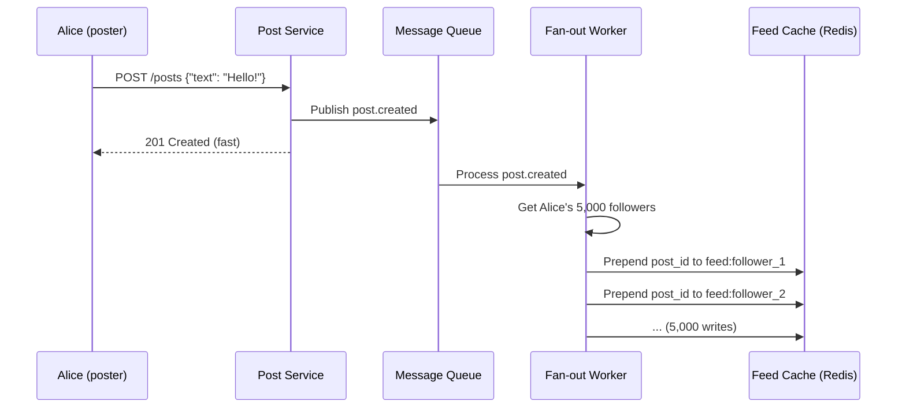

# Design a News Feed (Twitter/Instagram)

## Problem statement

Design a news feed system (like Twitter/Instagram) that:
- 500 million DAU
- Users follow other users; feed shows posts from followed users
- Post types: text, images, videos
- Feed is roughly chronological (with some ranking)
- Read-heavy: 100× more reads than writes

## Clarifying questions

```
1. What's the feed ordering? Chronological or ranked?
   → Start with chronological; ranking is an optimization

2. Max follows per user? Celebrity accounts?
   → Users: up to 5,000 follows. Celebrities: 100M+ followers

3. How fresh does the feed need to be? Real-time or slight delay ok?
   → New posts should appear within a few seconds

4. What counts as a "post"? Text only or media?
   → Text + images. Videos are out of scope.

5. Scale: write QPS?
   → 10M posts/day = ~120 posts/second
```

## Scale estimation

```
Users: 500M DAU
Posts: 10M/day = 120 writes/sec
Feed reads: 500M × 10 feed loads/day = 5B reads/day = 58,000 reads/sec

Post size: ~1KB text + media URLs
Feed: 20 posts × 1KB = 20KB per load

Storage: 10M posts/day × 1KB = 10GB/day text
         + 20MB avg media = 200TB/day media (use S3)

Read:write ratio: ~500:1 → heavily optimize reads
```

## High-level design

### Approach 1: Fan-out on write (push model)

When a user posts, immediately push to all followers' feed caches.



**Feed read:**
```python
def get_feed(user_id: str, cursor: str = None, limit: int = 20) -> list:
    # O(1) - just read from pre-built cache
    feed_key = f"feed:{user_id}"
    
    if cursor:
        # cursor = position in the list
        start = int(cursor)
    else:
        start = 0
    
    post_ids = redis.lrange(feed_key, start, start + limit - 1)
    posts = batch_get_posts(post_ids)  # multi-get from post store
    return posts
```

**Pros:** Feed reads are O(1) — just read from cache  
**Cons:** Writing to 100M followers (celebrity) is extremely slow

### Approach 2: Fan-out on read (pull model)

When user requests their feed, dynamically fetch and merge posts from all followed users.

```python
def get_feed(user_id: str, limit: int = 20) -> list:
    # Get all followed users
    following = db.get_following(user_id)  # up to 5,000
    
    # For each followed user, get their recent posts
    # SELECT * FROM posts WHERE author_id = ANY($1) 
    #   ORDER BY created_at DESC LIMIT 20
    posts = db.get_recent_posts_from_users(following, limit=limit * 2)
    
    # Merge and sort
    sorted_posts = sorted(posts, key=lambda p: p.created_at, reverse=True)
    return sorted_posts[:limit]
```

**Pros:** No fan-out cost; always fresh  
**Cons:** Feed read is O(following_count) — very slow for users following 5,000 accounts

### Approach 3: Hybrid (production choice)

**Fan-out on write for regular users; fan-out on read for celebrities:**

```python
CELEBRITY_THRESHOLD = 100_000  # followers

class FeedService:
    async def on_post_created(self, post: Post):
        author = await user_service.get(post.author_id)
        
        if author.follower_count < CELEBRITY_THRESHOLD:
            # Regular user: push to all followers' caches
            await self.fan_out_to_followers(post)
        else:
            # Celebrity: skip fan-out, fetch on read
            await self.store_post_only(post)
    
    async def get_feed(self, user_id: str, limit: int = 20) -> list:
        # 1. Get pre-built feed from cache (regular users you follow)
        cached_post_ids = await redis.lrange(f"feed:{user_id}", 0, limit * 2 - 1)
        
        # 2. Get celebrities you follow
        celebrities = await self.get_followed_celebrities(user_id)
        
        # 3. Fetch recent posts from celebrities (pull)
        celebrity_posts = await post_db.get_recent_posts(
            author_ids=celebrities, limit=limit
        )
        
        # 4. Merge and rank
        all_posts = await self.hydrate(cached_post_ids) + celebrity_posts
        return sorted(all_posts, key=lambda p: p.score, reverse=True)[:limit]
```

## Data model

### Posts table (PostgreSQL / DynamoDB)

```sql
-- PostgreSQL
CREATE TABLE posts (
    id          UUID PRIMARY KEY DEFAULT gen_random_uuid(),
    author_id   UUID NOT NULL,
    content     TEXT,
    media_urls  TEXT[],
    created_at  TIMESTAMP WITH TIME ZONE DEFAULT NOW(),
    like_count  INT DEFAULT 0,
    comment_count INT DEFAULT 0
);

CREATE INDEX idx_posts_author_created ON posts (author_id, created_at DESC);
```

```python
# DynamoDB: better for fan-out workloads
# PK: USER#{author_id}, SK: POST#{timestamp}#{post_id}
# GSI: for global feed, trending

table.put_item(Item={
    'PK': f'USER#{author_id}',
    'SK': f'POST#{created_at_iso}#{post_id}',
    'post_id': post_id,
    'content': content,
    'created_at': created_at_iso,
    'ttl': int(time.time()) + 86400 * 90,  # 90 day retention
})
```

### Follow graph (Graph DB or DynamoDB)

```python
# DynamoDB adjacency list for follows
# PK: USER#{user_id}#FOLLOWING, SK: USER#{followed_id}
# PK: USER#{user_id}#FOLLOWERS, SK: USER#{follower_id}

# Get all followers of user (for fan-out)
response = table.query(
    KeyConditionExpression=Key('PK').eq(f'USER#{user_id}#FOLLOWERS'),
    ProjectionExpression='SK',
)
follower_ids = [item['SK'].replace('USER#', '') for item in response['Items']]
```

### Feed cache (Redis)

```python
# feed:{user_id} → sorted list of post IDs (newest first)
# Max length: 800 posts (older posts dropped)

redis.lpush(f"feed:{user_id}", post_id)  # prepend newest
redis.ltrim(f"feed:{user_id}", 0, 799)   # keep only latest 800

# TTL: if user doesn't log in for 7 days, expire cache
redis.expire(f"feed:{user_id}", 86400 * 7)

# Cold start: cache miss → build feed from scratch
async def build_feed_from_scratch(user_id: str):
    following = await get_following(user_id)
    recent_posts = await db.get_recent_posts(author_ids=following, limit=200)
    post_ids = [p.id for p in sorted(recent_posts, key=lambda p: p.created_at, reverse=True)]
    
    redis.delete(f"feed:{user_id}")
    if post_ids:
        redis.rpush(f"feed:{user_id}", *post_ids)
    redis.expire(f"feed:{user_id}", 86400 * 7)
```

## Fan-out worker

```python
# Kafka consumer: processes post.created events
async def handle_post_created(post: Post):
    author = await user_service.get(post.author_id)
    
    # Paginate through followers to avoid OOM
    cursor = None
    while True:
        followers, cursor = await get_followers_page(post.author_id, cursor, page_size=5000)
        
        if not followers:
            break
        
        # Batch Redis operations
        pipe = redis.pipeline()
        for follower_id in followers:
            feed_key = f"feed:{follower_id}"
            # Only update if follower has an active feed (avoid writing to cold users)
            if redis.exists(feed_key):
                pipe.lpush(feed_key, post.post_id)
                pipe.ltrim(feed_key, 0, 799)
        pipe.execute()
        
        if cursor is None:
            break
    
    # Store in post DB (always, for fan-out on read fallback)
    await post_db.save(post)
```

## Media handling

```
Client wants to post an image:

1. Client → POST /posts/upload-url
   → Server generates S3 presigned URL
   → Returns: {upload_url: "https://s3.../", post_token: "..."}

2. Client → PUT {upload_url} (direct to S3)
   → S3 stores original image

3. S3 event → Lambda (image processing)
   → Resize to: thumbnail (150×150), mobile (720px), desktop (1080px)
   → Store variants in S3 with CloudFront prefix

4. Client → POST /posts {"content": "...", "post_token": "..."}
   → Server creates post with media URLs

5. CDN (CloudFront) serves images:
   https://cdn.example.com/images/{post_id}/mobile.jpg
```

## Caching strategy

```
L1: Feed cache (Redis) — list of post IDs per user (pre-built)
L2: Post cache (Redis) — post data by ID (TTL: 1 hour)
L3: User cache (Redis) — profile data (TTL: 5 min)

Read path:
  get_feed(user_id)
    → Redis: get feed:{user_id} → [post_id_1, post_id_2, ...]
    → Redis: MGET post:{id} for each post_id (batch)
    → DB fallback for cache misses
    → Return hydrated posts
```

## AWS architecture

```
CloudFront (images/videos)
     │
ALB → Post Service (ECS Fargate)
         │
         ├── DynamoDB (posts, follows)
         ├── ElastiCache Redis Cluster (feed cache, post cache)
         └── SQS/Kafka → Fan-out Workers (ECS) → Redis
         
S3 (media) → Lambda (resize) → CloudFront
```

## Interview talking points

!!! tip "Key design decisions to discuss"
    1. Push vs pull model — hybrid wins: push for regular users, pull for celebrities
    2. Cache feed as post IDs, not full posts — hydrate separately (simpler invalidation)
    3. Fan-out is async (queue) — write API returns fast, fan-out happens eventually
    4. Cold-start problem: if user's feed cache expires, rebuild from DB on first read
    5. Media via presigned URLs — never stream through your servers

## Related topics

- [Caching](../storage/caching.md) — feed cache strategies
- [Message Queues](../messaging/message-queues.md) — async fan-out
- [Pub/Sub](../messaging/pub-sub.md) — feed updates
- [Consistent Hashing](../patterns/consistent-hashing.md) — Redis cluster sharding
- [Blob Storage](../storage/blob-storage.md) — media on S3
