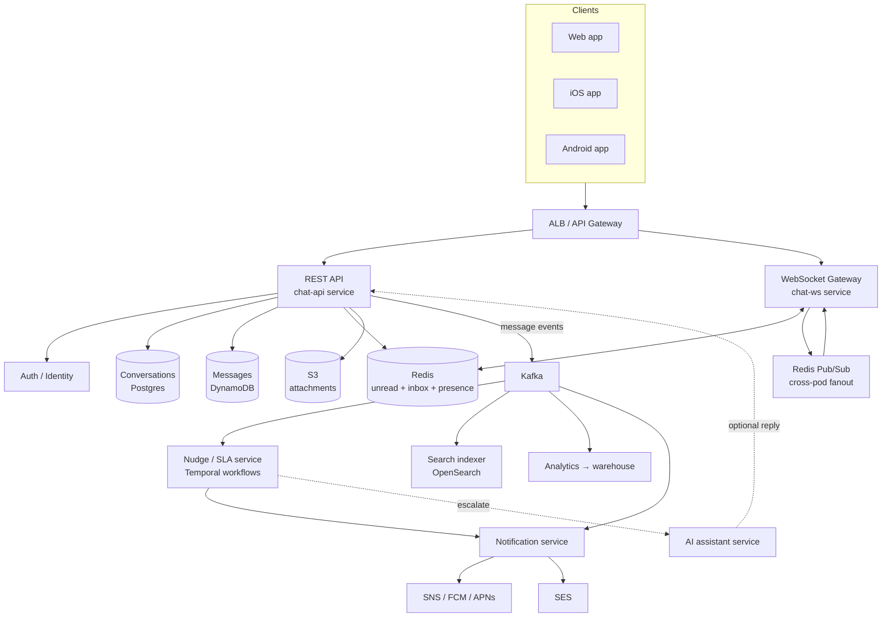
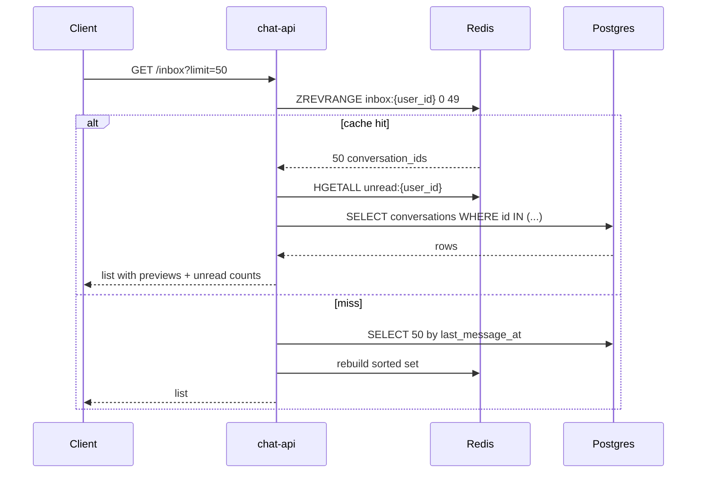
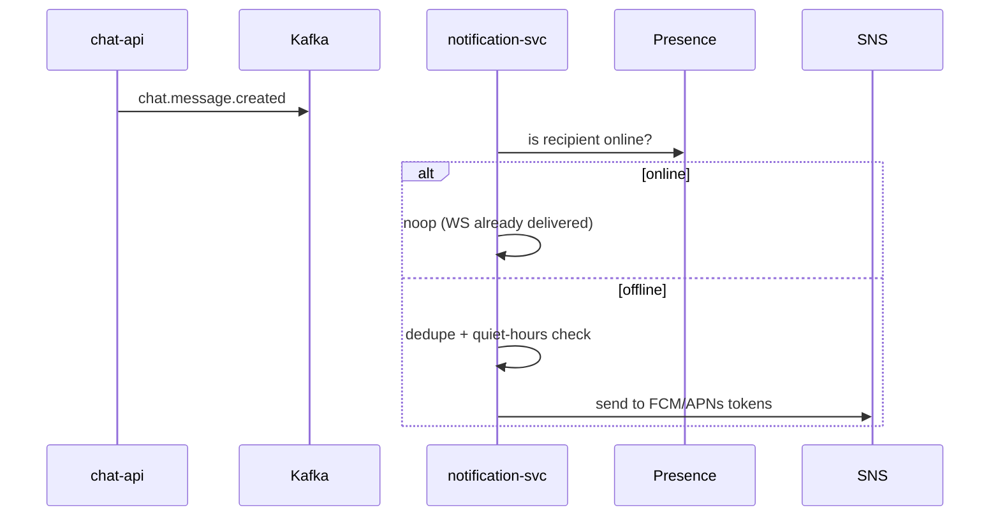
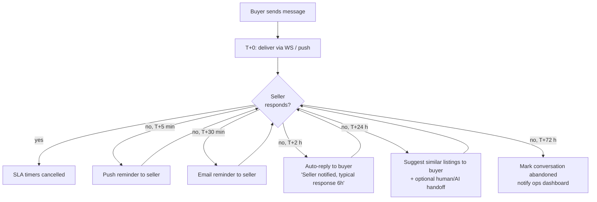
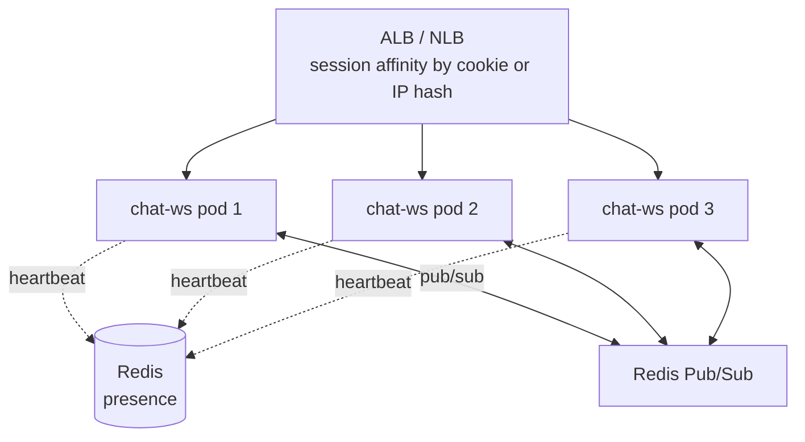

---
tags:
  - applied
  - interview-critical
  - for-scale
---

# Proptech Chat (Buyer ↔ Seller)

## The problem

Build a chat feature inside a proptech app.

- **50M registered users** total
- **1M DAU** using chat to communicate
- Buyers chat with sellers about listings
- Sidebar shows recent conversations + per-conversation unread count
- **Sellers respond slowly → buyers drop off** (this is the business problem, not just a feature)
- Deployment target: k8s, ECS / Cloud Run, or self-managed servers — interviewer wants us to choose with rationale

The requirements are deliberately incomplete. Half the score is on what you ask.

## Clarifying questions (state them out loud)

| Question | Why it matters |
|---|---|
| 1:1 only, or also group (buyer + seller + agent)? | Fan-out + storage model |
| Are conversations scoped per listing, or per user pair? | Affects conversation key + UX |
| Read receipts and typing indicators required? | Affects RTT / event volume |
| Attachments (images of property documents)? | Adds blob storage + scanning |
| Message retention policy? | GDPR, storage cost, retention TTL |
| Need full-text search across history? | Adds Elasticsearch / OpenSearch |
| Multi-region or single region? | Latency budget + consistency strategy |
| Web + mobile, or mobile only? | Push channels, WS reconnect strategy |

I'll proceed with these defaults: **1:1 conversations scoped per listing**, read receipts yes, typing indicators yes, attachments yes (images), 2-year retention, search yes, single primary region (one DR region), web + iOS + Android.

## Requirements

### Functional

- Send and receive 1:1 text messages between buyer and seller, scoped to a listing
- Real-time delivery to online recipients; push notification to offline
- Sidebar inbox: recent conversations sorted by `last_message_at`
- Per-conversation unread count + total unread badge
- Read receipts (delivered, read)
- Typing indicators
- Attachments (images, ≤10 MB) via signed URLs to object storage
- Message history with infinite scroll
- Search within and across conversations
- Block / report user
- **Seller SLA + drop-off mitigation**: nudge slow sellers, fallback paths for buyers (the proptech-specific part)

### Non-functional

| Attribute | Target |
|---|---|
| **Message send → delivered to online recipient p99** | < 300 ms |
| **Message durability** | No message loss after server ack |
| **Per-conversation ordering** | Strict |
| **Read availability** | 99.95% |
| **Write availability** | 99.9% (degraded mode acceptable: queue + deliver later) |
| **Inbox load p99** | < 200 ms |
| **Privacy** | Only participants + admins (audit-gated) see content |

## Capacity estimation

```
Users: 50M registered, 1M DAU
Assume avg 20 messages per DAU per day  → 20M messages/day
                                       → ~230 messages/sec average
Peak factor 5x                          → ~1.2K messages/sec peak

Active conversations: ~3M (DAU × avg open threads)
Concurrent WebSocket connections at peak: ~150K
  (DAU × ~15% open at peak hour)

Message size avg ~500 B (text + metadata)
Daily storage: 20M × 500 B ≈ 10 GB/day
Yearly: ~3.6 TB/year (messages only, before replication)

Inbox reads: each DAU opens app ~5x → 5M sidebar loads/day → ~60 RPS avg, ~300 peak
Unread count reads: every app foreground → ~10M/day → 120 RPS avg, ~600 peak
```

These numbers are modest. The interesting design problems are **shape**, not raw scale: real-time delivery, ordering, unread accuracy, the SLA pipeline, and WebSocket operations.

## High-level architecture



The split into **chat-api** (request/response) and **chat-ws** (long-lived) is intentional. Stateless REST scales differently from stateful WebSockets; mixing them in one pod makes the WS deployment story painful.

## Component breakdown

| Service | Responsibility | Stateful? |
|---|---|---|
| **chat-api** | REST: send message, list conversations, mark read, presigned URL for attachments | Stateless |
| **chat-ws** | WebSocket gateway: maintain connections, push events to clients | Stateful (connection registry) |
| **presence-svc** | Track who's online; backed by Redis with TTL keys | Stateless |
| **nudge-svc** | Temporal workflows: SLA timers, escalation ladder | Stateless (state in Temporal) |
| **notification-svc** | Send push/email; manages tokens, quiet hours, dedup | Stateless |
| **search-indexer** | Consume Kafka → index to OpenSearch | Stateless |
| **moderation-svc** | Async toxicity / spam / scam detection on each message | Stateless |
| **ai-assistant** (optional) | Auto-acknowledgment, FAQ, hand-off summaries | Stateless |

## Data model + storage choices

This is the section interviewers care about most. Every choice has a reason.

### Conversations metadata → **PostgreSQL**

```sql
CREATE TABLE conversations (
    id              UUID PRIMARY KEY,
    listing_id      UUID NOT NULL REFERENCES listings(id),
    buyer_id        UUID NOT NULL REFERENCES users(id),
    seller_id       UUID NOT NULL REFERENCES users(id),
    created_at      TIMESTAMPTZ NOT NULL DEFAULT NOW(),
    last_message_at TIMESTAMPTZ,
    last_message_preview TEXT,
    status          TEXT NOT NULL DEFAULT 'active',  -- active|archived|blocked
    sla_state       TEXT,                            -- ok|nudged|escalated|abandoned
    UNIQUE (listing_id, buyer_id, seller_id)
);
CREATE INDEX ON conversations (buyer_id, last_message_at DESC);
CREATE INDEX ON conversations (seller_id, last_message_at DESC);
```

**Why Postgres:**

- Conversation metadata is **relational** (joins to users, listings) and modestly sized (a few hundred million rows max).
- Needs strong consistency: creating a conversation must be unique per (listing, buyer, seller); a NoSQL upsert with conditional write is doable but Postgres is simpler.
- Joinable to `listings` table for admin / reporting queries.
- The query "give me my last 50 conversations sorted by last_message_at" is a textbook indexed Postgres query.

**Why not put it in DynamoDB:** we'd lose joins, and we'd still need a unique constraint on (listing, buyer, seller).

### Messages → **DynamoDB** (alternative: Cassandra)

```
Table: messages
  Partition Key: conversation_id              (UUID)
  Sort Key:      message_id                   (ULID — time-sortable)

Item:
  conversation_id, message_id,
  sender_id, body, attachment_keys[],
  created_at, server_received_at,
  delivered_to[], read_by[],
  client_message_id   (idempotency)
```

**Why DynamoDB:**

- **Write-heavy, time-ordered, partitioned by conversation** — the textbook DynamoDB shape. Partition key gives natural sharding; sort key (ULID) gives chronological reads.
- Managed: no Cassandra cluster ops at our scale (3.6 TB/year is comfortable).
- **DynamoDB Streams** for free: feeds Kafka via Lambda → search indexer, analytics, nudge SLA, notifications.
- **TTL** for retention: set a TTL attribute = `created_at + 2y`; DynamoDB auto-expires. No nightly cleanup job.
- Conditional write on `client_message_id` gives free idempotency for retries.
- Pay-per-request mode handles peakiness naturally.

**Why not Postgres for messages:** at 7-10 GB/day growing, you'd need partitioning + a sharding strategy within a year. We'd be reinventing what DynamoDB already does.

**Why Cassandra is the alternative:** the classic FAANG choice (Discord, FB Messenger). Better for self-managed deployments, exact same access pattern. Pick Cassandra if you're already running it or want to avoid AWS lock-in. For this design — managed wins.

**Hot partition risk:** a celebrity seller's listing could become hot. Mitigation: cap conversations per listing, allow a sub-partition key (`conversation_id#bucket`) if a single conversation ever crosses ~3K writes/sec — not realistic for 1:1 chat.

### Unread counters → **Redis** (hash per user)

```
HKEY: user:{user_id}:unread
  field: {conversation_id} → integer

HKEY: user:{user_id}:unread_total → integer
```

**Why Redis:**

- Atomic `HINCRBY` (per conversation) + `INCR` (total) on every new message: sub-ms.
- Read on app foreground is the most frequent read in the system (every app open). Postgres would buckle under it; DynamoDB is fine but pricier and slower than Redis.
- **Rebuildable** from messages table if Redis is lost: this is the deciding factor — Redis is a cache for derived state, not source of truth.

**Persistence:** AOF every second + RDB snapshots; we tolerate seconds of count drift (rebuilt by background job).

### Inbox feed → **Redis Sorted Set** (with Postgres as authoritative source)

```
ZKEY: user:{user_id}:inbox
  score: last_message_at (epoch ms)
  member: conversation_id

ZRANGEBYSCORE for paging the sidebar — top 50 with newest first.
```

**Why:** sidebar load is hot path; Postgres can serve it but at 600 RPS for inbox + filters it's wasteful. Redis sorted set gives O(log N) inserts and O(log N + M) range reads. On cache miss, hydrate from Postgres.

### Attachments → **S3** (presigned URLs, CDN for delivery)

- Client requests presigned PUT URL from chat-api; uploads direct to S3.
- chat-api stores `attachment_keys[]` in the message.
- Read goes through CloudFront for delivery + signed URL with short TTL.
- Async scan via Lambda (image moderation, malware) before marking as deliverable.

### Connection registry (which WS pod a user is connected to) → **Redis**

```
SET KEY: presence:{user_id} → "pod-7"   TTL 60s, heartbeat refreshes
SET KEY: pod:{pod_id}:users  → SADD users
```

**Why Redis:** WS pod lookups happen on every message routing. Has to be hot. TTL gives us automatic GC when a pod dies.

### Async event backbone → **Kafka**

Topics:

- `chat.message.created` — every new message; consumers: notifications, nudge, indexer, analytics
- `chat.message.read` — read receipts; consumers: nudge (cancels SLA timers), analytics
- `chat.conversation.created` — for analytics
- `chat.sla.event` — nudges/escalations emitted by nudge-svc

**Why Kafka:** ordered per partition (per conversation), durable, replayable for backfilling new consumers, multiple decoupled consumers. See [Event Streaming Maturity](../messaging/event-streaming-maturity.md).

### Search → **OpenSearch**

- Indexed from `chat.message.created` Kafka topic
- Per-user ACL filter at query time
- 90-day search window (older is rare, costly to keep indexed)

### Storage choice summary table

| Data | Store | Why this and not the others |
|---|---|---|
| Conversations metadata | Postgres | Relational, joins, modest size, ACID for participant uniqueness |
| Messages | DynamoDB | Conversation-partitioned, time-sorted, TTL, Streams, managed |
| Unread counters | Redis (hash) | Sub-ms reads, atomic increments, rebuildable from messages |
| Inbox feed | Redis (sorted set) + Postgres backup | Hot read path; Postgres for hydration |
| Attachments | S3 + CloudFront | Right tool; presigned URLs avoid proxying through API |
| Presence / connection map | Redis (TTL keys) | Routing lookups must be sub-ms; auto-GC via TTL |
| Async events | Kafka | Ordered per conv, durable, multi-consumer |
| Search | OpenSearch | Inverted index for FTS; fed from Kafka |
| SLA / workflow state | Temporal | Durable workflows with timers (alt: own scheduler) |

## Key flows

### Send message (online recipient)

```mermaid
sequenceDiagram
    autonumber
    participant C as Client (sender)
    participant API as chat-api
    participant DDB as DynamoDB
    participant Redis
    participant K as Kafka
    participant Bus as Redis Pub/Sub
    participant WS as chat-ws (recipient pod)
    participant R as Client (recipient)

    C->>API: POST /messages {conv_id, body, client_msg_id}
    API->>DDB: conditional put (idempotent on client_msg_id)
    API->>Redis: HINCRBY unread{recipient}; ZADD inbox{recipient}
    API-->>C: 200 {message_id, server_ts}
    API->>K: publish chat.message.created
    API->>Bus: publish to channel conv:{conv_id}
    Bus->>WS: deliver event
    WS->>R: WebSocket frame: new_message
    R->>API: POST /messages/{id}/read
    API->>Redis: HINCRBY unread{recipient} -1
    API->>K: publish chat.message.read
```

The client gets an ack from API (step 4) **before** Kafka publish or WS delivery. This is deliberate: we owe the sender durability (Dynamo write), not delivery — delivery is best-effort with retry semantics.

### Inbox load (open sidebar)



### Offline delivery (push notification path)



Push notification is a **wake signal + preview**, not transport. The actual message stays in DynamoDB and is fetched on app open. See [Mobile + Edge Specifics](../architecture/mobile-edge-specifics.md).

### Unread count consistency

- Source of truth: DynamoDB messages (read receipts).
- Fast counter: Redis hash.
- Drift detection: nightly job samples N users, recomputes from messages, alerts if drift > 1.
- Manual rebuild: replay `chat.message.created` + `chat.message.read` for affected user.

## The drop-off mechanic (proptech-specific)

Slow sellers cost the business buyers. The chat system has to *participate* in fixing that, not just deliver messages.

### Escalation ladder



### Implementation — Temporal workflows

Why Temporal: SLA logic is a long-running stateful process with timers, retries, and cancellation. Building it with cron + a table of "due nudges" works but is fragile (missed fires, double fires, no visibility). Temporal gives durable timers, replay-on-failure, and observable workflow state.

```python
@workflow.defn
class SellerSLAWorkflow:
    @workflow.run
    async def run(self, conv_id: str, seller_id: str, buyer_id: str):
        await workflow.sleep(timedelta(minutes=5))
        await workflow.execute_activity(push_reminder, seller_id, conv_id)

        await workflow.sleep(timedelta(minutes=25))
        await workflow.execute_activity(email_reminder, seller_id, conv_id)

        await workflow.sleep(timedelta(hours=1, minutes=30))
        await workflow.execute_activity(buyer_auto_reply, buyer_id, conv_id)

        await workflow.sleep(timedelta(hours=22))
        await workflow.execute_activity(suggest_alternatives, buyer_id, conv_id)

        await workflow.sleep(timedelta(hours=48))
        await workflow.execute_activity(mark_abandoned, conv_id)

    @workflow.signal
    def seller_responded(self):
        # Cancels remaining timers via workflow.wait_condition pattern
        ...
```

A consumer of `chat.message.created` starts a workflow when a buyer message has no seller reply within the conversation window. A consumer of `chat.message.read` + `chat.message.created` (sender=seller) signals the workflow to cancel.

### Why not just a cron / scheduled job table

| Cron / DB-of-pending-nudges | Temporal |
|---|---|
| Easy at small scale | Same complexity at any scale |
| Hard to express conditional cancellation | Native signals |
| Re-firing after crash is manual | Durable replay |
| Observability is a separate problem | Built-in UI per workflow |
| At-least-once is on you | Built-in |

For a small product I'd lean cron. At 1M DAU with this kind of multi-step business logic, Temporal pays for itself.

### AI assistant integration (optional, gated by feature flag)

At step 3 or 4, the system can:

- Generate a contextual auto-reply (FAQ: "Is this still available?" / "Schedule viewing?" → calendar deep link)
- Summarize the conversation when handing off to a broker
- Detect intent ("buyer wants viewing") and create a task

The chat path is **unchanged**: AI service produces a message, posted via the same `POST /messages` path with `sender_id = system` or `sender_id = ai-assistant`. No special rendering on the client beyond a badge.

## Deployment trade-offs

The interview prompt forces a choice. Each shape has implications for WebSockets.

### Layer-by-layer recommendation

| Layer | k8s | ECS Fargate | Cloud Run | Self-managed |
|---|---|---|---|---|
| **chat-api (REST)** | ✅ fine | ✅ fine | ✅ great (autoscale to zero) | ✅ fine |
| **chat-ws (WebSocket)** | ✅ best fit | ⚠️ works with caveats | ❌ unsuitable | ✅ classic choice |
| **Redis** | ❌ use ElastiCache | ❌ use ElastiCache | ❌ | ✅ if you must |
| **DynamoDB / Postgres / Kafka** | managed services regardless |

### Why Cloud Run is the wrong layer for WebSockets

- Cloud Run is request-scoped; max ~60 min per connection (raised limit) but instances scale down aggressively.
- Per-instance concurrency limits hurt long-lived connections.
- No durable membership in a routing topology — every reconnect can land anywhere.

Use Cloud Run / Lambda for **chat-api** if it fits your stack, but the WS layer wants a real long-running compute target.

### k8s as primary recommendation — what makes it work for WebSockets



Things to set:

| Setting | Why |
|---|---|
| `terminationGracePeriodSeconds: 60` | Let in-flight messages drain |
| `preStop` lifecycle hook | Stop accepting new connections, broadcast "reconnect to peer" |
| Readiness gate that flips off before SIGTERM | Pull pod out of LB pre-drain |
| HPA on **active connections** + CPU | Pure CPU lies for WS workloads |
| `topologySpreadConstraints` across AZs | One AZ failure doesn't take down 50%+ of connections |
| Sticky routing (cookie or IP hash) | Reconnects land on same pod when possible (cache warmth) |
| Connection cap per pod | Bound resource use; horizontal scale rather than vertical |

### ECS Fargate is workable

- ALB supports WebSockets + session stickiness.
- Slightly less control over graceful shutdown than k8s (`stopTimeout` up to 120s).
- No daemonset patterns if you want sidecars per node.
- Fine if the org is ECS-first; not as good a fit as k8s for stateful long-lived workloads.

### Self-managed servers (EC2 + HAProxy / NGINX)

- Max control, simplest mental model.
- Pays the cost of: AMI building, autoscaling group config, blue-green or in-place deploys, your own observability bootstrapping.
- The "no Kubernetes" path is honest if the org doesn't want to operate k8s. Don't pretend it's free though.

### My recommended deployment

| Component | Where |
|---|---|
| chat-api | k8s (Deployment, HPA on CPU) |
| chat-ws | k8s (Deployment, HPA on active connections, PodDisruptionBudget, AZ spread) |
| presence-svc | k8s |
| nudge-svc workers | k8s |
| notification-svc | k8s |
| search-indexer | k8s |
| Redis | **ElastiCache for Redis** cluster mode |
| Messages | **DynamoDB** |
| Conversations | **RDS / Aurora Postgres** |
| Attachments | **S3 + CloudFront** |
| Kafka | **MSK** (or Confluent Cloud) |
| Temporal | Temporal Cloud, or self-hosted in k8s |
| Push | **SNS → FCM/APNs** |

## Failure modes & how the design handles them

| Failure | Behavior |
|---|---|
| DynamoDB throttling on hot conv | Burst capacity + retry; rare for 1:1 |
| Redis cluster failure | Counters serve stale or 0; rebuild from messages; degraded inbox order falls back to Postgres |
| WS pod crash | Client reconnect; presence TTL expires within 60s; messages buffered in Kafka if anyone needs replay |
| Kafka outage | chat-api still acks (DDB is source of truth); Kafka backlog drains when up; nudge timers may be delayed (Temporal independent) |
| Push token invalid | SNS feedback → notification-svc invalidates token |
| AZ failure | Multi-AZ Redis + DDB + RDS; WS pods spread across AZs; ALB reroutes |
| Region failure | Active-passive DR; DynamoDB global tables for messages; Postgres async replica; estimated RTO 15-30 min |
| Misbehaving client (spam) | Rate limit at chat-api per user; moderation-svc flags repeated abuse |
| Buyer/seller block | Block list checked at send time + before WS delivery |

## Scaling pinch points

- **WebSocket connection density per pod**: tune; ~50K connections per pod is achievable with Go/Erlang/Node, less with JVM-heavy stacks.
- **Redis pub/sub fan-out**: at very high message rates, pub/sub becomes the bottleneck. Replace with NATS or Kafka direct-to-WS-pod consumers when needed.
- **Hot conversation**: cap message rate per conv; if a "conversation" becomes a broadcast channel, that's actually a different product — separate it.
- **Inbox writes**: each message updates 2 inbox sorted sets (buyer + seller). At 1.2K msgs/sec peak that's 2.4K ZADDs/sec — comfortable.
- **Search indexing**: lags real-time by seconds; surface this in UX (don't claim "search includes the message you just sent").

## Anti-patterns (call these out in the interview)

| Anti-pattern | Why it hurts | What to do instead |
|---|---|---|
| Polling for new messages | Battery, server load, latency | WebSocket + push fallback |
| Storing messages in Postgres | Won't scale, vacuum pressure | DynamoDB / Cassandra |
| Putting message body in the push notification as the transport | Push is best-effort, dropped, reordered | Push = wake; app fetches via API |
| Mixing REST and WS in the same pod | Conflicting deployment / scaling needs | Two services |
| Counting unread by scanning messages on every app open | Slow + expensive | Redis counters maintained on write |
| Stateful WS on Cloud Run / Lambda | Connection lifetime constraints | k8s / ECS / self-managed |
| Cron table of "nudges to send" | Race conditions, missed fires, manual recovery | Temporal workflows |
| Single primary region for global product | Cross-region latency for half your users | Multi-region with regional message stores |

## Quick reference

| Concern | Choice | One-line reason |
|---|---|---|
| Conversations | Postgres | Relational, joinable, modest size |
| Messages | DynamoDB | Conversation-partitioned, time-sorted, TTL, Streams |
| Unread / inbox | Redis | Sub-ms hot path, rebuildable from messages |
| Attachments | S3 + CloudFront | Direct upload via presigned URL |
| Real-time | WebSocket on k8s | Stateful, long-lived, well-supported |
| Pub/sub fanout | Redis Pub/Sub (NATS at scale) | Cross-pod routing |
| Async events | Kafka / MSK | Ordered, durable, multi-consumer |
| SLA workflows | Temporal | Durable timers, signals, replay |
| Push | SNS → FCM/APNs | Managed fan-out |
| Search | OpenSearch | Inverted index, ACL-filtered |
| Compute | k8s for WS, anything for REST | WS needs long-lived stateful pods |

## Interview angle

!!! tip "What interviewers are testing"
    Three things: (1) Did you ask before designing? (2) Did you pick storage tech with reasons, not labels? (3) Did you engage with the *business* problem (slow sellers / drop-off), not just shovel messages from A to B?

**Strong answer pattern:**

1. Start with the 6-8 clarifying questions; pick defaults out loud
2. Capacity math first (so the rest is grounded)
3. Split REST vs WebSocket as a deliberate architectural choice
4. Walk through storage choices and **justify each** — interviewers wait specifically for this
5. Sequence diagram the send-message path; call out where you ack (DDB) vs where you fan out (WS, Kafka)
6. Spend real time on the **drop-off mechanic** — that's the proptech angle and most candidates skip it
7. Address deployment trade-offs deliberately: WS layer is the constraint, not the REST API

**Common follow-ups:**

- "Why DynamoDB and not Postgres?" — write rate, partition shape, retention TTL, Streams; Postgres would force you to invent sharding
- "What happens if Redis goes down?" — counters degrade, rebuilt from messages; system stays writable; UX shows stale unread until recovery
- "How do you guarantee per-conversation ordering?" — DynamoDB sort key (ULID) is server-assigned; client receives messages back with server timestamps; WS frames are pushed in commit order
- "How would you handle a celebrity seller with thousands of buyers?" — not 1:1 chat anymore; that's a broadcast/announcements feature; separate product
- "How do you reduce drop-off if the seller really is unreachable?" — escalation ladder + auto-reply + alternative-listings nudge + optional broker/AI handoff; measure drop-off rate as a product KPI tied to chat
- "Why not Cloud Run for the WebSocket gateway?" — request-scoped, ephemeral instances, connection limits; misuse of the platform
- "How do you protect against scams (sellers asking for off-platform payment)?" — moderation-svc runs on every message async; flagged conversations get warnings and rate limits; ML signal + keyword rules

## Related

- [Chat System](chat-system.md) — generic case study (this page builds on it with proptech constraints)
- [WebSockets & SSE](../networking/websockets-sse.md)
- [Event Streaming Maturity](../messaging/event-streaming-maturity.md) — Kafka + schema discipline
- [Idempotent Consumers](../messaging/idempotent-consumers.md) — for the SLA / nudge consumers
- [Mobile + Edge Specifics](../architecture/mobile-edge-specifics.md) — push, offline, version skew
- [Key-Value Stores](../storage/key-value-stores.md) — DynamoDB + Redis usage patterns
- [Notification Service](notification-service.md) — push delivery architecture
- [Multi-Tenancy](../architecture/multi-tenancy.md) — relevant if same chat infra serves multiple proptech brands
