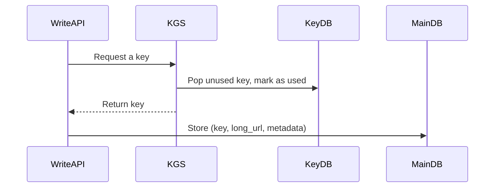
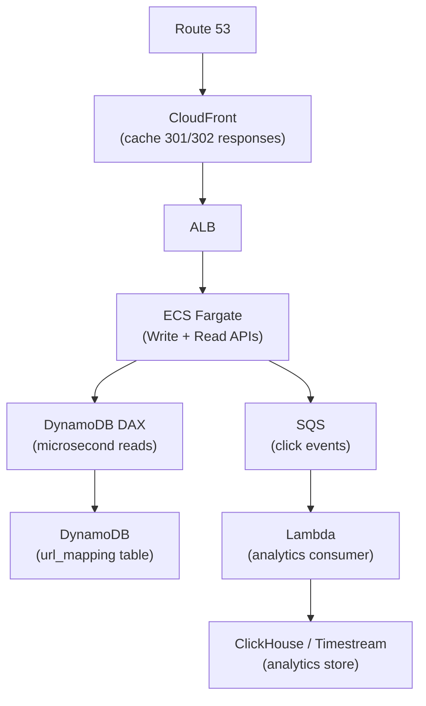

# URL Shortener

> Design a service like bit.ly that shortens URLs and redirects users.

---

## 1. Requirements

### Functional
- Given a long URL, generate a unique short URL
- Given a short URL, redirect to the original long URL
- (Optional) Custom aliases, expiry dates, click analytics

### Non-functional
- High availability — redirects must work even if parts of the system are degraded
- Low redirect latency — < 10ms P99 at the redirect layer
- Short codes must be unique and not collide
- Scale: 100M URLs created/day, 10:1 read/write ratio

---

## 2. Scale Estimation

```
Write QPS:  100M / 86400s  ≈ 1,200 writes/sec
Read QPS:   1,200 × 10    = 12,000 reads/sec

URL size:   ~500 bytes average
Storage:    1,200 writes/sec × 500 bytes × 86400s × 365 days ≈ 18 TB/year

Short code: 7 characters from [a-z, A-Z, 0-9] = 62^7 ≈ 3.5 trillion combinations
            Plenty of headroom.
```

---

## 3. High-Level Design

```mermaid
graph TD
    Client["Client"]
    DNS["DNS / Load Balancer"]
    WriteAPI["Write API\n(URL shortening)"]
    ReadAPI["Read API\n(redirect service)"]
    Cache["Redis Cache\n(short → long URL)"]
    DB["Database\n(short_code, long_url, created_at, expires_at)"]
    Analytics["Analytics Service\n(async, click events)"]
    MQ["Message Queue\n(SQS / Kafka)"]

    Client -->|POST /shorten| DNS
    Client -->|GET /{code}| DNS
    DNS --> WriteAPI
    DNS --> ReadAPI
    WriteAPI --> DB
    ReadAPI --> Cache
    Cache -->|miss| DB
    ReadAPI -->|click event| MQ
    MQ --> Analytics
```

**Data flow — write:**
```
POST /shorten { url: "https://..." }
  → generate short code
  → store in DB
  → return short URL
```

**Data flow — read (redirect):**
```
GET /abc1234
  → check Redis cache
  → hit: return 301/302 redirect
  → miss: fetch from DB → populate cache → redirect
```

---

## 4. Deep Dive

### Short code generation

**Option 1: Hash-based**
```
MD5(long_url) → 128-bit hash → take first 7 chars of base62 encoding
```
- Deterministic (same URL always gets same code)
- Risk: hash collisions — need collision detection and retry
- Risk: same URL produces same short code (may be desired or not)

**Option 2: ID-based (preferred)**
```
DB auto-increment ID → base62 encode → short code
```
- No collisions by definition
- IDs are sequential → predictable (use KGS or UUID if secrecy matters)
- Scale issue: single DB sequence is a bottleneck at high write volume

**Option 3: Key Generation Service (KGS)**
```
Pre-generate a pool of unique 7-char codes offline
On write request: pop one code from the pool
```
- No runtime collision risk
- Fast — code assignment is O(1)
- Need to handle KGS failure (keep a small in-memory buffer)



### Redirect type: 301 vs 302

| | 301 Permanent | 302 Temporary |
|---|---|---|
| Browser behavior | Caches the redirect permanently | Re-requests every time |
| Server load | Lower — browser doesn't call server again | Higher — every click hits your server |
| Analytics | Breaks click tracking after first visit | Accurate click counting |
| Use case | Save server load, don't need analytics | Need per-click analytics |

**Decision:** Use 302 if you want analytics. Use 301 to reduce load.

### Caching strategy

- **Cache-aside** on the read path: check Redis, fall back to DB on miss
- **TTL:** match the URL expiry or set a default (e.g., 24h)
- **Eviction:** LRU — most short URLs are accessed in a burst after creation, then rarely
- **Cache size estimate:** 20% of URLs drive 80% of traffic — cache the hot 20%

### Database choice

| Option | Why |
|---|---|
| Relational (PostgreSQL) | Good choice — simple schema, ACID, easy to query by code |
| NoSQL (DynamoDB) | Better at scale — key-value access pattern (lookup by short code) fits perfectly |

At 18 TB/year, DynamoDB with on-demand capacity and DAX for caching handles this well. Use short_code as the partition key.

### Analytics (deep dive)

Don't do synchronous analytics in the redirect path — it adds latency.

```
Redirect → publish click event to SQS/Kinesis → analytics consumer → aggregate into ClickHouse or DynamoDB
```

Store: `{ short_code, timestamp, ip, user_agent, referer }`  
Aggregate: clicks per day, per country, per referrer

---

## 5. Tradeoffs & Failure Modes

| Decision | Alternative | Why I chose this |
|---|---|---|
| KGS for code generation | Hash-based | No collision handling, simpler at scale |
| 302 redirect | 301 | Analytics requirement |
| Redis cache-aside | Write-through | Don't want to pollute cache with write-heavy, rarely-read URLs |
| DynamoDB | PostgreSQL | Access pattern is pure KV — no joins needed |

**Failure modes:**
- **Cache down:** Degrade to DB reads. Risk: DB overload. Mitigation: circuit breaker
- **KGS down:** Keep a small in-memory buffer of pre-fetched keys on write servers
- **DB down:** Redirect fails for cache misses. 302s still work for cached URLs

---

## 6. AWS Architecture



---

## Key concepts used

- [Caching](../storage/caching.md) — Redis/DAX cache-aside on redirect path
- [Consistent Hashing](../patterns/consistent-hashing.md) — if sharding the KGS key pool
- [Rate Limiting](../patterns/rate-limiting.md) — prevent abuse of the shorten API
- [SQL vs NoSQL](../storage/sql-vs-nosql.md) — why DynamoDB fits this access pattern
