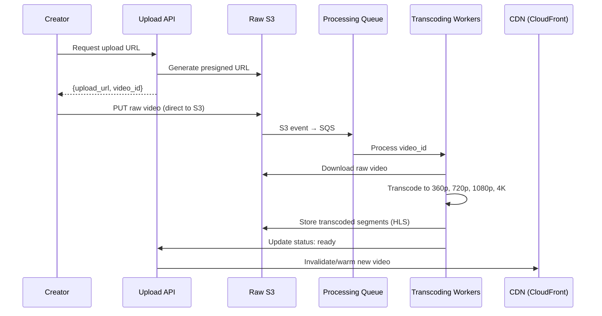

# Design a Video Streaming Service (YouTube/Netflix)

## Problem statement

Design a video streaming platform that:
- 2 billion MAU (YouTube scale)
- 500 hours of video uploaded per minute
- 1 billion hours watched per day
- Supports multiple resolutions: 360p, 720p, 1080p, 4K
- Adaptive bitrate streaming (adjusts quality to network speed)

## Clarifying questions

```
1. Live streaming or pre-recorded?
   → Pre-recorded (VOD). Live streaming is a stretch goal.

2. What devices?
   → Web, iOS, Android, Smart TV

3. Global distribution needed?
   → Yes, users worldwide

4. Monetization / DRM?
   → Out of scope. Focus on core streaming.

5. Video recommendations?
   → Out of scope. Focus on upload + playback.
```

## Scale estimation

```
Uploads: 500 hrs/min = 8 hrs/sec
  Per video: 4 resolutions × avg 2GB/hr = 8GB per hour of video
  Storage: 500 hrs/min × 60 min × 8GB = 240TB/hour uploaded

Playback: 1B hrs/day = ~700,000 concurrent streams
  Avg bitrate: 2 Mbps (720p)
  Bandwidth: 700,000 × 2Mbps = 1.4 Tbps

CDN: must serve 1.4 Tbps globally → critical infrastructure
```

## Video upload pipeline



### Why direct upload to S3?

```
Without presigned URL:
  Creator → API Server → S3
  → Your servers handle 240TB/hour upload bandwidth — impossible

With presigned URL:
  Creator → S3 directly
  → Your servers only handle metadata, not bytes
  → AWS handles the bandwidth
```

```python
def create_upload_url(video_id: str, content_type: str) -> dict:
    key = f"raw/{video_id}/original.mp4"
    
    presigned = s3.generate_presigned_post(
        Bucket='video-raw-uploads',
        Key=key,
        Fields={'Content-Type': content_type},
        Conditions=[
            {'Content-Type': content_type},
            ['content-length-range', 1, 10_000_000_000],  # max 10GB
        ],
        ExpiresIn=3600,
    )
    return {'upload_url': presigned['url'], 'fields': presigned['fields']}
```

## Video transcoding

### Adaptive Bitrate Streaming (ABR) with HLS

HLS (HTTP Live Streaming) splits video into 2–10 second segments:

```
Original: video.mp4 (2GB, 1 hour)
                │
       Transcode (AWS MediaConvert)
                │
    ┌───────────┼───────────┐
    ▼           ▼           ▼
360p/          720p/        1080p/
  seg001.ts     seg001.ts    seg001.ts
  seg002.ts     seg002.ts    seg002.ts
  ...           ...          ...
  playlist.m3u8 playlist.m3u8 playlist.m3u8
                │
          master.m3u8  ← client downloads this first
```

```
# master.m3u8 (manifest file)
#EXTM3U
#EXT-X-STREAM-INF:BANDWIDTH=800000,RESOLUTION=640x360
https://cdn.example.com/videos/abc123/360p/playlist.m3u8

#EXT-X-STREAM-INF:BANDWIDTH=2500000,RESOLUTION=1280x720
https://cdn.example.com/videos/abc123/720p/playlist.m3u8

#EXT-X-STREAM-INF:BANDWIDTH=8000000,RESOLUTION=1920x1080
https://cdn.example.com/videos/abc123/1080p/playlist.m3u8
```

**ABR in action:**
```
Network speed 10 Mbps → player selects 1080p segment
Network drops to 2 Mbps → player switches to 720p (mid-stream, seamlessly)
Network drops to 0.5 Mbps → player switches to 360p (buffers less than pauses)
```

### AWS MediaConvert

```python
mediaconvert = boto3.client('mediaconvert', endpoint_url=endpoint)

job = mediaconvert.create_job(
    Role='arn:aws:iam::123:role/MediaConvertRole',
    Settings={
        'Inputs': [{
            'FileInput': f's3://video-raw-uploads/raw/{video_id}/original.mp4',
        }],
        'OutputGroups': [{
            'Name': 'HLS Group',
            'OutputGroupSettings': {
                'Type': 'HLS_GROUP_SETTINGS',
                'HlsGroupSettings': {
                    'Destination': f's3://video-processed/{video_id}/',
                    'SegmentLength': 6,         # 6-second segments
                    'MinSegmentLength': 0,
                    'DirectoryStructure': 'SINGLE_DIRECTORY',
                }
            },
            'Outputs': [
                _hls_output('360p', 640, 360, 800_000),
                _hls_output('720p', 1280, 720, 2_500_000),
                _hls_output('1080p', 1920, 1080, 8_000_000),
            ]
        }]
    }
)

def _hls_output(name, width, height, bitrate):
    return {
        'NameModifier': f'_{name}',
        'VideoDescription': {
            'Width': width, 'Height': height,
            'CodecSettings': {
                'Codec': 'H_264',
                'H264Settings': {'Bitrate': bitrate, 'RateControlMode': 'CBR'},
            }
        },
        'ContainerSettings': {'Container': 'M3U8'},
    }
```

## CDN strategy (critical)

Serving 1.4 Tbps globally — CDN is not optional:

```
User in London watches US video:
  Request → CloudFront PoP in London
  Cache hit: serve from London edge (low latency, low cost)
  Cache miss: fetch from S3 in us-east-1, cache in London
```

```python
# CloudFront distribution for video delivery
cloudfront.create_distribution(
    DistributionConfig={
        'Origins': {
            'Items': [{
                'Id': 'video-s3',
                'DomainName': 'video-processed.s3.amazonaws.com',
                'S3OriginConfig': {'OriginAccessIdentity': ''},  # use OAC
            }]
        },
        'DefaultCacheBehavior': {
            'ViewerProtocolPolicy': 'https-only',
            'CachePolicyId': managed_cache_policy_id,  # cache based on URL
            'AllowedMethods': {'Items': ['GET', 'HEAD']},
            'Compress': True,
        },
        'CacheBehaviors': {
            'Items': [
                # Manifests: short TTL (player refreshes frequently)
                {
                    'PathPattern': '*.m3u8',
                    'DefaultTTL': 5,      # 5 seconds
                    'MaxTTL': 10,
                },
                # Segments: long TTL (immutable once created)
                {
                    'PathPattern': '*.ts',
                    'DefaultTTL': 86400,  # 24 hours
                    'MaxTTL': 31536000,   # 1 year
                },
            ]
        },
        'HttpVersion': 'http2and3',
        'PriceClass': 'PriceClass_All',  # all edge locations
    }
)
```

## Video metadata service

```python
# PostgreSQL: video metadata
"""
CREATE TABLE videos (
    id          UUID PRIMARY KEY,
    creator_id  UUID NOT NULL,
    title       TEXT NOT NULL,
    description TEXT,
    status      VARCHAR(20) NOT NULL,  -- uploading, processing, ready, failed
    duration_s  INT,
    views       BIGINT DEFAULT 0,
    likes       BIGINT DEFAULT 0,
    created_at  TIMESTAMP NOT NULL,
    published_at TIMESTAMP,
    thumbnail_url TEXT,
    manifest_url  TEXT,  -- CloudFront URL to master.m3u8
);

CREATE INDEX idx_videos_creator ON videos(creator_id, created_at DESC);
CREATE INDEX idx_videos_published ON videos(published_at DESC) WHERE status = 'ready';
"""
```

## Resumable uploads

500 hours/minute of video. Large files. Connections drop:

```python
# Multipart upload: resumable for large files
def initiate_multipart_upload(video_id: str) -> str:
    response = s3.create_multipart_upload(
        Bucket='video-raw-uploads',
        Key=f'raw/{video_id}/original.mp4',
    )
    return response['UploadId']

def upload_part(video_id: str, upload_id: str, part_num: int, data: bytes) -> str:
    response = s3.upload_part(
        Bucket='video-raw-uploads',
        Key=f'raw/{video_id}/original.mp4',
        UploadId=upload_id,
        PartNumber=part_num,
        Body=data,
    )
    return response['ETag']

def complete_upload(video_id: str, upload_id: str, parts: list):
    s3.complete_multipart_upload(
        Bucket='video-raw-uploads',
        Key=f'raw/{video_id}/original.mp4',
        UploadId=upload_id,
        MultipartUpload={'Parts': parts},
    )
```

## View count (eventual consistency)

Naive approach: `UPDATE videos SET views = views + 1` — too slow at scale.

```python
# Async view counting via Kafka
# Player sends view event when 30s watched
kinesis.put_record(
    StreamName='video-views',
    Data=json.dumps({'video_id': video_id, 'user_id': user_id, 'ts': now}),
    PartitionKey=video_id,
)

# Stream processor (every 1 min): aggregate and batch update
# UPDATE videos SET views = views + $count WHERE id = $video_id

# Redis approximate counter (for real-time display)
redis.incr(f"views:rt:{video_id}")
redis.expire(f"views:rt:{video_id}", 3600)
# Periodically flush Redis → DB
```

## Full AWS architecture

```
Upload path:
  Creator → API Gateway → Lambda (presigned URL)
  Creator → S3 (direct upload)
  S3 event → SQS → Lambda → MediaConvert Job
  MediaConvert → S3 (segments) → CloudFront

Playback path:
  Viewer → CloudFront (edge) → S3 (origin on miss)
  Player (HLS.js / native player) ← segments

Metadata:
  API → ECS Fargate → Aurora PostgreSQL
  View counts → Kinesis → Lambda → DynamoDB

Analytics:
  Events → Kinesis Firehose → S3 → Athena / Redshift
```

## Interview talking points

!!! tip "Key design decisions to discuss"
    1. Direct upload to S3 via presigned URL — never stream video through your servers
    2. HLS + ABR — adaptive quality to network speed, 2–10s segments
    3. CDN is the core infrastructure — 99%+ of video traffic served from edge
    4. Transcode at upload time, not at play time — all quality variants pre-built
    5. View counts async — Kinesis → batch DB update, Redis for real-time display

## Related topics

- [Blob Storage](../storage/blob-storage.md) — S3 for video files
- [CDN](../networking/cdn.md) — CloudFront for global delivery
- [Message Queues](../messaging/message-queues.md) — async transcoding pipeline
- [Back-of-Envelope Estimation](../fundamentals/estimation.md) — bandwidth calculations
