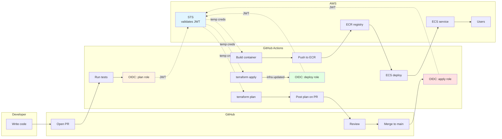
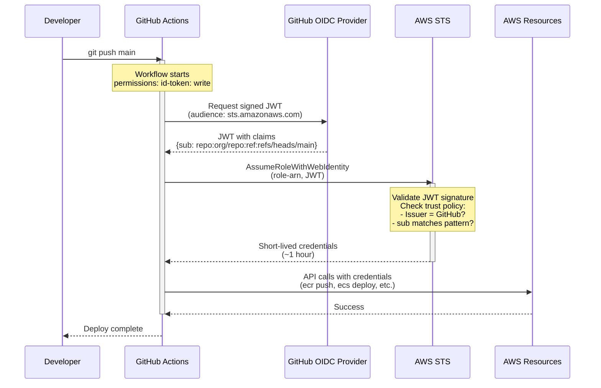
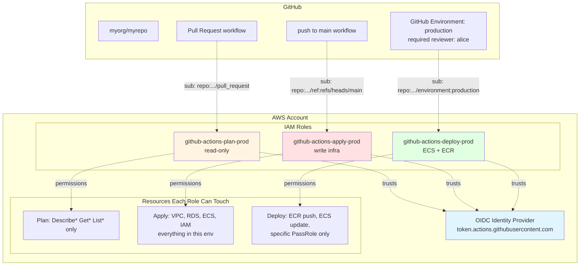
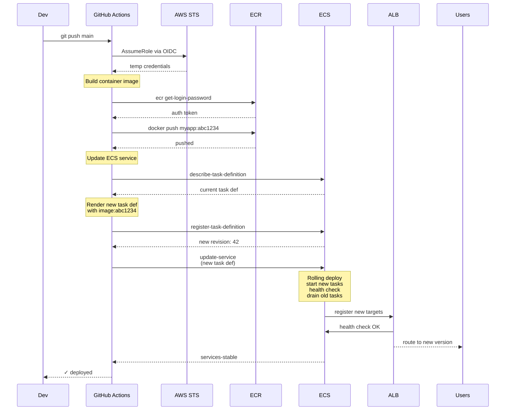
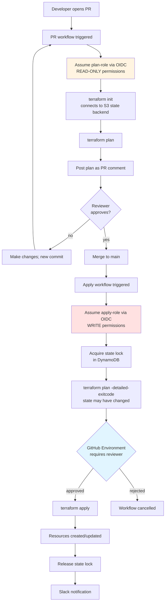
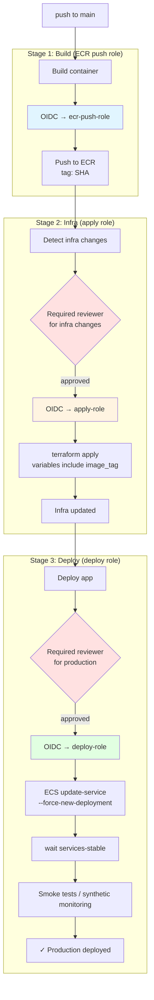
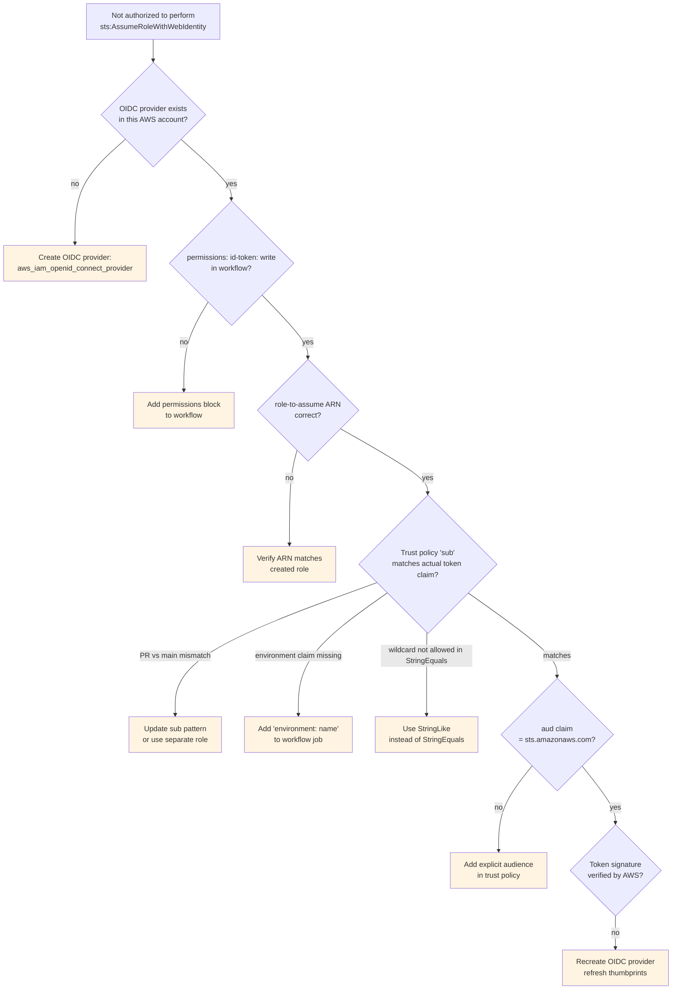
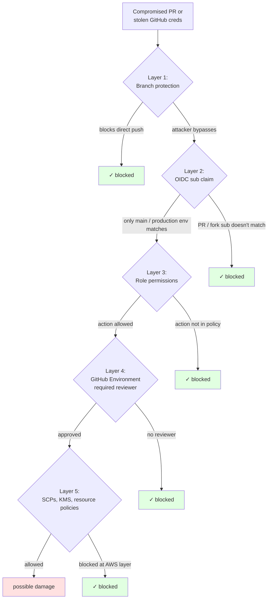
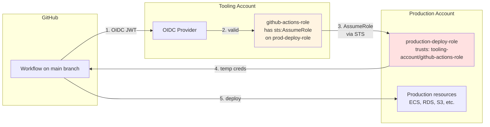

```mermaid
flowchart LR
    A[git push main] --> B[Checkout code]
    B --> C[Assume role via OIDC]
    C --> D[ecr get-login-password]
    D --> E[docker login to ECR]
    
    E --> F[Buildx setup<br/>multi-platform support]
    F --> G[Build image<br/>using BuildKit cache from registry]
    G --> H[Tag image:<br/>:abc1234 + :latest]
    H --> I[docker push to ECR]
    
    I --> J[Trivy scan]
    J --> K{Critical<br/>vulns?}
    K -->|yes| L[❌ Fail workflow]
    K -->|no| M[✓ Image ready]
    
    M --> N[Trigger downstream:<br/>ECS deploy / app rollout]
    
    style C fill:#e1f5ff
    style J fill:#fff4e1
    style L fill:#ffe1e1
    style M fill:#e1ffe1
```

---
tags:
  - aws-native
  - applied
---

# AWS Deployment via GitHub Actions (end-to-end)

A complete walkthrough: from zero to GitHub Actions deploying to AWS using **OIDC** (no stored AWS access keys). Covers the one-time IAM setup, three common deployment flows (app deploy, Terraform apply, container build & push), and how to debug the inevitable trust-policy errors.

This page assumes you're starting fresh. If you already have OIDC set up, jump to the [flows section](#flow-1-deploy-an-app-to-ecs).

---

## End-to-end flow at a glance



Three OIDC handshakes, each with a different IAM role scoped to its job. From a developer's PR to running in production. **No AWS keys anywhere.**

---

## Why OIDC, not access keys

Two ways to give GitHub Actions permission to do things in AWS:

| Method | How it works | Problem |
|---|---|---|
| **Long-lived access keys** | Create IAM user → store keys in GitHub Secrets | Keys leak, never rotate, compromise = total AWS access |
| **OIDC (federated identity)** | GitHub issues a short-lived token; AWS verifies it; grants temporary role | No long-lived secrets; scoped to specific repo + branch |

OIDC is the modern standard. The setup is one-time; benefits are permanent.

---

## The big picture — OIDC handshake



**Key takeaway**: no long-lived AWS keys stored anywhere. Trust is bound to **the specific repo + branch + workflow** via the JWT's `sub` claim, validated by AWS against your IAM role's trust policy.

---

## One-time AWS setup (using Terraform)

Run this Terraform **once per AWS account** that you'll deploy to. This creates the OIDC trust + the IAM roles your workflows will assume.

### What you're building



The pattern: **one OIDC provider, multiple roles**, each scoped to a specific workflow trigger + specific permission set. Goes from "GitHub can do anything in AWS" to "this specific branch can do this specific thing."

### Step 1: Create the GitHub OIDC identity provider in AWS

This tells AWS "trust tokens issued by GitHub."

```hcl
# github-oidc.tf

# Get GitHub's TLS certificate thumbprint
data "tls_certificate" "github" {
  url = "https://token.actions.githubusercontent.com/.well-known/openid-configuration"
}

resource "aws_iam_openid_connect_provider" "github" {
  url             = "https://token.actions.githubusercontent.com"
  client_id_list  = ["sts.amazonaws.com"]
  thumbprint_list = data.tls_certificate.github.certificates[*].sha1_fingerprint
}
```

You create this **once per AWS account**. All future roles reference it.

### Step 2: Create a deployment role (per environment)

This is the role GitHub Actions will assume. The trust policy is the key part — it locks down **which repo + branch + workflow** can assume it.

```hcl
# github-actions-roles.tf

variable "github_org" { default = "myorg" }
variable "github_repo" { default = "myrepo" }

# Role assumable by GitHub Actions running on main branch
resource "aws_iam_role" "github_actions_deploy" {
  name = "github-actions-deploy-production"

  assume_role_policy = jsonencode({
    Version = "2012-10-17"
    Statement = [{
      Effect = "Allow"
      Principal = {
        Federated = aws_iam_openid_connect_provider.github.arn
      }
      Action = "sts:AssumeRoleWithWebIdentity"
      Condition = {
        StringEquals = {
          "token.actions.githubusercontent.com:aud" = "sts.amazonaws.com"
          # The CRITICAL line: locks role to a specific repo + branch
          "token.actions.githubusercontent.com:sub" = "repo:${var.github_org}/${var.github_repo}:ref:refs/heads/main"
        }
      }
    }]
  })
}

# Attach permissions to the role — what it's allowed to do
resource "aws_iam_role_policy" "github_actions_deploy" {
  name = "deploy-permissions"
  role = aws_iam_role.github_actions_deploy.id

  policy = jsonencode({
    Version = "2012-10-17"
    Statement = [
      # ECR push
      {
        Effect = "Allow"
        Action = [
          "ecr:GetAuthorizationToken",
          "ecr:BatchCheckLayerAvailability",
          "ecr:GetDownloadUrlForLayer",
          "ecr:BatchGetImage",
          "ecr:InitiateLayerUpload",
          "ecr:UploadLayerPart",
          "ecr:CompleteLayerUpload",
          "ecr:PutImage",
        ]
        Resource = "*"
      },
      # ECS deploy
      {
        Effect = "Allow"
        Action = [
          "ecs:UpdateService",
          "ecs:DescribeServices",
          "ecs:DescribeTaskDefinition",
          "ecs:RegisterTaskDefinition",
        ]
        Resource = "*"
      },
      # PassRole for ECS task role (only the specific roles ECS needs)
      {
        Effect = "Allow"
        Action = "iam:PassRole"
        Resource = [
          aws_iam_role.ecs_task_execution.arn,
          aws_iam_role.ecs_task.arn,
        ]
      },
    ]
  })
}

output "github_actions_role_arn" {
  value = aws_iam_role.github_actions_deploy.arn
}
```

### Step 3: Important — the `sub` claim patterns

The `sub` claim is the security boundary. **Get this wrong and you have a security hole.**

```hcl
# ONLY main branch of one repo (most common)
"token.actions.githubusercontent.com:sub" = "repo:myorg/myrepo:ref:refs/heads/main"

# Pull requests of one repo (use for plan-only roles)
"token.actions.githubusercontent.com:sub" = "repo:myorg/myrepo:pull_request"

# Any branch matching a pattern
"token.actions.githubusercontent.com:sub" = "repo:myorg/myrepo:ref:refs/heads/release/*"

# A specific GitHub environment (for protection rules)
"token.actions.githubusercontent.com:sub" = "repo:myorg/myrepo:environment:production"

# Tag pushes (release deploys)
"token.actions.githubusercontent.com:sub" = "repo:myorg/myrepo:ref:refs/tags/v*"

# Multiple repos under one org (use StringLike, not StringEquals)
# Condition = {
#   StringLike = {
#     "token.actions.githubusercontent.com:sub" = "repo:myorg/*:ref:refs/heads/main"
#   }
# }
```

**Common mistakes**:

- Using `StringLike` with `*` everywhere → too permissive
- Forgetting `:ref:refs/heads/` prefix → claim never matches
- Mixing `pull_request` and `ref:refs/heads/*` in one role → use separate roles

### Step 4: Apply the Terraform

```bash
terraform init
terraform plan
terraform apply
```

After apply, note the output:

```
github_actions_role_arn = "arn:aws:iam::123456789012:role/github-actions-deploy-production"
```

You'll use this ARN in every GitHub Actions workflow.

---

## Recommended IAM role structure

Don't have one omnipotent role. Have **multiple roles per environment**, each with minimum permissions:

```
github-actions-plan-dev               (Terraform plan, read-only)
github-actions-apply-dev              (Terraform apply, create/modify)
github-actions-deploy-dev             (ECS deploy, ECR push)

github-actions-plan-staging
github-actions-apply-staging
github-actions-deploy-staging

github-actions-plan-production        (read-only — anyone can review)
github-actions-apply-production       (write — gated by environment protection rules)
github-actions-deploy-production      (deploy — gated by environment)
```

Each role's trust policy specifies *which branch / environment / event* can assume it. PR runs get plan; main merges get apply; production gets manual approval via GitHub Environments.

---

## Flow 1: Deploy an app to ECS

The most common flow. Code change → build container → push to ECR → update ECS service.

### Diagram



```yaml
# .github/workflows/deploy.yml
name: Deploy to ECS

on:
  push:
    branches: [main]

permissions:
  id-token: write       # REQUIRED for OIDC
  contents: read

env:
  AWS_REGION: us-east-1
  ECR_REPOSITORY: order-service
  ECS_CLUSTER: production
  ECS_SERVICE: order-service

jobs:
  deploy:
    runs-on: ubuntu-latest
    environment: production    # GitHub Environment with required reviewers
    
    steps:
      - uses: actions/checkout@v4

      # 1. Assume AWS role via OIDC
      - name: Configure AWS credentials
        uses: aws-actions/configure-aws-credentials@v4
        with:
          role-to-assume: arn:aws:iam::123456789012:role/github-actions-deploy-production
          aws-region: ${{ env.AWS_REGION }}

      # 2. Login to ECR (uses the assumed role)
      - name: Login to ECR
        id: login-ecr
        uses: aws-actions/amazon-ecr-login@v2

      # 3. Build and push image
      - name: Build and push image
        env:
          REGISTRY: ${{ steps.login-ecr.outputs.registry }}
          IMAGE_TAG: ${{ github.sha }}
        run: |
          docker build -t $REGISTRY/$ECR_REPOSITORY:$IMAGE_TAG .
          docker push $REGISTRY/$ECR_REPOSITORY:$IMAGE_TAG
          echo "image=$REGISTRY/$ECR_REPOSITORY:$IMAGE_TAG" >> $GITHUB_OUTPUT
        id: build

      # 4. Update ECS task definition with new image
      - name: Download current task definition
        run: |
          aws ecs describe-task-definition \
            --task-definition $ECS_SERVICE \
            --query taskDefinition > task-definition.json

      - name: Update image in task definition
        id: task-def
        uses: aws-actions/amazon-ecs-render-task-definition@v1
        with:
          task-definition: task-definition.json
          container-name: ${{ env.ECS_SERVICE }}
          image: ${{ steps.build.outputs.image }}

      # 5. Deploy
      - name: Deploy to ECS
        uses: aws-actions/amazon-ecs-deploy-task-definition@v1
        with:
          task-definition: ${{ steps.task-def.outputs.task-definition }}
          service: ${{ env.ECS_SERVICE }}
          cluster: ${{ env.ECS_CLUSTER }}
          wait-for-service-stability: true
```

That's a complete production deploy. No AWS keys anywhere; auth is via OIDC.

### Adding canary or blue/green

ECS supports both. The deployment configuration is in the task definition or via CodeDeploy. See [Deployment Strategies](deployment-strategies.md) and [Progressive Delivery](progressive-delivery.md).

---

## Flow 2: Run Terraform in CI

The full lifecycle: PR opens → plan posted as comment → review → merge → apply.

### Diagram



### PR workflow — plan only, read-only role

```yaml
# .github/workflows/terraform-plan.yml
name: Terraform Plan

on:
  pull_request:
    paths: ['infra/**']

permissions:
  id-token: write
  contents: read
  pull-requests: write    # to comment on PR

jobs:
  plan:
    runs-on: ubuntu-latest
    
    defaults:
      run:
        working-directory: infra/environments/production

    steps:
      - uses: actions/checkout@v4

      - uses: hashicorp/setup-terraform@v3
        with:
          terraform_version: 1.7.0

      # Plan role is READ-ONLY — safe even if PR is from a fork
      - name: AWS OIDC auth (plan role)
        uses: aws-actions/configure-aws-credentials@v4
        with:
          role-to-assume: arn:aws:iam::123456789012:role/github-actions-plan-production
          aws-region: us-east-1

      - name: terraform init
        run: terraform init

      - name: terraform validate
        run: terraform validate

      - name: terraform plan
        id: plan
        run: |
          terraform plan -no-color -out=tfplan -var-file=terraform.tfvars
          terraform show -no-color tfplan > plan.txt
        continue-on-error: true

      - name: Post plan as PR comment
        uses: actions/github-script@v7
        with:
          script: |
            const fs = require('fs');
            const plan = fs.readFileSync('infra/environments/production/plan.txt', 'utf8');
            const truncated = plan.length > 60000 ? plan.slice(0, 60000) + '\n... (truncated)' : plan;
            github.rest.issues.createComment({
              issue_number: context.issue.number,
              owner: context.repo.owner,
              repo: context.repo.repo,
              body: `### Terraform Plan: production\n\n\`\`\`hcl\n${truncated}\n\`\`\``
            });
```

### Apply workflow — runs on merge to main

```yaml
# .github/workflows/terraform-apply.yml
name: Terraform Apply

on:
  push:
    branches: [main]
    paths: ['infra/**']

permissions:
  id-token: write
  contents: read

concurrency:
  group: terraform-apply-production
  cancel-in-progress: false   # NEVER cancel an in-progress apply

jobs:
  apply:
    runs-on: ubuntu-latest
    environment: production   # Manual approval required via GitHub Environment

    defaults:
      run:
        working-directory: infra/environments/production

    steps:
      - uses: actions/checkout@v4

      - uses: hashicorp/setup-terraform@v3
        with:
          terraform_version: 1.7.0

      # Apply role has WRITE permissions
      - name: AWS OIDC auth (apply role)
        uses: aws-actions/configure-aws-credentials@v4
        with:
          role-to-assume: arn:aws:iam::123456789012:role/github-actions-apply-production
          aws-region: us-east-1

      - name: terraform init
        run: terraform init

      # Re-plan to confirm; state may have changed since PR
      - name: terraform plan
        id: plan
        run: terraform plan -out=tfplan -var-file=terraform.tfvars -detailed-exitcode
        continue-on-error: true

      - name: Stop if no changes
        if: steps.plan.outputs.exitcode == '0'
        run: echo "No changes — exiting" && exit 0

      - name: terraform apply
        if: steps.plan.outputs.exitcode == '2'
        run: terraform apply -auto-approve tfplan

      - name: Notify Slack
        if: always()
        uses: slackapi/slack-github-action@v1
        with:
          payload: |
            {
              "text": "Terraform apply ${{ job.status }} for production"
            }
```

### State backend (one-time setup, also Terraform)

You need an S3 bucket + DynamoDB table for state + locks. Set this up **before** doing anything else:

```hcl
# terraform-state-backend.tf

resource "aws_s3_bucket" "tf_state" {
  bucket = "mycompany-terraform-state-production"
}

resource "aws_s3_bucket_versioning" "tf_state" {
  bucket = aws_s3_bucket.tf_state.id
  versioning_configuration { status = "Enabled" }
}

resource "aws_s3_bucket_server_side_encryption_configuration" "tf_state" {
  bucket = aws_s3_bucket.tf_state.id
  rule {
    apply_server_side_encryption_by_default {
      sse_algorithm = "aws:kms"
    }
  }
}

resource "aws_s3_bucket_public_access_block" "tf_state" {
  bucket                  = aws_s3_bucket.tf_state.id
  block_public_acls       = true
  block_public_policy     = true
  ignore_public_acls      = true
  restrict_public_buckets = true
}

resource "aws_dynamodb_table" "tf_locks" {
  name         = "terraform-state-locks"
  billing_mode = "PAY_PER_REQUEST"
  hash_key     = "LockID"
  attribute {
    name = "LockID"
    type = "S"
  }
}
```

In your environment's `backend.tf`:

```hcl
terraform {
  backend "s3" {
    bucket         = "mycompany-terraform-state-production"
    key            = "production/terraform.tfstate"
    region         = "us-east-1"
    encrypt        = true
    dynamodb_table = "terraform-state-locks"
  }
}
```

See [State Management](../iac/state-management.md) for depth.

---

## Flow 3: Build and push a container to ECR

This is a sub-step of Flow 1, but it's common to want it standalone (for libraries, base images, dev tools).

### Diagram



```yaml
# .github/workflows/build-and-push.yml
name: Build and Push to ECR

on:
  push:
    branches: [main]

permissions:
  id-token: write
  contents: read

jobs:
  build:
    runs-on: ubuntu-latest

    steps:
      - uses: actions/checkout@v4

      - uses: aws-actions/configure-aws-credentials@v4
        with:
          role-to-assume: arn:aws:iam::123456789012:role/github-actions-ecr-push
          aws-region: us-east-1

      - uses: aws-actions/amazon-ecr-login@v2
        id: ecr

      # Buildkit + cache from registry for faster builds
      - uses: docker/setup-buildx-action@v3

      - name: Build and push
        uses: docker/build-push-action@v5
        with:
          context: .
          push: true
          tags: |
            ${{ steps.ecr.outputs.registry }}/order-service:${{ github.sha }}
            ${{ steps.ecr.outputs.registry }}/order-service:latest
          cache-from: type=registry,ref=${{ steps.ecr.outputs.registry }}/order-service:cache
          cache-to: type=registry,ref=${{ steps.ecr.outputs.registry }}/order-service:cache,mode=max

      # Scan for vulnerabilities
      - name: Trivy scan
        uses: aquasecurity/trivy-action@master
        with:
          image-ref: ${{ steps.ecr.outputs.registry }}/order-service:${{ github.sha }}
          severity: CRITICAL,HIGH
          exit-code: '1'
```

---

## Combined: full deployment pipeline

The most common real-world setup combines all three flows:

### Diagram — three stages, three roles



**Why three roles instead of one super-role**: blast radius. The build role can't apply infra. The apply role can't push containers. The deploy role can't change IAM. Each layer is independently locked down.

```yaml
# .github/workflows/full-deploy.yml
name: Full Deploy

on:
  push:
    branches: [main]

permissions:
  id-token: write
  contents: read

jobs:
  # ── Stage 1: Build app image ────────────────────────────
  build:
    runs-on: ubuntu-latest
    outputs:
      image-tag: ${{ steps.build.outputs.tag }}
    steps:
      - uses: actions/checkout@v4
      - uses: aws-actions/configure-aws-credentials@v4
        with:
          role-to-assume: arn:aws:iam::123:role/github-actions-ecr-push
          aws-region: us-east-1
      - uses: aws-actions/amazon-ecr-login@v2
        id: ecr
      - name: Build & push
        id: build
        run: |
          docker build -t ${{ steps.ecr.outputs.registry }}/app:${{ github.sha }} .
          docker push ${{ steps.ecr.outputs.registry }}/app:${{ github.sha }}
          echo "tag=${{ github.sha }}" >> $GITHUB_OUTPUT

  # ── Stage 2: Apply infra changes (if any) ────────────────
  infra:
    runs-on: ubuntu-latest
    needs: build
    environment: production-infra    # Required reviewer for infra changes
    steps:
      - uses: actions/checkout@v4
      - uses: hashicorp/setup-terraform@v3
      - uses: aws-actions/configure-aws-credentials@v4
        with:
          role-to-assume: arn:aws:iam::123:role/github-actions-apply-production
          aws-region: us-east-1
      - working-directory: infra/environments/production
        run: |
          terraform init
          terraform apply -auto-approve -var="image_tag=${{ needs.build.outputs.image-tag }}"

  # ── Stage 3: Deploy app via ECS ──────────────────────────
  deploy:
    runs-on: ubuntu-latest
    needs: [build, infra]
    environment: production           # Final approval
    steps:
      - uses: actions/checkout@v4
      - uses: aws-actions/configure-aws-credentials@v4
        with:
          role-to-assume: arn:aws:iam::123:role/github-actions-deploy-production
          aws-region: us-east-1
      - name: Deploy
        run: |
          aws ecs update-service \
            --cluster production \
            --service order-service \
            --force-new-deployment

      - name: Wait for service stable
        run: |
          aws ecs wait services-stable \
            --cluster production \
            --services order-service
```

Three stages, three different roles, gated by GitHub Environments for production approval.

---

## GitHub Environments — the missing protection layer

OIDC alone doesn't give you "manual approval for production." GitHub Environments do:

```
GitHub → Repo settings → Environments → New environment "production"
  
Configure:
  ✓ Required reviewers: alice, bob (the SREs)
  ✓ Wait timer: 5 minutes (cooling-off period)
  ✓ Deployment branches: main only
  ✓ Environment secrets: any prod-specific values
```

In the workflow:

```yaml
deploy:
  environment: production  # Pauses workflow until reviewer approves
```

Now any deploy to production requires a human click before running. Combined with OIDC, this gives you the right model: **automation, with humans in the loop where it matters**.

---

## Debugging — common errors

### Decision tree for "AssumeRole failed"



### `Error: Not authorized to perform sts:AssumeRoleWithWebIdentity`

The trust policy doesn't match the OIDC token. Check:

```bash
# What's the actual sub claim being sent?
# Add this step to your workflow:
- name: Debug OIDC token
  run: |
    IDTOKEN=$(curl -H "Authorization: bearer $ACTIONS_ID_TOKEN_REQUEST_TOKEN" \
              "$ACTIONS_ID_TOKEN_REQUEST_URL&audience=sts.amazonaws.com" \
              | jq -r .value)
    echo "$IDTOKEN" | cut -d'.' -f2 | base64 -d | jq
```

Compare the `sub` field to your trust policy's `StringEquals`. They must match exactly.

Common mismatches:

| Trust policy says | Token actually has | Why |
|---|---|---|
| `repo:org/repo:ref:refs/heads/main` | `repo:org/repo:pull_request` | Workflow runs on PR not push |
| `repo:org/repo:ref:refs/heads/main` | `repo:org/repo:ref:refs/heads/feature/x` | Triggered from feature branch |
| `repo:org/repo:environment:production` | `repo:org/repo:ref:refs/heads/main` | Workflow doesn't reference environment |

### `Error: Could not assume role with OIDC: No OpenIDConnect provider found`

You didn't create the OIDC provider in this AWS account. Run the `aws_iam_openid_connect_provider` Terraform.

### `Error: User: anonymous is not authorized to perform: <action>`

The role was assumed but doesn't have the permission. Add it to the role's policy.

### Workflow succeeds but `terraform apply` says "Error acquiring the state lock"

A previous apply crashed. Check DynamoDB for the lock entry; force-unlock only if you're sure no apply is running:

```bash
terraform force-unlock <LOCK_ID>
```

### "Permission denied" on `iam:PassRole`

For ECS deploys, the deploy role needs to pass roles to the ECS service. Add to deploy role:

```hcl
{
  Effect = "Allow"
  Action = "iam:PassRole"
  Resource = [
    aws_iam_role.ecs_task_execution.arn,
    aws_iam_role.ecs_task.arn,
  ]
  Condition = {
    StringEquals = {
      "iam:PassedToService" = "ecs-tasks.amazonaws.com"
    }
  }
}
```

---

## Security model — defence in depth



```
Layer 1: Branch protection (GitHub)
  Main branch requires PR + reviews + green CI
  Direct push to main is blocked

Layer 2: OIDC sub claim binding (AWS IAM)
  Trust policy → only specific repo + branch + environment can assume role
  No long-lived AWS keys exist in GitHub

Layer 3: Role permissions (AWS IAM)  
  Each role has minimum permissions for its job
  Plan role: read-only
  Apply role: write to specific resources
  Deploy role: ECS update + ECR push only

Layer 4: GitHub Environments
  Production deploys require human approval
  Branch restrictions: only `main` can deploy to production
  Secrets scoped to environment

Layer 5: AWS-side guardrails (SCPs, KMS keys, resource policies)
  Production resources only modifiable by the production role
  Cross-account access requires explicit trust
```

Each layer is independent. Compromising one (e.g., a malicious PR) doesn't bypass the others (GitHub Environment approval still required).

---

## Cross-account deploys (the real pattern at scale)

Most companies have separate AWS accounts per environment:

### Diagram — two-hop role assumption



Two hops:
1. GitHub → tooling account (via OIDC)
2. Tooling account → production account (via standard AWS AssumeRole)

Compromising the tooling account isn't enough — the attacker also needs to be able to assume the production role, which has its own trust policy.

```
Tooling account:    GitHub Actions runs here
  - github-actions-role
  - This role can sts:AssumeRole into other accounts

Production account:
  - production-deploy-role (assumable only from tooling account)
  - All production resources
```

```hcl
# In the tooling account
resource "aws_iam_role" "github_actions" {
  # Trust policy: GitHub OIDC as before
  
  # Plus: this role can assume cross-account roles
  inline_policy {
    name = "assume-cross-account"
    policy = jsonencode({
      Statement = [{
        Effect = "Allow"
        Action = "sts:AssumeRole"
        Resource = [
          "arn:aws:iam::PROD_ACCOUNT_ID:role/production-deploy-role",
          "arn:aws:iam::STAGING_ACCOUNT_ID:role/staging-deploy-role",
        ]
      }]
    })
  }
}

# In the production account
resource "aws_iam_role" "production_deploy" {
  assume_role_policy = jsonencode({
    Statement = [{
      Effect = "Allow"
      Principal = {
        AWS = "arn:aws:iam::TOOLING_ACCOUNT_ID:role/github-actions-role"
      }
      Action = "sts:AssumeRole"
    }]
  })
}
```

In the workflow:

```yaml
- name: Assume tooling-account role via OIDC
  uses: aws-actions/configure-aws-credentials@v4
  with:
    role-to-assume: arn:aws:iam::TOOLING_ACCOUNT:role/github-actions-role
    aws-region: us-east-1

- name: Assume production-account role
  uses: aws-actions/configure-aws-credentials@v4
  with:
    role-to-assume: arn:aws:iam::PROD_ACCOUNT:role/production-deploy-role
    role-chaining: true
    aws-region: us-east-1
```

Two-hop assumption. Blast radius bounded: even if tooling-account is compromised, production access requires the specific role.

---

## Cost

```
GitHub Actions:
  - Public repos: free (unlimited minutes)
  - Private repos: free tier (~2,000 min/month), then $0.008/min Linux

AWS:
  - OIDC provider: free
  - IAM roles: free
  - STS tokens: free
  - ECR storage: $0.10/GB-month
  - ECR data transfer: free within region

Typical small/mid SaaS:
  - GitHub Actions: $50-300/month
  - AWS deploy infra: nearly free (just storage)
```

OIDC is dramatically cheaper than running your own deployment infrastructure.

---

## Migration from access keys

If you currently have AWS keys in GitHub Secrets:

```
1. Create the OIDC provider + roles in AWS (Terraform above)
2. Add OIDC-based auth to a NEW workflow alongside the old
3. Test it works end-to-end
4. Switch the main workflow to OIDC
5. Delete the old IAM user + access keys
6. Audit CloudTrail: confirm no more AccessKey-based API calls
```

Don't try to flip both at once. Run them in parallel for a week, then cut over.

---

## Checklist for production-ready setup

```
✓ AWS OIDC provider created (one per account)
✓ Separate IAM roles per environment + per function (plan / apply / deploy)
✓ Trust policies use StringEquals (not StringLike with wildcards) where possible
✓ Each role has minimum permissions for its job
✓ Production roles bound to main branch + production environment only
✓ GitHub Environments configured with required reviewers for production
✓ Branch protection on main: PR required, reviews, status checks
✓ State backend (S3 + DynamoDB) for Terraform
✓ Secrets scanning enabled (gitleaks, GitHub secret scanning)
✓ Slack / email notifications for deploy success/failure
✓ Rollback procedure documented (revert commit + re-apply)
✓ CloudTrail enabled — all role assumptions auditable
```

---

## Related

- [CI/CD Fundamentals](fundamentals.md) — concepts (OIDC, pipeline anatomy)
- [Pipelines](pipelines.md) — GitHub Actions in depth
- [Terraform in CI/CD Lifecycle](../iac/terraform-cicd-lifecycle.md) — Terraform-specific deep dive
- [State Management](../iac/state-management.md) — Terraform state backend setup
- [Security in CI/CD](security-in-cicd.md) — scanning, signing, supply chain
- [Deployment Strategies](deployment-strategies.md) — canary, blue/green on ECS
- [AWS Compute Picker](../aws/picker-compute.md) — pick the right deploy target
- [Zero Trust](../security/zero-trust.md) — the security model OIDC enables
