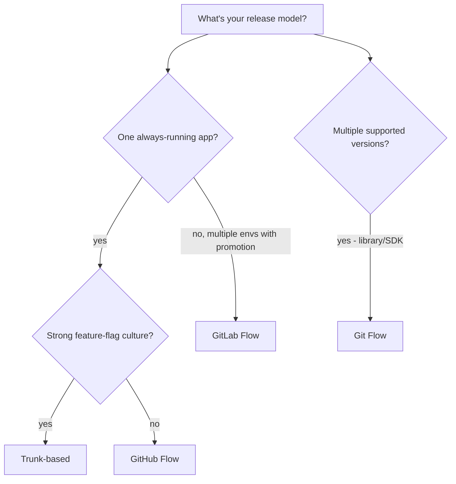

# Branching Strategies

How code flows from a developer's keyboard to production is shaped by the branching strategy. The strategy determines integration cadence, release coordination, and how risky each merge is. Pick wrong and the pipeline is fighting the workflow.

---

## The four common strategies

| Strategy | Long-lived branches | Release cadence | Best for |
|---|---|---|---|
| **Trunk-based** | None (just `main`) | Multiple per day | Modern continuous delivery |
| **GitHub Flow** | `main` only | Continuous, on merge | Web apps, SaaS |
| **GitLab Flow** | `main` + env branches | Per environment | Multi-environment promotion |
| **Git Flow** | `main`, `develop`, releases | Slow, planned | Versioned releases, multi-version support |

---

## Trunk-based development

Every developer works directly on `main` (or in very short-lived feature branches that merge within hours).

```
main:  o─o─o─o─o─o─o─o─o─o─o─o─o─o─o─o
       │ │ │ │ │ │ │ │ │ │ │ │ │ │ │
       commits flow continuously
```

### Rules

- Branches live <24h, often <1h
- Merge to main only when CI green
- Production deploys from main
- Incomplete features hidden behind feature flags

### Pros

- Smallest possible PRs → easier review
- No long-lived branches to rebase
- Fast feedback (any change is in main quickly)
- Forces feature flags (good practice anyway)
- Encourages small, incremental design

### Cons

- Requires strong CI (any merge = potential prod)
- Requires feature flags (or partial features visible)
- Steep cultural change for teams used to long branches

### Example

```bash
# Morning
git checkout -b feature/add-user-search
# ... 2 hours of work, hidden behind feature flag SEARCH_V2 ...
git push -u origin feature/add-user-search
# Open PR → CI green → review → merge

# Afternoon
git checkout main && git pull
# main is already updated with morning's change
```

Used by Google, Facebook, most modern SaaS at scale.

---

## GitHub Flow

Slightly more relaxed than trunk-based. Feature branches off `main`, merged via PR.

```
main:    o───────o───────o───────o───────o
          \     /         \     /
feature1:  o───o            (deleted after merge)
                feature2:    o───o
```

### Rules

- Branch from main
- Push branches to GitHub
- Open PR when ready for review
- Merge after review + CI green
- Deploy main to production

### Pros

- Simple mental model
- Works well for web apps with single deployable
- Compatible with most CI systems out of the box

### Cons

- Branches can live longer than ideal (days/weeks)
- Long-lived branches accumulate merge conflicts
- Not suited to versioned releases (e.g., libraries)

The default for most GitHub teams.

---

## GitLab Flow

GitHub Flow + environment branches. Code promotes through branches matching environments.

```
main:        o───o───o───o───o     ← bleeding edge, deploys to dev
              \       \       \
pre-production: o───────o───────o   ← merges from main, deploys to staging
                          \       \
production:                o───────o ← merges from pre-prod, deploys to prod
```

### Rules

- All work merges to main first
- Merge main → pre-production → production via PRs
- Each branch corresponds to an environment

### Pros

- Promotion is explicit (PR per environment)
- Easy rollback (revert in environment branch)
- Suits regulated industries (audit trail per env)

### Cons

- More branches to maintain
- Promotion friction (manual PRs)
- Can drift if promotion gets skipped

### Example

```bash
# Engineer merges feature to main
# → CI auto-deploys to dev

# Tech lead opens PR: main → pre-production
# → CI auto-deploys to staging on merge

# Engineering manager opens PR: pre-production → production
# → CI deploys to production on merge (with approval gate)
```

Common in companies that need explicit promotion gates per environment.

---

## Git Flow (the heavyweight one)

Long-lived `develop` branch + `release/*` and `hotfix/*` branches. Designed for software with discrete versioned releases.

```
main:      o───────────o───────o   ← only released versions
             \         |        \
release:      o───o    |         release-1.2 ─→ merges to main
               \   \   |
develop:        o───o─o    ← integration of features
                |  |  |
features:       o  o  o    ← branched from develop
```

### Rules

- `develop` is the integration branch
- Features branch from `develop`, merge back to `develop`
- Releases branch from `develop`, stabilise, then merge to both `develop` AND `main`
- Hotfixes branch from `main`, merge back to `main` AND `develop`

### Pros

- Multiple versions in production simultaneously (v1.0 + v1.1 + v2.0 supported)
- Stable `main` always represents released code
- Hotfix path is clear

### Cons

- **Heavy** — many branches, many merges, many conflicts
- Long-lived branches → painful merges
- Doesn't fit modern continuous delivery
- Often misapplied — used for SaaS that doesn't need version proliferation

### When Git Flow makes sense

- Library/SDK where multiple versions are supported
- Embedded software with shipped releases
- Regulated industry where releases are formal events
- Mobile app store releases (review delays force the structure)

### When to skip Git Flow

- Web apps / SaaS with one production version
- Modern teams aiming for continuous delivery
- Anything where "release" means "deploy"

The original Git Flow article author later wrote that it's been overused: "If your team is doing continuous delivery of software, I would suggest to adopt a much simpler workflow … instead of trying to shoehorn git-flow into your team."

---

## Comparing on real concerns

| Concern | Trunk-based | GitHub Flow | GitLab Flow | Git Flow |
|---|---|---|---|---|
| Merge conflicts | Rare (small PRs) | Some | Some | Frequent |
| CI complexity | Simple | Simple | Moderate | High |
| Feature flag dependency | High | Medium | Low | Low |
| Hotfix path | Just merge | Just merge | Skip envs to prod | Dedicated branch |
| Suits SaaS | ✓✓ | ✓✓ | ✓ | ✗ |
| Suits library | ✗ | ✗ | ✓ | ✓✓ |
| Suits regulated | ✗ | ✗ | ✓✓ | ✓ |
| Setup complexity | Low | Low | Medium | High |

---

## Feature flags — the unlock for trunk-based

Feature flags decouple **deploy** from **release**. Code is deployed but disabled.

```python
if feature_flags.is_enabled("new_search_ui", user=current_user):
    return new_search_response()
return old_search_response()
```

Now you can:

- Merge incomplete features to main (flag off in prod)
- Roll out gradually (10% → 50% → 100%)
- Roll back instantly (flip the flag, no redeploy)
- A/B test (flag on for cohort A only)

Tools: LaunchDarkly, Unleash, Flagsmith, ConfigCat, AWS AppConfig.

Without feature flags, trunk-based development is risky — incomplete features in main could ship.

---

## Pull request hygiene

Regardless of strategy:

```
✓ Small PRs (< 400 lines, ideally < 200)
✓ Single concern per PR (refactor + feature = two PRs)
✓ Descriptive title (not "fix stuff")
✓ Description: what + why (not just what)
✓ Linked issue / ticket
✓ Self-review before requesting review
✓ Tests included
✓ CI green before requesting review
✗ No "fix typo" commits piled in unrelated PR
✗ No "WIP" PRs without [WIP] tag
```

PR size correlates strongly with review quality. A 50-line PR gets a careful review; a 2000-line PR gets "LGTM."

---

## Merge strategies

### Merge commit
```
*   Merge feature into main
|\
| * Feature commit 3
| * Feature commit 2  
| * Feature commit 1
|/
* Previous main commit
```
Preserves full history. Most accurate but cluttered.

### Squash and merge
```
* Squashed feature (single commit)
* Previous main commit
```
Clean main history. Loses individual commit history.

### Rebase and merge
```
* Feature commit 3
* Feature commit 2
* Feature commit 1
* Previous main commit
```
Linear history with all commits. Each must be coherent (rebase often forces fixup commits).

**Common choice**: squash for SaaS (clean main), merge commits for libraries (preserve PR boundaries), rebase for hardcore linear-history teams.

---

## Code owners

Automatic reviewer assignment based on file paths:

```
# .github/CODEOWNERS
infra/                      @platform-team
src/payment/                @payment-team
src/order/                  @order-team
docs/                       @docs-team @engineering
*.md                        @docs-team
.github/workflows/          @platform-team
```

PR touching `src/payment/` → payment-team auto-requested for review. Combined with branch protection (require code-owner approval), enforces ownership.

---

## Release tagging

Even in trunk-based, tag releases:

```bash
git tag -a v1.2.3 -m "Release 1.2.3" abc1234
git push origin v1.2.3
```

Tags trigger release workflows:

```yaml
on:
  push:
    tags:
      - 'v*'
```

Tags are immutable refs to specific commits. Useful for:

- Reproducing exact builds
- Rollback ("deploy v1.2.2")
- Generated changelogs (between tags)

---

## Hotfix patterns

A bug in production needs a fix without merging unrelated work in flight.

### Trunk-based / GitHub Flow

```bash
# Branch from main, fix, merge fast
git checkout -b hotfix/critical-bug main
# ... fix ...
# Open PR → CI → merge → deploy
```

Same as any other change. Speed comes from small PR + fast pipeline.

### GitLab Flow

```bash
# Branch from production (the deployed branch), fix, then propagate back
git checkout -b hotfix/critical-bug production
# ... fix ...
# Merge to production (deploy immediately)
# Then PR: production → pre-production → main
```

The fix goes to prod first, then propagates back to keep all branches consistent.

### Git Flow

```bash
git checkout -b hotfix/1.2.4 main
# ... fix ...
# Merge to main (releases 1.2.4)
# Merge to develop (so develop has the fix)
git tag v1.2.4
```

---

## Choosing a strategy



For SaaS / web apps: **trunk-based or GitHub Flow**.
For multi-env regulated: **GitLab Flow**.
For libraries with versioned support: **Git Flow** (or simpler).

---

## Interview angle

!!! tip "What interviewers are testing"
    Whether you can match a branching strategy to the team and product, not just name strategies.

**Strong answer pattern:**
1. Modern SaaS → trunk-based with feature flags; or GitHub Flow if culture isn't ready
2. Strategy choice depends on release cadence and number of supported versions
3. Long-lived branches always cost merge conflicts and lost productivity
4. Branch protection + code owners enforce quality regardless of strategy
5. Squash vs merge vs rebase — pick one and be consistent

**Common follow-up:** *"What's the biggest barrier to trunk-based development?"*
> Feature flags. Without them, every commit on main could ship a half-built feature. Teams that try trunk-based without flag discipline either revert to feature branches or ship broken code. The flag tooling and the discipline come first; the branching strategy follows.

---

## Related topics

- [Fundamentals](fundamentals.md) — pipeline basics that interact with branches
- [Pipelines](pipelines.md) — how triggers map to branches
- [Deployment Strategies](deployment-strategies.md) — what happens after merge
- [GitOps](gitops.md) — Git-driven deploys that pair with these strategies
