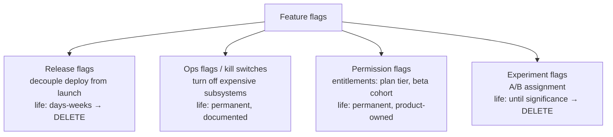
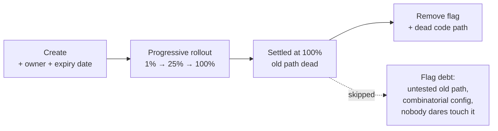
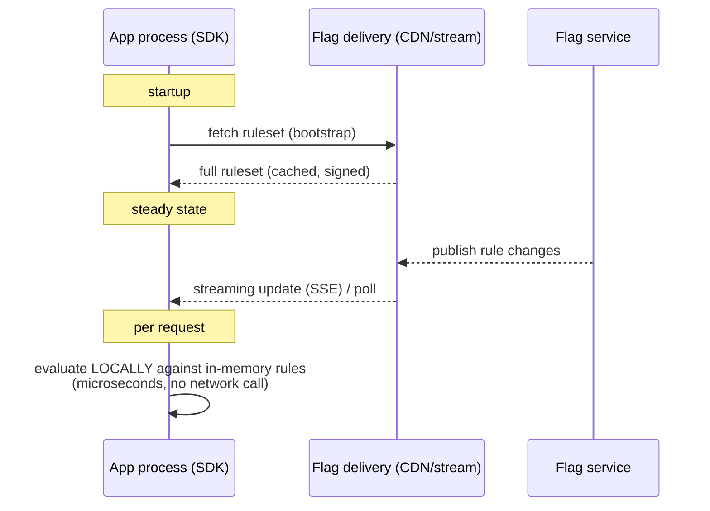
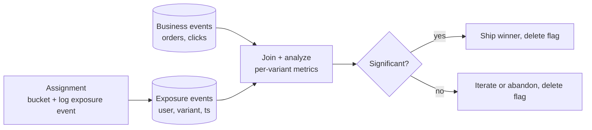

---
tags:
  - applied
  - for-saas
---

# Feature Flags & Experimentation

## You'll see this when...

- A deploy went out Friday; the feature should turn on Monday — without another deploy
- A bad release needs to be turned off in seconds, not rolled back in minutes
- Product wants the new checkout for 5% of users first, then 25%, then everyone
- "Can we show this only to beta customers / employees / tenant X?"
- Two teams merge to main daily but ship features on different dates (trunk-based development)
- Someone asks "did the new ranking actually improve conversion?" and nobody can answer
- The codebase has `if (user.id % 100 < 5)` scattered through it — hand-rolled flags

## Flag types — they are not all the same thing

The biggest source of flag mess is treating these four as one concept. They have different lifetimes, owners, and cleanup rules.



| Type | Owner | Lifetime | Cleanup rule |
|---|---|---|---|
| **Release** | Feature team | Days–weeks | Delete after 100% rollout settles |
| **Ops / kill switch** | On-call / platform | Permanent | Documented in runbooks, tested in game days |
| **Permission / entitlement** | Product | Permanent | It's not a flag, it's a feature — model accordingly |
| **Experiment** | Growth / data | Until decision | Delete after the experiment is decided |

A "flag system" that mixes entitlements with release flags ends up unable to delete anything — the cleanup discipline only works when types are explicit.

## Flag lifecycle and flag debt



Flag debt is real debt: every stale flag doubles the theoretical config space and keeps a dead code path compiled in. The famous failure mode is **Knight Capital (2012)** — a repurposed flag activated eight-year-old dead code on 7 of 8 servers and lost $440M in 45 minutes. Flags that linger become loaded guns.

**Hygiene that works in practice:**

- Every flag gets an **owner** and an **expiry date** at creation — the flag system should require these fields
- CI check or bot that lists flags past expiry and nags the owner (or auto-opens a ticket)
- **Stale-flag detection**: if evaluation telemetry shows a flag has returned the same value for 100% of evaluations for 30 days, it's a constant — delete it
- Tooling for automated removal exists: Uber's **Piranha** removes stale flag code in Java/Swift/Kotlin
- Naming convention with type prefix: `release.checkout-v2`, `ops.disable-recs`, `exp.ranking-ml-v3`

## Targeting and progressive rollout

A flag evaluation answers: *for this context (user, tenant, device, region), which variant?*

```
Rule evaluation order (typical):
  1. Individual overrides       — user on allowlist → on (support/QA)
  2. Segment rules              — tenant.plan == "enterprise" → on
  3. Percentage rollout         — hash(flag_key + user_id) % 100 < rollout_pct
  4. Default                    — off
```

**Sticky bucketing matters**: the percentage check must hash a stable identity (user ID, not session ID), and must include the flag key in the hash. If you hash only `user_id`, the *same* 5% of users get every experiment — those users have a wildly nonstandard product experience and your experiments contaminate each other.

```python
def bucket(flag_key: str, user_id: str) -> int:
    h = hashlib.sha1(f"{flag_key}:{user_id}".encode()).hexdigest()
    return int(h[:8], 16) % 100

def is_enabled(flag, user) -> bool:
    if user.id in flag.allowlist:        return True
    if matches_segment(flag.rules, user): return True
    return bucket(flag.key, user.id) < flag.rollout_pct
```

**Rollout ladder** for risky changes: employees → 1% → 10% (hold a day, watch error rates and business metrics) → 50% → 100%. Tie the ladder to your observability: if you can't tell whether 10% is healthy, you're not doing progressive delivery, you're doing slow-motion big bang. See [Progressive Delivery](progressive-delivery.md).

## Evaluation architecture

The make-or-break operational question: where does evaluation happen, and what happens when the flag service is down?



| Model | Latency | Failure mode | Use |
|---|---|---|---|
| **Local evaluation** (SDK holds ruleset) | µs, in-process | Stale rules until reconnect — degrade gracefully | Default for backend services |
| **Remote evaluation** (call per check) | ms + network | Flag service outage = your outage | Avoid on hot paths; OK for low-traffic admin |
| **Edge/bootstrap** (rules injected at page render) | µs on client | Payload size; rules visible to client | Web frontends |

Rules to live by:

- **Never make a network call per flag check on a hot path.**
- **Always define the in-code default** (`is_enabled(flag, user, default=False)`) — the SDK falling back to defaults must leave the system in a safe state.
- Flag checks happen at request time, not at startup — a flag read once into a static at boot can't be turned off without a restart, which defeats the kill switch.

### Tools

| Tool | Shape |
|---|---|
| **LaunchDarkly** | Managed SaaS, streaming updates, mature targeting; the default commercial pick |
| **Unleash** | Open source, self-host or cloud, good k8s story |
| **Flagsmith** | Open source + cloud, entitlements-friendly |
| **AWS AppConfig** | AWS-native, validators + gradual deploy of config; ties to CloudWatch alarms for auto-rollback |
| **OpenFeature** | CNCF **standard API** — vendor-neutral SDK so you can swap providers; pair with any of the above |
| **Boring option** | A `flags` table + 30-second in-process cache + an admin page. Fine until you need streaming updates, segments, or experiment analytics |

Adopt **OpenFeature interfaces from day one** even with the boring backend — the migration to a real provider later becomes a config change.

## Flags vs branches

Long-lived feature branches and feature flags solve the same problem — unfinished work — in opposite ways. Flags win for teams that ship continuously:

| | Feature branch | Feature flag |
|---|---|---|
| Integration pain | Grows with branch age (merge hell) | None — code is in main, off |
| Testable in prod-like env | Only after merge | Immediately, dark |
| Rollback | Revert + redeploy | Toggle, seconds |
| Risk | Big-bang merge | Incremental exposure |

This is the enabling mechanism for **trunk-based development**: merge incomplete work behind a flag, keep main releasable. See [Branching Strategies](branching-strategies.md).

**The testing cost is real**: N active flags = 2^N theoretical combinations. You cannot test them all. In practice: test default-on and default-off paths per flag, pin flag states in integration tests, and keep N small by deleting settled flags — the combinatorial argument is the strongest case for cleanup discipline.

## Experimentation (A/B testing on flags)

An experiment flag is a flag plus **assignment logging** plus **metrics analysis**:



What goes wrong, in order of frequency:

1. **Peeking**: checking significance daily and stopping at the first p < 0.05 inflates false positives massively. Fix: fixed sample size decided up front (power analysis), or sequential testing methods built for peeking (e.g., mSPRT — what the commercial platforms use).
2. **Sample ratio mismatch (SRM)**: you configured 50/50 but exposure logs show 52/48 — something is biased (bots, caching, logging loss). An SRM check is the cheapest data-quality alarm; fail the experiment if it fires.
3. **Logging exposure ≠ assignment**: log when the user actually *hit* the experience, not when the bucket was computed — otherwise you dilute the effect with users who never saw the change.
4. **Underpowered tests**: detecting a 0.5% conversion lift needs far more traffic than most B2B products have. Run the power math first; if you need 6 months of traffic, don't pretend two weeks means anything.
5. **Interaction between concurrent experiments**: usually negligible with independent bucketing per flag key — but don't run two experiments on the same surface simultaneously.

For ranking/recommendation experiments specifically (interleaving, switchbacks, holdouts), see [ML in Production](../ai/ml-in-production.md).

## Kill switches as operational tools

The ops flag deserves first-class treatment:

- Wrap every **expensive or optional subsystem** (recommendations, search suggestions, image processing, third-party calls) in a kill switch
- Killing a feature must **degrade, not break**: the UI hides the section; the API returns an empty list, not a 500
- Test them: a kill switch that has never been flipped in production is a hypothesis, not a control. Flip them in game days
- Document in runbooks: symptom → which switch → expected effect ("payments p99 high → `ops.disable-fraud-enrichment` sheds 80ms")
- Combine with [load shedding](../patterns/unhappy-path-engineering.md): under brownout, shed lowest-value flagged features first

## Anti-patterns

| Anti-pattern | Why it hurts | Better |
|---|---|---|
| Network call per flag evaluation | Flag service outage becomes your outage; ms on every request | Local evaluation with streamed ruleset |
| Flags without owner/expiry | Permanent flag debt, 2^N config space | Require owner + expiry at creation; stale-flag detection |
| Repurposing an old flag | Knight Capital — old code paths reactivate | Flags are append-only; new behavior = new flag |
| Hashing user only (not flag+user) | Same users in every experiment; contaminated results | `hash(flag_key + user_id)` |
| Reading flags at process startup | Kill switch can't kill anything without restart | Evaluate per request |
| Peeking at experiment results daily | False positives; you ship noise | Fixed horizon or sequential testing |
| Entitlements modeled as release flags | Can never delete them; flag list becomes a product catalog | Separate entitlement system / explicit type |
| One global "beta users" cohort for everything | That cohort stops resembling real users | Per-flag segments, per-experiment bucketing |

## Quick reference

| Need | Reach for |
|---|---|
| Decouple deploy from launch | Release flag, delete after rollout |
| Instant off for a risky subsystem | Ops kill switch, tested in game days |
| 5% → 100% rollout | Percentage rollout on `hash(flag+user)`, watch metrics per step |
| Vendor-neutral SDK | OpenFeature + provider of choice |
| AWS-native with auto-rollback | AWS AppConfig + CloudWatch alarm |
| Self-hosted OSS | Unleash or Flagsmith |
| Trustworthy A/B result | Pre-registered sample size, SRM check, exposure logging |
| Find dead flags | Evaluation telemetry: same value 30 days → delete |

## Interview angle

!!! tip "What interviewers are testing"
    Whether you treat flags as architecture (evaluation latency, failure modes, lifecycle) rather than as an if-statement. Senior candidates bring up flag debt and kill-switch testing unprompted.

**Strong answer pattern:**

1. Distinguish the four flag types and their lifetimes — release flags get deleted, ops flags get runbooks
2. Local evaluation with streamed rulesets; in-code safe defaults when the flag system is unreachable
3. Sticky bucketing on `hash(flag_key + user_id)` for rollouts and experiments
4. Progressive rollout tied to observability — each step gated on error rates and business metrics
5. Cleanup discipline: owner + expiry + stale-flag detection, because 2^N flag combinations are untestable

**Common follow-ups:**

- "What happens when the flag service is down?" — SDKs serve the last-known ruleset, then in-code defaults; the system must be safe under defaults; never a per-request network dependency
- "How do you A/B test without a data team?" — you mostly don't; without exposure logging, SRM checks, and power analysis, results are noise. Start with rollouts gated on guardrail metrics instead
- "How do flags interact with trunk-based development?" — they're the enabling mechanism: merge unfinished work dark, keep main releasable, expose later
- "How would you clean up 500 stale flags?" — telemetry to find constants, batch by owner, automated code removal (Piranha-style), and a creation-time expiry policy so it doesn't regrow

## Test yourself

Answers are hidden — commit to an answer before expanding.

??? question "Why must the rollout bucket hash include the flag key, not just the user ID?"

    Hashing only the user ID puts the same users in the low buckets for every flag — that cohort gets every experimental feature at once, making their experience nonstandard and contaminating every experiment with the effects of the others. `hash(flag_key + user_id)` gives each flag an independent, stable assignment.

??? question "Your flag provider has a 30-minute outage. What should well-architected services do during it?"

    Nothing visible. SDKs evaluate locally against the last-streamed ruleset, so existing processes keep working; fresh processes that can't bootstrap fall back to in-code defaults, which must be chosen to be safe. The outage costs you the ability to *change* flags, not the ability to serve traffic.

??? question "A team checks their experiment dashboard every morning and ships when p < 0.05 appears. What's wrong?"

    That's peeking — repeated significance testing inflates the false-positive rate far above 5%, because you're giving noise many chances to cross the threshold. Either fix the sample size up front via power analysis and test once, or use a sequential method (like mSPRT) designed for continuous monitoring.

??? question "What is sample ratio mismatch and why is it worth alerting on?"

    SRM is when the observed traffic split (say 52/48) deviates statistically from the configured one (50/50). It signals broken assignment or logging — bot traffic in one arm, caching that skips exposure logs, crashes in one variant. Any metric comparison on top of mismatched samples is invalid, so SRM is the cheapest possible data-quality gate: fail the experiment automatically when it fires.

??? question "An interviewer asks: 'Feature branches already isolate unfinished work — why add flags?'"

    Branches isolate code but delay integration: the merge gets riskier the longer the branch lives, and the feature can't be tested in production-like conditions until it merges. Flags invert this — code integrates into main continuously (trunk-based development), ships dark, and exposure becomes a runtime decision with instant rollback. The trade is testing surface: flags require cleanup discipline because each active flag doubles the configuration space.

## Related

- [Progressive Delivery](progressive-delivery.md) — canary and rollout mechanics
- [Deployment Strategies](deployment-strategies.md) — deploy vs release distinction
- [Branching Strategies](branching-strategies.md) — trunk-based development
- [Unhappy-Path Engineering](../patterns/unhappy-path-engineering.md) — graceful degradation and load shedding
- [ML in Production](../ai/ml-in-production.md) — experimentation for ranking/ML systems
- [Mobile + Edge Specifics](../architecture/mobile-edge-specifics.md) — server-side flags as the mobile version-skew escape hatch
