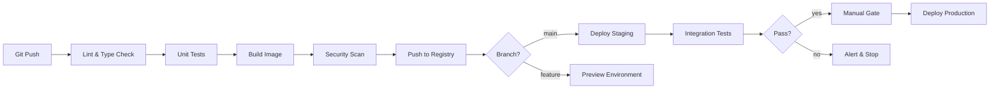

# CI/CD

<div class="sec-hero" markdown>
<span class="ey">Delivery · ship safely</span>
CI/CD automates the build, test, and release pipeline so every code change is verified and deployable with minimal manual steps. The goal: short feedback loops, low-risk releases, and the ability to ship many times a day instead of once a quarter.
</div>

## Roadmap

<div class="roadmap">
  <div class="rm-head">
    <span class="h">🧭 CI/CD roadmap</span>
    <span class="legend">
      <i><span class="sw core"></span>core path</i>
      <i><span class="sw opt"></span>read as needed</i>
      <i><span class="sw adv"></span>advanced / later</i>
    </span>
  </div>
  <p class="rm-sub">Follow the spine top-to-bottom your first time. Branches hang off the topic they support — grab them when you need them.</p>
  <div class="rm-track">
    <div class="rm-stop">
      <a class="rm-node" href="fundamentals/"><span class="n">1</span>Fundamentals</a>
    </div>
    <div class="rm-stop">
      <a class="rm-node" href="pipelines/"><span class="n">2</span>Pipelines</a>
    </div>
    <div class="rm-stop">
      <a class="rm-node" href="branching-strategies/"><span class="n">3</span>Branching Strategies</a>
    </div>
    <div class="rm-stop">
      <div class="rm-branch left"><a class="rm-chip" href="security-in-cicd/">Security in CI/CD</a></div>
      <a class="rm-node" href="build-and-test/"><span class="n">4</span>Build and Test</a>
    </div>
    <div class="rm-stop">
      <a class="rm-node" href="artifact-management/"><span class="n">5</span>Artifact Management</a>
    </div>
    <div class="rm-stop">
      <a class="rm-node" href="deployment-strategies/"><span class="n">6</span>Deployment Strategies</a>
      <div class="rm-branch right"><a class="rm-chip" href="gitops/">GitOps</a><a class="rm-chip" href="progressive-delivery/">Progressive Delivery</a></div>
    </div>
  </div>
</div>

## Core pipeline topics

The mental model, the tools, and how code flows from commit to production.

<div class="pcards">
<a class="pcard" href="fundamentals/"><span class="t">Fundamentals</span><span class="d">CI vs CD, pipeline stages, quality gates, build vs deploy</span></a>
<a class="pcard" href="pipelines/"><span class="t">Pipelines</span><span class="d">GitHub Actions, GitLab CI, CircleCI, Jenkins — concrete examples</span></a>
<a class="pcard" href="branching-strategies/"><span class="t">Branching Strategies</span><span class="d">Trunk-based, GitFlow, GitHub Flow, release branches</span></a>
<a class="pcard" href="build-and-test/"><span class="t">Build and Test</span><span class="d">Test pyramid in CI, caching, parallelism, fast feedback</span></a>
<a class="pcard" href="artifact-management/"><span class="t">Artifact Management</span><span class="d">Image registries, semver vs SHA, retention, immutability</span></a>
<a class="pcard" href="deployment-strategies/"><span class="t">Deployment Strategies</span><span class="d">Rolling, blue/green, canary, feature flags</span></a>
</div>

## Going deeper

Securing the pipeline, GitOps delivery, and automated progressive rollout.

<div class="pcards">
<a class="pcard" href="security-in-cicd/"><span class="t">Security in CI/CD</span><span class="d">SAST, DAST, SCA, image scanning, signing, secrets scanning</span></a>
<a class="pcard" href="gitops/"><span class="t">GitOps</span><span class="d">ArgoCD, Flux, pull-based deploys for Kubernetes</span></a>
<a class="pcard" href="progressive-delivery/"><span class="t">Progressive Delivery</span><span class="d">Argo Rollouts, Flagger, automated canary analysis</span></a>
<a class="pcard" href="feature-flags-experimentation/"><span class="t">Feature Flags & Experimentation</span><span class="d">Decouple deploy from release; gradual rollout by cohort</span></a>
<a class="pcard" href="aws-codepipeline/"><span class="t">AWS CodePipeline</span><span class="d">CodeBuild, CodeDeploy, CodePipeline</span></a>
<a class="pcard" href="aws-deployment-with-github-actions/"><span class="t">AWS Deployment with GitHub Actions</span><span class="d">OIDC auth, deploying to AWS from GitHub Actions</span></a>
<a class="pcard" href="release-management/"><span class="t">Release Management</span><span class="d">Versioning, changelogs, release notes, rollback playbooks</span></a>
</div>

## Suggested reading order

New to this topic? Read these in order — each builds on the previous:

1. [Fundamentals](fundamentals.md) — CI vs CD vs deployment; the mental model for the rest
2. [Pipelines](pipelines.md) — concrete tools (GitHub Actions, GitLab CI) that make it real
3. [Branching Strategies](branching-strategies.md) — how code flows into the pipeline in the first place
4. [Build and Test](build-and-test.md) — making the pipeline fast and trustworthy
5. [Artifact Management](artifact-management.md) — what the pipeline produces and how it's versioned
6. [Deployment Strategies](deployment-strategies.md) — rolling, blue/green, canary: shipping artifacts safely

**Then, as needed (reference):** [AWS CodePipeline](aws-codepipeline.md), [AWS Deployment with GitHub Actions](aws-deployment-with-github-actions.md), [Release Management](release-management.md)

**Advanced — come back later:** [Security in CI/CD](security-in-cicd.md), [GitOps](gitops.md), [Progressive Delivery](progressive-delivery.md), [Feature Flags & Experimentation](feature-flags-experimentation.md)

---

## What "CI/CD" actually means

The acronym combines three distinct ideas, which teams often conflate:

| Term | Definition |
|---|---|
| **Continuous Integration (CI)** | Every push triggers automated build, lint, test. Catches integration bugs early. |
| **Continuous Delivery (CD)** | Every successful CI run produces a deployable artifact. Deploy is one button away. |
| **Continuous Deployment** | Every successful CI run *automatically* deploys to production. No human gate. |

Most production systems do CI + Continuous Delivery (with manual gate to prod). Continuous Deployment is rarer — needs strong automated gates.

---

## Why CI/CD matters

```
Without CI/CD:
  Developer writes code
  → "It works on my machine"
  → Manual testing (takes days)
  → Manual deployment (error-prone, runbook out of date)
  → Deployment happens once a quarter (big bang, high risk, painful)
  → Bugs accumulate; rollback is "redeploy old version manually"

With CI/CD:
  Developer pushes code
  → Automated: lint, type check, unit tests, security scan, build (minutes)
  → Automated: deploy to staging, run integration tests
  → Automated: deploy to production (with approval gate)
  → Deploy dozens of times per day (small, low risk)
  → Bugs caught early; rollback is "revert commit"
```

Shorter feedback loops compound. Teams that deploy daily get good at deploying daily. Teams that deploy quarterly get worse at it.

---

## Topics in this section

| Topic | What it covers | When it matters |
|---|---|---|
| [Fundamentals](fundamentals.md) | CI vs CD, pipeline stages, quality gates, build vs deploy | Mental model for the rest |
| [Pipelines](pipelines.md) | GitHub Actions, GitLab CI, CircleCI, Jenkins — concrete examples | Picking and configuring tools |
| [Branching Strategies](branching-strategies.md) | Trunk-based, GitFlow, GitHub Flow, release branches | How code flows through CI/CD |
| [Build and Test](build-and-test.md) | Test pyramid in CI, caching, parallelism, fast feedback | Pipeline performance |
| [Artifact Management](artifact-management.md) | Image registries, semver vs SHA, retention, immutability | Reliable deploys |
| [Security in CI/CD](security-in-cicd.md) | SAST, DAST, SCA, image scanning, signing, secrets scanning | Shift security left |
| [Deployment Strategies](deployment-strategies.md) | Rolling, blue/green, canary, feature flags | Minimising deploy risk |
| [GitOps](gitops.md) | ArgoCD, Flux, pull-based deploys for Kubernetes | K8s-native delivery |
| [Progressive Delivery](progressive-delivery.md) | Argo Rollouts, Flagger, automated canary analysis | Beyond manual canary |
| [AWS CodePipeline](aws-codepipeline.md) | CodeBuild, CodeDeploy, CodePipeline | AWS-native CI/CD alternative |
| [Release Management](release-management.md) | Versioning, changelogs, release notes, rollback playbooks | Coordinating releases |

---

## The pipeline anatomy



Stages, in order of cost and value:

1. **Validate** (seconds) — fmt, lint, type check
2. **Test** (1-10 min) — unit tests, integration tests
3. **Build** (1-5 min) — compile, package, build container image
4. **Scan** (30s-2min) — security, secrets, dependencies
5. **Publish** (30s-1min) — push artifact to registry
6. **Deploy staging** (1-5 min) — apply to non-prod
7. **Verify** (1-10 min) — smoke tests, integration tests in staging
8. **Gate** (manual or automated) — approval before prod
9. **Deploy production** (1-15 min) — apply with chosen strategy (rolling/canary/blue-green)
10. **Verify** (1-5 min) — production smoke tests, error rate monitoring

Run cheap stages first. Fail fast. Cache aggressively.

---

## How CI/CD connects to other concerns

```
Application code
  ↓ packaged into
Container image  ─────►  Image registry (ECR, GHCR, GCR)
  ↓ deployed to
Kubernetes / ECS  ◄─────  IaC (Terraform/CDK) provisioned this
  ↓ exposed via
Load balancer + DNS
  ↓ observed by
Logs, metrics, traces  ─────►  Alerts feed back into CI/CD (rollback signals)
```

CI/CD is the glue. It builds the image, applies the IaC change, deploys, and verifies.

---

## Mental model: pipeline as code

The pipeline definition itself is **versioned in Git** alongside the code:

```yaml
# .github/workflows/ci.yml
on: [push, pull_request]
jobs:
  test:
    steps: [...]
  build:
    steps: [...]
```

Same file in dev branch as in main → same pipeline. Change pipeline = PR + review = audit trail.

This is why platforms like Jenkins (with global UI config) get replaced by GitHub Actions / GitLab CI / CircleCI: pipeline-as-code is non-negotiable now.

---

## Interview shortlist

| Question | Key answer |
|---|---|
| *"What's the difference between CI and CD?"* | CI verifies every change (build, test). CD makes every verified change deployable (delivery) or auto-deploys (deployment). Most teams do CI + manual-gate delivery. |
| *"How do you tag container images?"* | Git SHA (immutable, traceable). Optionally also semver tags for releases. Never `latest` in production — non-deterministic. |
| *"How do you authenticate CI to AWS without stored credentials?"* | OIDC. CI provider issues a JWT; AWS IAM role trusts the OIDC issuer with conditions on repo + branch + workflow. No long-lived keys in CI. |
| *"How do you reduce CI time on a slow pipeline?"* | Parallel jobs, cache dependencies, layer Docker builds, run only changed tests, smaller test scopes per job. |
| *"What's GitOps?"* | Git is the source of truth for cluster state. A controller (ArgoCD/Flux) watches Git and reconciles cluster. Push to Git = deploy. Audit = `git log`. Rollback = revert. |
| *"How do you deploy safely to production?"* | Canary or blue-green strategy. Automated rollback on error rate spike. Feature flags for risky code paths. Manual approval gate before final cutover. |

---

## Related sections

- [IaC](../iac/index.md) — pipeline applies infrastructure changes too
- [Containers](../infrastructure/containers.md) — what CI/CD builds and deploys
- [Kubernetes](../infrastructure/kubernetes.md) — common deploy target
- [Observability](../observability/index.md) — verifies deploys, signals rollback
- [Security](../security/index.md) — shift-left scanning lives in CI/CD
