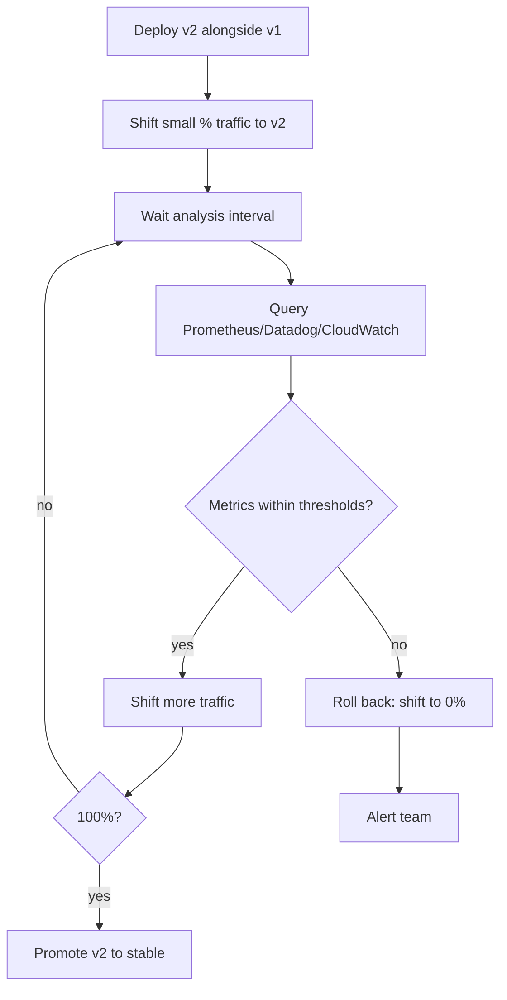

# Progressive Delivery

Progressive delivery extends canary and blue/green with **automated analysis and rollback**: shift small slices of traffic, watch real-time metrics, abort automatically if anything looks wrong. The human role shrinks from "monitor the deploy" to "set the SLOs and review post-deploy reports."

---

## What "progressive" adds to "canary"

```
Manual canary (covered in Deployment Strategies):
  Engineer shifts 5% → watches dashboards → manually shifts 25% → watches → 100%
  Human in the loop the whole time
  Slow, error-prone (humans get tired, distracted)

Progressive delivery:
  Tool shifts 5% → analyses metrics for 5 min → shifts 25% → analyses → 100%
  Tool aborts automatically if error rate > threshold
  Human reviews the report afterwards
```

The canary itself is the same. What's new is **automation around the analysis**.

---

## The analysis loop



Each step:

1. **Shift traffic** — route a fraction of users to v2 (10%, 25%, 50%, 100%)
2. **Wait** — analysis interval (1-30 minutes)
3. **Query metrics** — error rate, p95 latency, custom KPIs
4. **Decide** — proceed or roll back
5. **Repeat** until 100% or rollback

---

## Argo Rollouts

Kubernetes-native progressive delivery, integrates with ArgoCD.

### Rollout resource

```yaml
apiVersion: argoproj.io/v1alpha1
kind: Rollout
metadata:
  name: order-service
spec:
  replicas: 10
  selector:
    matchLabels:
      app: order-service
  template:
    metadata:
      labels:
        app: order-service
    spec:
      containers:
        - name: order-service
          image: ghcr.io/myorg/order-service:abc1234
  
  strategy:
    canary:
      canaryService: order-service-canary
      stableService: order-service-stable
      trafficRouting:
        istio:
          virtualService:
            name: order-service
            routes: [primary]
      
      steps:
        - setWeight: 10
        - pause: { duration: 5m }
        - analysis:
            templates:
              - templateName: error-rate
              - templateName: latency-p95
            args:
              - name: service-name
                value: order-service
        
        - setWeight: 25
        - pause: { duration: 5m }
        - analysis:
            templates:
              - templateName: error-rate
              - templateName: latency-p95
        
        - setWeight: 50
        - pause: { duration: 10m }
        - analysis:
            templates:
              - templateName: error-rate
              - templateName: latency-p95
        
        - setWeight: 100
```

### AnalysisTemplate

```yaml
apiVersion: argoproj.io/v1alpha1
kind: AnalysisTemplate
metadata:
  name: error-rate
spec:
  args:
    - name: service-name
  
  metrics:
    - name: error-rate
      interval: 1m
      successCondition: result[0] < 0.01    # < 1% error rate
      failureLimit: 3                        # 3 consecutive failures aborts
      provider:
        prometheus:
          address: http://prometheus.monitoring:9090
          query: |
            sum(rate(http_requests_total{
              service="{{args.service-name}}",
              status=~"5.."
            }[5m]))
            /
            sum(rate(http_requests_total{
              service="{{args.service-name}}"
            }[5m]))
```

If error rate exceeds 1% three times in a row, Argo Rollouts:

1. Stops the rollout
2. Routes 100% traffic back to stable
3. Optionally deletes the canary pods
4. Sets the Rollout status to `Degraded`

### Multiple metrics

```yaml
apiVersion: argoproj.io/v1alpha1
kind: AnalysisTemplate
metadata:
  name: latency-p95
spec:
  metrics:
    - name: latency-p95
      interval: 1m
      successCondition: result[0] < 200    # < 200ms p95
      failureLimit: 3
      provider:
        prometheus:
          address: http://prometheus.monitoring:9090
          query: |
            histogram_quantile(0.95,
              sum(rate(http_request_duration_seconds_bucket{
                service="{{args.service-name}}"
              }[5m])) by (le)
            ) * 1000
```

Multiple AnalysisTemplates run in parallel; any failing aborts the rollout.

### Experiment-based analysis

Run a short A/B experiment alongside canary:

```yaml
- experiment:
    duration: 10m
    templates:
      - name: baseline
        specRef: stable
      - name: canary
        specRef: canary
    analyses:
      - name: success-rate
        templateName: success-rate
```

Compare baseline vs canary directly during the experiment window. Stronger signal than just thresholds — controls for traffic patterns.

---

## Flagger

Similar to Argo Rollouts. Originally Weaveworks (now CNCF). Integrates with Flux.

```yaml
apiVersion: flagger.app/v1beta1
kind: Canary
metadata:
  name: order-service
spec:
  targetRef:
    apiVersion: apps/v1
    kind: Deployment
    name: order-service
  
  service:
    port: 8080
    targetPort: 8080
    gateways:
      - public-gateway.istio-system.svc.cluster.local
    hosts:
      - order-service.example.com
  
  analysis:
    interval: 1m
    threshold: 5
    maxWeight: 50
    stepWeight: 10
    
    metrics:
      - name: request-success-rate
        thresholdRange:
          min: 99
        interval: 1m
      
      - name: request-duration
        thresholdRange:
          max: 500
        interval: 1m
    
    webhooks:
      - name: load-test
        type: pre-rollout
        url: http://flagger-loadtester.test/
        timeout: 5s
        metadata:
          cmd: "hey -z 1m -q 100 -c 10 http://order-service-canary:8080/"
```

Steps automatic: 10% → 20% → 30% → 40% → 50% → 100%. Aborts if metrics fall below thresholds.

`webhooks` enable pre-rollout load tests, post-rollout smoke tests, custom integrations.

---

## Argo Rollouts vs Flagger

| | Argo Rollouts | Flagger |
|---|---|---|
| Project | CNCF (Argo) | CNCF (Flagger) |
| Pairs with | ArgoCD | Flux (also works standalone) |
| Traffic routing | Istio, Linkerd, ALB, Nginx, SMI | Istio, Linkerd, App Mesh, Contour, Gloo, Nginx, Skipper |
| Analysis | AnalysisTemplate (Prometheus, Datadog, NewRelic, custom) | Built-in metric templates + custom |
| Experiment-based | Yes | Limited |
| Rollout resource | `Rollout` (replaces Deployment) | `Canary` (wraps Deployment) |
| Best for | ArgoCD shops, complex analysis | Flux shops, simpler config |

Both solve the same problem. Pick based on which control plane you already have.

---

## SLO-based rollouts

The most powerful pattern: tie the rollout to **service-level objectives**.

```yaml
apiVersion: argoproj.io/v1alpha1
kind: AnalysisTemplate
metadata:
  name: slo-burn-rate
spec:
  metrics:
    - name: error-budget-burn
      interval: 5m
      successCondition: result[0] < 1.0
      provider:
        prometheus:
          query: |
            (
              sum(rate(http_requests_total{status=~"5..", service="order-service"}[5m]))
              /
              sum(rate(http_requests_total{service="order-service"}[5m]))
            )
            /
            0.001    # SLO: 99.9% success → error budget = 0.1%
```

If burn rate > 1.0, the canary is consuming error budget faster than allowed. Roll back automatically.

This is the right way to think about progressive delivery: the canary either preserves the SLO or it doesn't. Threshold-based analysis without SLO context is arbitrary.

See [SLI, SLO, SLA](../observability/slo-sla.md).

---

## Feature flags vs progressive delivery

Both let you gradually expose changes. Different layers:

| | Feature flags | Progressive delivery |
|---|---|---|
| Granularity | Per-user, per-cohort, per-feature | Per-deploy, traffic-fraction |
| Rollback speed | Instant (flag flip) | Minutes (traffic shift) |
| Code visibility | Both versions in same binary | Separate deploys |
| Best for | Gradual feature rollout to users | Safe deploy of new code |
| Tools | LaunchDarkly, Unleash, Flagsmith | Argo Rollouts, Flagger |

Use both:
- **Progressive delivery** for the deploy itself (is the new code stable?)
- **Feature flags** for the feature within the new code (do users like it?)

---

## When NOT to use progressive delivery

- **Stateful workloads** — DB schema changes, message queue migrations don't fit traffic-shifting
- **Single-replica services** — no headroom for canary alongside
- **Tightly coupled deployments** — frontend + backend that must change together
- **Tiny teams without observability** — you need solid metrics for analysis to work
- **Low-stakes services** — overhead of progressive infra exceeds benefit

For these, simpler rolling deploy or blue/green is better. Progressive delivery shines for high-traffic stateless services with mature observability.

---

## Anti-patterns

| Anti-pattern | Problem |
|---|---|
| Progressive deploy without alerting | If analysis fails silently, the rollback may not happen |
| Thresholds without baselines | "Error rate < 1%" only meaningful if normal is 0.01% |
| Promoting after first interval | Defeats the point — give time for issues to manifest |
| Ignoring rollback reports | Aborted rollouts are signals; investigate, don't just retry |
| One AnalysisTemplate per service | Share templates across services for consistency |
| Long pause durations on small services | 30-min canary on a 10rps service = no signal |

---

## Tooling beyond K8s

For non-Kubernetes:

- **AWS CodeDeploy** — built-in canary with CloudWatch alarm integration (covered in [AWS CodePipeline](aws-codepipeline.md))
- **AWS Lambda Aliases + Weighted Routing** — Lambda-native canary
- **Spinnaker** — multi-cloud progressive delivery platform (heavy)
- **LaunchDarkly Release Pipelines** — feature-flag-driven progressive rollout

---

## Putting it together — workflow

```
1. Engineer merges PR
2. CI builds image, pushes to registry
3. ArgoCD detects new image tag in config repo
4. ArgoCD applies Rollout resource update (image: new tag)
5. Argo Rollouts begins canary:
     5.1. Routes 10% traffic to new version
     5.2. Waits 5 minutes
     5.3. Queries Prometheus for error rate, latency
     5.4. If green → 25% → wait → analysis
     5.5. ... continues to 100%
     5.6. If red → 0% (rollback) → alert
6. ArgoCD marks Application "healthy"
7. Slack notification with summary
```

The engineer's involvement: open PR, get review, merge. Everything after is automated.

---

## Interview angle

!!! tip "What interviewers are testing"
    Whether you've operated production systems where automated rollback matters, not just "we have canary."

**Strong answer pattern:**
1. Progressive delivery = canary + automated analysis + automated rollback
2. Define analysis on real metrics: error rate, latency, custom business KPIs
3. Tie thresholds to SLOs / error budgets where possible
4. Argo Rollouts (with ArgoCD) or Flagger (with Flux) — both CNCF, both fine
5. Combine with feature flags for the feature dimension on top of the deploy dimension
6. Not for stateful, single-replica, or low-traffic services

**Common follow-up:** *"What metrics would you use for canary analysis?"*
> Error rate, p95/p99 latency, business metrics (e.g., conversion rate for an e-commerce service). Tie to SLOs — error budget burn rate is the strongest signal because it inherently includes "is this acceptable for our SLO?" Custom metrics if standard ones miss the failure mode (e.g., 200 OK with garbage body).

---

## Related topics

- [Deployment Strategies](deployment-strategies.md) — manual canary as the foundation
- [GitOps](gitops.md) — ArgoCD pairs with Argo Rollouts
- [Observability: SLO/SLA](../observability/slo-sla.md) — error budget tied to rollouts
- [Metrics](../observability/metrics.md) — what feeds the analysis
- [Service Mesh](../infrastructure/service-mesh.md) — provides traffic routing
