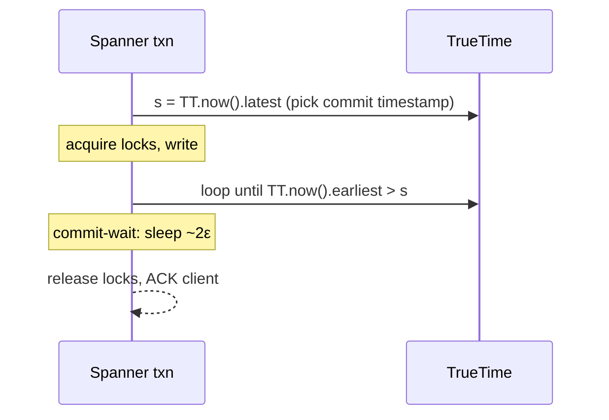

---
tags:
  - interview-critical
  - for-scale
---

# Advanced Clocks: Hybrid Logical Clocks & TrueTime

## You'll see this when...

- You need to order writes **across regions** and "just use the server timestamp" gives wrong answers because two data-center clocks disagree by milliseconds.
- A multi-leader or quorum store has to decide **"which write won"** for the same key, and last-write-wins on a wall clock silently loses data when clocks skew.
- You're reading the Spanner or CockroachDB / YugabyteDB docs and hit the words *external consistency*, *commit-wait*, *max offset*, or *uncertainty restart* and want to know what they're actually buying you.
- A lease or distributed lock expired "early" on one node and "late" on another, and a fenced-off node kept writing because its clock ran fast.
- An interviewer asks how Spanner gives you global linearizable transactions without a single coordinator, or why CockroachDB doesn't need atomic clocks.

This page is the sequel to [Clocks & Ordering](clocks.md). It assumes you already know Lamport clocks and vector clocks. Here we close the gap those leave open: **relating logical order back to real time**.

## The gap: logical clocks vs physical clocks

Two clock families, each with a hole the other fills:

| Clock | Captures causality? | Relates to wall-clock time? | Cost |
|---|---|---|---|
| **Physical (NTP) clock** | No | Yes (but skewed) | Free |
| **Lamport clock** | Partially (one direction) | No | 1 integer |
| **Vector clock** | Yes (full happens-before) | No | O(N) per event |

- **Lamport / vector clocks** give you happens-before, but a Lamport timestamp of `4271` means nothing in seconds. You can't ask "give me everything written in the last 5 minutes" or expire a lease against it.
- **Physical clocks** are in real seconds but they **skew**. NTP-synced machines in a fleet typically drift within a few milliseconds of each other; a misconfigured or VM-paused node can be off by hundreds of ms or seconds. Worse, a physical timestamp tells you nothing about causality: event A can causally precede B yet carry a *later* wall-clock time if A's host clock ran fast.

The two ideas below — **HLC** and **TrueTime** — are the two production answers to "I want a timestamp that is close to real time *and* respects causality."

## Hybrid Logical Clocks (HLC)

An HLC timestamp is a pair: `(pt, c)` — a **physical-time component** (`pt`, the wall clock in ms) plus a small **logical counter** (`c`). It sorts lexicographically: compare `pt` first, break ties with `c`.

The point: `pt` tracks NTP wall-clock time so timestamps are human-meaningful and roughly monotonic, while `c` absorbs causality and clock-jitter so the order **never violates happens-before**, even when the physical clock stalls or jumps backward briefly.

### Update rule

Each node keeps its last issued HLC `(l, c)`. `pt()` reads the local physical clock.

```
# On a LOCAL event or a SEND:
l_old = l
l = max(l_old, pt())
if l == l_old:
    c = c + 1          # physical clock didn't advance -> bump counter
else:
    c = 0              # physical clock moved forward -> reset counter
return (l, c)

# On RECEIVE of a message stamped (l_msg, c_msg):
l_old = l
l = max(l_old, l_msg, pt())
if   l == l_old and l == l_msg: c = max(c, c_msg) + 1
elif l == l_old:                c = c + 1
elif l == l_msg:                c = c_msg + 1
else:                           c = 0          # local pt() won, fresh tick
return (l, c)
```

### What you get

- **Causality preserved**: if event A happens-before B (same node, or message dependency), then `HLC(A) < HLC(B)` lexicographically. Same guarantee as a Lamport clock.
- **Bounded divergence from real time**: the `l` component stays within the clock-skew bound `ε` of true physical time — it can run *ahead* of a slow node's wall clock, but never further than the worst skew in the fleet (assume `ε` of a few ms with healthy NTP; configurable as a max-offset, see below).
- **Constant size**: a 64-bit `pt` + 16-bit `c` (or similar) regardless of cluster size — unlike vector clocks which grow O(N).

The counter `c` is small in practice: it only increments when many events share the same millisecond or when a message arrives "from the future" relative to local time. It resets to 0 the moment the physical clock ticks forward, so it can't grow unbounded.

## Google TrueTime

NTP hides uncertainty — it hands you a single timestamp and pretends it's exact. TrueTime does the opposite: it **exposes** the uncertainty explicitly. `TT.now()` returns an interval, not a point:

```
TT.now() -> [ earliest, latest ]      # the true time is GUARANTEED to be in here
            \________ε________/        # width = 2ε, typically a few ms
```

Backed by **GPS receivers + atomic clocks** in every Google datacenter (two independent failure domains so a bad GPS feed is caught). Each TrueTime daemon polls multiple time masters and computes a bounded `ε`. Reported `ε` is on the order of a few ms — sawtooths up between syncs and drops at each poll. The hardware exists to keep `ε` *small and bounded*, not zero.

### Commit-wait → external consistency

Spanner uses TrueTime to give **external consistency** (linearizability) across regions: if transaction T1 commits before T2 starts in real time, T1's timestamp is guaranteed less than T2's. The trick is **commit-wait**:



1. Pick the commit timestamp `s = TT.now().latest`.
2. **Wait** until `TT.now().earliest > s` — i.e. sleep until you are *certain* real time has passed `s`. That wait is roughly `2ε`.
3. Only then release locks and acknowledge the client.

After commit-wait, no later transaction can be assigned a timestamp `≤ s`, because every clock in the fleet now reads past `s`. Smaller `ε` ⇒ shorter commit-wait ⇒ lower write latency. That's the whole economic reason Google buys atomic clocks: `ε` is added latency on every read-write transaction.

## CockroachDB / YugabyteDB: HLC instead of hardware

CockroachDB and YugabyteDB want Spanner-style semantics on commodity hardware with **no GPS or atomic clocks**. They substitute:

- **HLC** for the timestamp (physical component from NTP + logical counter).
- A configured **`--max-offset`** (default 500 ms in CockroachDB) — the assumed worst-case clock skew, playing the role of `ε`.

But without TrueTime's *measured* `ε`, a read at timestamp `ts` can't know whether a value written in the window `(ts, ts + max_offset]` was actually causally earlier. That window is the **uncertainty interval**. When a read finds a value inside it, the transaction does an **uncertainty restart**: it bumps its read timestamp past the value and retries.

```
read @ ts ──┐
            │   uncertainty window = max_offset (e.g. 500ms)
            ▼
   |--------[========================]--------> time
            ts                    ts+offset
                  ^ value here? -> RESTART read at higher ts
```

Trade-offs versus TrueTime:

| | TrueTime (Spanner) | HLC + max-offset (Cockroach/Yuga) |
|---|---|---|
| Special hardware | GPS + atomic clocks | None — plain NTP |
| Uncertainty handling | **Commit-wait** (~2ε on writes) | **Uncertainty restarts** (retry reads) |
| Where latency lands | Every read-write commit | Occasional contended reads |
| If clocks exceed bound | `ε` grows, writes slow | **Correctness breaks** — node must self-fence |

The critical operational rule: if a CockroachDB node detects its clock drifted beyond `max-offset` from peers, it **crashes itself**, because past that point the consistency guarantees no longer hold. So you tune `max-offset` as a bet: tighter offset = fewer uncertainty restarts and lower latency, but less tolerance for real clock skew.

## Why clock skew matters for leases, fencing, and locks

Time-based correctness primitives are only as safe as the clock assumptions under them.

- **Leases**: a leader holds a lease for `T` seconds. If the holder's clock runs slow and a watcher's runs fast, the watcher can declare the lease expired and elect a new leader while the old one still thinks it holds it — **two leaders**. Mitigation: leases must account for max skew (effective lease = `T − ε`), and you still need fencing.
- **Fencing tokens**: never trust "the lock expired, so it's safe to write." A paused VM can wake up after its lease lapsed and issue a stale write. The durable fix is a monotonically increasing **fencing token** checked by the storage layer (see [Distributed Locks](distributed-locks.md)) — that's a *logical* counter, not a clock, precisely because clocks can't be trusted for safety.
- **Lock correctness / LWW**: last-write-wins keyed on a raw wall clock will discard the genuinely newer write whenever the loser's clock ran ahead. HLC fixes the *ordering*, but if you need the winner to be the truly-causally-later one, you need the logical component — a bare physical timestamp is not enough.

Rule of thumb: use clocks to make things **fast** (leases, optimistic ordering), use logical counters / consensus to make things **safe** (fencing, commit decisions).

## Anti-patterns

| Anti-pattern | Why it hurts | Better |
|---|---|---|
| Last-write-wins on raw NTP timestamps | A skewed clock silently discards the newer write; data loss with no error | HLC for ordering, or version vectors when you must detect conflicts |
| Treating `NTP.now()` as exact | Hides the ε that actually exists; correctness assumes zero skew it never has | Reason with an interval (`now ± ε`) like TrueTime, or a configured max-offset |
| Releasing a commit immediately after picking its timestamp | Breaks external consistency — a later txn can get an earlier timestamp | Commit-wait out the uncertainty (Spanner) before acknowledging |
| Trusting "lease expired" to mean "safe to write" | A clock-skewed or paused node writes after its lease lapsed | Fencing tokens enforced at the storage layer |
| Setting `max-offset` huge "to be safe" | Every uncertainty window widens → more restarts, higher tail latency | Tighten NTP, then tune offset to measured worst-case skew |

## Quick reference

| Need | Reach for |
|---|---|
| Order events *and* keep timestamps near real time | Hybrid Logical Clock (HLC) |
| Detect concurrent/conflicting writes | Vector / version clocks ([Clocks & Ordering](clocks.md)) |
| Global linearizable txns with hardware budget | TrueTime + commit-wait (Spanner) |
| Spanner-like semantics on commodity hardware | HLC + configured `max-offset` (CockroachDB / YugabyteDB) |
| Safe mutual exclusion despite clock skew | Fencing tokens via consensus, not lease timing |
| Strong single-value agreement | Consensus ([Raft & Paxos](consensus.md)) |

## Interview angle

!!! tip "What interviewers are testing"
    Whether you understand that wall-clock time is *uncertain* in a distributed system, and that "ordering" and "real time" are two different problems that HLC and TrueTime reconcile in two different ways — one by absorbing skew into a logical counter, the other by measuring and waiting out the uncertainty.

**Strong answer pattern:**

1. State the gap: logical clocks order events but aren't real time; physical clocks are real time but skew and miss causality.
2. Explain HLC as `(physical, counter)` — tracks wall clock, bumps the counter to preserve happens-before and stay within the skew bound.
3. Explain TrueTime as an explicit interval `[earliest, latest]` of width `2ε`, and commit-wait: sleep ~`2ε` before acknowledging so no later txn gets an earlier timestamp — that's how Spanner gets external consistency.
4. Contrast CockroachDB: same goal, no special hardware, HLC + `max-offset`, paying with uncertainty restarts instead of commit-wait, and self-fencing if clocks drift too far.
5. Close on safety: clocks make things fast; for correctness (fencing, leases) you still want logical tokens / consensus.

**Common follow-ups:**

- *Why does Spanner buy atomic clocks?* To keep `ε` small and bounded; commit-wait is ~`2ε`, so smaller `ε` directly means lower write latency.
- *What happens if a clock in CockroachDB drifts past max-offset?* The node detects it and crashes itself — beyond the offset the consistency guarantees are void, so continuing would be unsafe.
- *Can HLC counters grow unbounded?* No — the counter resets to 0 whenever the physical component advances, so it only grows within a stalled millisecond or a burst.
- *Why not just use vector clocks everywhere?* They're O(N) in cluster size and carry no relation to real time; HLC is constant-size and wall-clock-anchored.
- *Is a fencing token a clock?* No — it's a monotonic logical counter, used precisely because clocks can't be trusted for safety.

## Test yourself

??? question "Why can't you safely use a raw NTP wall-clock timestamp for last-write-wins across two regions?"

    Because the two regions' clocks skew by some `ε`. If the node with the *older* logical write happens to have a fast clock, its timestamp can exceed the genuinely-newer write's timestamp, so LWW discards the newer write — silent data loss with no error. You need a logical component (HLC) to preserve happens-before regardless of skew.

??? question "What are the two parts of an HLC timestamp and what does each do?"

    A physical-time component `pt` (the NTP wall clock in ms) and a logical counter `c`. `pt` keeps the timestamp close to real time and roughly monotonic; `c` increments to preserve happens-before when the physical clock stalls, repeats a millisecond, or a message arrives "from the future," and resets to 0 once `pt` advances. They sort lexicographically.

??? question "What does TrueTime return that NTP does not, and how does Spanner exploit it?"

    TrueTime returns an interval `[earliest, latest]` of width `2ε` that is guaranteed to contain the true time — it exposes uncertainty instead of hiding it. Spanner picks commit timestamp `s = latest`, then commit-waits until `TT.now().earliest > s` before acknowledging. After that wait, every clock reads past `s`, so no later transaction can be assigned an earlier timestamp → external consistency.

??? question "How does CockroachDB get Spanner-like ordering without atomic clocks, and what does it pay?"

    It uses HLC plus a configured `--max-offset` (default ~500 ms) standing in for `ε`. A read that finds a value within `max_offset` of its timestamp can't be sure of ordering, so it does an uncertainty restart — bumps its read timestamp and retries. It pays with occasional read restarts/latency rather than commit-wait, and a node self-crashes if it ever drifts beyond `max-offset`.

??? question "Your lease holder's clock runs slow while a watcher's runs fast. What can go wrong, and what's the real fix?"

    The watcher can declare the lease expired and elect a new leader while the slow-clocked holder still believes it owns the lease → two leaders, both writing. Shrinking the effective lease by `ε` reduces but doesn't eliminate the risk (e.g. a paused VM). The durable fix is fencing tokens: a monotonic logical counter enforced at the storage layer rejects writes from the stale holder, independent of any clock.

## Related

- [Clocks & Ordering](clocks.md)
- [Consensus (Raft & Paxos)](consensus.md)
- [Distributed Transactions](distributed-transactions.md)
- [Distributed Locks](distributed-locks.md)
- [Consistency Models](../fundamentals/consistency-models.md)
