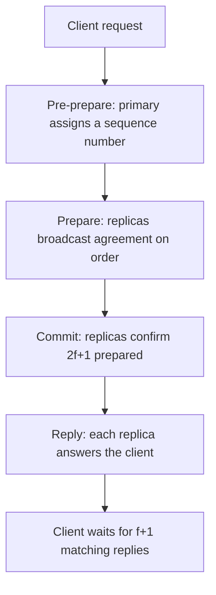

---
tags:
  - interview-critical
---

# Byzantine Fault Tolerance

## You'll see this when...

- A node doesn't just crash — it stays up but **lies**, sending one answer to peer A and a contradicting answer to peer B.
- You're reading about **blockchain consensus** (Bitcoin, Ethereum, Tendermint, HotStuff) and keep hitting "Byzantine" without a crisp definition.
- Someone asks in review: **"does Raft protect us against a compromised node?"** (It does not.)
- Multiple **mutually-distrusting organizations** share a ledger and nobody is willing to trust a single operator's database.
- A **safety-critical** system (avionics, spacecraft, nuclear) must keep agreeing even if a component is faulty in arbitrary, undetected ways.
- A node has been **owned by an attacker** and is now an active adversary inside your quorum, not a dead box.

## The Byzantine Generals Problem

Lamport, Shostak, and Pease (1982) framed it as an allegory. Several Byzantine army divisions surround a city, each led by a general. They communicate only by messenger. They must agree on a single plan — **attack** or **retreat** — and act together; a half-attack is the worst outcome. The catch: some generals may be **traitors** who actively try to prevent the loyal ones from reaching agreement, including by sending different messages to different peers.

This is a sharper failure model than "a general died." A traitor can:

- Send conflicting information to different recipients ("attack" to one, "retreat" to another).
- Selectively lie, forge, equivocate, or stay silent.
- Collude with other traitors.

```
            "attack"                "retreat"
   General A <-------- Traitor C --------> General B
        |                                      |
        |              "C said attack"         |
        +------------------------------------->|
              ...but B heard "retreat" from C.
   A and B now hold conflicting views of the SAME source.
```

A protocol is **Byzantine fault tolerant** if the honest participants still reach the same decision despite this behaviour. The classic result: with only oral (unsigned) messages, agreement is possible **if and only if** fewer than one-third of the generals are traitors.

## Crash faults vs Byzantine faults

The model you assume decides which protocol you can use.

| Failure model | What a faulty node does | Tolerated by | Replicas to survive `f` faults |
|---|---|---|---|
| **Crash / fail-stop** | Stops responding; never lies | Raft, Paxos, ZAB, Viewstamped Replication | `2f + 1` |
| **Byzantine** | Arbitrary: lies, equivocates, forges, colludes | PBFT, Tendermint, HotStuff, Nakamoto-style PoW | `3f + 1` |

Raft and Paxos are **crash-fault tolerant**. They assume every node runs the honest protocol — a node may be slow, partitioned, or dead, but it never sends a fabricated log entry or votes two ways in one term. Give Raft a single malicious leader that appends different entries to different followers and the safety guarantee evaporates. **CFT consensus is not a security boundary.** If your threat model includes "a node is compromised and actively adversarial," CFT does not cover you.

## Why 3f+1, not 2f+1

The extra replicas pay for the fact that you can no longer trust what a node tells you.

With crash faults, a quorum of `f+1` out of `2f+1` always intersects another quorum in at least one node, and that node — being honest by assumption — reliably reports the truth. The only problem is `f` nodes might be *missing*.

With Byzantine faults you have two problems at once:

1. Up to `f` nodes may be **unreachable** (so you must reach a decision without them), and
2. Up to `f` nodes may be **present but lying**.

So you need a quorum of `2f+1` out of `3f+1` total. Walk the worst case:

```
Total nodes:  3f + 1
Quorum size:  2f + 1

Any two quorums of size 2f+1 overlap in at least:
   (2f+1) + (2f+1) - (3f+1) = f + 1 nodes.

Of those f+1 overlapping nodes, at most f are Byzantine,
so AT LEAST ONE is honest -> the two quorums cannot be
made to agree on contradictory values.

And you can still form a quorum after discarding f silent
nodes:   (3f+1) - f = 2f+1   exactly a quorum. ✓
```

Concretely: tolerating **1** Byzantine fault needs **4** nodes; **2** faults needs **7**; **3** faults needs **10**. (Crash faults: 3, 5, 7 respectively.) The Byzantine premium is roughly 50% more replicas plus the message cost below.

## PBFT — Practical Byzantine Fault Tolerance

Castro & Liskov (1999) made BFT fast enough for real systems (their target: a Byzantine-tolerant NFS). PBFT runs a primary (leader) and uses a **three-phase commit** per request, all within a numbered *view*:



- **Pre-prepare**: the primary proposes an ordering (sequence number) for the request.
- **Prepare**: every replica multicasts a `prepare` to every other replica; once a replica sees `2f+1` matching prepares it knows the honest majority agrees on the *order*.
- **Commit**: every replica multicasts a `commit`; once it sees `2f+1` commits it executes and replies.
- The client accepts the result once it has `f+1` identical replies (guaranteeing at least one honest replica vouches for it).

If the primary is faulty (silent or equivocating), replicas time out and run a **view change** to rotate to a new primary.

**The cost:** the prepare and commit phases are all-to-all broadcasts, so each consensus round is **O(n²) messages** (every node talks to every other node, twice). At 4 nodes that's trivial; at 40 nodes it's ~1,600 messages per request and latency climbs. This quadratic blow-up is why classic PBFT clusters stay small — order of **tens** of nodes, not thousands. Three message delays per decision also means BFT inherently costs more round trips than a leader-based CFT commit.

## Modern BFT: Tendermint and HotStuff

Blockchains revived BFT research because permissionless and consortium ledgers are *exactly* the mutually-distrusting setting BFT was built for.

- **Tendermint** (Cosmos) — a propose / prevote / precommit round structure, still BFT (tolerates `<1/3` Byzantine voting power), with deterministic finality (no probabilistic "wait N blocks" like Bitcoin). Communication is broadly O(n²).
- **HotStuff** (basis of Diem/Libra, and influential on later chains) — the key advance is **linear, O(n) message complexity** per phase. It does this by routing votes through the leader, who aggregates them (often via threshold/aggregate signatures) into a single quorum certificate instead of an all-to-all broadcast, and by **pipelining** phases so a steady stream of blocks amortizes the work. Linear messaging is what lets BFT scale to **hundreds** of validators.

Contrast with **Nakamoto consensus** (Bitcoin PoW): it tolerates Byzantine behaviour too, but trades deterministic finality for probabilistic finality and enormous energy cost, and assumes an honest *majority of hash power* rather than `<1/3` of identified nodes.

## When you actually need BFT — and when you don't

This is the judgment call interviewers (and architects) care about.

**You need BFT when nodes can be adversarial:**

- **Permissionless blockchains** — anyone can run a node; some will be malicious by design.
- **Consortium / cross-organization ledgers** — competing banks or firms share state and none will trust another's database as the source of truth.
- **Safety-critical systems** — avionics, spacecraft, nuclear control. Here the "adversary" isn't malice but arbitrary hardware faults (a sensor returning garbage, single-event upsets) that must not corrupt agreement. Boeing 777 / SpaceX-style flight computers use Byzantine-tolerant voting.

**You do NOT need BFT in the common case:**

- A **single-operator datacenter** — you own every node, control deployment, and your real threats are crashes, partitions, and bad deploys, not nodes that lie to each other. Here **crash-fault Raft or Paxos is the right, boring default.** Securing the perimeter (auth, network policy, signed images) keeps adversaries *out* of the quorum far more cheaply than paying BFT's tax on every write.
- The BFT tax is real: ~50% more replicas, an extra message phase (more latency), and O(n²) traffic in classic protocols. Spending that to defend against an attacker who, by your deployment model, can't be inside the quorum is over-engineering.

Rule of thumb: **if one organization controls all the nodes, use crash-fault consensus.** Reach for BFT only when trust genuinely spans an organizational or adversarial boundary.

## Anti-patterns

| Anti-pattern | Why it hurts | Better |
|---|---|---|
| Running PBFT inside a single trusted datacenter | Pays 3f+1 replicas + O(n²) messages + extra latency to defend against a threat (lying nodes) that your deployment model already excludes | Crash-fault Raft/Paxos; harden the perimeter to keep adversaries out of the quorum |
| Assuming Raft/Paxos defends against a compromised node | CFT assumes honest nodes; a malicious leader can equivocate and break safety silently | Use BFT if your threat model includes adversarial nodes; otherwise treat node integrity as a *security* problem, not a consensus one |
| Rolling your own BFT protocol | Subtle equivocation, view-change, and quorum bugs are catastrophic and near-impossible to audit | Use a vetted implementation (Tendermint Core, a HotStuff library) and lean on its published proofs |
| Scaling classic PBFT to hundreds of nodes | O(n²) messaging melts down past a few dozen nodes | Use a linear-message protocol (HotStuff) or shard the validator set |
| Treating Bitcoin's PoW security as equivalent to permissioned BFT | Different model: honest-hash-power majority + probabilistic finality, not `<1/3` identified Byzantine nodes with instant finality | Match the protocol to the trust model and finality requirement |

## Quick reference

| Need | Reach for |
|---|---|
| Agreement among nodes you fully control (crashes/partitions only) | Raft or Paxos (crash-fault, the boring default) |
| Tolerate `f` Byzantine nodes with deterministic finality | A BFT protocol with `3f+1` nodes |
| Small permissioned cluster, classic BFT | PBFT (pre-prepare / prepare / commit) |
| Many validators / consortium chain | HotStuff (linear O(n) messages) or Tendermint |
| Open, permissionless network | Nakamoto-style PoW/PoS consensus |
| Safety-critical hardware voting | Byzantine-tolerant replication (e.g. triple+ modular redundancy with voting) |
| Replicas needed to survive `f` faults | `2f+1` (crash) vs `3f+1` (Byzantine) |

## Interview angle

!!! tip "What interviewers are testing"
    Whether you understand that consensus protocols assume a *failure model*, can name what Raft/Paxos do and don't protect against, and — most importantly — show the engineering judgment to NOT reach for BFT when crash-fault consensus is sufficient.

**Strong answer pattern:**

1. State the two failure models up front: crash/fail-stop (nodes die honestly) vs Byzantine (nodes lie, equivocate, collude).
2. Map protocols to models: Raft/Paxos tolerate crashes only; PBFT/Tendermint/HotStuff tolerate Byzantine faults.
3. Give the quorum math and *why*: `2f+1` total for crash, `3f+1` for Byzantine, because quorum overlap must contain at least one *honest* node even after discarding `f` silent ones.
4. Name the cost: extra replicas, an added message phase, and O(n²) traffic in classic PBFT — which caps cluster size and is why HotStuff's O(n) matters.
5. Close with the judgment call: single-operator datacenter → crash-fault Raft/Paxos (the boring, correct default); BFT only when trust crosses an organizational or adversarial boundary.

**Common follow-ups:**

- *"Why exactly 3f+1?"* — Two quorums of `2f+1` over `3f+1` nodes overlap in `f+1` nodes; at most `f` are Byzantine, so at least one honest node is shared, preventing conflicting decisions — and you can still form a quorum after `f` nodes go silent.
- *"Does Raft survive a malicious leader?"* — No. A leader that sends different entries to different followers violates Raft's honesty assumption; safety is not guaranteed. That's a BFT problem.
- *"Why is PBFT limited to small clusters?"* — The prepare and commit phases are all-to-all, so messages grow as O(n²); past a few dozen nodes latency and bandwidth dominate.
- *"What does HotStuff change?"* — Votes route through and are aggregated by the leader (threshold signatures), giving O(n) messages per phase plus pipelining, so it scales to hundreds of validators.
- *"We're building an internal service — do we need BFT?"* — Almost certainly not. You control the nodes; defend the perimeter and use crash-fault consensus.

## Test yourself

??? question "What is the core difference between a crash fault and a Byzantine fault?"

    A crash (fail-stop) fault means a node simply stops responding — it never produces incorrect or dishonest output. A Byzantine fault means a node behaves arbitrarily: it can lie, send conflicting information to different peers (equivocate), forge messages, or collude with other faulty nodes. Byzantine is the strictly harder model and includes crashes as a special case.

??? question "Why do you need 3f+1 nodes to tolerate f Byzantine faults instead of 2f+1?"

    Two reasons stack: up to `f` nodes may be silent (so you must decide without them), and up to `f` of the responders may be lying. A quorum of `2f+1` out of `3f+1` means any two quorums overlap in `f+1` nodes; since at most `f` are Byzantine, at least one honest node is common to both, so they cannot be steered to contradictory decisions. You also still have `2f+1` reachable nodes after discarding `f` silent ones.

??? question "Does Raft or Paxos protect against a compromised, lying node? Why or why not?"

    No. Both are crash-fault tolerant and assume every node runs the protocol honestly. A malicious leader can append different log entries to different followers or vote inconsistently, silently breaking the safety guarantee. Defending against adversarial nodes requires a Byzantine fault tolerant protocol — node integrity is otherwise a security/perimeter problem, not something CFT consensus solves.

??? question "Why does classic PBFT not scale to thousands of nodes, and what fixed it?"

    PBFT's prepare and commit phases are all-to-all broadcasts, giving O(n²) message complexity per consensus round; bandwidth and latency become prohibitive past a few dozen nodes. HotStuff fixed it by routing votes through the leader and aggregating them (e.g. via threshold signatures) into a single quorum certificate, achieving O(n) messages per phase plus pipelining — enough to support hundreds of validators.

??? question "You're designing consensus for a service whose nodes all run in your own single-operator datacenter. BFT or crash-fault — and why?"

    Crash-fault (Raft or Paxos). You control every node, deployment, and the network, so your real failure modes are crashes, partitions, and bad deploys — not nodes lying to each other. BFT would cost ~50% more replicas, an extra message phase, and O(n²) traffic to defend against an adversary your deployment model already excludes. Keep attackers out of the quorum with auth, network policy, and signed images instead, and use the boring crash-fault default.

## Related

- [Consensus (Raft & Paxos)](consensus.md)
- [Quorum](quorum.md)
- [Fault Tolerance & Resilience](../fundamentals/fault-tolerance.md)
- [Failure Modes Catalogue](../fundamentals/failure-modes.md)
