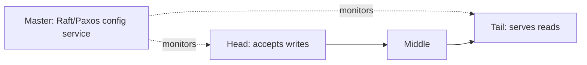

---
tags:
  - interview-critical
  - for-scale
---

# Chain Replication

## You'll see this when...

- You need **strong consistency** (linearizable reads) but quorum replication's read/write amplification is eating your throughput budget.
- A storage system advertises "all reads served by one node" and you wonder how that's not a single point of failure or a stale-read trap.
- Your replication is **primary-backup**, the primary is doing all the read+write work, and the backups sit idle burning money.
- You're reading the GFS/Bigtable/Azure-Storage lineage and keep hitting the phrase "the tail acknowledges."
- An interviewer asks "design replication that is both strongly consistent *and* high-throughput" — quorum and primary-backup both have an awkward answer; chain replication has a clean one.
- You hear **CRAQ** and want to know how a chain can scale reads across all replicas without giving up linearizability.

---

## The core idea

Arrange the N replicas in a **total order** — a chain. Writes enter at one end, reads leave the other.

```
        write                                          read
          │                                              │
          ▼                                              ▼
      ┌────────┐     ┌────────┐     ┌────────┐     ┌────────┐
      │  HEAD  │ ──► │ MIDDLE │ ──► │ MIDDLE │ ──► │  TAIL  │
      └────────┘     └────────┘     └────────┘     └────────┘
       accepts        forward         forward       acks write +
       writes,        downstream      downstream    serves ALL reads
       forwards
```

- **Writes** always enter at the **head**. The head applies the update locally, then forwards it to its successor. Each node applies then forwards. When the **tail** applies it, the tail sends the ACK back to the client (or back up the chain).
- **Reads** are always served by the **tail** — and only the tail.

That single rule — *the tail acks writes and the tail serves reads* — is what buys linearizability. A value is only visible at the tail after it has propagated through every node ahead of it. So any read the tail answers reflects a write that all replicas have already durably applied. There is no window where a read can see a value that a later failure could lose.

### Why "tail serves reads" is linearizable

A write is "committed" exactly when the tail applies it. Before that moment the tail still holds the old value, so reads return the old value — consistently, on every read. After that moment the tail holds the new value and every read returns the new value. There is no node that can answer a read with a half-propagated update, because the only node answering reads is the *last* node to receive any update. Reads and writes are therefore serialized at the tail into a single total order: the textbook definition of linearizability.

Contrast with primary-backup, where the primary serves reads: the primary can ack a read of a value the backups haven't received yet, so a primary failover can lose an acknowledged read's basis.

---

## Compared to the alternatives

| Property | Chain replication | Primary-backup | Quorum (R+W>N) |
|---|---|---|---|
| Write path | head → … → tail (serial, length N) | primary → all backups (parallel) | client → W replicas (parallel) |
| Read path | tail only (1 node) | primary only (1 node) | client → R replicas, reconcile |
| Reads served by | 1 node (or all, with CRAQ) | 1 node | R of N nodes |
| Consistency | linearizable | linearizable (if reads from primary) | linearizable iff R+W>N |
| Write latency | sum of N hops (grows with chain) | max of backup hops (parallel) | latency of Wth-fastest replica |
| Read cost | 1 read op | 1 read op | R read ops + reconciliation |
| Failure handling | external master reconfigures chain | external election / promote backup | quorum tolerates failures inline |

The trade is explicit: chain replication **serializes the write path** to keep the read path trivial. Quorum parallelizes writes but pays R reads + version reconciliation on every read. Chain replication is the better default when **reads vastly outnumber writes** (the common case) and you want strong consistency without read-side fan-out.

---

## Throughput vs latency

Two independent ideas, easy to conflate:

- **Throughput is good** because work is *spread* across the chain. The head only does writes-forwarding, the tail only does reads + final-apply, middles only forward. No single node carries both the full read load and the full write load (unlike a primary-backup primary). Reads, in plain chain replication, are all on the tail — so read throughput is capped at one node's capacity until you add CRAQ.
- **Write latency is bad-ish** because a write traverses the chain serially. With N replicas and a per-hop RTT of ~0.5–1 ms inside one datacenter, a write costs ~N hops ≈ a few ms for N=3, and grows linearly with chain length. Across regions (tens of ms per hop) a long chain becomes painful fast. **Keep chains short** (N=3 is the common sweet spot) and you keep both consistency and acceptable latency.

Order-of-magnitude: assume 0.5 ms intra-DC RTT, N=3 → write ≈ 1.5 ms; N=10 → write ≈ 5 ms. Reads are always a single hop regardless of N.

---

## Failure handling needs an external master

The chain itself doesn't decide membership — a separate **master / config service** does, and *that* service is where consensus lives (Raft/Paxos/ZooKeeper). The master monitors replicas via heartbeats and reconfigures the chain on failure. Three cases:

- **Head fails** → master promotes the head's successor to head. In-flight writes the dead head hadn't forwarded are simply lost (never acked), which is correct — the client retries.
- **Middle fails** → master splices it out: its predecessor is told to send to the dead node's successor. The successor may be missing the last few updates the dead middle had received but not forwarded; the predecessor re-sends from its last-acked point.
- **Tail fails** → master promotes the tail's predecessor to tail. The new tail may know about updates the old tail had acked-but-not-yet-... no: the new tail is *upstream*, so it has a superset of the old tail's state. It starts serving reads immediately; consistency holds.



The master is the consensus dependency. The chain nodes themselves run no consensus — they just apply-and-forward — which is why the data path is cheap. Don't try to make the chain self-arbitrate membership; a partition would split-brain it. That's a job for fencing + a consensus-backed master. The **boring, correct option** is ZooKeeper/etcd as the master.

---

## CRAQ — reading from every node

Plain chain replication wastes read capacity: only the tail answers reads. **CRAQ** (Chain Replication with Apportioned Queries) lets *any* node serve reads while staying linearizable, using per-version clean/dirty tracking.

Each node keeps possibly-multiple versions of an object, each tagged **clean** or **dirty**:

- When a node receives a write, it appends the new version as **dirty** and forwards.
- When the tail applies the write, it marks its version clean and sends an ACK *back up* the chain. As the ACK propagates, each node marks that version clean and drops older versions.
- On a **read**, a node checks its newest version: if **clean**, answer immediately (no coordination). If **dirty**, the value is mid-flight, so the node asks the **tail** for the latest committed version number and returns that — a "version query," cheaper than shipping the whole object.

```python
def read(node, key):
    v = node.latest_version(key)
    if v.clean:
        return v.value                      # local, fast path
    committed = tail.version_query(key)     # one small RPC
    return node.value_at(committed, key)    # serve the agreed version
```

Result: under **read-heavy, low-contention** workloads (the normal case) almost every read hits a clean local version, so read throughput scales ~linearly with chain length while reads stay linearizable. Under heavy write contention CRAQ degrades toward "every read pings the tail" — back to the plain-chain bottleneck. CRAQ also offers an eventual-consistency read mode (return the local dirty version, skip the version query) when you can tolerate it.

---

## Real systems

- **CRAQ** (Terrace & Freedman, 2009) — the canonical apportioned-queries implementation.
- **Hibari** — distributed key-value store built directly on chain replication.
- **FAWN-KV** — chain replication across an array of low-power flash nodes.
- **Microsoft Azure Storage** — the stream layer uses a chain-replication-style flow (writes ack at the end of the replica set) for its strongly-consistent appends.
- General pattern: object/blob stores and metadata logs where you want linearizable writes, cheap reads, and short chains (N=3).

---

## Anti-patterns

| Anti-pattern | Why it hurts | Better |
|---|---|---|
| Long chains for "more durability" | Write latency grows linearly with N; an 8-node chain is ~8 hops per write | Keep N=3; tune durability with erasure coding or extra chains, not length |
| Letting the chain elect its own head/tail | Partition → two nodes both think they're tail → split brain, divergent reads | External consensus-backed master + fencing decides membership |
| Serving reads from a middle node in *plain* chain replication | Middles may hold un-acked (dirty) updates → stale or phantom reads | Tail-only reads, or adopt CRAQ's clean/dirty version tracking |
| Using plain chain replication under write-heavy contention | Tail is the read bottleneck; CRAQ degrades to tail-queries anyway | Re-evaluate: quorum or sharding may fit a write-heavy profile better |
| Treating the master as a mere monitor you can skip | Without an authoritative reconfigurator, failures leave the chain broken/forked | The master is load-bearing; it's the consensus core of the design |

## Quick reference

| Need | Reach for |
|---|---|
| Linearizable writes + cheap single-hop reads | Plain chain replication, N=3 |
| Linearizable reads scaled across all replicas | CRAQ |
| Strong consistency with parallel (low-latency) writes | Quorum, R+W>N |
| Who decides head/tail on failure | External master on Raft/Paxos (ZooKeeper/etcd) |
| Tolerate read of in-flight value cheaply | CRAQ version query to tail |
| Read scaling when you can tolerate staleness | CRAQ eventual-consistency read mode |
| Workload is write-heavy / high-contention | Reconsider: sharding or quorum, not a longer chain |

## Interview angle

!!! tip "What interviewers are testing"
    Whether you understand that consistency, read throughput, and write latency are *separable* knobs — and that chain replication makes a specific, defensible trade (serialize writes to make reads trivial) rather than a magic "fast and consistent" claim. They also probe whether you know the consensus dependency hides in the *master*, not the data path.

**Strong answer pattern:**

1. State the structure: replicas in a total order, writes at the head propagating to the tail, reads at the tail.
2. Explain *why* tail-reads give linearizability: a write is committed exactly when the tail applies it, and the tail is the only reader, so reads/writes serialize at one node.
3. Contrast with quorum (parallel writes, R reads + reconciliation per read) and primary-backup (one node does both read and write load), naming the trade each makes.
4. Locate the consensus: the *master/config service* uses Raft/Paxos to reconfigure the chain on failure; the chain nodes themselves run no consensus.
5. Introduce CRAQ as the read-scaling upgrade via clean/dirty versions, and note its degradation under write contention.

**Common follow-ups:**

- *What happens when the tail dies?* — Master promotes the predecessor; it's upstream so it has a superset of the tail's state, so it can serve reads immediately with no consistency gap.
- *Why not just let the chain pick its own head?* — Partitions cause split brain; membership must come from a consensus-backed master with fencing.
- *Where's the latency cost?* — Write traverses the chain serially, so write latency ≈ N hops; keep chains short (N=3).
- *How does CRAQ stay linearizable while reading from a middle?* — Clean versions are committed and safe to serve locally; dirty (in-flight) versions trigger a small version query to the tail.
- *When would you NOT use it?* — Write-heavy/high-contention workloads, where the tail bottleneck (and CRAQ's degradation) make quorum or sharding a better fit.

## Test yourself

??? question "Why does serving all reads from the tail give linearizability?"

    A write is only "committed" when the tail applies it, since the tail is the last node in the chain. Because the tail is also the *only* node answering reads, every read reflects either the old value (before the tail applied the write) or the new value (after) — never a half-propagated state, and never a value a later failure could roll back. Reads and writes are thereby serialized into a single total order at one node, which is exactly linearizability.

??? question "How does chain replication achieve high throughput if the write path is serial?"

    Throughput and latency are different axes. The serial path raises per-write *latency*, but the *work* is spread across nodes: the head only ingests/forwards writes, middles only forward, and the tail handles final-apply plus reads. No single node carries both the full read and full write load (unlike a primary-backup primary). With CRAQ, reads spread across all nodes too, scaling read throughput ~linearly with chain length.

??? question "Where does consensus actually live in a chain-replication system?"

    Not in the data path. The chain nodes just apply-and-forward with no agreement protocol. Consensus lives in the external master/config service (Raft, Paxos, or ZooKeeper/etcd), which monitors replicas via heartbeats and authoritatively reconfigures the chain — promoting a new head or tail, or splicing out a dead middle — when a node fails. This separation is why the data path stays cheap.

??? question "What does CRAQ change, and when does its benefit disappear?"

    CRAQ lets any node serve reads, not just the tail, by tracking clean (committed) vs dirty (in-flight) versions per object. A node serves a clean version locally and fast; for a dirty version it does a small version query to the tail and serves the committed version. This scales read throughput across the whole chain. The benefit collapses under heavy write contention: most objects are dirty, so nearly every read becomes a tail query — back to the plain-chain bottleneck.

??? question "The tail fails. Why is recovery trivially consistent, and how does a head failure differ?"

    The tail's predecessor is *upstream*, so it has already received and applied a superset of everything the old tail had committed. The master promotes it to tail and it serves reads immediately — no gap, no lost committed write. A head failure is different: the dead head may have accepted writes it never forwarded; those were never acked, so losing them is correct, and the client simply retries. The master promotes the head's successor.
