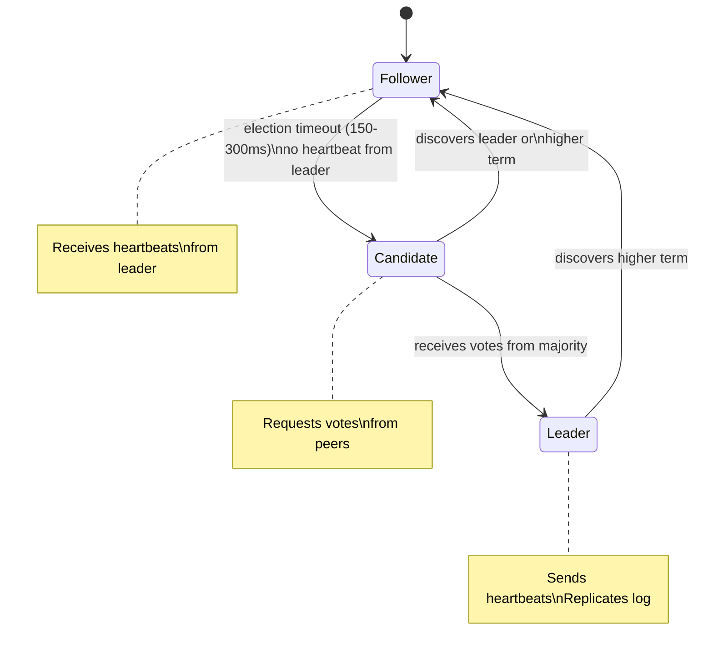
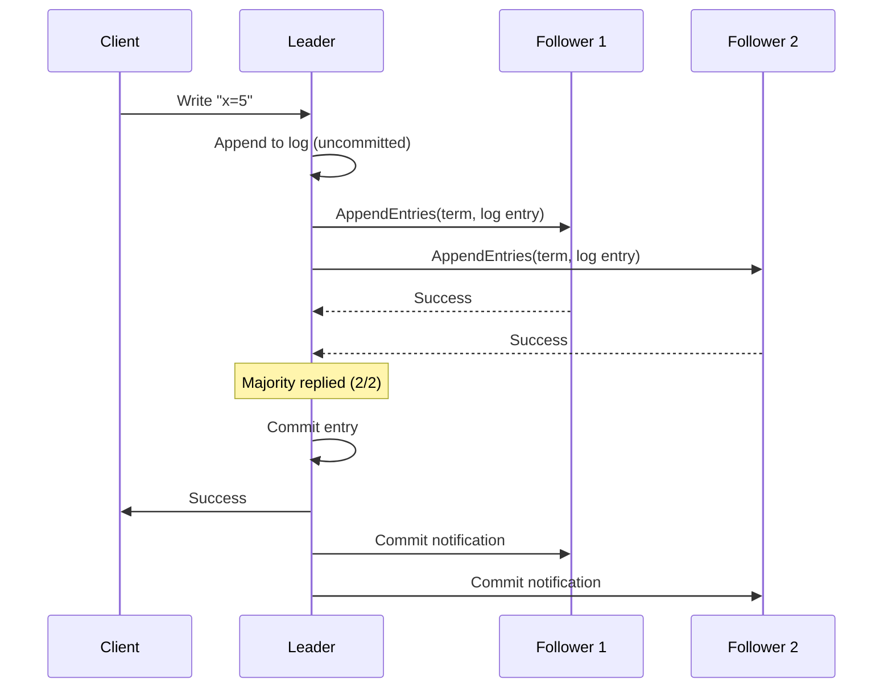

# Consensus (Raft & Paxos)

## What it is

Consensus is the problem of getting multiple nodes in a distributed system to agree on a single value or a sequence of values, even in the presence of node failures and network partitions.

Consensus is the foundation of: leader election, distributed locks, replicated state machines, and consistent configuration storage (etcd, ZooKeeper).

## The problem

```
3 nodes: A, B, C
A proposes: "value = 5"
B proposes: "value = 7"
Network partition: A can't talk to B

Without consensus:
  A and C agree on 5
  B alone with 7
  
  When partition heals: A says 5, B says 7
  → Inconsistency

With consensus:
  A proposal requires majority (2/3) agreement
  B's proposal requires majority (2/3) agreement
  Only one can get majority → one value chosen
```

## Paxos

Paxos, designed by Leslie Lamport (1989), is the foundational consensus algorithm. It's famously difficult to understand and implement correctly — Lamport's own description says "the algorithm is simple but notoriously difficult to implement."

### Roles
- **Proposer:** Proposes a value
- **Acceptor:** Accepts/rejects proposals
- **Learner:** Learns the chosen value

### Basic Paxos (single value)

**Phase 1 (Prepare):**
```
Proposer chooses proposal number N (higher than any seen before)
Proposer → all Acceptors: "Prepare(N)"

Acceptor response:
  If N > max_promised_N:
    Promise to not accept proposals < N
    Return highest accepted value (if any)
  Else: Ignore or reject
```

**Phase 2 (Accept):**
```
If Proposer receives promises from majority:
  Choose value V:
    - If any acceptor returned an accepted value, use the highest-N one
    - Otherwise, use proposer's own value
  Proposer → majority: "Accept(N, V)"

Acceptor response:
  If N >= max_promised_N:
    Accept the proposal, store (N, V)
    Notify learners
  Else: Reject

If majority accepts → value V is CHOSEN
```

**Problem:** Multi-Paxos (for a log of values) requires complex optimizations. Few implement it correctly.

## Raft

Raft was designed to be understandable (2014, Diego Ongaro). It's the standard implementation used in modern systems (etcd, CockroachDB, Consul, Kafka KRaft).

### Key insight

Raft decomposes consensus into three relatively independent subproblems:
1. **Leader election:** One server is the leader at a time
2. **Log replication:** Leader accepts entries, replicates to followers
3. **Safety:** Only servers with up-to-date logs can become leader

### Terms

Time is divided into **terms** (monotonically increasing integers). Each term begins with an election. Terms act as logical clocks.

```
Term 1:  Leader = A    (normal operation)
Term 2:  Election       (A failed, election starts)
Term 3:  Leader = B    (B wins election)
Term 4:  Election       (B fails)
Term 5:  Leader = A    (A recovers, wins election)
```

### Leader Election



**Election process:**
```
1. Follower's election timer expires (didn't hear from leader)
2. Follower → Candidate: increments term, votes for self
3. Candidate → all peers: RequestVote(term, candidate_id, last_log_index, last_log_term)
4. Peer grants vote IF:
   - Hasn't voted this term yet
   - Candidate's log is at least as up-to-date as peer's log
5. Candidate receives majority → becomes Leader
6. New Leader → sends empty AppendEntries (heartbeat) to establish authority
```

**Split vote:** Two candidates get equal votes → timeout again → new election with higher term.

**Why randomized timeouts?** 150-300ms random timeout means one node becomes candidate before others. Reduces split votes.

### Log Replication



**Log matching property:**
- If two logs have an entry with the same index and term, they're identical
- If two logs have identical entries at index N, all entries before N are identical

### Safety

**Leader completeness:** A leader must have all committed log entries. Guaranteed by vote restriction: voters reject candidates with less up-to-date logs.

**State machine safety:** If any server applies log entry N to state machine, no other server applies a different entry at index N.

### Leader failover

```
Timeline:
  t=0:  Leader A, log committed up to index 50
  t=5:  Leader A crashes
  t=6:  Follower B election timer expires → becomes candidate
  t=7:  B receives votes from C → becomes Leader (term+1)
  t=8:  B sends heartbeats → C knows B is new leader
  t=10: Client sends write → B accepts, replicates to C
  
  A recovers:
  t=20: A sends heartbeat (old term) → B/C reject (higher term)
  t=21: A sees higher term → demotes to Follower
  t=22: A receives heartbeats from B → syncs log
```

### Raft in practice (etcd)

etcd is the primary configuration store for Kubernetes. It uses Raft for all writes:

```
kubectl create deployment nginx ... 
→ API Server → etcd.Put("/deployments/nginx", spec)
→ etcd leader writes to log
→ replicates to followers (majority: 2/3 or 3/5)
→ commits → returns to API Server
→ scheduler, controller-manager watch etcd → respond to change
```

**etcd cluster sizing:**
- 3 nodes: survives 1 failure
- 5 nodes: survives 2 failures
- Odd numbers to avoid split-brain

```
Fault tolerance formula:
  Majority = floor(N/2) + 1
  Max failures tolerated = floor(N/2)
  
  N=3: majority=2, can lose 1
  N=5: majority=3, can lose 2
```

## ZooKeeper (ZAB protocol)

ZooKeeper uses ZAB (ZooKeeper Atomic Broadcast) — similar to Paxos/Raft but different in detail. Used by older systems (Kafka pre-KRaft, Hadoop, HBase).

Kafka moved away from ZooKeeper to KRaft (Kafka Raft) to reduce operational complexity of running a separate ZooKeeper cluster.

## When you need consensus

Use a consensus system (etcd, ZooKeeper, Consul) for:
- **Leader election:** One service holds a distributed lock
- **Configuration:** Cluster-wide config that must be consistent
- **Service discovery:** Registry that must be accurate (see [Service Discovery](service-discovery.md))
- **Distributed locks:** Mutex across services

**Don't build your own consensus** — it's one of the hardest problems in distributed systems. Use etcd or ZooKeeper.

## Interview angle

!!! tip "What interviewers are testing"
    They want to see you understand the fundamental guarantees — quorum, leader election, the price of consistency.

**Strong answer pattern:**
1. Consensus = agree on a value despite failures
2. Requires majority (quorum) — N/2+1 nodes must agree
3. Raft = understandable consensus: leader election + log replication
4. Use etcd/ZooKeeper for distributed locks, config, leader election — don't build your own
5. Tradeoff: consensus is slow (multiple round trips) — use only where strong consistency is required

## Related topics

- [Leader Election](leader-election.md) — built on top of consensus
- [Replication](../patterns/replication.md) — Raft used for replica consensus
- [CAP Theorem](../fundamentals/cap-theorem.md) — consensus is the CP choice
- [Distributed Transactions](distributed-transactions.md) — consensus within distributed transactions
