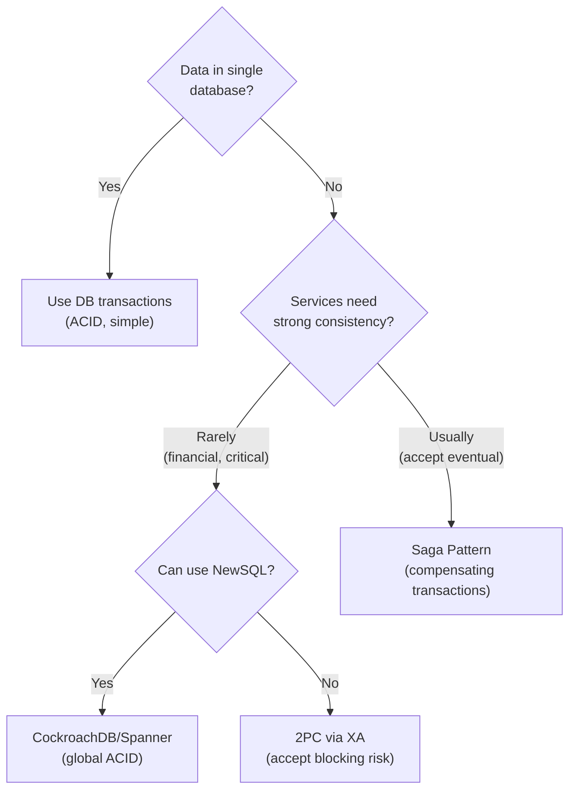

# Distributed Transactions

## What it is

A distributed transaction spans multiple services or databases and must maintain ACID properties across all of them — either everything commits or everything rolls back.

```
Simple (single DB):
  BEGIN
    UPDATE accounts SET balance = balance - 100 WHERE id = 'alice'
    UPDATE accounts SET balance = balance + 100 WHERE id = 'bob'
  COMMIT  ← easy, one DB engine handles atomicity

Distributed (multiple services):
  Order Service (own DB)  → deduct inventory
  Payment Service (own DB) → charge card
  Notification Service (own DB) → send email

  How do you ensure all succeed or all roll back?
```

## Why it's hard

The core problem: network is unreliable. A coordinator can send a "commit" message but crash before all participants acknowledge. Participants don't know: did the commit succeed? Should I commit or abort?

```
  Coordinator: "everyone commit"
  Participant A: commits
  Coordinator crashes ←
  Participant B: waiting... 
  Participant B: BLOCKED (can't decide — didn't get commit message)
```

## Two-Phase Commit (2PC)

The classic protocol. Two phases: prepare then commit.

### Phase 1: Prepare (voting)

```
Coordinator → all participants: "Prepare — can you commit?"
Participant A: acquires locks, writes to undo log → responds "YES"
Participant B: acquires locks, writes to undo log → responds "YES"
Participant C: fails to acquire lock → responds "NO"
```

### Phase 2: Commit or Abort

```
If all voted YES:
  Coordinator → all: "COMMIT"
  Participants: commit, release locks, respond ACK

If any voted NO:
  Coordinator → all: "ABORT"
  Participants: rollback, release locks
```

### 2PC problems

**Blocking protocol:** If coordinator crashes after sending PREPARE but before COMMIT:
```
Participants are in "prepared" state with locks held
They cannot commit or abort without coordinator
They BLOCK until coordinator recovers
→ Availability problem
```

**Single point of failure:** Coordinator failure → all participants block.

**Use only when:**
- Services are within the same trust boundary (same team, same DB cluster)
- Can tolerate the blocking risk
- Transaction volume is low enough that coordinator failure is acceptable

**XA transactions** (Java/JDBC) implement 2PC across multiple databases. Used in JEE application servers. Still used in some enterprise environments.

## Saga Pattern (preferred for microservices)

See [Saga Pattern](../patterns/saga-pattern.md) for full coverage.

Key points:
- Sequence of local transactions with compensating transactions on failure
- Eventually consistent (not ACID-consistent)
- No blocking — each service is autonomous
- Choreography (events) or Orchestration (central coordinator)

## Three-Phase Commit (3PC)

Adds a "pre-commit" phase to 2PC to reduce blocking. Participants can make progress even if coordinator fails.

```
Phase 1: CanCommit (voting — same as 2PC prepare)
Phase 2: PreCommit (coordinator committed to outcome, participants prepare to commit)
Phase 3: DoCommit (actually commit)
```

In Phase 3, if participants time out (coordinator crashed), they can safely commit — because if they received PreCommit, the coordinator had decided to commit.

**Not widely used in practice** — still has corner cases, complex implementation, and doesn't solve all 2PC problems.

## Distributed transactions in NewSQL

### CockroachDB

Uses Raft + MVCC (Multi-Version Concurrency Control) for global ACID transactions:

```sql
BEGIN;
UPDATE accounts SET balance = balance - 100 WHERE id = 'alice';  -- on node 1
UPDATE accounts SET balance = balance + 100 WHERE id = 'bob';    -- on node 2
COMMIT;  -- atomic across both nodes via Raft
```

CockroachDB implements Percolator (Google's protocol) — a variant of 2PC that uses MVCC to avoid the blocking problem.

### Google Spanner

Uses TrueTime + Paxos for global ACID transactions with external consistency:

```sql
-- Works identically whether alice is in US and bob in EU
BEGIN TRANSACTION;
UPDATE accounts SET balance = balance - 100 WHERE id = 'alice';
UPDATE accounts SET balance = balance + 100 WHERE id = 'bob';
COMMIT;
```

## Choosing the right approach



## Idempotency in distributed transactions

Regardless of the approach, every operation in a distributed transaction must be idempotent. Network failures cause retries. Without idempotency:

```
Step 1: Charge payment → network timeout
Step 2: Retry charge → charges twice!

With idempotency key:
Step 1: Charge payment with key="order-123-payment" → success (stored in payment DB)
Step 2: Retry with same key → returns original success response (no duplicate charge)
```

## Outbox + at-least-once = effective once

The combination that replaces distributed transactions for most use cases:

```
Service A:
  DB transaction: {
    UPDATE orders SET status='confirmed'
    INSERT INTO outbox (event_type='OrderConfirmed', order_id='123')
  }

Outbox relay: OrderConfirmed → Kafka

Service B consumes:
  if already_processed(event_id): return
  UPDATE inventory ...
  mark_processed(event_id)

Result: effectively once — no distributed transaction needed
```

## Interview angle

!!! tip "What interviewers are testing"
    Any design involving microservices + multi-service state changes needs a distributed transaction strategy.

**Strong answer pattern:**
1. Identify the cross-service consistency requirement
2. For most cases: Saga pattern (eventual consistency + compensation)
3. For true ACID at global scale: NewSQL (CockroachDB, Spanner)
4. For legacy enterprise: 2PC/XA but acknowledge blocking risk
5. Outbox + idempotent consumers as a practical alternative for most cases

**Common follow-up:** *"How do you handle a payment failure after inventory was reserved?"*
> Compensation: if payment fails, the saga sends a "release inventory" command. The inventory service rolls back the reservation. This is the compensating transaction.

## Related topics

- [Saga Pattern](../patterns/saga-pattern.md) — the primary solution for microservices
- [Two-Phase Commit](two-phase-commit.md) — the classic protocol in depth
- [Outbox Pattern](../patterns/outbox.md) — reliable event publishing
- [Idempotency](../patterns/idempotency.md) — required for all distributed transaction operations
- [NewSQL](../storage/newsql.md) — databases that provide distributed ACID
