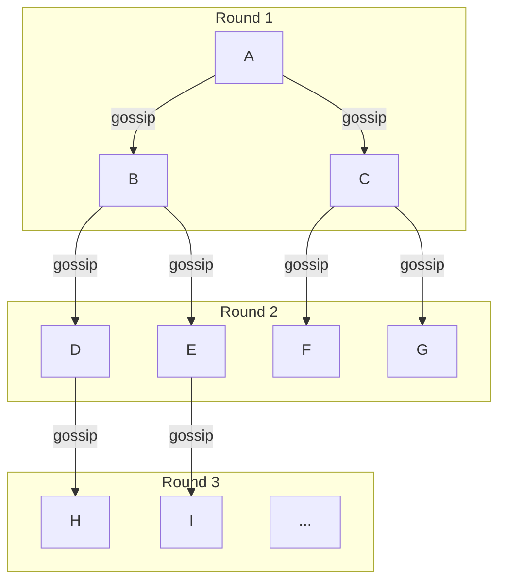

# Gossip Protocol

## What it is

Gossip protocols (also called epidemic protocols) spread information through a distributed system the way a rumor spreads in a social network: each node periodically picks random peers and shares information with them. Information propagates exponentially fast without central coordination.

```
Node A learns new info
A tells random peers B, C
B tells random peers D, E
C tells random peers F, G
...

After O(log N) rounds: all N nodes know the information
```

## How it works



Each round: number of informed nodes roughly doubles.  
After `log₂(N)` rounds: ~all N nodes informed.  
For 1000 nodes: ~10 rounds.

## Types

### Push gossip

Informed node pushes information to random peers:

```python
def gossip_push(node, all_nodes, info):
    peers = random.sample(all_nodes, k=3)  # pick 3 random peers
    for peer in peers:
        peer.receive(info)
```

**Good for:** Spreading updates quickly.

### Pull gossip

Node periodically requests state from random peers:

```python
def gossip_pull(node, all_nodes):
    peers = random.sample(all_nodes, k=3)
    for peer in peers:
        their_state = peer.request_state()
        node.merge_state(their_state)
```

**Good for:** Converging to consistent state, detecting missing updates.

### Push-pull gossip

Combine both: push what you have, pull what you need:

```python
def gossip_push_pull(node, all_nodes):
    peer = random.choice(all_nodes)
    peer.receive_and_respond(node.state)
    # peer sends back its state
    node.merge_state(peer_response)
```

**Best convergence:** Used in production systems (Cassandra, Serf, Consul).

## Properties

| Property | Description |
|---|---|
| **Eventual consistency** | All nodes converge to the same state |
| **No single point of failure** | Fully decentralized — any node can fail |
| **Scalability** | O(log N) messages per round, regardless of N |
| **Fault tolerance** | Continues despite node failures — information routes around failures |
| **Eventual delivery** | No guarantee on when — convergence has statistical bounds |

## Applications

### Membership detection (Cassandra, Consul)

Each node periodically gossips its state (alive/suspicious/dead) to random peers:

```
Every 1 second:
  Node A selects random peers B, C
  A → B: {A: alive, version=100}, {D: suspicious, version=80}, ...
  B merges, updates its view
  B → C: merged state
  
Eventually: all nodes have consistent view of cluster membership
```

### Failure detection (Cassandra's phi accrual)

Gossip propagates suspicion:
```
Node A misses heartbeat from D for 5 seconds
A marks D as "suspect" in gossip
Other nodes see D as suspect → they also try contacting D
If none can reach D → D marked "dead" in gossip
```

### Distributed configuration

Consul uses gossip (Serf library) for cluster membership and failure detection, while using Raft for consistent KV storage. Gossip spreads cluster membership; Raft provides consistency for config data.

### Anti-entropy (database synchronization)

Nodes gossip their Merkle tree roots to detect data divergence:

```
Node A: Merkle root = abc123
Node B: Merkle root = abc123 → in sync
Node C: Merkle root = def456 → diverged!

A and C exchange Merkle subtrees to find exactly which keys differ
A sends missing/updated data to C
```

Used by: Cassandra, DynamoDB, Riak for replica repair.

## Gossip implementation (simplified)

```python
import random
import time
import threading
from dataclasses import dataclass, field
from typing import Dict

@dataclass
class NodeState:
    node_id: str
    status: str  # alive, suspect, dead
    version: int
    heartbeat: float

class GossipNode:
    def __init__(self, node_id: str, peers: List[str]):
        self.node_id = node_id
        self.peers = peers
        self.state: Dict[str, NodeState] = {
            node_id: NodeState(node_id, 'alive', 0, time.time())
        }
        self.lock = threading.Lock()
    
    def gossip_round(self):
        """Send state to random peers"""
        selected_peers = random.sample(self.peers, min(3, len(self.peers)))
        
        with self.lock:
            state_to_send = dict(self.state)
        
        for peer in selected_peers:
            response = send_gossip(peer, state_to_send)
            if response:
                self.merge_state(response)
    
    def merge_state(self, received: Dict[str, NodeState]):
        """Merge received state with local state"""
        with self.lock:
            for node_id, received_state in received.items():
                local = self.state.get(node_id)
                if local is None or received_state.version > local.version:
                    self.state[node_id] = received_state
    
    def heartbeat(self):
        """Increment own heartbeat"""
        with self.lock:
            own = self.state[self.node_id]
            own.version += 1
            own.heartbeat = time.time()
    
    def check_failures(self):
        """Mark stale nodes as suspect/dead"""
        now = time.time()
        with self.lock:
            for node_id, state in self.state.items():
                if node_id == self.node_id:
                    continue
                age = now - state.heartbeat
                if age > 30 and state.status == 'alive':
                    state.status = 'suspect'
                elif age > 60 and state.status == 'suspect':
                    state.status = 'dead'
    
    def start(self):
        while True:
            self.heartbeat()
            self.gossip_round()
            self.check_failures()
            time.sleep(1)  # gossip every second
```

## Convergence speed

For N nodes, push gossip reaches all nodes in approximately `log₂(N) + log(log(N))` rounds.

```
N=10:      ~4 rounds
N=100:     ~8 rounds
N=1,000:   ~10 rounds
N=1,000,000: ~20 rounds

At 1s gossip interval: 1M nodes converge in ~20 seconds
```

## Fanout

The number of peers to gossip to per round:

```
Fanout=1: O(log N) rounds to converge
Fanout=3: ~3x faster convergence, 3x more messages
Fanout=k: Logarithmically faster, linearly more messages

Sweet spot: fanout=3 in most systems
```

## AWS context

Gossip is used internally in many AWS services:

- **ElastiCache Redis cluster:** Gossip-based cluster membership
- **DynamoDB:** Anti-entropy gossip for replica consistency
- **ECS/EKS:** Consul (gossip-based) for service discovery in some configurations

AWS doesn't directly expose gossip protocols to users, but knowing how they work helps you understand the failure detection guarantees of managed services.

## Interview angle

!!! tip "When gossip comes up"
    Usually in distributed systems questions about "how does Cassandra/Dynamo detect node failures?" or "how do you spread membership information at scale?"

**Key points:**
1. Gossip is the decentralized alternative to centralized membership tracking
2. O(log N) convergence — scales to millions of nodes
3. Used in: Cassandra membership, Consul cluster discovery, DynamoDB anti-entropy
4. Not for strong consistency — for propagating soft state (membership, metrics, config)

## Related topics

- [Failure Detection](failure-detection.md) — gossip as a failure detection mechanism
- [Service Discovery](service-discovery.md) — Consul uses gossip for cluster membership
- [Replication](../patterns/replication.md) — anti-entropy via gossip keeps replicas in sync
- [Wide-Column Stores](../storage/wide-column-stores.md) — Cassandra uses gossip
